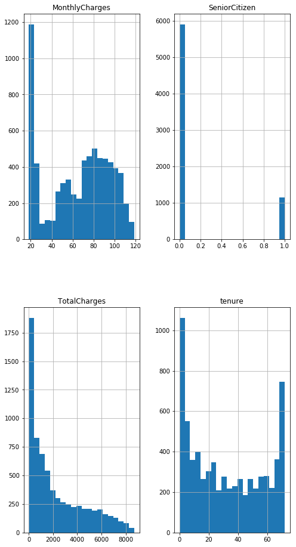
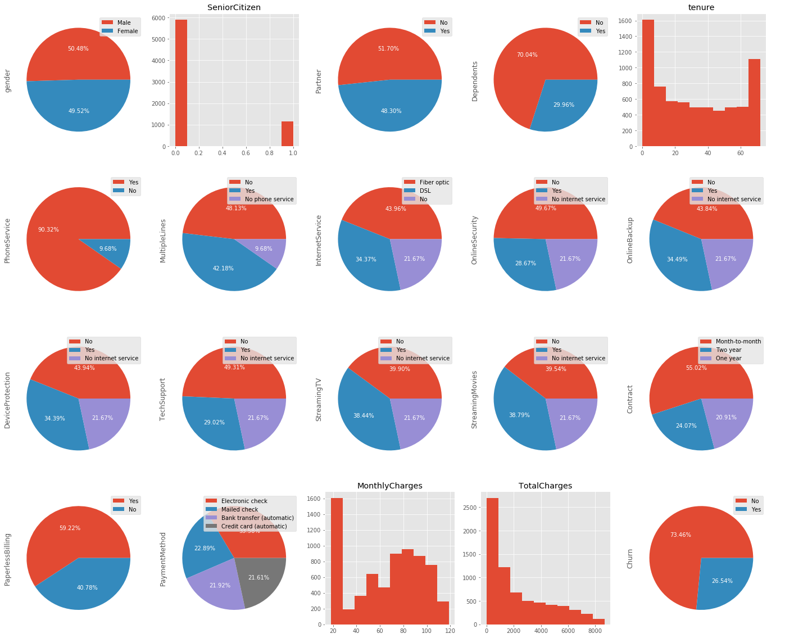
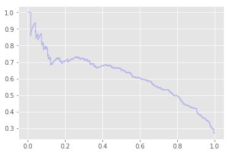

> **提示**：
> 1. 欢迎来到**Python 人工智能入门**毕业项目！引用段会添加这类提示，来帮助你理清整个项目的思路。在你提交项目之前，你可以浏览一下报告，将这一段删除，以保持报告的简洁性。首先，你需要双击该 Markdown 框(cell)，将标题更改为与数据集和调查相关的标题。
> 2. 在这个项目模板中，会在具体内容后的小括号 *()* 中或其他地方添加一部分提示，请在最终项目提交前，删除括号及里面的提示，保持报告的整洁。
> 3. 请先通读整个文档，理清思路后再着手解答
> 4. Have fun!


---
# Python 人工智能入门 毕业项目
# Telco Customer Churn
## Jiang Ziqi
## 2020年2月28日(请写下你完成报告的日期)
---


## 目录
<ul>
<li><a href="#definition">定义</a></li>
<li><a href="#analysis">分析</a></li>
<li><a href="#implementation">实现</a></li>
<li><a href="#result">结果</a></li>
<li><a href="#conclusion">结论</a></li>   
</ul>


---
<a id="definition"></a>
## Ⅰ.定义

在第一节中，你需要对你选定的问题作出定义

### 1.项目概况

在这个部分，你需要用浅显简洁的语句描述这个项目的一个总体概况。以下几个问题可以帮助你理清思路：

- _项目的背景信息是什么？_
- _做这个项目的出发点？_
- _数据集的大概情况是什么？_

### 2.问题陈述

在这个部分，你需要清楚地为你将要解决的问题下定义，这应该包括你解决问题将要使用的策略（任务的大纲）。你同时要详尽地讨论你期望的结果是怎样的。有几个问题是需要考虑的：
- _你是否清楚地定义了这个问题。站在读者的角度，他们能否明白你将要解决的问题是什么。_
- _你是否详尽地阐述了你将会如何解决这个问题？_
- _你期望什么样的结果，读者能明白你期望的这个结果吗？_

### 3.评价指标
在这里，你需要说明你将要用于评价自己的模型和结果的**指标**和**计算方法**。它们需要契合你所选问题的特点及其所在的领域，同时，你要保证他们的合理性。需要考虑的问题：
- _你是否清晰地定义了你所使用的指标和计算方法？_
- _你是否论述了这些指标和计算方法的合理性？_

#  某集团通过数据调研发现每个月用户流失量巨大，难以在有限的人力下对每一位用户进行策略性挽回。所以在此项目中，我需要对用户进行分层，通过机器学习算法预测并能够提前筛选出最可能流失的用户，从而进行点对点的挽回策略

*  观察数据集可知这个数据集有7043行，21列。为了完成用户分层的目标，Churn为No则代表用户存在，Churn为Yes则代表该用户以流失

*  判断用户是否流失是一个二分类问题，所以需要打造用户分层的逻辑回归模型。为了判断得到的预测模型拟合度如何，需要将数据集拆分成训练集和测试集，并且通过精确率、召回率，准确率等验证该模型是否成功

#  逻辑回归
*   逻辑回归适用于解决分类问题，预测用户属于流失用户还是非流失用户，明显需要使用逻辑回归方法解决
*   把Y（预测变量/Churn）的结果带入一个非线形变换的Sigmoid函数中，即可得到[0，1]之间取值范围的数S,S可以把它看成一个概率值，如果我们设置概率阈值为0.5，那么S大于0.5可以看成是正样本，小于0.5可以看成是负样本，就可以进行分类了

#  评价指标：精确率、召回率、准确率

*  逻辑回归模型的模型评估指标一般是精确率、召回率、准确率
*  准确度accuracy score是正确标记的行数和数据集中的总行数的比值（TN+TP)/(TN+TP+FP+FN)
*  精确率precision score是准确识别为流失用户的数量和所有预测为流失用户的数量的比值 TP/(TP+FN)
*  召回率recall score是准确识别为流失用户的数量和所有真正的流失用户数量的比值 TP/(TP+FP)


```python
import numpy as np
import pandas as pd
from sklearn.model_selection import train_test_split
from sklearn.linear_model import LogisticRegression 
from sklearn.metrics import precision_score, recall_score, accuracy_score, confusion_matrix
from sklearn.metrics import classification_report
from sklearn.metrics import precision_recall_curve
import seaborn as sb
import matplotlib.pyplot as plt
%matplotlib inline
```


```python
df=pd.read_csv('./WA_Fn-UseC_-Telco-Customer-Churn.csv')
```


```python
#df有7043行，21列
df.shape
```


    (7043, 21)


```python
df.head(5)
```


<div>
<style scoped>
    .dataframe tbody tr th:only-of-type {
        vertical-align: middle;
    }

    .dataframe tbody tr th {
        vertical-align: top;
    }

    .dataframe thead th {
        text-align: right;
    }
</style>
<table border="1" class="dataframe">
  <thead>
    <tr style="text-align: right;">
      <th></th>
      <th>customerID</th>
      <th>gender</th>
      <th>SeniorCitizen</th>
      <th>Partner</th>
      <th>Dependents</th>
      <th>tenure</th>
      <th>PhoneService</th>
      <th>MultipleLines</th>
      <th>InternetService</th>
      <th>OnlineSecurity</th>
      <th>...</th>
      <th>DeviceProtection</th>
      <th>TechSupport</th>
      <th>StreamingTV</th>
      <th>StreamingMovies</th>
      <th>Contract</th>
      <th>PaperlessBilling</th>
      <th>PaymentMethod</th>
      <th>MonthlyCharges</th>
      <th>TotalCharges</th>
      <th>Churn</th>
    </tr>
  </thead>
  <tbody>
    <tr>
      <th>0</th>
      <td>7590-VHVEG</td>
      <td>Female</td>
      <td>0</td>
      <td>Yes</td>
      <td>No</td>
      <td>1</td>
      <td>No</td>
      <td>No phone service</td>
      <td>DSL</td>
      <td>No</td>
      <td>...</td>
      <td>No</td>
      <td>No</td>
      <td>No</td>
      <td>No</td>
      <td>Month-to-month</td>
      <td>Yes</td>
      <td>Electronic check</td>
      <td>29.85</td>
      <td>29.85</td>
      <td>No</td>
    </tr>
    <tr>
      <th>1</th>
      <td>5575-GNVDE</td>
      <td>Male</td>
      <td>0</td>
      <td>No</td>
      <td>No</td>
      <td>34</td>
      <td>Yes</td>
      <td>No</td>
      <td>DSL</td>
      <td>Yes</td>
      <td>...</td>
      <td>Yes</td>
      <td>No</td>
      <td>No</td>
      <td>No</td>
      <td>One year</td>
      <td>No</td>
      <td>Mailed check</td>
      <td>56.95</td>
      <td>1889.5</td>
      <td>No</td>
    </tr>
    <tr>
      <th>2</th>
      <td>3668-QPYBK</td>
      <td>Male</td>
      <td>0</td>
      <td>No</td>
      <td>No</td>
      <td>2</td>
      <td>Yes</td>
      <td>No</td>
      <td>DSL</td>
      <td>Yes</td>
      <td>...</td>
      <td>No</td>
      <td>No</td>
      <td>No</td>
      <td>No</td>
      <td>Month-to-month</td>
      <td>Yes</td>
      <td>Mailed check</td>
      <td>53.85</td>
      <td>108.15</td>
      <td>Yes</td>
    </tr>
    <tr>
      <th>3</th>
      <td>7795-CFOCW</td>
      <td>Male</td>
      <td>0</td>
      <td>No</td>
      <td>No</td>
      <td>45</td>
      <td>No</td>
      <td>No phone service</td>
      <td>DSL</td>
      <td>Yes</td>
      <td>...</td>
      <td>Yes</td>
      <td>Yes</td>
      <td>No</td>
      <td>No</td>
      <td>One year</td>
      <td>No</td>
      <td>Bank transfer (automatic)</td>
      <td>42.30</td>
      <td>1840.75</td>
      <td>No</td>
    </tr>
    <tr>
      <th>4</th>
      <td>9237-HQITU</td>
      <td>Female</td>
      <td>0</td>
      <td>No</td>
      <td>No</td>
      <td>2</td>
      <td>Yes</td>
      <td>No</td>
      <td>Fiber optic</td>
      <td>No</td>
      <td>...</td>
      <td>No</td>
      <td>No</td>
      <td>No</td>
      <td>No</td>
      <td>Month-to-month</td>
      <td>Yes</td>
      <td>Electronic check</td>
      <td>70.70</td>
      <td>151.65</td>
      <td>Yes</td>
    </tr>
  </tbody>
</table>
<p>5 rows × 21 columns</p>
</div>


---
<a id="analysis"></a>
## Ⅱ.分析

在第二节，你将对数据进行分析与整理，来进一步认识数据。

### 1.数据的探索
在这一部分，你需要探索你将要使用的数据。数据可以是若干个数据集，或者输入数据/文件，甚至可以是一个设定环境。不过在本项目中，我们已经给出了数据集，因此，你需要详尽地描述数据的类型。如果可以的话，你需要展示数据的一些统计量和基本信息（例如输入的特征（features)，输入里与定义相关的特性）。你还要说明数据中的任何需要被关注的异常或有趣的性质（例如需要做变换的特征，离群值等等）。你需要考虑：
- _如果你使用了数据集，你要详尽地讨论了你所使用数据集的某些特征，并且为阅读者呈现一个直观的样本_
- _如果你使用了数据集，你要计算并描述了它们的统计量，并对其中与你问题相关的地方进行讨论_
- _数据集或输入中是否存在异常、缺陷或其他特性？你为什么认为他们是异常？给出佐证你观点的理由(例如分类变量的处理，缺失数据，离群值等）_

### 2.探索性可视化
在这一部分，你需要对数据的特征或特性进行概括性或提取性的可视化。这个可视化的过程应该要适应你所使用的数据。就你为何使用这个形式的可视化，以及这个可视化过程为什么是有意义的，进行一定的讨论。你需要考虑的问题：
- _你是否对数据中与问题有关的特性进行了可视化？_
- _你对可视化结果进行详尽的分析和讨论了吗？_
- _绘图的坐标轴，标题，基准面是不是清晰定义了？_

### 3.算法和技术
在这一部分，你需要讨论你解决问题时用到的算法和技术。你需要根据问题的特性和所属领域来论述使用这些方法的合理性。你需要考虑：
- _你所使用的算法，包括用到的变量/参数都清晰地说明了吗？_
- _你是否已经详尽地描述并讨论了使用这些技术的合理性？_

> **提示**：*不应* 在每个 notebook 框 (cell) 中进行太多操作。可以自由创建框，来进行数据探索。在这个项目中，可以在初始 notebook 中进行大量探索性操作。不要求对其进行组织，但请务必仔细阅读备注，理解每个代码框的用途。完成分析之后，你可以创建 notebook 副本，在其中去除多余数据，组织好你的每一步分析，从而形成信息连贯、结构紧密的报告。


```python
#分析df各列的数据类型：
df.dtypes
```


    customerID           object
    gender               object
    SeniorCitizen         int64
    Partner              object
    Dependents           object
    tenure                int64
    PhoneService         object
    MultipleLines        object
    InternetService      object
    OnlineSecurity       object
    OnlineBackup         object
    DeviceProtection     object
    TechSupport          object
    StreamingTV          object
    StreamingMovies      object
    Contract             object
    PaperlessBilling     object
    PaymentMethod        object
    MonthlyCharges      float64
    TotalCharges         object
    Churn                object
    dtype: object


#  2.1 数据预处理：转换string为float

*  查看dataframe的格式发现，数值变量的TotalCharges格式是object,因pandas中string的格式显示为object,这里
*  需要把TotalCHarges列的object格式转化为和MonthlyCharges一样的float格式；转化后会出现NaN，再处理NaN


```python
df['TotalCharges']=pd.to_numeric(df['TotalCharges'], errors='coerce',downcast=None)
```


```python
#再一次确认 double check变量格式
df.dtypes
```


    customerID           object
    gender               object
    SeniorCitizen         int64
    Partner              object
    Dependents           object
    tenure                int64
    PhoneService         object
    MultipleLines        object
    InternetService      object
    OnlineSecurity       object
    OnlineBackup         object
    DeviceProtection     object
    TechSupport          object
    StreamingTV          object
    StreamingMovies      object
    Contract             object
    PaperlessBilling     object
    PaymentMethod        object
    MonthlyCharges      float64
    TotalCharges        float64
    Churn                object
    dtype: object


```python
#检查df各列是否存在空值，TotalCharges果然存在空值
df.isnull().sum()
```


    customerID           0
    gender               0
    SeniorCitizen        0
    Partner              0
    Dependents           0
    tenure               0
    PhoneService         0
    MultipleLines        0
    InternetService      0
    OnlineSecurity       0
    OnlineBackup         0
    DeviceProtection     0
    TechSupport          0
    StreamingTV          0
    StreamingMovies      0
    Contract             0
    PaperlessBilling     0
    PaymentMethod        0
    MonthlyCharges       0
    TotalCharges        11
    Churn                0
    dtype: int64


# 2.2 数据预处理：处理空值

* 发现TotalCharges列确实存在空值，TotalCharges应该会和MonthlyCharges及Contract变量有关联，所以将空值行展示出来观察，这些空值行中，有1个用户的contract是一年，10个用户的contract是2年;


```python
nan_rows=df[df.isnull().T.any().T]
nan_rows
```


<div>
<style scoped>
    .dataframe tbody tr th:only-of-type {
        vertical-align: middle;
    }

    .dataframe tbody tr th {
        vertical-align: top;
    }

    .dataframe thead th {
        text-align: right;
    }
</style>
<table border="1" class="dataframe">
  <thead>
    <tr style="text-align: right;">
      <th></th>
      <th>customerID</th>
      <th>gender</th>
      <th>SeniorCitizen</th>
      <th>Partner</th>
      <th>Dependents</th>
      <th>tenure</th>
      <th>PhoneService</th>
      <th>MultipleLines</th>
      <th>InternetService</th>
      <th>OnlineSecurity</th>
      <th>...</th>
      <th>DeviceProtection</th>
      <th>TechSupport</th>
      <th>StreamingTV</th>
      <th>StreamingMovies</th>
      <th>Contract</th>
      <th>PaperlessBilling</th>
      <th>PaymentMethod</th>
      <th>MonthlyCharges</th>
      <th>TotalCharges</th>
      <th>Churn</th>
    </tr>
  </thead>
  <tbody>
    <tr>
      <th>488</th>
      <td>4472-LVYGI</td>
      <td>Female</td>
      <td>0</td>
      <td>Yes</td>
      <td>Yes</td>
      <td>0</td>
      <td>No</td>
      <td>No phone service</td>
      <td>DSL</td>
      <td>Yes</td>
      <td>...</td>
      <td>Yes</td>
      <td>Yes</td>
      <td>Yes</td>
      <td>No</td>
      <td>Two year</td>
      <td>Yes</td>
      <td>Bank transfer (automatic)</td>
      <td>52.55</td>
      <td>NaN</td>
      <td>No</td>
    </tr>
    <tr>
      <th>753</th>
      <td>3115-CZMZD</td>
      <td>Male</td>
      <td>0</td>
      <td>No</td>
      <td>Yes</td>
      <td>0</td>
      <td>Yes</td>
      <td>No</td>
      <td>No</td>
      <td>No internet service</td>
      <td>...</td>
      <td>No internet service</td>
      <td>No internet service</td>
      <td>No internet service</td>
      <td>No internet service</td>
      <td>Two year</td>
      <td>No</td>
      <td>Mailed check</td>
      <td>20.25</td>
      <td>NaN</td>
      <td>No</td>
    </tr>
    <tr>
      <th>936</th>
      <td>5709-LVOEQ</td>
      <td>Female</td>
      <td>0</td>
      <td>Yes</td>
      <td>Yes</td>
      <td>0</td>
      <td>Yes</td>
      <td>No</td>
      <td>DSL</td>
      <td>Yes</td>
      <td>...</td>
      <td>Yes</td>
      <td>No</td>
      <td>Yes</td>
      <td>Yes</td>
      <td>Two year</td>
      <td>No</td>
      <td>Mailed check</td>
      <td>80.85</td>
      <td>NaN</td>
      <td>No</td>
    </tr>
    <tr>
      <th>1082</th>
      <td>4367-NUYAO</td>
      <td>Male</td>
      <td>0</td>
      <td>Yes</td>
      <td>Yes</td>
      <td>0</td>
      <td>Yes</td>
      <td>Yes</td>
      <td>No</td>
      <td>No internet service</td>
      <td>...</td>
      <td>No internet service</td>
      <td>No internet service</td>
      <td>No internet service</td>
      <td>No internet service</td>
      <td>Two year</td>
      <td>No</td>
      <td>Mailed check</td>
      <td>25.75</td>
      <td>NaN</td>
      <td>No</td>
    </tr>
    <tr>
      <th>1340</th>
      <td>1371-DWPAZ</td>
      <td>Female</td>
      <td>0</td>
      <td>Yes</td>
      <td>Yes</td>
      <td>0</td>
      <td>No</td>
      <td>No phone service</td>
      <td>DSL</td>
      <td>Yes</td>
      <td>...</td>
      <td>Yes</td>
      <td>Yes</td>
      <td>Yes</td>
      <td>No</td>
      <td>Two year</td>
      <td>No</td>
      <td>Credit card (automatic)</td>
      <td>56.05</td>
      <td>NaN</td>
      <td>No</td>
    </tr>
    <tr>
      <th>3331</th>
      <td>7644-OMVMY</td>
      <td>Male</td>
      <td>0</td>
      <td>Yes</td>
      <td>Yes</td>
      <td>0</td>
      <td>Yes</td>
      <td>No</td>
      <td>No</td>
      <td>No internet service</td>
      <td>...</td>
      <td>No internet service</td>
      <td>No internet service</td>
      <td>No internet service</td>
      <td>No internet service</td>
      <td>Two year</td>
      <td>No</td>
      <td>Mailed check</td>
      <td>19.85</td>
      <td>NaN</td>
      <td>No</td>
    </tr>
    <tr>
      <th>3826</th>
      <td>3213-VVOLG</td>
      <td>Male</td>
      <td>0</td>
      <td>Yes</td>
      <td>Yes</td>
      <td>0</td>
      <td>Yes</td>
      <td>Yes</td>
      <td>No</td>
      <td>No internet service</td>
      <td>...</td>
      <td>No internet service</td>
      <td>No internet service</td>
      <td>No internet service</td>
      <td>No internet service</td>
      <td>Two year</td>
      <td>No</td>
      <td>Mailed check</td>
      <td>25.35</td>
      <td>NaN</td>
      <td>No</td>
    </tr>
    <tr>
      <th>4380</th>
      <td>2520-SGTTA</td>
      <td>Female</td>
      <td>0</td>
      <td>Yes</td>
      <td>Yes</td>
      <td>0</td>
      <td>Yes</td>
      <td>No</td>
      <td>No</td>
      <td>No internet service</td>
      <td>...</td>
      <td>No internet service</td>
      <td>No internet service</td>
      <td>No internet service</td>
      <td>No internet service</td>
      <td>Two year</td>
      <td>No</td>
      <td>Mailed check</td>
      <td>20.00</td>
      <td>NaN</td>
      <td>No</td>
    </tr>
    <tr>
      <th>5218</th>
      <td>2923-ARZLG</td>
      <td>Male</td>
      <td>0</td>
      <td>Yes</td>
      <td>Yes</td>
      <td>0</td>
      <td>Yes</td>
      <td>No</td>
      <td>No</td>
      <td>No internet service</td>
      <td>...</td>
      <td>No internet service</td>
      <td>No internet service</td>
      <td>No internet service</td>
      <td>No internet service</td>
      <td>One year</td>
      <td>Yes</td>
      <td>Mailed check</td>
      <td>19.70</td>
      <td>NaN</td>
      <td>No</td>
    </tr>
    <tr>
      <th>6670</th>
      <td>4075-WKNIU</td>
      <td>Female</td>
      <td>0</td>
      <td>Yes</td>
      <td>Yes</td>
      <td>0</td>
      <td>Yes</td>
      <td>Yes</td>
      <td>DSL</td>
      <td>No</td>
      <td>...</td>
      <td>Yes</td>
      <td>Yes</td>
      <td>Yes</td>
      <td>No</td>
      <td>Two year</td>
      <td>No</td>
      <td>Mailed check</td>
      <td>73.35</td>
      <td>NaN</td>
      <td>No</td>
    </tr>
    <tr>
      <th>6754</th>
      <td>2775-SEFEE</td>
      <td>Male</td>
      <td>0</td>
      <td>No</td>
      <td>Yes</td>
      <td>0</td>
      <td>Yes</td>
      <td>Yes</td>
      <td>DSL</td>
      <td>Yes</td>
      <td>...</td>
      <td>No</td>
      <td>Yes</td>
      <td>No</td>
      <td>No</td>
      <td>Two year</td>
      <td>Yes</td>
      <td>Bank transfer (automatic)</td>
      <td>61.90</td>
      <td>NaN</td>
      <td>No</td>
    </tr>
  </tbody>
</table>
<p>11 rows × 21 columns</p>
</div>


*  再通过观察df的头20行，得知TotalCharges和MonthlyCharges不是对等关系，TotalCharges通常是多次MonthlyCharges的总和；


```python
df.head(20)
```


<div>
<style scoped>
    .dataframe tbody tr th:only-of-type {
        vertical-align: middle;
    }

    .dataframe tbody tr th {
        vertical-align: top;
    }

    .dataframe thead th {
        text-align: right;
    }
</style>
<table border="1" class="dataframe">
  <thead>
    <tr style="text-align: right;">
      <th></th>
      <th>customerID</th>
      <th>gender</th>
      <th>SeniorCitizen</th>
      <th>Partner</th>
      <th>Dependents</th>
      <th>tenure</th>
      <th>PhoneService</th>
      <th>MultipleLines</th>
      <th>InternetService</th>
      <th>OnlineSecurity</th>
      <th>...</th>
      <th>DeviceProtection</th>
      <th>TechSupport</th>
      <th>StreamingTV</th>
      <th>StreamingMovies</th>
      <th>Contract</th>
      <th>PaperlessBilling</th>
      <th>PaymentMethod</th>
      <th>MonthlyCharges</th>
      <th>TotalCharges</th>
      <th>Churn</th>
    </tr>
  </thead>
  <tbody>
    <tr>
      <th>0</th>
      <td>7590-VHVEG</td>
      <td>Female</td>
      <td>0</td>
      <td>Yes</td>
      <td>No</td>
      <td>1</td>
      <td>No</td>
      <td>No phone service</td>
      <td>DSL</td>
      <td>No</td>
      <td>...</td>
      <td>No</td>
      <td>No</td>
      <td>No</td>
      <td>No</td>
      <td>Month-to-month</td>
      <td>Yes</td>
      <td>Electronic check</td>
      <td>29.85</td>
      <td>29.85</td>
      <td>No</td>
    </tr>
    <tr>
      <th>1</th>
      <td>5575-GNVDE</td>
      <td>Male</td>
      <td>0</td>
      <td>No</td>
      <td>No</td>
      <td>34</td>
      <td>Yes</td>
      <td>No</td>
      <td>DSL</td>
      <td>Yes</td>
      <td>...</td>
      <td>Yes</td>
      <td>No</td>
      <td>No</td>
      <td>No</td>
      <td>One year</td>
      <td>No</td>
      <td>Mailed check</td>
      <td>56.95</td>
      <td>1889.50</td>
      <td>No</td>
    </tr>
    <tr>
      <th>2</th>
      <td>3668-QPYBK</td>
      <td>Male</td>
      <td>0</td>
      <td>No</td>
      <td>No</td>
      <td>2</td>
      <td>Yes</td>
      <td>No</td>
      <td>DSL</td>
      <td>Yes</td>
      <td>...</td>
      <td>No</td>
      <td>No</td>
      <td>No</td>
      <td>No</td>
      <td>Month-to-month</td>
      <td>Yes</td>
      <td>Mailed check</td>
      <td>53.85</td>
      <td>108.15</td>
      <td>Yes</td>
    </tr>
    <tr>
      <th>3</th>
      <td>7795-CFOCW</td>
      <td>Male</td>
      <td>0</td>
      <td>No</td>
      <td>No</td>
      <td>45</td>
      <td>No</td>
      <td>No phone service</td>
      <td>DSL</td>
      <td>Yes</td>
      <td>...</td>
      <td>Yes</td>
      <td>Yes</td>
      <td>No</td>
      <td>No</td>
      <td>One year</td>
      <td>No</td>
      <td>Bank transfer (automatic)</td>
      <td>42.30</td>
      <td>1840.75</td>
      <td>No</td>
    </tr>
    <tr>
      <th>4</th>
      <td>9237-HQITU</td>
      <td>Female</td>
      <td>0</td>
      <td>No</td>
      <td>No</td>
      <td>2</td>
      <td>Yes</td>
      <td>No</td>
      <td>Fiber optic</td>
      <td>No</td>
      <td>...</td>
      <td>No</td>
      <td>No</td>
      <td>No</td>
      <td>No</td>
      <td>Month-to-month</td>
      <td>Yes</td>
      <td>Electronic check</td>
      <td>70.70</td>
      <td>151.65</td>
      <td>Yes</td>
    </tr>
    <tr>
      <th>5</th>
      <td>9305-CDSKC</td>
      <td>Female</td>
      <td>0</td>
      <td>No</td>
      <td>No</td>
      <td>8</td>
      <td>Yes</td>
      <td>Yes</td>
      <td>Fiber optic</td>
      <td>No</td>
      <td>...</td>
      <td>Yes</td>
      <td>No</td>
      <td>Yes</td>
      <td>Yes</td>
      <td>Month-to-month</td>
      <td>Yes</td>
      <td>Electronic check</td>
      <td>99.65</td>
      <td>820.50</td>
      <td>Yes</td>
    </tr>
    <tr>
      <th>6</th>
      <td>1452-KIOVK</td>
      <td>Male</td>
      <td>0</td>
      <td>No</td>
      <td>Yes</td>
      <td>22</td>
      <td>Yes</td>
      <td>Yes</td>
      <td>Fiber optic</td>
      <td>No</td>
      <td>...</td>
      <td>No</td>
      <td>No</td>
      <td>Yes</td>
      <td>No</td>
      <td>Month-to-month</td>
      <td>Yes</td>
      <td>Credit card (automatic)</td>
      <td>89.10</td>
      <td>1949.40</td>
      <td>No</td>
    </tr>
    <tr>
      <th>7</th>
      <td>6713-OKOMC</td>
      <td>Female</td>
      <td>0</td>
      <td>No</td>
      <td>No</td>
      <td>10</td>
      <td>No</td>
      <td>No phone service</td>
      <td>DSL</td>
      <td>Yes</td>
      <td>...</td>
      <td>No</td>
      <td>No</td>
      <td>No</td>
      <td>No</td>
      <td>Month-to-month</td>
      <td>No</td>
      <td>Mailed check</td>
      <td>29.75</td>
      <td>301.90</td>
      <td>No</td>
    </tr>
    <tr>
      <th>8</th>
      <td>7892-POOKP</td>
      <td>Female</td>
      <td>0</td>
      <td>Yes</td>
      <td>No</td>
      <td>28</td>
      <td>Yes</td>
      <td>Yes</td>
      <td>Fiber optic</td>
      <td>No</td>
      <td>...</td>
      <td>Yes</td>
      <td>Yes</td>
      <td>Yes</td>
      <td>Yes</td>
      <td>Month-to-month</td>
      <td>Yes</td>
      <td>Electronic check</td>
      <td>104.80</td>
      <td>3046.05</td>
      <td>Yes</td>
    </tr>
    <tr>
      <th>9</th>
      <td>6388-TABGU</td>
      <td>Male</td>
      <td>0</td>
      <td>No</td>
      <td>Yes</td>
      <td>62</td>
      <td>Yes</td>
      <td>No</td>
      <td>DSL</td>
      <td>Yes</td>
      <td>...</td>
      <td>No</td>
      <td>No</td>
      <td>No</td>
      <td>No</td>
      <td>One year</td>
      <td>No</td>
      <td>Bank transfer (automatic)</td>
      <td>56.15</td>
      <td>3487.95</td>
      <td>No</td>
    </tr>
    <tr>
      <th>10</th>
      <td>9763-GRSKD</td>
      <td>Male</td>
      <td>0</td>
      <td>Yes</td>
      <td>Yes</td>
      <td>13</td>
      <td>Yes</td>
      <td>No</td>
      <td>DSL</td>
      <td>Yes</td>
      <td>...</td>
      <td>No</td>
      <td>No</td>
      <td>No</td>
      <td>No</td>
      <td>Month-to-month</td>
      <td>Yes</td>
      <td>Mailed check</td>
      <td>49.95</td>
      <td>587.45</td>
      <td>No</td>
    </tr>
    <tr>
      <th>11</th>
      <td>7469-LKBCI</td>
      <td>Male</td>
      <td>0</td>
      <td>No</td>
      <td>No</td>
      <td>16</td>
      <td>Yes</td>
      <td>No</td>
      <td>No</td>
      <td>No internet service</td>
      <td>...</td>
      <td>No internet service</td>
      <td>No internet service</td>
      <td>No internet service</td>
      <td>No internet service</td>
      <td>Two year</td>
      <td>No</td>
      <td>Credit card (automatic)</td>
      <td>18.95</td>
      <td>326.80</td>
      <td>No</td>
    </tr>
    <tr>
      <th>12</th>
      <td>8091-TTVAX</td>
      <td>Male</td>
      <td>0</td>
      <td>Yes</td>
      <td>No</td>
      <td>58</td>
      <td>Yes</td>
      <td>Yes</td>
      <td>Fiber optic</td>
      <td>No</td>
      <td>...</td>
      <td>Yes</td>
      <td>No</td>
      <td>Yes</td>
      <td>Yes</td>
      <td>One year</td>
      <td>No</td>
      <td>Credit card (automatic)</td>
      <td>100.35</td>
      <td>5681.10</td>
      <td>No</td>
    </tr>
    <tr>
      <th>13</th>
      <td>0280-XJGEX</td>
      <td>Male</td>
      <td>0</td>
      <td>No</td>
      <td>No</td>
      <td>49</td>
      <td>Yes</td>
      <td>Yes</td>
      <td>Fiber optic</td>
      <td>No</td>
      <td>...</td>
      <td>Yes</td>
      <td>No</td>
      <td>Yes</td>
      <td>Yes</td>
      <td>Month-to-month</td>
      <td>Yes</td>
      <td>Bank transfer (automatic)</td>
      <td>103.70</td>
      <td>5036.30</td>
      <td>Yes</td>
    </tr>
    <tr>
      <th>14</th>
      <td>5129-JLPIS</td>
      <td>Male</td>
      <td>0</td>
      <td>No</td>
      <td>No</td>
      <td>25</td>
      <td>Yes</td>
      <td>No</td>
      <td>Fiber optic</td>
      <td>Yes</td>
      <td>...</td>
      <td>Yes</td>
      <td>Yes</td>
      <td>Yes</td>
      <td>Yes</td>
      <td>Month-to-month</td>
      <td>Yes</td>
      <td>Electronic check</td>
      <td>105.50</td>
      <td>2686.05</td>
      <td>No</td>
    </tr>
    <tr>
      <th>15</th>
      <td>3655-SNQYZ</td>
      <td>Female</td>
      <td>0</td>
      <td>Yes</td>
      <td>Yes</td>
      <td>69</td>
      <td>Yes</td>
      <td>Yes</td>
      <td>Fiber optic</td>
      <td>Yes</td>
      <td>...</td>
      <td>Yes</td>
      <td>Yes</td>
      <td>Yes</td>
      <td>Yes</td>
      <td>Two year</td>
      <td>No</td>
      <td>Credit card (automatic)</td>
      <td>113.25</td>
      <td>7895.15</td>
      <td>No</td>
    </tr>
    <tr>
      <th>16</th>
      <td>8191-XWSZG</td>
      <td>Female</td>
      <td>0</td>
      <td>No</td>
      <td>No</td>
      <td>52</td>
      <td>Yes</td>
      <td>No</td>
      <td>No</td>
      <td>No internet service</td>
      <td>...</td>
      <td>No internet service</td>
      <td>No internet service</td>
      <td>No internet service</td>
      <td>No internet service</td>
      <td>One year</td>
      <td>No</td>
      <td>Mailed check</td>
      <td>20.65</td>
      <td>1022.95</td>
      <td>No</td>
    </tr>
    <tr>
      <th>17</th>
      <td>9959-WOFKT</td>
      <td>Male</td>
      <td>0</td>
      <td>No</td>
      <td>Yes</td>
      <td>71</td>
      <td>Yes</td>
      <td>Yes</td>
      <td>Fiber optic</td>
      <td>Yes</td>
      <td>...</td>
      <td>Yes</td>
      <td>No</td>
      <td>Yes</td>
      <td>Yes</td>
      <td>Two year</td>
      <td>No</td>
      <td>Bank transfer (automatic)</td>
      <td>106.70</td>
      <td>7382.25</td>
      <td>No</td>
    </tr>
    <tr>
      <th>18</th>
      <td>4190-MFLUW</td>
      <td>Female</td>
      <td>0</td>
      <td>Yes</td>
      <td>Yes</td>
      <td>10</td>
      <td>Yes</td>
      <td>No</td>
      <td>DSL</td>
      <td>No</td>
      <td>...</td>
      <td>Yes</td>
      <td>Yes</td>
      <td>No</td>
      <td>No</td>
      <td>Month-to-month</td>
      <td>No</td>
      <td>Credit card (automatic)</td>
      <td>55.20</td>
      <td>528.35</td>
      <td>Yes</td>
    </tr>
    <tr>
      <th>19</th>
      <td>4183-MYFRB</td>
      <td>Female</td>
      <td>0</td>
      <td>No</td>
      <td>No</td>
      <td>21</td>
      <td>Yes</td>
      <td>No</td>
      <td>Fiber optic</td>
      <td>No</td>
      <td>...</td>
      <td>Yes</td>
      <td>No</td>
      <td>No</td>
      <td>Yes</td>
      <td>Month-to-month</td>
      <td>Yes</td>
      <td>Electronic check</td>
      <td>90.05</td>
      <td>1862.90</td>
      <td>No</td>
    </tr>
  </tbody>
</table>
<p>20 rows × 21 columns</p>
</div>


*  因此，增加一列系数列（系数COEF为TotalCharges和MonthlyCharges的比值），得到每一种Contract类型的Coef平均值，以下有缺失值的用户的TotalCharges即可用用户自己的MonthlyCharges和对应Contract的Coef的乘积填补


```python
df['coef']=df['TotalCharges']/df['MonthlyCharges']
```


```python
t=df.groupby(['Contract'])['coef'].mean()
```


```python
t
```


    Contract
    Month-to-month    18.024140
    One year          42.066282
    Two year          57.116298
    Name: coef, dtype: float64


```python
nan_rows.index
```


    Int64Index([488, 753, 936, 1082, 1340, 3331, 3826, 4380, 5218, 6670, 6754], dtype='int64')


```python
#index为5218时，Contract是一年，给行5218列TotalCharges的NaN赋具体的值
df.loc[5218,'TotalCharges']=t['One year']*(df.loc[5218,'MonthlyCharges'])
```


```python
#doublecheck,行5218的TotalCharges确实已赋值
df.loc[5218,'TotalCharges']
```


    828.7057623341342


```python
df=df.drop('coef',axis=1)
```


```python
nan_row = df[df.isnull().T.any().T]
```


```python
nan_row.index
```


    Int64Index([488, 753, 936, 1082, 1340, 3331, 3826, 4380, 6670, 6754], dtype='int64')


```python
#给Contract是两年的空值赋值
df['TotalCharges'][(nan_row.index)] = t['Two year']*(df.loc[(nan_row.index),'MonthlyCharges'])
```

    /Users/xiahchiang/anaconda3/lib/python3.6/site-packages/ipykernel_launcher.py:2: SettingWithCopyWarning: 
    A value is trying to be set on a copy of a slice from a DataFrame
    
    See the caveats in the documentation: http://pandas.pydata.org/pandas-docs/stable/indexing.html#indexing-view-versus-copy
      


```python
#此时，df已无空值
df.isnull().values.any()
```


    False


```python
#观察每对数据的相关性，可知tenure和TotalCharges的线性相关性较强
df.corr()
```


<div>
<style scoped>
    .dataframe tbody tr th:only-of-type {
        vertical-align: middle;
    }

    .dataframe tbody tr th {
        vertical-align: top;
    }

    .dataframe thead th {
        text-align: right;
    }
</style>
<table border="1" class="dataframe">
  <thead>
    <tr style="text-align: right;">
      <th></th>
      <th>SeniorCitizen</th>
      <th>tenure</th>
      <th>MonthlyCharges</th>
      <th>TotalCharges</th>
    </tr>
  </thead>
  <tbody>
    <tr>
      <th>SeniorCitizen</th>
      <td>1.000000</td>
      <td>0.016567</td>
      <td>0.220173</td>
      <td>0.102351</td>
    </tr>
    <tr>
      <th>tenure</th>
      <td>0.016567</td>
      <td>1.000000</td>
      <td>0.247900</td>
      <td>0.824486</td>
    </tr>
    <tr>
      <th>MonthlyCharges</th>
      <td>0.220173</td>
      <td>0.247900</td>
      <td>1.000000</td>
      <td>0.650953</td>
    </tr>
    <tr>
      <th>TotalCharges</th>
      <td>0.102351</td>
      <td>0.824486</td>
      <td>0.650953</td>
      <td>1.000000</td>
    </tr>
  </tbody>
</table>
</div>


# 2.3 数据可视化
*  观察每个变量的分布特征


```python
df.hist(bins=20, figsize=(8,16))
```


    array([[<matplotlib.axes._subplots.AxesSubplot object at 0x1a0fb5df28>,
            <matplotlib.axes._subplots.AxesSubplot object at 0x1a0fbab6a0>],
           [<matplotlib.axes._subplots.AxesSubplot object at 0x1a0fbd4c18>,
            <matplotlib.axes._subplots.AxesSubplot object at 0x1a0fc041d0>]],
          dtype=object)





```python
raw = pd.read_csv('WA_Fn-UseC_-Telco-Customer-Churn.csv')
raw.TotalCharges.replace(' ', '0', inplace=True)
raw.TotalCharges = raw.TotalCharges.astype(np.float64)

plt.style.use('ggplot')
def vis_feat(col, dtype, ax):
    if dtype == np.object:
        raw[col].value_counts().plot.pie(ax=ax, autopct='%.2f%%', legend=True, textprops=dict(color="w"))
        ax.set_aspect('equal')
    elif (dtype == np.int64) or (dtype == np.float64):
        raw[col].hist(ax=ax)
        ax.set_title(col)
_, axes = plt.subplots(4, 5, figsize=(24, 20))

for col, dtype, ax in zip(raw.columns[1:], raw.dtypes[1:], axes.flatten()):
    vis_feat(col, dtype, ax)
```





---
<a id="implementation"></a>
## Ⅲ. 实现
在第三节中，你需要引入自己选定的模型，并使用数据集中的数据去训练兵优化它，使得最终的模型能够得到想要的结果

### 1.数据预处理
在这一部分， 你需要清晰记录你所有必要的数据预处理步骤。在前一个部分所描述的数据的异常或特性在这一部分需要被更正和处理。需要考虑的问题有：
- _如果你选择的算法需要进行特征选取或特征变换，你对此进行记录和描述了吗？_
- _**数据的探索**这一部分中提及的异常和特性是否被更正了，对此进行记录和描述了吗？_
- _如果你认为不需要进行预处理，你解释个中原因了吗？_

### 2.执行过程
在这一部分， 你需要描述你所建立的模型在给定数据上执行过程。模型的执行过程，以及过程中遇到的困难的描述应该清晰明了地记录和描述。需要考虑的问题：
- _你所用到的算法和技术执行的方式是否清晰记录了？_
- _在运用上面所提及的技术及指标的执行过程中是否遇到了困难，是否需要作出改动来得到想要的结果？_


### 3.完善
在这一部分，你需要描述你对原有的算法和技术完善的过程。例如调整模型的参数以达到更好的结果的过程应该有所记录。你需要记录最初和最终的模型，以及过程中有代表性意义的结果。你需要考虑的问题：
- _初始结果是否清晰记录了？_
- _完善的过程是否清晰记录了，其中使用了什么技术？_
- _完善过程中的结果以及最终结果是否清晰记录了？_

#  3.1 实现 - 数据预处理 

*  为分类变量创建虚拟变量,并删除多余的Column
*  部分分类变量无法使用df.join(pd.get_dummies(df['MultipleLines']))的get_dummies自动识别方法，是因为自动识别会出现重复的列名，比如MultipleLines会自动识别出No,No phone services,Yes; 但是InternetService也会自动识别出DSL,Fiber optic,和No;使用自动识别则会出现多个Yes列，No列，而无法分清是哪一个变量的Yes,哪一个变量的No
*  二分类变量也需要拆分，显示成0，1的形式


```python
df[['No_multi','nophone_multi', 'yes_multi']]=pd.get_dummies(df['MultipleLines'])
df[['DSL','Fiber_optic','Internet_no']]=pd.get_dummies(df['InternetService'])
df[['OnlineSe_No','OnlineSe_nointernet','OnlineSe_Yes']]=pd.get_dummies(df['OnlineSecurity'])
df[['OnlineBa_No','OnlineBa_nointernet','OnlineBa_Yes']]=pd.get_dummies(df['OnlineBackup'])
df[['Device_No','Device_nointernet','Device_Yes']]=pd.get_dummies(df['DeviceProtection'])
df[['TechSu_No','TechSu_nointernet','TechSu_Yes']]=pd.get_dummies(df['TechSupport'])
df[['TV_No','TV_nointernet','TV_Yes']]=pd.get_dummies(df['StreamingTV'])
df[['Movies_No','Movies_nointernet','Movies_Yes']]=pd.get_dummies(df['StreamingMovies'])
```


```python
df=df.join(pd.get_dummies(df['Contract']))
df=df.join(pd.get_dummies(df['PaymentMethod']))
df=df.join(pd.get_dummies(df['gender']))
```


```python
df[['Churn_No','Churn_Yes']]=pd.get_dummies(df['Churn'])
df[['Partner_No','Partner_Yes']]=pd.get_dummies(df['Partner'])
df[['Dependents_No','Dependents_Yes']]=pd.get_dummies(df['Dependents'])  
df[['PhoneService_No','PhoneService_Yes']]=pd.get_dummies(df['PhoneService'])
df[['Paperless_No','Paperless_Yes']]=pd.get_dummies(df['PaperlessBilling'])
```


```python
df=df.drop(['Churn','Churn_No','gender','Male','Dependents','Dependents_No','PhoneService',
            'PhoneService_No','MultipleLines','InternetService','OnlineSecurity',
            'OnlineBackup','DeviceProtection','TechSupport','StreamingTV',
           'StreamingMovies','Contract','PaperlessBilling','PaymentMethod','Partner',
           'Partner_No','Paperless_No'],axis=1)
```


```python
df.head()
```


<div>
<style scoped>
    .dataframe tbody tr th:only-of-type {
        vertical-align: middle;
    }

    .dataframe tbody tr th {
        vertical-align: top;
    }

    .dataframe thead th {
        text-align: right;
    }
</style>
<table border="1" class="dataframe">
  <thead>
    <tr style="text-align: right;">
      <th></th>
      <th>customerID</th>
      <th>SeniorCitizen</th>
      <th>tenure</th>
      <th>MonthlyCharges</th>
      <th>TotalCharges</th>
      <th>No_multi</th>
      <th>nophone_multi</th>
      <th>yes_multi</th>
      <th>DSL</th>
      <th>Fiber_optic</th>
      <th>...</th>
      <th>Bank transfer (automatic)</th>
      <th>Credit card (automatic)</th>
      <th>Electronic check</th>
      <th>Mailed check</th>
      <th>Female</th>
      <th>Churn_Yes</th>
      <th>Partner_Yes</th>
      <th>Dependents_Yes</th>
      <th>PhoneService_Yes</th>
      <th>Paperless_Yes</th>
    </tr>
  </thead>
  <tbody>
    <tr>
      <th>0</th>
      <td>7590-VHVEG</td>
      <td>0</td>
      <td>1</td>
      <td>29.85</td>
      <td>29.85</td>
      <td>0</td>
      <td>1</td>
      <td>0</td>
      <td>1</td>
      <td>0</td>
      <td>...</td>
      <td>0</td>
      <td>0</td>
      <td>1</td>
      <td>0</td>
      <td>1</td>
      <td>0</td>
      <td>1</td>
      <td>0</td>
      <td>0</td>
      <td>1</td>
    </tr>
    <tr>
      <th>1</th>
      <td>5575-GNVDE</td>
      <td>0</td>
      <td>34</td>
      <td>56.95</td>
      <td>1889.50</td>
      <td>1</td>
      <td>0</td>
      <td>0</td>
      <td>1</td>
      <td>0</td>
      <td>...</td>
      <td>0</td>
      <td>0</td>
      <td>0</td>
      <td>1</td>
      <td>0</td>
      <td>0</td>
      <td>0</td>
      <td>0</td>
      <td>1</td>
      <td>0</td>
    </tr>
    <tr>
      <th>2</th>
      <td>3668-QPYBK</td>
      <td>0</td>
      <td>2</td>
      <td>53.85</td>
      <td>108.15</td>
      <td>1</td>
      <td>0</td>
      <td>0</td>
      <td>1</td>
      <td>0</td>
      <td>...</td>
      <td>0</td>
      <td>0</td>
      <td>0</td>
      <td>1</td>
      <td>0</td>
      <td>1</td>
      <td>0</td>
      <td>0</td>
      <td>1</td>
      <td>1</td>
    </tr>
    <tr>
      <th>3</th>
      <td>7795-CFOCW</td>
      <td>0</td>
      <td>45</td>
      <td>42.30</td>
      <td>1840.75</td>
      <td>0</td>
      <td>1</td>
      <td>0</td>
      <td>1</td>
      <td>0</td>
      <td>...</td>
      <td>1</td>
      <td>0</td>
      <td>0</td>
      <td>0</td>
      <td>0</td>
      <td>0</td>
      <td>0</td>
      <td>0</td>
      <td>0</td>
      <td>0</td>
    </tr>
    <tr>
      <th>4</th>
      <td>9237-HQITU</td>
      <td>0</td>
      <td>2</td>
      <td>70.70</td>
      <td>151.65</td>
      <td>1</td>
      <td>0</td>
      <td>0</td>
      <td>0</td>
      <td>1</td>
      <td>...</td>
      <td>0</td>
      <td>0</td>
      <td>1</td>
      <td>0</td>
      <td>1</td>
      <td>1</td>
      <td>0</td>
      <td>0</td>
      <td>1</td>
      <td>1</td>
    </tr>
  </tbody>
</table>
<p>5 rows × 42 columns</p>
</div>


```python
df.columns
```


    Index(['customerID', 'SeniorCitizen', 'tenure', 'MonthlyCharges',
           'TotalCharges', 'No_multi', 'nophone_multi', 'yes_multi', 'DSL',
           'Fiber_optic', 'Internet_no', 'OnlineSe_No', 'OnlineSe_nointernet',
           'OnlineSe_Yes', 'OnlineBa_No', 'OnlineBa_nointernet', 'OnlineBa_Yes',
           'Device_No', 'Device_nointernet', 'Device_Yes', 'TechSu_No',
           'TechSu_nointernet', 'TechSu_Yes', 'TV_No', 'TV_nointernet', 'TV_Yes',
           'Movies_No', 'Movies_nointernet', 'Movies_Yes', 'Month-to-month',
           'One year', 'Two year', 'Bank transfer (automatic)',
           'Credit card (automatic)', 'Electronic check', 'Mailed check', 'Female',
           'Churn_Yes', 'Partner_Yes', 'Dependents_Yes', 'PhoneService_Yes',
           'Paperless_Yes'],
          dtype='object')


#   3.2 算法执行： 拟合逻辑回归模型


```python
y=df['Churn_Yes']
x=df[['tenure','MonthlyCharges','TotalCharges','Female','SeniorCitizen','Partner_Yes','Dependents_Yes',
     'PhoneService_Yes','No_multi','yes_multi','nophone_multi','DSL','Fiber_optic','Internet_no',
      'OnlineSe_No','OnlineSe_Yes','OnlineSe_nointernet','OnlineBa_nointernet','Device_nointernet',
     'OnlineBa_No','OnlineBa_Yes','Device_No','Device_Yes','TechSu_No','TechSu_Yes','TechSu_nointernet',
      'TV_No','TV_Yes','TV_nointernet','Movies_No','Movies_Yes','Movies_nointernet','One year', 
      'Two year','Month-to-month','Paperless_Yes', 'Bank transfer (automatic)',
       'Credit card (automatic)', 'Electronic check', 'Mailed check',]]
```


```python
#再次检查模型用到的数据的数据类型，确保数据类型不是string
y.dtypes
```


    dtype('uint8')


```python
x.dtypes
```


    tenure                         int64
    MonthlyCharges               float64
    TotalCharges                 float64
    Female                         uint8
    SeniorCitizen                  int64
    Partner_Yes                    uint8
    Dependents_Yes                 uint8
    PhoneService_Yes               uint8
    No_multi                       uint8
    yes_multi                      uint8
    nophone_multi                  uint8
    DSL                            uint8
    Fiber_optic                    uint8
    Internet_no                    uint8
    OnlineSe_No                    uint8
    OnlineSe_Yes                   uint8
    OnlineSe_nointernet            uint8
    OnlineBa_nointernet            uint8
    Device_nointernet              uint8
    OnlineBa_No                    uint8
    OnlineBa_Yes                   uint8
    Device_No                      uint8
    Device_Yes                     uint8
    TechSu_No                      uint8
    TechSu_Yes                     uint8
    TechSu_nointernet              uint8
    TV_No                          uint8
    TV_Yes                         uint8
    TV_nointernet                  uint8
    Movies_No                      uint8
    Movies_Yes                     uint8
    Movies_nointernet              uint8
    One year                       uint8
    Two year                       uint8
    Month-to-month                 uint8
    Paperless_Yes                  uint8
    Bank transfer (automatic)      uint8
    Credit card (automatic)        uint8
    Electronic check               uint8
    Mailed check                   uint8
    dtype: object


*  使用train_test_split创建一个train数据集和test数据集，其中20%的数据在测试集中，无序状态设为0，将结果存储在x_train,x_test,y_train,y_test中


```python
x_train,x_test,y_train,y_test=train_test_split(x,y,test_size=0.20,random_state=0)
```


```python
log_mod=LogisticRegression()
```


```python
#得到用户分层预测模型log_mod
log_mod.fit(x_train,y_train)
```


    LogisticRegression(C=1.0, class_weight=None, dual=False, fit_intercept=True,
              intercept_scaling=1, max_iter=100, multi_class='ovr', n_jobs=1,
              penalty='l2', random_state=None, solver='liblinear', tol=0.0001,
              verbose=0, warm_start=False)


```python
y_preds=log_mod.predict(x_test)
```

---
<a id="result"></a>
## IV. 结果
经过前面的几步，你已经训练好了自己的模型并计算出了一些结果。这一节，你需要对这些进行讨论与分析

### 模型的评价与验证
在这一部分，你需要对你得出的最终模型的各种技术质量进行详尽的评价。最终模型是怎么得出来的，为什么它会被选为最佳需要清晰地描述。你也需要对模型和结果可靠性作出验证分析，譬如对输入数据或环境的一些操控是否会对结果产生影响（敏感性分析sensitivity analysis）。一些需要考虑的问题：
- _最终的模型是否合理，跟期待的结果是否一致？最后的各种参数是否合理？_
- _模型是否对于这个问题是否足够稳健可靠？训练数据或输入的一些微小的改变是否会极大影响结果？（鲁棒性）_
- _这个模型得出的结果是否可信？_


# 4 结果：模型评估，参考精确率、召回率、准确率、混淆矩阵


```python
print(precision_score(y_test,y_preds))
print(recall_score(y_test,y_preds))
print(accuracy_score(y_test,y_preds))
confusion_matrix(y_test,y_preds)
```

    0.6421404682274248
    0.5217391304347826
    0.7991483321504613


    array([[934, 107],
           [176, 192]])


*  准确度accuracy score是正确标记的行数和数据集中的总行数的比值（TN+TP)/(TN+TP+FP+FN)；
   精确率precision score是准确识别为流失用户的数量和所有预测为流失用户的数量的比值 TP/(TP+FN)；
   召回率recall score是准确识别为流失用户的数量和所有真正的流失用户数量的比值 TP/(TP+FP)；
   
   
*  从混淆矩阵来看，934是True Negative（正确预测的非流失用户数量）, 107是False Negative（实际是非流失用户但错误预测成了流失用户的数量, 176是False Positive（实际是流失用户但错误预测成了非流失用户的数量）, 192是True Positive(正确预测的流失用户数量）


*  从整体来看，模型的整体准确度较高，是个可用的模型，预测非流失用户的能力较强。但从准确预测出流失用户的建模意义来看，召回率太低，遗漏了过多需要被检测出流失的用户，后期的挽回策略能实施的用户会少一半，导致挽回效果不佳


*  后续优化的方向：提高recall

---
<a id="conclusion"></a>
## V. 项目结论
这一节中，我们将对整个项目做出总结


### 结果可视化
在这一部分，你需要用可视化的方式展示项目中需要强调的重要技术特性。至于什么形式，你可以自由把握，但需要表达出一个关于这个项目重要的结论和特点，并对此作出讨论。一些需要考虑的：
- _你是否对一个与问题，数据集，输入数据，或结果相关的，重要的技术特性进行了可视化？_
- _可视化结果是否详尽的分析讨论了？_
- _绘图的坐标轴，标题，基准面是不是清晰定义了？_


### 对项目的思考
在这一部分，你需要从头到尾总结一下整个问题的解决方案，讨论其中你认为有趣或困难的地方。从整体来反思一下整个项目，确保自己对整个流程是明确掌握的。需要考虑：
- _你是否详尽总结了项目的整个流程？_
- _项目里有哪些比较有意思的地方？_
- _项目里有哪些比较困难的地方？_
- _最终模型和结果是否符合你对这个问题的期望？它可以在通用的场景下解决这些类型的问题吗？_


### 需要作出的改进
在这一部分，你需要讨论你可以怎么样去完善你执行流程中的某一方面。例如考虑一下你的操作的方法是否可以进一步推广，泛化，有没有需要作出变更的地方。你并不需要确实作出这些改进，不过你应能够讨论这些改进可能对结果的影响，并与现有结果进行比较。一些需要考虑的问题：
- _是否可以有算法和技术层面的进一步的完善？_
- _是否有一些你了解到，但是你还没能够实践的算法和技术？_


#  5 结论：比对测试集中真实值和模型预测值


```python
print(classification_report(y_test, y_preds))
```

                 precision    recall  f1-score   support
    
              0       0.84      0.90      0.87      1041
              1       0.64      0.52      0.58       368
    
    avg / total       0.79      0.80      0.79      1409
    


*  可视化precision_recall_curve，横轴为recall,竖轴为precision，曲线凸点（大概recall和precision都为0.6时）的域值最好，因为凸点处的面积最大


```python
y_proba = log_mod.predict_proba(x_test)
precision, recall, thresholds = precision_recall_curve(y_test, y_proba[:, 1])
```


```python
plt.step(recall, precision, color="b", alpha=0.2, where = 'post')
```


    [<matplotlib.lines.Line2D at 0x1a1a421908>]





*  就此项目而言，recall比precision更加重要，因为需要对流失用户实施挽回策略，如果给错误认为是流失用户的非流失用户也实施了挽回策略，也不会造成严重后果；最重要的是不要遗漏流失用户，也就是需要依靠预测模型尽可能多地把真正的流失用户预测出来

(在这一Markdown框内完整陈述你对**V. 结论**中问题的思考，注意，你应当将你的答案整理成为行文通顺、思路清晰的语句，而非僵硬的对每个问题回答的罗列)

**(你的回答)**


----------
** 在提交之前， 问一下自己... **

- 你所写的项目报告结构对比于这个模板而言足够清晰了没有？
- 每一个部分（尤其**分析**和**方法**）是否清晰，简洁，明了？有没有存在歧义的术语和用语需要进一步说明的？
- 你的目标读者是不是能够明白你的分析，方法和结果？
- 报告里面是否有语法错误或拼写错误？
- 报告里提到的一些外部资料及来源是不是都正确引述或引用了？
- 代码可读性是否良好？必要的注释是否加上了？
- 代码是否可以顺利运行并重现跟报告相似的结果？
