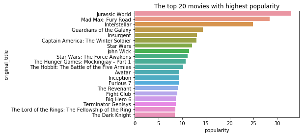
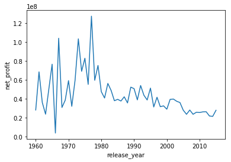

## 探索电影数据集

在这个项目中，你将尝试使用所学的知识，使用 `NumPy`、`Pandas`、`matplotlib`、`seaborn` 库中的函数，来对电影数据集进行探索。

下载数据集：
[TMDb电影数据](https://s3.cn-north-1.amazonaws.com.cn/static-documents/nd101/explore+dataset/tmdb-movies.csv)


数据集各列名称的含义：
<table>
<thead><tr><th>列名称</th><th>id</th><th>imdb_id</th><th>popularity</th><th>budget</th><th>revenue</th><th>original_title</th><th>cast</th><th>homepage</th><th>director</th><th>tagline</th><th>keywords</th><th>overview</th><th>runtime</th><th>genres</th><th>production_companies</th><th>release_date</th><th>vote_count</th><th>vote_average</th><th>release_year</th><th>budget_adj</th><th>revenue_adj</th></tr></thead><tbody>
 <tr><td>含义</td><td>编号</td><td>IMDB 编号</td><td>知名度</td><td>预算</td><td>票房</td><td>名称</td><td>主演</td><td>网站</td><td>导演</td><td>宣传词</td><td>关键词</td><td>简介</td><td>时常</td><td>类别</td><td>发行公司</td><td>发行日期</td><td>投票总数</td><td>投票均值</td><td>发行年份</td><td>预算（调整后）</td><td>票房（调整后）</td></tr>
</tbody></table>


**请注意，你需要提交该报告导出的 `.html`、`.ipynb` 以及 `.py` 文件。**


---

---

## 第一节 数据的导入与处理

在这一部分，你需要编写代码，使用 Pandas 读取数据，并进行预处理。


**任务1.1：** 导入库以及数据

1. 载入需要的库 `NumPy`、`Pandas`、`matplotlib`、`seaborn`。
2. 利用 `Pandas` 库，读取 `tmdb-movies.csv` 中的数据，保存为 `movie_data`。

提示：记得使用 notebook 中的魔法指令 `%matplotlib inline`，否则会导致你接下来无法打印出图像。


```python
import numpy as np
import pandas as pd
import matplotlib.pyplot as plt
import seaborn as sb

%matplotlib inline
```


```python
movie_data=pd.read_csv('./tmdb-movies.csv')
```

---

**任务1.2: ** 了解数据

你会接触到各种各样的数据表，因此在读取之后，我们有必要通过一些简单的方法，来了解我们数据表是什么样子的。

1. 获取数据表的行列，并打印。
2. 使用 `.head()`、`.tail()`、`.sample()` 方法，观察、了解数据表的情况。
3. 使用 `.dtypes` 属性，来查看各列数据的数据类型。
4. 使用 `isnull()` 配合 `.any()` 等方法，来查看各列是否存在空值。
5. 使用 `.describe()` 方法，看看数据表中数值型的数据是怎么分布的。


```python
#获取数据表的行列
movie_data
```


<div>
<style scoped>
    .dataframe tbody tr th:only-of-type {
        vertical-align: middle;
    }

    .dataframe tbody tr th {
        vertical-align: top;
    }

    .dataframe thead th {
        text-align: right;
    }
</style>
<table border="1" class="dataframe">
  <thead>
    <tr style="text-align: right;">
      <th></th>
      <th>id</th>
      <th>imdb_id</th>
      <th>popularity</th>
      <th>budget</th>
      <th>revenue</th>
      <th>original_title</th>
      <th>cast</th>
      <th>homepage</th>
      <th>director</th>
      <th>tagline</th>
      <th>...</th>
      <th>overview</th>
      <th>runtime</th>
      <th>genres</th>
      <th>production_companies</th>
      <th>release_date</th>
      <th>vote_count</th>
      <th>vote_average</th>
      <th>release_year</th>
      <th>budget_adj</th>
      <th>revenue_adj</th>
    </tr>
  </thead>
  <tbody>
    <tr>
      <th>0</th>
      <td>135397</td>
      <td>tt0369610</td>
      <td>32.985763</td>
      <td>150000000</td>
      <td>1513528810</td>
      <td>Jurassic World</td>
      <td>Chris Pratt|Bryce Dallas Howard|Irrfan Khan|Vi...</td>
      <td>http://www.jurassicworld.com/</td>
      <td>Colin Trevorrow</td>
      <td>The park is open.</td>
      <td>...</td>
      <td>Twenty-two years after the events of Jurassic ...</td>
      <td>124</td>
      <td>Action|Adventure|Science Fiction|Thriller</td>
      <td>Universal Studios|Amblin Entertainment|Legenda...</td>
      <td>6/9/15</td>
      <td>5562</td>
      <td>6.5</td>
      <td>2015</td>
      <td>1.379999e+08</td>
      <td>1.392446e+09</td>
    </tr>
    <tr>
      <th>1</th>
      <td>76341</td>
      <td>tt1392190</td>
      <td>28.419936</td>
      <td>150000000</td>
      <td>378436354</td>
      <td>Mad Max: Fury Road</td>
      <td>Tom Hardy|Charlize Theron|Hugh Keays-Byrne|Nic...</td>
      <td>http://www.madmaxmovie.com/</td>
      <td>George Miller</td>
      <td>What a Lovely Day.</td>
      <td>...</td>
      <td>An apocalyptic story set in the furthest reach...</td>
      <td>120</td>
      <td>Action|Adventure|Science Fiction|Thriller</td>
      <td>Village Roadshow Pictures|Kennedy Miller Produ...</td>
      <td>5/13/15</td>
      <td>6185</td>
      <td>7.1</td>
      <td>2015</td>
      <td>1.379999e+08</td>
      <td>3.481613e+08</td>
    </tr>
    <tr>
      <th>2</th>
      <td>262500</td>
      <td>tt2908446</td>
      <td>13.112507</td>
      <td>110000000</td>
      <td>295238201</td>
      <td>Insurgent</td>
      <td>Shailene Woodley|Theo James|Kate Winslet|Ansel...</td>
      <td>http://www.thedivergentseries.movie/#insurgent</td>
      <td>Robert Schwentke</td>
      <td>One Choice Can Destroy You</td>
      <td>...</td>
      <td>Beatrice Prior must confront her inner demons ...</td>
      <td>119</td>
      <td>Adventure|Science Fiction|Thriller</td>
      <td>Summit Entertainment|Mandeville Films|Red Wago...</td>
      <td>3/18/15</td>
      <td>2480</td>
      <td>6.3</td>
      <td>2015</td>
      <td>1.012000e+08</td>
      <td>2.716190e+08</td>
    </tr>
    <tr>
      <th>3</th>
      <td>140607</td>
      <td>tt2488496</td>
      <td>11.173104</td>
      <td>200000000</td>
      <td>2068178225</td>
      <td>Star Wars: The Force Awakens</td>
      <td>Harrison Ford|Mark Hamill|Carrie Fisher|Adam D...</td>
      <td>http://www.starwars.com/films/star-wars-episod...</td>
      <td>J.J. Abrams</td>
      <td>Every generation has a story.</td>
      <td>...</td>
      <td>Thirty years after defeating the Galactic Empi...</td>
      <td>136</td>
      <td>Action|Adventure|Science Fiction|Fantasy</td>
      <td>Lucasfilm|Truenorth Productions|Bad Robot</td>
      <td>12/15/15</td>
      <td>5292</td>
      <td>7.5</td>
      <td>2015</td>
      <td>1.839999e+08</td>
      <td>1.902723e+09</td>
    </tr>
    <tr>
      <th>4</th>
      <td>168259</td>
      <td>tt2820852</td>
      <td>9.335014</td>
      <td>190000000</td>
      <td>1506249360</td>
      <td>Furious 7</td>
      <td>Vin Diesel|Paul Walker|Jason Statham|Michelle ...</td>
      <td>http://www.furious7.com/</td>
      <td>James Wan</td>
      <td>Vengeance Hits Home</td>
      <td>...</td>
      <td>Deckard Shaw seeks revenge against Dominic Tor...</td>
      <td>137</td>
      <td>Action|Crime|Thriller</td>
      <td>Universal Pictures|Original Film|Media Rights ...</td>
      <td>4/1/15</td>
      <td>2947</td>
      <td>7.3</td>
      <td>2015</td>
      <td>1.747999e+08</td>
      <td>1.385749e+09</td>
    </tr>
    <tr>
      <th>5</th>
      <td>281957</td>
      <td>tt1663202</td>
      <td>9.110700</td>
      <td>135000000</td>
      <td>532950503</td>
      <td>The Revenant</td>
      <td>Leonardo DiCaprio|Tom Hardy|Will Poulter|Domhn...</td>
      <td>http://www.foxmovies.com/movies/the-revenant</td>
      <td>Alejandro González Iñárritu</td>
      <td>(n. One who has returned, as if from the dead.)</td>
      <td>...</td>
      <td>In the 1820s, a frontiersman, Hugh Glass, sets...</td>
      <td>156</td>
      <td>Western|Drama|Adventure|Thriller</td>
      <td>Regency Enterprises|Appian Way|CatchPlay|Anony...</td>
      <td>12/25/15</td>
      <td>3929</td>
      <td>7.2</td>
      <td>2015</td>
      <td>1.241999e+08</td>
      <td>4.903142e+08</td>
    </tr>
    <tr>
      <th>6</th>
      <td>87101</td>
      <td>tt1340138</td>
      <td>8.654359</td>
      <td>155000000</td>
      <td>440603537</td>
      <td>Terminator Genisys</td>
      <td>Arnold Schwarzenegger|Jason Clarke|Emilia Clar...</td>
      <td>http://www.terminatormovie.com/</td>
      <td>Alan Taylor</td>
      <td>Reset the future</td>
      <td>...</td>
      <td>The year is 2029. John Connor, leader of the r...</td>
      <td>125</td>
      <td>Science Fiction|Action|Thriller|Adventure</td>
      <td>Paramount Pictures|Skydance Productions</td>
      <td>6/23/15</td>
      <td>2598</td>
      <td>5.8</td>
      <td>2015</td>
      <td>1.425999e+08</td>
      <td>4.053551e+08</td>
    </tr>
    <tr>
      <th>7</th>
      <td>286217</td>
      <td>tt3659388</td>
      <td>7.667400</td>
      <td>108000000</td>
      <td>595380321</td>
      <td>The Martian</td>
      <td>Matt Damon|Jessica Chastain|Kristen Wiig|Jeff ...</td>
      <td>http://www.foxmovies.com/movies/the-martian</td>
      <td>Ridley Scott</td>
      <td>Bring Him Home</td>
      <td>...</td>
      <td>During a manned mission to Mars, Astronaut Mar...</td>
      <td>141</td>
      <td>Drama|Adventure|Science Fiction</td>
      <td>Twentieth Century Fox Film Corporation|Scott F...</td>
      <td>9/30/15</td>
      <td>4572</td>
      <td>7.6</td>
      <td>2015</td>
      <td>9.935996e+07</td>
      <td>5.477497e+08</td>
    </tr>
    <tr>
      <th>8</th>
      <td>211672</td>
      <td>tt2293640</td>
      <td>7.404165</td>
      <td>74000000</td>
      <td>1156730962</td>
      <td>Minions</td>
      <td>Sandra Bullock|Jon Hamm|Michael Keaton|Allison...</td>
      <td>http://www.minionsmovie.com/</td>
      <td>Kyle Balda|Pierre Coffin</td>
      <td>Before Gru, they had a history of bad bosses</td>
      <td>...</td>
      <td>Minions Stuart, Kevin and Bob are recruited by...</td>
      <td>91</td>
      <td>Family|Animation|Adventure|Comedy</td>
      <td>Universal Pictures|Illumination Entertainment</td>
      <td>6/17/15</td>
      <td>2893</td>
      <td>6.5</td>
      <td>2015</td>
      <td>6.807997e+07</td>
      <td>1.064192e+09</td>
    </tr>
    <tr>
      <th>9</th>
      <td>150540</td>
      <td>tt2096673</td>
      <td>6.326804</td>
      <td>175000000</td>
      <td>853708609</td>
      <td>Inside Out</td>
      <td>Amy Poehler|Phyllis Smith|Richard Kind|Bill Ha...</td>
      <td>http://movies.disney.com/inside-out</td>
      <td>Pete Docter</td>
      <td>Meet the little voices inside your head.</td>
      <td>...</td>
      <td>Growing up can be a bumpy road, and it's no ex...</td>
      <td>94</td>
      <td>Comedy|Animation|Family</td>
      <td>Walt Disney Pictures|Pixar Animation Studios|W...</td>
      <td>6/9/15</td>
      <td>3935</td>
      <td>8.0</td>
      <td>2015</td>
      <td>1.609999e+08</td>
      <td>7.854116e+08</td>
    </tr>
    <tr>
      <th>10</th>
      <td>206647</td>
      <td>tt2379713</td>
      <td>6.200282</td>
      <td>245000000</td>
      <td>880674609</td>
      <td>Spectre</td>
      <td>Daniel Craig|Christoph Waltz|Léa Seydoux|Ralp...</td>
      <td>http://www.sonypictures.com/movies/spectre/</td>
      <td>Sam Mendes</td>
      <td>A Plan No One Escapes</td>
      <td>...</td>
      <td>A cryptic message from Bond’s past sends him...</td>
      <td>148</td>
      <td>Action|Adventure|Crime</td>
      <td>Columbia Pictures|Danjaq|B24</td>
      <td>10/26/15</td>
      <td>3254</td>
      <td>6.2</td>
      <td>2015</td>
      <td>2.253999e+08</td>
      <td>8.102203e+08</td>
    </tr>
    <tr>
      <th>11</th>
      <td>76757</td>
      <td>tt1617661</td>
      <td>6.189369</td>
      <td>176000003</td>
      <td>183987723</td>
      <td>Jupiter Ascending</td>
      <td>Mila Kunis|Channing Tatum|Sean Bean|Eddie Redm...</td>
      <td>http://www.jupiterascending.com</td>
      <td>Lana Wachowski|Lilly Wachowski</td>
      <td>Expand your universe.</td>
      <td>...</td>
      <td>In a universe where human genetic material is ...</td>
      <td>124</td>
      <td>Science Fiction|Fantasy|Action|Adventure</td>
      <td>Village Roadshow Pictures|Dune Entertainment|A...</td>
      <td>2/4/15</td>
      <td>1937</td>
      <td>5.2</td>
      <td>2015</td>
      <td>1.619199e+08</td>
      <td>1.692686e+08</td>
    </tr>
    <tr>
      <th>12</th>
      <td>264660</td>
      <td>tt0470752</td>
      <td>6.118847</td>
      <td>15000000</td>
      <td>36869414</td>
      <td>Ex Machina</td>
      <td>Domhnall Gleeson|Alicia Vikander|Oscar Isaac|S...</td>
      <td>http://exmachina-movie.com/</td>
      <td>Alex Garland</td>
      <td>There is nothing more human than the will to s...</td>
      <td>...</td>
      <td>Caleb, a 26 year old coder at the world's larg...</td>
      <td>108</td>
      <td>Drama|Science Fiction</td>
      <td>DNA Films|Universal Pictures International (UP...</td>
      <td>1/21/15</td>
      <td>2854</td>
      <td>7.6</td>
      <td>2015</td>
      <td>1.379999e+07</td>
      <td>3.391985e+07</td>
    </tr>
    <tr>
      <th>13</th>
      <td>257344</td>
      <td>tt2120120</td>
      <td>5.984995</td>
      <td>88000000</td>
      <td>243637091</td>
      <td>Pixels</td>
      <td>Adam Sandler|Michelle Monaghan|Peter Dinklage|...</td>
      <td>http://www.pixels-movie.com/</td>
      <td>Chris Columbus</td>
      <td>Game On.</td>
      <td>...</td>
      <td>Video game experts are recruited by the milita...</td>
      <td>105</td>
      <td>Action|Comedy|Science Fiction</td>
      <td>Columbia Pictures|Happy Madison Productions</td>
      <td>7/16/15</td>
      <td>1575</td>
      <td>5.8</td>
      <td>2015</td>
      <td>8.095996e+07</td>
      <td>2.241460e+08</td>
    </tr>
    <tr>
      <th>14</th>
      <td>99861</td>
      <td>tt2395427</td>
      <td>5.944927</td>
      <td>280000000</td>
      <td>1405035767</td>
      <td>Avengers: Age of Ultron</td>
      <td>Robert Downey Jr.|Chris Hemsworth|Mark Ruffalo...</td>
      <td>http://marvel.com/movies/movie/193/avengers_ag...</td>
      <td>Joss Whedon</td>
      <td>A New Age Has Come.</td>
      <td>...</td>
      <td>When Tony Stark tries to jumpstart a dormant p...</td>
      <td>141</td>
      <td>Action|Adventure|Science Fiction</td>
      <td>Marvel Studios|Prime Focus|Revolution Sun Studios</td>
      <td>4/22/15</td>
      <td>4304</td>
      <td>7.4</td>
      <td>2015</td>
      <td>2.575999e+08</td>
      <td>1.292632e+09</td>
    </tr>
    <tr>
      <th>15</th>
      <td>273248</td>
      <td>tt3460252</td>
      <td>5.898400</td>
      <td>44000000</td>
      <td>155760117</td>
      <td>The Hateful Eight</td>
      <td>Samuel L. Jackson|Kurt Russell|Jennifer Jason ...</td>
      <td>http://thehatefuleight.com/</td>
      <td>Quentin Tarantino</td>
      <td>No one comes up here without a damn good reason.</td>
      <td>...</td>
      <td>Bounty hunters seek shelter from a raging bliz...</td>
      <td>167</td>
      <td>Crime|Drama|Mystery|Western</td>
      <td>Double Feature Films|The Weinstein Company|Fil...</td>
      <td>12/25/15</td>
      <td>2389</td>
      <td>7.4</td>
      <td>2015</td>
      <td>4.047998e+07</td>
      <td>1.432992e+08</td>
    </tr>
    <tr>
      <th>16</th>
      <td>260346</td>
      <td>tt2446042</td>
      <td>5.749758</td>
      <td>48000000</td>
      <td>325771424</td>
      <td>Taken 3</td>
      <td>Liam Neeson|Forest Whitaker|Maggie Grace|Famke...</td>
      <td>http://www.taken3movie.com/</td>
      <td>Olivier Megaton</td>
      <td>It Ends Here</td>
      <td>...</td>
      <td>Ex-government operative Bryan Mills finds his ...</td>
      <td>109</td>
      <td>Crime|Action|Thriller</td>
      <td>Twentieth Century Fox Film Corporation|M6 Film...</td>
      <td>1/1/15</td>
      <td>1578</td>
      <td>6.1</td>
      <td>2015</td>
      <td>4.415998e+07</td>
      <td>2.997096e+08</td>
    </tr>
    <tr>
      <th>17</th>
      <td>102899</td>
      <td>tt0478970</td>
      <td>5.573184</td>
      <td>130000000</td>
      <td>518602163</td>
      <td>Ant-Man</td>
      <td>Paul Rudd|Michael Douglas|Evangeline Lilly|Cor...</td>
      <td>http://marvel.com/movies/movie/180/ant-man</td>
      <td>Peyton Reed</td>
      <td>Heroes Don't Get Any Bigger</td>
      <td>...</td>
      <td>Armed with the astonishing ability to shrink i...</td>
      <td>115</td>
      <td>Science Fiction|Action|Adventure</td>
      <td>Marvel Studios</td>
      <td>7/14/15</td>
      <td>3779</td>
      <td>7.0</td>
      <td>2015</td>
      <td>1.195999e+08</td>
      <td>4.771138e+08</td>
    </tr>
    <tr>
      <th>18</th>
      <td>150689</td>
      <td>tt1661199</td>
      <td>5.556818</td>
      <td>95000000</td>
      <td>542351353</td>
      <td>Cinderella</td>
      <td>Lily James|Cate Blanchett|Richard Madden|Helen...</td>
      <td>NaN</td>
      <td>Kenneth Branagh</td>
      <td>Midnight is just the beginning.</td>
      <td>...</td>
      <td>When her father unexpectedly passes away, youn...</td>
      <td>112</td>
      <td>Romance|Fantasy|Family|Drama</td>
      <td>Walt Disney Pictures|Genre Films|Beagle Pug Fi...</td>
      <td>3/12/15</td>
      <td>1495</td>
      <td>6.8</td>
      <td>2015</td>
      <td>8.739996e+07</td>
      <td>4.989630e+08</td>
    </tr>
    <tr>
      <th>19</th>
      <td>131634</td>
      <td>tt1951266</td>
      <td>5.476958</td>
      <td>160000000</td>
      <td>650523427</td>
      <td>The Hunger Games: Mockingjay - Part 2</td>
      <td>Jennifer Lawrence|Josh Hutcherson|Liam Hemswor...</td>
      <td>http://www.thehungergames.movie/</td>
      <td>Francis Lawrence</td>
      <td>The fire will burn forever.</td>
      <td>...</td>
      <td>With the nation of Panem in a full scale war, ...</td>
      <td>136</td>
      <td>War|Adventure|Science Fiction</td>
      <td>Studio Babelsberg|StudioCanal|Lionsgate|Walt D...</td>
      <td>11/18/15</td>
      <td>2380</td>
      <td>6.5</td>
      <td>2015</td>
      <td>1.471999e+08</td>
      <td>5.984813e+08</td>
    </tr>
    <tr>
      <th>20</th>
      <td>158852</td>
      <td>tt1964418</td>
      <td>5.462138</td>
      <td>190000000</td>
      <td>209035668</td>
      <td>Tomorrowland</td>
      <td>Britt Robertson|George Clooney|Raffey Cassidy|...</td>
      <td>http://movies.disney.com/tomorrowland</td>
      <td>Brad Bird</td>
      <td>Imagine a world where nothing is impossible.</td>
      <td>...</td>
      <td>Bound by a shared destiny, a bright, optimisti...</td>
      <td>130</td>
      <td>Action|Family|Science Fiction|Adventure|Mystery</td>
      <td>Walt Disney Pictures|Babieka|A113</td>
      <td>5/19/15</td>
      <td>1899</td>
      <td>6.2</td>
      <td>2015</td>
      <td>1.747999e+08</td>
      <td>1.923127e+08</td>
    </tr>
    <tr>
      <th>21</th>
      <td>307081</td>
      <td>tt1798684</td>
      <td>5.337064</td>
      <td>30000000</td>
      <td>91709827</td>
      <td>Southpaw</td>
      <td>Jake Gyllenhaal|Rachel McAdams|Forest Whitaker...</td>
      <td>NaN</td>
      <td>Antoine Fuqua</td>
      <td>Believe in Hope.</td>
      <td>...</td>
      <td>Billy "The Great" Hope, the reigning junior mi...</td>
      <td>123</td>
      <td>Action|Drama</td>
      <td>Escape Artists|Riche-Ludwig Productions</td>
      <td>6/15/15</td>
      <td>1386</td>
      <td>7.3</td>
      <td>2015</td>
      <td>2.759999e+07</td>
      <td>8.437300e+07</td>
    </tr>
    <tr>
      <th>22</th>
      <td>254128</td>
      <td>tt2126355</td>
      <td>4.907832</td>
      <td>110000000</td>
      <td>470490832</td>
      <td>San Andreas</td>
      <td>Dwayne Johnson|Alexandra Daddario|Carla Gugino...</td>
      <td>http://www.sanandreasmovie.com/</td>
      <td>Brad Peyton</td>
      <td>A rescue pilot survived an earthquake, this is...</td>
      <td>...</td>
      <td>In the aftermath of a massive earthquake in Ca...</td>
      <td>114</td>
      <td>Action|Drama|Thriller</td>
      <td>New Line Cinema|Village Roadshow Pictures|Warn...</td>
      <td>5/27/15</td>
      <td>2060</td>
      <td>6.1</td>
      <td>2015</td>
      <td>1.012000e+08</td>
      <td>4.328514e+08</td>
    </tr>
    <tr>
      <th>23</th>
      <td>216015</td>
      <td>tt2322441</td>
      <td>4.710402</td>
      <td>40000000</td>
      <td>569651467</td>
      <td>Fifty Shades of Grey</td>
      <td>Dakota Johnson|Jamie Dornan|Jennifer Ehle|Eloi...</td>
      <td>https://www.facebook.com/fiftyshadesofgreymovie</td>
      <td>Sam Taylor-Johnson</td>
      <td>Are you curious?</td>
      <td>...</td>
      <td>When college senior Anastasia Steele steps in ...</td>
      <td>125</td>
      <td>Drama|Romance</td>
      <td>Focus Features|Trigger Street Productions|Mich...</td>
      <td>2/11/15</td>
      <td>1865</td>
      <td>5.3</td>
      <td>2015</td>
      <td>3.679998e+07</td>
      <td>5.240791e+08</td>
    </tr>
    <tr>
      <th>24</th>
      <td>318846</td>
      <td>tt1596363</td>
      <td>4.648046</td>
      <td>28000000</td>
      <td>133346506</td>
      <td>The Big Short</td>
      <td>Christian Bale|Steve Carell|Ryan Gosling|Brad ...</td>
      <td>http://www.thebigshortmovie.com/</td>
      <td>Adam McKay</td>
      <td>This is a true story.</td>
      <td>...</td>
      <td>The men who made millions from a global econom...</td>
      <td>130</td>
      <td>Comedy|Drama</td>
      <td>Paramount Pictures|Plan B Entertainment|Regenc...</td>
      <td>12/11/15</td>
      <td>1545</td>
      <td>7.3</td>
      <td>2015</td>
      <td>2.575999e+07</td>
      <td>1.226787e+08</td>
    </tr>
    <tr>
      <th>25</th>
      <td>177677</td>
      <td>tt2381249</td>
      <td>4.566713</td>
      <td>150000000</td>
      <td>682330139</td>
      <td>Mission: Impossible - Rogue Nation</td>
      <td>Tom Cruise|Jeremy Renner|Simon Pegg|Rebecca Fe...</td>
      <td>http://www.missionimpossible.com</td>
      <td>Christopher McQuarrie</td>
      <td>Desperate Times. Desperate Measures.</td>
      <td>...</td>
      <td>Ethan and team take on their most impossible m...</td>
      <td>131</td>
      <td>Action</td>
      <td>Paramount Pictures|Skydance Productions|China ...</td>
      <td>7/23/15</td>
      <td>2349</td>
      <td>7.1</td>
      <td>2015</td>
      <td>1.379999e+08</td>
      <td>6.277435e+08</td>
    </tr>
    <tr>
      <th>26</th>
      <td>214756</td>
      <td>tt2637276</td>
      <td>4.564549</td>
      <td>68000000</td>
      <td>215863606</td>
      <td>Ted 2</td>
      <td>Mark Wahlberg|Seth MacFarlane|Amanda Seyfried|...</td>
      <td>NaN</td>
      <td>Seth MacFarlane</td>
      <td>Ted is Coming, Again.</td>
      <td>...</td>
      <td>Newlywed couple Ted and Tami-Lynn want to have...</td>
      <td>115</td>
      <td>Comedy</td>
      <td>Universal Pictures|Media Rights Capital|Fuzzy ...</td>
      <td>6/25/15</td>
      <td>1666</td>
      <td>6.3</td>
      <td>2015</td>
      <td>6.255997e+07</td>
      <td>1.985944e+08</td>
    </tr>
    <tr>
      <th>27</th>
      <td>207703</td>
      <td>tt2802144</td>
      <td>4.503789</td>
      <td>81000000</td>
      <td>403802136</td>
      <td>Kingsman: The Secret Service</td>
      <td>Taron Egerton|Colin Firth|Samuel L. Jackson|Mi...</td>
      <td>http://www.kingsmanmovie.com/</td>
      <td>Matthew Vaughn</td>
      <td>Manners maketh man.</td>
      <td>...</td>
      <td>The story of a super-secret spy organization t...</td>
      <td>130</td>
      <td>Crime|Comedy|Action|Adventure</td>
      <td>Twentieth Century Fox Film Corporation|Marv Fi...</td>
      <td>1/24/15</td>
      <td>3833</td>
      <td>7.6</td>
      <td>2015</td>
      <td>7.451997e+07</td>
      <td>3.714978e+08</td>
    </tr>
    <tr>
      <th>28</th>
      <td>314365</td>
      <td>tt1895587</td>
      <td>4.062293</td>
      <td>20000000</td>
      <td>88346473</td>
      <td>Spotlight</td>
      <td>Mark Ruffalo|Michael Keaton|Rachel McAdams|Lie...</td>
      <td>http://www.spotlightthefilm.com</td>
      <td>Tom McCarthy</td>
      <td>Break the story. Break the silence.</td>
      <td>...</td>
      <td>The true story of how The Boston Globe uncover...</td>
      <td>128</td>
      <td>Drama|Thriller|History</td>
      <td>Participant Media|Open Road Films|Anonymous Co...</td>
      <td>11/6/15</td>
      <td>1559</td>
      <td>7.8</td>
      <td>2015</td>
      <td>1.839999e+07</td>
      <td>8.127872e+07</td>
    </tr>
    <tr>
      <th>29</th>
      <td>294254</td>
      <td>tt4046784</td>
      <td>3.968891</td>
      <td>61000000</td>
      <td>311256926</td>
      <td>Maze Runner: The Scorch Trials</td>
      <td>Dylan O'Brien|Kaya Scodelario|Thomas Brodie-Sa...</td>
      <td>http://mazerunnermovies.com</td>
      <td>Wes Ball</td>
      <td>The Maze Was Just the Beginning.</td>
      <td>...</td>
      <td>Thomas and his fellow Gladers face their great...</td>
      <td>132</td>
      <td>Action|Science Fiction|Thriller</td>
      <td>Gotham Group|Temple Hill Entertainment|TSG Ent...</td>
      <td>9/9/15</td>
      <td>1849</td>
      <td>6.4</td>
      <td>2015</td>
      <td>5.611998e+07</td>
      <td>2.863562e+08</td>
    </tr>
    <tr>
      <th>...</th>
      <td>...</td>
      <td>...</td>
      <td>...</td>
      <td>...</td>
      <td>...</td>
      <td>...</td>
      <td>...</td>
      <td>...</td>
      <td>...</td>
      <td>...</td>
      <td>...</td>
      <td>...</td>
      <td>...</td>
      <td>...</td>
      <td>...</td>
      <td>...</td>
      <td>...</td>
      <td>...</td>
      <td>...</td>
      <td>...</td>
      <td>...</td>
    </tr>
    <tr>
      <th>10836</th>
      <td>38720</td>
      <td>tt0061170</td>
      <td>0.239435</td>
      <td>0</td>
      <td>0</td>
      <td>Walk Don't Run</td>
      <td>Cary Grant|Samantha Eggar|Jim Hutton|John Stan...</td>
      <td>NaN</td>
      <td>Charles Walters</td>
      <td>Run, don't walk to see Walk, Don't Run.</td>
      <td>...</td>
      <td>British industrialist Sir William Rutland - "B...</td>
      <td>114</td>
      <td>Comedy|Romance</td>
      <td>Columbia Pictures Corporation</td>
      <td>1/1/66</td>
      <td>11</td>
      <td>5.8</td>
      <td>1966</td>
      <td>0.000000e+00</td>
      <td>0.000000e+00</td>
    </tr>
    <tr>
      <th>10837</th>
      <td>19728</td>
      <td>tt0060177</td>
      <td>0.291704</td>
      <td>0</td>
      <td>0</td>
      <td>The Blue Max</td>
      <td>George Peppard|James Mason|Ursula Andress|Jere...</td>
      <td>NaN</td>
      <td>John Guillermin</td>
      <td>There was no quiet on the Western Front!</td>
      <td>...</td>
      <td>A young pilot in the German air force of 1918,...</td>
      <td>156</td>
      <td>War|Action|Adventure|Drama</td>
      <td>Twentieth Century Fox Film Corporation</td>
      <td>6/21/66</td>
      <td>12</td>
      <td>5.5</td>
      <td>1966</td>
      <td>0.000000e+00</td>
      <td>0.000000e+00</td>
    </tr>
    <tr>
      <th>10838</th>
      <td>22383</td>
      <td>tt0060862</td>
      <td>0.151845</td>
      <td>0</td>
      <td>0</td>
      <td>The Professionals</td>
      <td>Burt Lancaster|Lee Marvin|Robert Ryan|Woody St...</td>
      <td>NaN</td>
      <td>Richard Brooks</td>
      <td>Rough, tough and ready.</td>
      <td>...</td>
      <td>The Professionals is a 1966 American Western f...</td>
      <td>117</td>
      <td>Action|Adventure|Western</td>
      <td>Columbia Pictures</td>
      <td>11/1/66</td>
      <td>21</td>
      <td>6.0</td>
      <td>1966</td>
      <td>0.000000e+00</td>
      <td>0.000000e+00</td>
    </tr>
    <tr>
      <th>10839</th>
      <td>13353</td>
      <td>tt0060550</td>
      <td>0.276133</td>
      <td>0</td>
      <td>0</td>
      <td>It's the Great Pumpkin, Charlie Brown</td>
      <td>Christopher Shea|Sally Dryer|Kathy Steinberg|A...</td>
      <td>NaN</td>
      <td>Bill Melendez</td>
      <td>Every year he rises from the pumpkin patch...</td>
      <td>...</td>
      <td>This classic "Peanuts" tale focuses on the thu...</td>
      <td>25</td>
      <td>Family|Animation</td>
      <td>Warner Bros. Home Video</td>
      <td>10/27/66</td>
      <td>49</td>
      <td>7.2</td>
      <td>1966</td>
      <td>0.000000e+00</td>
      <td>0.000000e+00</td>
    </tr>
    <tr>
      <th>10840</th>
      <td>34388</td>
      <td>tt0060437</td>
      <td>0.102530</td>
      <td>0</td>
      <td>0</td>
      <td>Funeral in Berlin</td>
      <td>Michael Caine|Paul Hubschmid|Oskar Homolka|Eva...</td>
      <td>NaN</td>
      <td>Guy Hamilton</td>
      <td>NaN</td>
      <td>...</td>
      <td>Colonel Stok, a Soviet intelligence officer re...</td>
      <td>102</td>
      <td>Thriller</td>
      <td>Lowndes Productions Limited</td>
      <td>12/22/66</td>
      <td>13</td>
      <td>5.7</td>
      <td>1966</td>
      <td>0.000000e+00</td>
      <td>0.000000e+00</td>
    </tr>
    <tr>
      <th>10841</th>
      <td>42701</td>
      <td>tt0062262</td>
      <td>0.264925</td>
      <td>75000</td>
      <td>0</td>
      <td>The Shooting</td>
      <td>Will Hutchins|Millie Perkins|Jack Nicholson|Wa...</td>
      <td>NaN</td>
      <td>Monte Hellman</td>
      <td>Suspenseful desert pursuit in the "High Noon" ...</td>
      <td>...</td>
      <td>A hired gun seeks to enact revenge on a group ...</td>
      <td>82</td>
      <td>Western</td>
      <td>Proteus Films</td>
      <td>10/23/66</td>
      <td>12</td>
      <td>5.5</td>
      <td>1966</td>
      <td>5.038511e+05</td>
      <td>0.000000e+00</td>
    </tr>
    <tr>
      <th>10842</th>
      <td>36540</td>
      <td>tt0061199</td>
      <td>0.253437</td>
      <td>0</td>
      <td>0</td>
      <td>Winnie the Pooh and the Honey Tree</td>
      <td>Sterling Holloway|Junius Matthews|Sebastian Ca...</td>
      <td>NaN</td>
      <td>Wolfgang Reitherman</td>
      <td>NaN</td>
      <td>...</td>
      <td>Christopher Robin's bear attempts to raid a be...</td>
      <td>25</td>
      <td>Animation|Family</td>
      <td>NaN</td>
      <td>1/1/66</td>
      <td>12</td>
      <td>7.9</td>
      <td>1966</td>
      <td>0.000000e+00</td>
      <td>0.000000e+00</td>
    </tr>
    <tr>
      <th>10843</th>
      <td>29710</td>
      <td>tt0060588</td>
      <td>0.252399</td>
      <td>0</td>
      <td>0</td>
      <td>Khartoum</td>
      <td>Charlton Heston|Laurence Olivier|Richard Johns...</td>
      <td>NaN</td>
      <td>Basil Dearden|Eliot Elisofon</td>
      <td>Where the Nile divides, the great Cinerama adv...</td>
      <td>...</td>
      <td>English General Charles George Gordon, a devou...</td>
      <td>134</td>
      <td>Adventure|Drama|War|History|Action</td>
      <td>Julian Blaustein Productions Ltd.</td>
      <td>6/9/66</td>
      <td>12</td>
      <td>5.8</td>
      <td>1966</td>
      <td>0.000000e+00</td>
      <td>0.000000e+00</td>
    </tr>
    <tr>
      <th>10844</th>
      <td>23728</td>
      <td>tt0059557</td>
      <td>0.236098</td>
      <td>0</td>
      <td>0</td>
      <td>Our Man Flint</td>
      <td>James Coburn|Lee J. Cobb|Gila Golan|Edward Mul...</td>
      <td>NaN</td>
      <td>Daniel Mann</td>
      <td>The ORIGINAL man of mystery!</td>
      <td>...</td>
      <td>When scientists use eco-terrorism to impose th...</td>
      <td>108</td>
      <td>Adventure|Comedy|Fantasy|Science Fiction</td>
      <td>20th Century Fox</td>
      <td>1/16/66</td>
      <td>13</td>
      <td>5.6</td>
      <td>1966</td>
      <td>0.000000e+00</td>
      <td>0.000000e+00</td>
    </tr>
    <tr>
      <th>10845</th>
      <td>5065</td>
      <td>tt0059014</td>
      <td>0.230873</td>
      <td>0</td>
      <td>0</td>
      <td>Carry On Cowboy</td>
      <td>Sid James|Jim Dale|Angela Douglas|Kenneth Will...</td>
      <td>NaN</td>
      <td>Gerald Thomas</td>
      <td>How the west was lost!</td>
      <td>...</td>
      <td>Stodge City is in the grip of the Rumpo Kid an...</td>
      <td>93</td>
      <td>Comedy|Western</td>
      <td>Peter Rogers Productions</td>
      <td>3/1/66</td>
      <td>15</td>
      <td>5.9</td>
      <td>1966</td>
      <td>0.000000e+00</td>
      <td>0.000000e+00</td>
    </tr>
    <tr>
      <th>10846</th>
      <td>17102</td>
      <td>tt0059127</td>
      <td>0.212716</td>
      <td>0</td>
      <td>0</td>
      <td>Dracula: Prince of Darkness</td>
      <td>Christopher Lee|Barbara Shelley|Andrew Keir|Fr...</td>
      <td>NaN</td>
      <td>Terence Fisher</td>
      <td>DEAD for Ten Years DRACULA, Prince of Darkness...</td>
      <td>...</td>
      <td>Whilst vacationing in the Carpathian Mountain,...</td>
      <td>90</td>
      <td>Horror</td>
      <td>Seven Arts Productions|Hammer Film Productions</td>
      <td>1/9/66</td>
      <td>16</td>
      <td>5.7</td>
      <td>1966</td>
      <td>0.000000e+00</td>
      <td>0.000000e+00</td>
    </tr>
    <tr>
      <th>10847</th>
      <td>28763</td>
      <td>tt0060548</td>
      <td>0.034555</td>
      <td>0</td>
      <td>0</td>
      <td>Island of Terror</td>
      <td>Peter Cushing|Edward Judd|Carole Gray|Eddie By...</td>
      <td>NaN</td>
      <td>Terence Fisher</td>
      <td>How could they stop the devouring death...that...</td>
      <td>...</td>
      <td>A small island community is overrun with creep...</td>
      <td>89</td>
      <td>Science Fiction|Horror</td>
      <td>Planet Film Productions|Protelco</td>
      <td>6/20/66</td>
      <td>13</td>
      <td>5.3</td>
      <td>1966</td>
      <td>0.000000e+00</td>
      <td>0.000000e+00</td>
    </tr>
    <tr>
      <th>10848</th>
      <td>2161</td>
      <td>tt0060397</td>
      <td>0.207257</td>
      <td>5115000</td>
      <td>12000000</td>
      <td>Fantastic Voyage</td>
      <td>Stephen Boyd|Raquel Welch|Edmond O'Brien|Donal...</td>
      <td>NaN</td>
      <td>Richard Fleischer</td>
      <td>A Fantastic and Spectacular Voyage... Through ...</td>
      <td>...</td>
      <td>The science of miniaturization has been unlock...</td>
      <td>100</td>
      <td>Adventure|Science Fiction</td>
      <td>Twentieth Century Fox Film Corporation</td>
      <td>8/24/66</td>
      <td>42</td>
      <td>6.7</td>
      <td>1966</td>
      <td>3.436265e+07</td>
      <td>8.061618e+07</td>
    </tr>
    <tr>
      <th>10849</th>
      <td>28270</td>
      <td>tt0060445</td>
      <td>0.206537</td>
      <td>0</td>
      <td>0</td>
      <td>Gambit</td>
      <td>Michael Caine|Shirley MacLaine|Herbert Lom|Joh...</td>
      <td>NaN</td>
      <td>Ronald Neame</td>
      <td>Shirley MacLaine raises Michael Caine!</td>
      <td>...</td>
      <td>Harry Dean (Michael Caine) has a perfect plan ...</td>
      <td>109</td>
      <td>Action|Comedy|Crime</td>
      <td>Universal Pictures</td>
      <td>12/16/66</td>
      <td>14</td>
      <td>6.1</td>
      <td>1966</td>
      <td>0.000000e+00</td>
      <td>0.000000e+00</td>
    </tr>
    <tr>
      <th>10850</th>
      <td>26268</td>
      <td>tt0060490</td>
      <td>0.202473</td>
      <td>0</td>
      <td>0</td>
      <td>Harper</td>
      <td>Paul Newman|Lauren Bacall|Julie Harris|Arthur ...</td>
      <td>NaN</td>
      <td>Jack Smight</td>
      <td>Harper takes a case - and the payoff is murder.</td>
      <td>...</td>
      <td>Harper is a cynical private eye in the best tr...</td>
      <td>121</td>
      <td>Action|Drama|Thriller|Crime|Mystery</td>
      <td>Warner Bros.</td>
      <td>2/23/66</td>
      <td>14</td>
      <td>6.0</td>
      <td>1966</td>
      <td>0.000000e+00</td>
      <td>0.000000e+00</td>
    </tr>
    <tr>
      <th>10851</th>
      <td>15347</td>
      <td>tt0060182</td>
      <td>0.342791</td>
      <td>0</td>
      <td>0</td>
      <td>Born Free</td>
      <td>Virginia McKenna|Bill Travers|Geoffrey Keen|Pe...</td>
      <td>NaN</td>
      <td>James Hill</td>
      <td>From The Pages Of The Beloved Best Seller... A...</td>
      <td>...</td>
      <td>Born Free (1966) is an Open Road Films Ltd./Co...</td>
      <td>95</td>
      <td>Adventure|Drama|Action|Family|Foreign</td>
      <td>High Road</td>
      <td>6/22/66</td>
      <td>15</td>
      <td>6.6</td>
      <td>1966</td>
      <td>0.000000e+00</td>
      <td>0.000000e+00</td>
    </tr>
    <tr>
      <th>10852</th>
      <td>37301</td>
      <td>tt0060165</td>
      <td>0.227220</td>
      <td>0</td>
      <td>0</td>
      <td>A Big Hand for the Little Lady</td>
      <td>Henry Fonda|Joanne Woodward|Jason Robards|Paul...</td>
      <td>NaN</td>
      <td>Fielder Cook</td>
      <td>All the action you can take...all the adventur...</td>
      <td>...</td>
      <td>A naive traveler in Laredo gets involved in a ...</td>
      <td>95</td>
      <td>Western</td>
      <td>Eden Productions Inc.</td>
      <td>5/31/66</td>
      <td>11</td>
      <td>6.0</td>
      <td>1966</td>
      <td>0.000000e+00</td>
      <td>0.000000e+00</td>
    </tr>
    <tr>
      <th>10853</th>
      <td>15598</td>
      <td>tt0060086</td>
      <td>0.163592</td>
      <td>0</td>
      <td>0</td>
      <td>Alfie</td>
      <td>Michael Caine|Shelley Winters|Millicent Martin...</td>
      <td>NaN</td>
      <td>Lewis Gilbert</td>
      <td>Is any man an Alfie? Ask any girl!</td>
      <td>...</td>
      <td>The film tells the story of a young man who le...</td>
      <td>114</td>
      <td>Comedy|Drama|Romance</td>
      <td>NaN</td>
      <td>3/29/66</td>
      <td>26</td>
      <td>6.2</td>
      <td>1966</td>
      <td>0.000000e+00</td>
      <td>0.000000e+00</td>
    </tr>
    <tr>
      <th>10854</th>
      <td>31602</td>
      <td>tt0060232</td>
      <td>0.146402</td>
      <td>0</td>
      <td>0</td>
      <td>The Chase</td>
      <td>Marlon Brando|Jane Fonda|Robert Redford|E.G. M...</td>
      <td>NaN</td>
      <td>Arthur Penn</td>
      <td>The chase is on!</td>
      <td>...</td>
      <td>Most everyone in town thinks that Sheriff Cald...</td>
      <td>135</td>
      <td>Thriller|Drama|Crime</td>
      <td>Horizon Pictures|Columbia Pictures Corporation</td>
      <td>2/17/66</td>
      <td>17</td>
      <td>6.0</td>
      <td>1966</td>
      <td>0.000000e+00</td>
      <td>0.000000e+00</td>
    </tr>
    <tr>
      <th>10855</th>
      <td>13343</td>
      <td>tt0059221</td>
      <td>0.141026</td>
      <td>700000</td>
      <td>0</td>
      <td>The Ghost &amp; Mr. Chicken</td>
      <td>Don Knotts|Joan Staley|Liam Redmond|Dick Sarge...</td>
      <td>NaN</td>
      <td>Alan Rafkin</td>
      <td>G-G-GUARANTEED! YOU'LL BE SCARED UNTIL YOU LAU...</td>
      <td>...</td>
      <td>Luther Heggs aspires to being a reporter for h...</td>
      <td>90</td>
      <td>Comedy|Family|Mystery|Romance</td>
      <td>Universal Pictures</td>
      <td>1/20/66</td>
      <td>14</td>
      <td>6.1</td>
      <td>1966</td>
      <td>4.702610e+06</td>
      <td>0.000000e+00</td>
    </tr>
    <tr>
      <th>10856</th>
      <td>20277</td>
      <td>tt0061135</td>
      <td>0.140934</td>
      <td>0</td>
      <td>0</td>
      <td>The Ugly Dachshund</td>
      <td>Dean Jones|Suzanne Pleshette|Charles Ruggles|K...</td>
      <td>NaN</td>
      <td>Norman Tokar</td>
      <td>A HAPPY HONEYMOON GOES TO THE DOGS!...When a G...</td>
      <td>...</td>
      <td>The Garrisons (Dean Jones and Suzanne Pleshett...</td>
      <td>93</td>
      <td>Comedy|Drama|Family</td>
      <td>Walt Disney Pictures</td>
      <td>2/16/66</td>
      <td>14</td>
      <td>5.7</td>
      <td>1966</td>
      <td>0.000000e+00</td>
      <td>0.000000e+00</td>
    </tr>
    <tr>
      <th>10857</th>
      <td>5921</td>
      <td>tt0060748</td>
      <td>0.131378</td>
      <td>0</td>
      <td>0</td>
      <td>Nevada Smith</td>
      <td>Steve McQueen|Karl Malden|Brian Keith|Arthur K...</td>
      <td>NaN</td>
      <td>Henry Hathaway</td>
      <td>Some called him savage- and some called him sa...</td>
      <td>...</td>
      <td>Nevada Smith is the young son of an Indian mot...</td>
      <td>128</td>
      <td>Action|Western</td>
      <td>Paramount Pictures|Solar Productions|Embassy P...</td>
      <td>6/10/66</td>
      <td>10</td>
      <td>5.9</td>
      <td>1966</td>
      <td>0.000000e+00</td>
      <td>0.000000e+00</td>
    </tr>
    <tr>
      <th>10858</th>
      <td>31918</td>
      <td>tt0060921</td>
      <td>0.317824</td>
      <td>0</td>
      <td>0</td>
      <td>The Russians Are Coming, The Russians Are Coming</td>
      <td>Carl Reiner|Eva Marie Saint|Alan Arkin|Brian K...</td>
      <td>NaN</td>
      <td>Norman Jewison</td>
      <td>IT'S A PLOT! ...to make the world die laughing!!</td>
      <td>...</td>
      <td>Without hostile intent, a Soviet sub runs agro...</td>
      <td>126</td>
      <td>Comedy|War</td>
      <td>The Mirisch Corporation</td>
      <td>5/25/66</td>
      <td>11</td>
      <td>5.5</td>
      <td>1966</td>
      <td>0.000000e+00</td>
      <td>0.000000e+00</td>
    </tr>
    <tr>
      <th>10859</th>
      <td>20620</td>
      <td>tt0060955</td>
      <td>0.089072</td>
      <td>0</td>
      <td>0</td>
      <td>Seconds</td>
      <td>Rock Hudson|Salome Jens|John Randolph|Will Gee...</td>
      <td>NaN</td>
      <td>John Frankenheimer</td>
      <td>NaN</td>
      <td>...</td>
      <td>A secret organisation offers wealthy people a ...</td>
      <td>100</td>
      <td>Mystery|Science Fiction|Thriller|Drama</td>
      <td>Gibraltar Productions|Joel Productions|John Fr...</td>
      <td>10/5/66</td>
      <td>22</td>
      <td>6.6</td>
      <td>1966</td>
      <td>0.000000e+00</td>
      <td>0.000000e+00</td>
    </tr>
    <tr>
      <th>10860</th>
      <td>5060</td>
      <td>tt0060214</td>
      <td>0.087034</td>
      <td>0</td>
      <td>0</td>
      <td>Carry On Screaming!</td>
      <td>Kenneth Williams|Jim Dale|Harry H. Corbett|Joa...</td>
      <td>NaN</td>
      <td>Gerald Thomas</td>
      <td>Carry On Screaming with the Hilarious CARRY ON...</td>
      <td>...</td>
      <td>The sinister Dr Watt has an evil scheme going....</td>
      <td>87</td>
      <td>Comedy</td>
      <td>Peter Rogers Productions|Anglo-Amalgamated Fil...</td>
      <td>5/20/66</td>
      <td>13</td>
      <td>7.0</td>
      <td>1966</td>
      <td>0.000000e+00</td>
      <td>0.000000e+00</td>
    </tr>
    <tr>
      <th>10861</th>
      <td>21</td>
      <td>tt0060371</td>
      <td>0.080598</td>
      <td>0</td>
      <td>0</td>
      <td>The Endless Summer</td>
      <td>Michael Hynson|Robert August|Lord 'Tally Ho' B...</td>
      <td>NaN</td>
      <td>Bruce Brown</td>
      <td>NaN</td>
      <td>...</td>
      <td>The Endless Summer, by Bruce Brown, is one of ...</td>
      <td>95</td>
      <td>Documentary</td>
      <td>Bruce Brown Films</td>
      <td>6/15/66</td>
      <td>11</td>
      <td>7.4</td>
      <td>1966</td>
      <td>0.000000e+00</td>
      <td>0.000000e+00</td>
    </tr>
    <tr>
      <th>10862</th>
      <td>20379</td>
      <td>tt0060472</td>
      <td>0.065543</td>
      <td>0</td>
      <td>0</td>
      <td>Grand Prix</td>
      <td>James Garner|Eva Marie Saint|Yves Montand|Tosh...</td>
      <td>NaN</td>
      <td>John Frankenheimer</td>
      <td>Cinerama sweeps YOU into a drama of speed and ...</td>
      <td>...</td>
      <td>Grand Prix driver Pete Aron is fired by his te...</td>
      <td>176</td>
      <td>Action|Adventure|Drama</td>
      <td>Cherokee Productions|Joel Productions|Douglas ...</td>
      <td>12/21/66</td>
      <td>20</td>
      <td>5.7</td>
      <td>1966</td>
      <td>0.000000e+00</td>
      <td>0.000000e+00</td>
    </tr>
    <tr>
      <th>10863</th>
      <td>39768</td>
      <td>tt0060161</td>
      <td>0.065141</td>
      <td>0</td>
      <td>0</td>
      <td>Beregis Avtomobilya</td>
      <td>Innokentiy Smoktunovskiy|Oleg Efremov|Georgi Z...</td>
      <td>NaN</td>
      <td>Eldar Ryazanov</td>
      <td>NaN</td>
      <td>...</td>
      <td>An insurance agent who moonlights as a carthie...</td>
      <td>94</td>
      <td>Mystery|Comedy</td>
      <td>Mosfilm</td>
      <td>1/1/66</td>
      <td>11</td>
      <td>6.5</td>
      <td>1966</td>
      <td>0.000000e+00</td>
      <td>0.000000e+00</td>
    </tr>
    <tr>
      <th>10864</th>
      <td>21449</td>
      <td>tt0061177</td>
      <td>0.064317</td>
      <td>0</td>
      <td>0</td>
      <td>What's Up, Tiger Lily?</td>
      <td>Tatsuya Mihashi|Akiko Wakabayashi|Mie Hama|Joh...</td>
      <td>NaN</td>
      <td>Woody Allen</td>
      <td>WOODY ALLEN STRIKES BACK!</td>
      <td>...</td>
      <td>In comic Woody Allen's film debut, he took the...</td>
      <td>80</td>
      <td>Action|Comedy</td>
      <td>Benedict Pictures Corp.</td>
      <td>11/2/66</td>
      <td>22</td>
      <td>5.4</td>
      <td>1966</td>
      <td>0.000000e+00</td>
      <td>0.000000e+00</td>
    </tr>
    <tr>
      <th>10865</th>
      <td>22293</td>
      <td>tt0060666</td>
      <td>0.035919</td>
      <td>19000</td>
      <td>0</td>
      <td>Manos: The Hands of Fate</td>
      <td>Harold P. Warren|Tom Neyman|John Reynolds|Dian...</td>
      <td>NaN</td>
      <td>Harold P. Warren</td>
      <td>It's Shocking! It's Beyond Your Imagination!</td>
      <td>...</td>
      <td>A family gets lost on the road and stumbles up...</td>
      <td>74</td>
      <td>Horror</td>
      <td>Norm-Iris</td>
      <td>11/15/66</td>
      <td>15</td>
      <td>1.5</td>
      <td>1966</td>
      <td>1.276423e+05</td>
      <td>0.000000e+00</td>
    </tr>
  </tbody>
</table>
<p>10866 rows × 21 columns</p>
</div>


```python
movie_data.shape
```


    (10866, 21)


```python
#获取数据表的列
print(movie_data.columns)
```

    Index(['id', 'imdb_id', 'popularity', 'budget', 'revenue', 'original_title',
           'cast', 'homepage', 'director', 'tagline', 'keywords', 'overview',
           'runtime', 'genres', 'production_companies', 'release_date',
           'vote_count', 'vote_average', 'release_year', 'budget_adj',
           'revenue_adj'],
          dtype='object')


```python
#获取数据表的行
print(movie_data.index)
```

    RangeIndex(start=0, stop=10866, step=1)


```python
movie_data.head()
```


<div>
<style scoped>
    .dataframe tbody tr th:only-of-type {
        vertical-align: middle;
    }

    .dataframe tbody tr th {
        vertical-align: top;
    }

    .dataframe thead th {
        text-align: right;
    }
</style>
<table border="1" class="dataframe">
  <thead>
    <tr style="text-align: right;">
      <th></th>
      <th>id</th>
      <th>imdb_id</th>
      <th>popularity</th>
      <th>budget</th>
      <th>revenue</th>
      <th>original_title</th>
      <th>cast</th>
      <th>homepage</th>
      <th>director</th>
      <th>tagline</th>
      <th>...</th>
      <th>overview</th>
      <th>runtime</th>
      <th>genres</th>
      <th>production_companies</th>
      <th>release_date</th>
      <th>vote_count</th>
      <th>vote_average</th>
      <th>release_year</th>
      <th>budget_adj</th>
      <th>revenue_adj</th>
    </tr>
  </thead>
  <tbody>
    <tr>
      <th>0</th>
      <td>135397</td>
      <td>tt0369610</td>
      <td>32.985763</td>
      <td>150000000</td>
      <td>1513528810</td>
      <td>Jurassic World</td>
      <td>Chris Pratt|Bryce Dallas Howard|Irrfan Khan|Vi...</td>
      <td>http://www.jurassicworld.com/</td>
      <td>Colin Trevorrow</td>
      <td>The park is open.</td>
      <td>...</td>
      <td>Twenty-two years after the events of Jurassic ...</td>
      <td>124</td>
      <td>Action|Adventure|Science Fiction|Thriller</td>
      <td>Universal Studios|Amblin Entertainment|Legenda...</td>
      <td>6/9/15</td>
      <td>5562</td>
      <td>6.5</td>
      <td>2015</td>
      <td>1.379999e+08</td>
      <td>1.392446e+09</td>
    </tr>
    <tr>
      <th>1</th>
      <td>76341</td>
      <td>tt1392190</td>
      <td>28.419936</td>
      <td>150000000</td>
      <td>378436354</td>
      <td>Mad Max: Fury Road</td>
      <td>Tom Hardy|Charlize Theron|Hugh Keays-Byrne|Nic...</td>
      <td>http://www.madmaxmovie.com/</td>
      <td>George Miller</td>
      <td>What a Lovely Day.</td>
      <td>...</td>
      <td>An apocalyptic story set in the furthest reach...</td>
      <td>120</td>
      <td>Action|Adventure|Science Fiction|Thriller</td>
      <td>Village Roadshow Pictures|Kennedy Miller Produ...</td>
      <td>5/13/15</td>
      <td>6185</td>
      <td>7.1</td>
      <td>2015</td>
      <td>1.379999e+08</td>
      <td>3.481613e+08</td>
    </tr>
    <tr>
      <th>2</th>
      <td>262500</td>
      <td>tt2908446</td>
      <td>13.112507</td>
      <td>110000000</td>
      <td>295238201</td>
      <td>Insurgent</td>
      <td>Shailene Woodley|Theo James|Kate Winslet|Ansel...</td>
      <td>http://www.thedivergentseries.movie/#insurgent</td>
      <td>Robert Schwentke</td>
      <td>One Choice Can Destroy You</td>
      <td>...</td>
      <td>Beatrice Prior must confront her inner demons ...</td>
      <td>119</td>
      <td>Adventure|Science Fiction|Thriller</td>
      <td>Summit Entertainment|Mandeville Films|Red Wago...</td>
      <td>3/18/15</td>
      <td>2480</td>
      <td>6.3</td>
      <td>2015</td>
      <td>1.012000e+08</td>
      <td>2.716190e+08</td>
    </tr>
    <tr>
      <th>3</th>
      <td>140607</td>
      <td>tt2488496</td>
      <td>11.173104</td>
      <td>200000000</td>
      <td>2068178225</td>
      <td>Star Wars: The Force Awakens</td>
      <td>Harrison Ford|Mark Hamill|Carrie Fisher|Adam D...</td>
      <td>http://www.starwars.com/films/star-wars-episod...</td>
      <td>J.J. Abrams</td>
      <td>Every generation has a story.</td>
      <td>...</td>
      <td>Thirty years after defeating the Galactic Empi...</td>
      <td>136</td>
      <td>Action|Adventure|Science Fiction|Fantasy</td>
      <td>Lucasfilm|Truenorth Productions|Bad Robot</td>
      <td>12/15/15</td>
      <td>5292</td>
      <td>7.5</td>
      <td>2015</td>
      <td>1.839999e+08</td>
      <td>1.902723e+09</td>
    </tr>
    <tr>
      <th>4</th>
      <td>168259</td>
      <td>tt2820852</td>
      <td>9.335014</td>
      <td>190000000</td>
      <td>1506249360</td>
      <td>Furious 7</td>
      <td>Vin Diesel|Paul Walker|Jason Statham|Michelle ...</td>
      <td>http://www.furious7.com/</td>
      <td>James Wan</td>
      <td>Vengeance Hits Home</td>
      <td>...</td>
      <td>Deckard Shaw seeks revenge against Dominic Tor...</td>
      <td>137</td>
      <td>Action|Crime|Thriller</td>
      <td>Universal Pictures|Original Film|Media Rights ...</td>
      <td>4/1/15</td>
      <td>2947</td>
      <td>7.3</td>
      <td>2015</td>
      <td>1.747999e+08</td>
      <td>1.385749e+09</td>
    </tr>
  </tbody>
</table>
<p>5 rows × 21 columns</p>
</div>


```python
movie_data.tail()
```


<div>
<style scoped>
    .dataframe tbody tr th:only-of-type {
        vertical-align: middle;
    }

    .dataframe tbody tr th {
        vertical-align: top;
    }

    .dataframe thead th {
        text-align: right;
    }
</style>
<table border="1" class="dataframe">
  <thead>
    <tr style="text-align: right;">
      <th></th>
      <th>id</th>
      <th>imdb_id</th>
      <th>popularity</th>
      <th>budget</th>
      <th>revenue</th>
      <th>original_title</th>
      <th>cast</th>
      <th>homepage</th>
      <th>director</th>
      <th>tagline</th>
      <th>...</th>
      <th>overview</th>
      <th>runtime</th>
      <th>genres</th>
      <th>production_companies</th>
      <th>release_date</th>
      <th>vote_count</th>
      <th>vote_average</th>
      <th>release_year</th>
      <th>budget_adj</th>
      <th>revenue_adj</th>
    </tr>
  </thead>
  <tbody>
    <tr>
      <th>10861</th>
      <td>21</td>
      <td>tt0060371</td>
      <td>0.080598</td>
      <td>0</td>
      <td>0</td>
      <td>The Endless Summer</td>
      <td>Michael Hynson|Robert August|Lord 'Tally Ho' B...</td>
      <td>NaN</td>
      <td>Bruce Brown</td>
      <td>NaN</td>
      <td>...</td>
      <td>The Endless Summer, by Bruce Brown, is one of ...</td>
      <td>95</td>
      <td>Documentary</td>
      <td>Bruce Brown Films</td>
      <td>6/15/66</td>
      <td>11</td>
      <td>7.4</td>
      <td>1966</td>
      <td>0.000000</td>
      <td>0.0</td>
    </tr>
    <tr>
      <th>10862</th>
      <td>20379</td>
      <td>tt0060472</td>
      <td>0.065543</td>
      <td>0</td>
      <td>0</td>
      <td>Grand Prix</td>
      <td>James Garner|Eva Marie Saint|Yves Montand|Tosh...</td>
      <td>NaN</td>
      <td>John Frankenheimer</td>
      <td>Cinerama sweeps YOU into a drama of speed and ...</td>
      <td>...</td>
      <td>Grand Prix driver Pete Aron is fired by his te...</td>
      <td>176</td>
      <td>Action|Adventure|Drama</td>
      <td>Cherokee Productions|Joel Productions|Douglas ...</td>
      <td>12/21/66</td>
      <td>20</td>
      <td>5.7</td>
      <td>1966</td>
      <td>0.000000</td>
      <td>0.0</td>
    </tr>
    <tr>
      <th>10863</th>
      <td>39768</td>
      <td>tt0060161</td>
      <td>0.065141</td>
      <td>0</td>
      <td>0</td>
      <td>Beregis Avtomobilya</td>
      <td>Innokentiy Smoktunovskiy|Oleg Efremov|Georgi Z...</td>
      <td>NaN</td>
      <td>Eldar Ryazanov</td>
      <td>NaN</td>
      <td>...</td>
      <td>An insurance agent who moonlights as a carthie...</td>
      <td>94</td>
      <td>Mystery|Comedy</td>
      <td>Mosfilm</td>
      <td>1/1/66</td>
      <td>11</td>
      <td>6.5</td>
      <td>1966</td>
      <td>0.000000</td>
      <td>0.0</td>
    </tr>
    <tr>
      <th>10864</th>
      <td>21449</td>
      <td>tt0061177</td>
      <td>0.064317</td>
      <td>0</td>
      <td>0</td>
      <td>What's Up, Tiger Lily?</td>
      <td>Tatsuya Mihashi|Akiko Wakabayashi|Mie Hama|Joh...</td>
      <td>NaN</td>
      <td>Woody Allen</td>
      <td>WOODY ALLEN STRIKES BACK!</td>
      <td>...</td>
      <td>In comic Woody Allen's film debut, he took the...</td>
      <td>80</td>
      <td>Action|Comedy</td>
      <td>Benedict Pictures Corp.</td>
      <td>11/2/66</td>
      <td>22</td>
      <td>5.4</td>
      <td>1966</td>
      <td>0.000000</td>
      <td>0.0</td>
    </tr>
    <tr>
      <th>10865</th>
      <td>22293</td>
      <td>tt0060666</td>
      <td>0.035919</td>
      <td>19000</td>
      <td>0</td>
      <td>Manos: The Hands of Fate</td>
      <td>Harold P. Warren|Tom Neyman|John Reynolds|Dian...</td>
      <td>NaN</td>
      <td>Harold P. Warren</td>
      <td>It's Shocking! It's Beyond Your Imagination!</td>
      <td>...</td>
      <td>A family gets lost on the road and stumbles up...</td>
      <td>74</td>
      <td>Horror</td>
      <td>Norm-Iris</td>
      <td>11/15/66</td>
      <td>15</td>
      <td>1.5</td>
      <td>1966</td>
      <td>127642.279154</td>
      <td>0.0</td>
    </tr>
  </tbody>
</table>
<p>5 rows × 21 columns</p>
</div>


```python
movie_data.sample()
```


<div>
<style scoped>
    .dataframe tbody tr th:only-of-type {
        vertical-align: middle;
    }

    .dataframe tbody tr th {
        vertical-align: top;
    }

    .dataframe thead th {
        text-align: right;
    }
</style>
<table border="1" class="dataframe">
  <thead>
    <tr style="text-align: right;">
      <th></th>
      <th>id</th>
      <th>imdb_id</th>
      <th>popularity</th>
      <th>budget</th>
      <th>revenue</th>
      <th>original_title</th>
      <th>cast</th>
      <th>homepage</th>
      <th>director</th>
      <th>tagline</th>
      <th>...</th>
      <th>overview</th>
      <th>runtime</th>
      <th>genres</th>
      <th>production_companies</th>
      <th>release_date</th>
      <th>vote_count</th>
      <th>vote_average</th>
      <th>release_year</th>
      <th>budget_adj</th>
      <th>revenue_adj</th>
    </tr>
  </thead>
  <tbody>
    <tr>
      <th>1790</th>
      <td>23127</td>
      <td>tt0419724</td>
      <td>0.209043</td>
      <td>0</td>
      <td>0</td>
      <td>The Haunted World of El Superbeasto</td>
      <td>Rosario Dawson|Danny Trejo|Sheri Moon Zombie|P...</td>
      <td>NaN</td>
      <td>Rob Zombie</td>
      <td>NaN</td>
      <td>...</td>
      <td>The Haunted World of El Superbeasto is an anim...</td>
      <td>77</td>
      <td>Animation|Horror|Action|Comedy</td>
      <td>Film Roman Productions|Anchor Bay Films|Specta...</td>
      <td>9/12/09</td>
      <td>18</td>
      <td>6.9</td>
      <td>2009</td>
      <td>0.0</td>
      <td>0.0</td>
    </tr>
  </tbody>
</table>
<p>1 rows × 21 columns</p>
</div>


```python
movie_data.dtypes
```


    id                        int64
    imdb_id                  object
    popularity              float64
    budget                    int64
    revenue                   int64
    original_title           object
    cast                     object
    homepage                 object
    director                 object
    tagline                  object
    keywords                 object
    overview                 object
    runtime                   int64
    genres                   object
    production_companies     object
    release_date             object
    vote_count                int64
    vote_average            float64
    release_year              int64
    budget_adj              float64
    revenue_adj             float64
    dtype: object


```python
movie_data.isnull().any()
```


    id                      False
    imdb_id                  True
    popularity              False
    budget                  False
    revenue                 False
    original_title          False
    cast                     True
    homepage                 True
    director                 True
    tagline                  True
    keywords                 True
    overview                 True
    runtime                 False
    genres                   True
    production_companies     True
    release_date            False
    vote_count              False
    vote_average            False
    release_year            False
    budget_adj              False
    revenue_adj             False
    dtype: bool


```python
movie_data.describe()
```


<div>
<style scoped>
    .dataframe tbody tr th:only-of-type {
        vertical-align: middle;
    }

    .dataframe tbody tr th {
        vertical-align: top;
    }

    .dataframe thead th {
        text-align: right;
    }
</style>
<table border="1" class="dataframe">
  <thead>
    <tr style="text-align: right;">
      <th></th>
      <th>id</th>
      <th>popularity</th>
      <th>budget</th>
      <th>revenue</th>
      <th>runtime</th>
      <th>vote_count</th>
      <th>vote_average</th>
      <th>release_year</th>
      <th>budget_adj</th>
      <th>revenue_adj</th>
    </tr>
  </thead>
  <tbody>
    <tr>
      <th>count</th>
      <td>10866.000000</td>
      <td>10866.000000</td>
      <td>1.086600e+04</td>
      <td>1.086600e+04</td>
      <td>10866.000000</td>
      <td>10866.000000</td>
      <td>10866.000000</td>
      <td>10866.000000</td>
      <td>1.086600e+04</td>
      <td>1.086600e+04</td>
    </tr>
    <tr>
      <th>mean</th>
      <td>66064.177434</td>
      <td>0.646441</td>
      <td>1.462570e+07</td>
      <td>3.982332e+07</td>
      <td>102.070863</td>
      <td>217.389748</td>
      <td>5.974922</td>
      <td>2001.322658</td>
      <td>1.755104e+07</td>
      <td>5.136436e+07</td>
    </tr>
    <tr>
      <th>std</th>
      <td>92130.136561</td>
      <td>1.000185</td>
      <td>3.091321e+07</td>
      <td>1.170035e+08</td>
      <td>31.381405</td>
      <td>575.619058</td>
      <td>0.935142</td>
      <td>12.812941</td>
      <td>3.430616e+07</td>
      <td>1.446325e+08</td>
    </tr>
    <tr>
      <th>min</th>
      <td>5.000000</td>
      <td>0.000065</td>
      <td>0.000000e+00</td>
      <td>0.000000e+00</td>
      <td>0.000000</td>
      <td>10.000000</td>
      <td>1.500000</td>
      <td>1960.000000</td>
      <td>0.000000e+00</td>
      <td>0.000000e+00</td>
    </tr>
    <tr>
      <th>25%</th>
      <td>10596.250000</td>
      <td>0.207583</td>
      <td>0.000000e+00</td>
      <td>0.000000e+00</td>
      <td>90.000000</td>
      <td>17.000000</td>
      <td>5.400000</td>
      <td>1995.000000</td>
      <td>0.000000e+00</td>
      <td>0.000000e+00</td>
    </tr>
    <tr>
      <th>50%</th>
      <td>20669.000000</td>
      <td>0.383856</td>
      <td>0.000000e+00</td>
      <td>0.000000e+00</td>
      <td>99.000000</td>
      <td>38.000000</td>
      <td>6.000000</td>
      <td>2006.000000</td>
      <td>0.000000e+00</td>
      <td>0.000000e+00</td>
    </tr>
    <tr>
      <th>75%</th>
      <td>75610.000000</td>
      <td>0.713817</td>
      <td>1.500000e+07</td>
      <td>2.400000e+07</td>
      <td>111.000000</td>
      <td>145.750000</td>
      <td>6.600000</td>
      <td>2011.000000</td>
      <td>2.085325e+07</td>
      <td>3.369710e+07</td>
    </tr>
    <tr>
      <th>max</th>
      <td>417859.000000</td>
      <td>32.985763</td>
      <td>4.250000e+08</td>
      <td>2.781506e+09</td>
      <td>900.000000</td>
      <td>9767.000000</td>
      <td>9.200000</td>
      <td>2015.000000</td>
      <td>4.250000e+08</td>
      <td>2.827124e+09</td>
    </tr>
  </tbody>
</table>
</div>


---

**任务1.3: ** 清理数据

在真实的工作场景中，数据处理往往是最为费时费力的环节。但是幸运的是，我们提供给大家的 tmdb 数据集非常的「干净」，不需要大家做特别多的数据清洗以及处理工作。在这一步中，你的核心的工作主要是对数据表中的空值进行处理。你可以使用 `.fillna()` 来填补空值，当然也可以使用 `.dropna()` 来丢弃数据表中包含空值的某些行或者列。

任务：使用适当的方法来清理空值，并将得到的数据保存。


```python
movie_data.isnull().sum()
```


    id                         0
    imdb_id                   10
    popularity                 0
    budget                     0
    revenue                    0
    original_title             0
    cast                      76
    homepage                7930
    director                  44
    tagline                 2824
    keywords                1493
    overview                   4
    runtime                    0
    genres                    23
    production_companies    1030
    release_date               0
    vote_count                 0
    vote_average               0
    release_year               0
    budget_adj                 0
    revenue_adj                0
    dtype: int64


```python
#homepage一列太多NaN,所以删除这一列
movie_data.pop('homepage')
movie_data
```


<div>
<style scoped>
    .dataframe tbody tr th:only-of-type {
        vertical-align: middle;
    }

    .dataframe tbody tr th {
        vertical-align: top;
    }

    .dataframe thead th {
        text-align: right;
    }
</style>
<table border="1" class="dataframe">
  <thead>
    <tr style="text-align: right;">
      <th></th>
      <th>id</th>
      <th>imdb_id</th>
      <th>popularity</th>
      <th>budget</th>
      <th>revenue</th>
      <th>original_title</th>
      <th>cast</th>
      <th>director</th>
      <th>tagline</th>
      <th>keywords</th>
      <th>overview</th>
      <th>runtime</th>
      <th>genres</th>
      <th>production_companies</th>
      <th>release_date</th>
      <th>vote_count</th>
      <th>vote_average</th>
      <th>release_year</th>
      <th>budget_adj</th>
      <th>revenue_adj</th>
    </tr>
  </thead>
  <tbody>
    <tr>
      <th>0</th>
      <td>135397</td>
      <td>tt0369610</td>
      <td>32.985763</td>
      <td>150000000</td>
      <td>1513528810</td>
      <td>Jurassic World</td>
      <td>Chris Pratt|Bryce Dallas Howard|Irrfan Khan|Vi...</td>
      <td>Colin Trevorrow</td>
      <td>The park is open.</td>
      <td>monster|dna|tyrannosaurus rex|velociraptor|island</td>
      <td>Twenty-two years after the events of Jurassic ...</td>
      <td>124</td>
      <td>Action|Adventure|Science Fiction|Thriller</td>
      <td>Universal Studios|Amblin Entertainment|Legenda...</td>
      <td>6/9/15</td>
      <td>5562</td>
      <td>6.5</td>
      <td>2015</td>
      <td>1.379999e+08</td>
      <td>1.392446e+09</td>
    </tr>
    <tr>
      <th>1</th>
      <td>76341</td>
      <td>tt1392190</td>
      <td>28.419936</td>
      <td>150000000</td>
      <td>378436354</td>
      <td>Mad Max: Fury Road</td>
      <td>Tom Hardy|Charlize Theron|Hugh Keays-Byrne|Nic...</td>
      <td>George Miller</td>
      <td>What a Lovely Day.</td>
      <td>future|chase|post-apocalyptic|dystopia|australia</td>
      <td>An apocalyptic story set in the furthest reach...</td>
      <td>120</td>
      <td>Action|Adventure|Science Fiction|Thriller</td>
      <td>Village Roadshow Pictures|Kennedy Miller Produ...</td>
      <td>5/13/15</td>
      <td>6185</td>
      <td>7.1</td>
      <td>2015</td>
      <td>1.379999e+08</td>
      <td>3.481613e+08</td>
    </tr>
    <tr>
      <th>2</th>
      <td>262500</td>
      <td>tt2908446</td>
      <td>13.112507</td>
      <td>110000000</td>
      <td>295238201</td>
      <td>Insurgent</td>
      <td>Shailene Woodley|Theo James|Kate Winslet|Ansel...</td>
      <td>Robert Schwentke</td>
      <td>One Choice Can Destroy You</td>
      <td>based on novel|revolution|dystopia|sequel|dyst...</td>
      <td>Beatrice Prior must confront her inner demons ...</td>
      <td>119</td>
      <td>Adventure|Science Fiction|Thriller</td>
      <td>Summit Entertainment|Mandeville Films|Red Wago...</td>
      <td>3/18/15</td>
      <td>2480</td>
      <td>6.3</td>
      <td>2015</td>
      <td>1.012000e+08</td>
      <td>2.716190e+08</td>
    </tr>
    <tr>
      <th>3</th>
      <td>140607</td>
      <td>tt2488496</td>
      <td>11.173104</td>
      <td>200000000</td>
      <td>2068178225</td>
      <td>Star Wars: The Force Awakens</td>
      <td>Harrison Ford|Mark Hamill|Carrie Fisher|Adam D...</td>
      <td>J.J. Abrams</td>
      <td>Every generation has a story.</td>
      <td>android|spaceship|jedi|space opera|3d</td>
      <td>Thirty years after defeating the Galactic Empi...</td>
      <td>136</td>
      <td>Action|Adventure|Science Fiction|Fantasy</td>
      <td>Lucasfilm|Truenorth Productions|Bad Robot</td>
      <td>12/15/15</td>
      <td>5292</td>
      <td>7.5</td>
      <td>2015</td>
      <td>1.839999e+08</td>
      <td>1.902723e+09</td>
    </tr>
    <tr>
      <th>4</th>
      <td>168259</td>
      <td>tt2820852</td>
      <td>9.335014</td>
      <td>190000000</td>
      <td>1506249360</td>
      <td>Furious 7</td>
      <td>Vin Diesel|Paul Walker|Jason Statham|Michelle ...</td>
      <td>James Wan</td>
      <td>Vengeance Hits Home</td>
      <td>car race|speed|revenge|suspense|car</td>
      <td>Deckard Shaw seeks revenge against Dominic Tor...</td>
      <td>137</td>
      <td>Action|Crime|Thriller</td>
      <td>Universal Pictures|Original Film|Media Rights ...</td>
      <td>4/1/15</td>
      <td>2947</td>
      <td>7.3</td>
      <td>2015</td>
      <td>1.747999e+08</td>
      <td>1.385749e+09</td>
    </tr>
    <tr>
      <th>5</th>
      <td>281957</td>
      <td>tt1663202</td>
      <td>9.110700</td>
      <td>135000000</td>
      <td>532950503</td>
      <td>The Revenant</td>
      <td>Leonardo DiCaprio|Tom Hardy|Will Poulter|Domhn...</td>
      <td>Alejandro González Iñárritu</td>
      <td>(n. One who has returned, as if from the dead.)</td>
      <td>father-son relationship|rape|based on novel|mo...</td>
      <td>In the 1820s, a frontiersman, Hugh Glass, sets...</td>
      <td>156</td>
      <td>Western|Drama|Adventure|Thriller</td>
      <td>Regency Enterprises|Appian Way|CatchPlay|Anony...</td>
      <td>12/25/15</td>
      <td>3929</td>
      <td>7.2</td>
      <td>2015</td>
      <td>1.241999e+08</td>
      <td>4.903142e+08</td>
    </tr>
    <tr>
      <th>6</th>
      <td>87101</td>
      <td>tt1340138</td>
      <td>8.654359</td>
      <td>155000000</td>
      <td>440603537</td>
      <td>Terminator Genisys</td>
      <td>Arnold Schwarzenegger|Jason Clarke|Emilia Clar...</td>
      <td>Alan Taylor</td>
      <td>Reset the future</td>
      <td>saving the world|artificial intelligence|cybor...</td>
      <td>The year is 2029. John Connor, leader of the r...</td>
      <td>125</td>
      <td>Science Fiction|Action|Thriller|Adventure</td>
      <td>Paramount Pictures|Skydance Productions</td>
      <td>6/23/15</td>
      <td>2598</td>
      <td>5.8</td>
      <td>2015</td>
      <td>1.425999e+08</td>
      <td>4.053551e+08</td>
    </tr>
    <tr>
      <th>7</th>
      <td>286217</td>
      <td>tt3659388</td>
      <td>7.667400</td>
      <td>108000000</td>
      <td>595380321</td>
      <td>The Martian</td>
      <td>Matt Damon|Jessica Chastain|Kristen Wiig|Jeff ...</td>
      <td>Ridley Scott</td>
      <td>Bring Him Home</td>
      <td>based on novel|mars|nasa|isolation|botanist</td>
      <td>During a manned mission to Mars, Astronaut Mar...</td>
      <td>141</td>
      <td>Drama|Adventure|Science Fiction</td>
      <td>Twentieth Century Fox Film Corporation|Scott F...</td>
      <td>9/30/15</td>
      <td>4572</td>
      <td>7.6</td>
      <td>2015</td>
      <td>9.935996e+07</td>
      <td>5.477497e+08</td>
    </tr>
    <tr>
      <th>8</th>
      <td>211672</td>
      <td>tt2293640</td>
      <td>7.404165</td>
      <td>74000000</td>
      <td>1156730962</td>
      <td>Minions</td>
      <td>Sandra Bullock|Jon Hamm|Michael Keaton|Allison...</td>
      <td>Kyle Balda|Pierre Coffin</td>
      <td>Before Gru, they had a history of bad bosses</td>
      <td>assistant|aftercreditsstinger|duringcreditssti...</td>
      <td>Minions Stuart, Kevin and Bob are recruited by...</td>
      <td>91</td>
      <td>Family|Animation|Adventure|Comedy</td>
      <td>Universal Pictures|Illumination Entertainment</td>
      <td>6/17/15</td>
      <td>2893</td>
      <td>6.5</td>
      <td>2015</td>
      <td>6.807997e+07</td>
      <td>1.064192e+09</td>
    </tr>
    <tr>
      <th>9</th>
      <td>150540</td>
      <td>tt2096673</td>
      <td>6.326804</td>
      <td>175000000</td>
      <td>853708609</td>
      <td>Inside Out</td>
      <td>Amy Poehler|Phyllis Smith|Richard Kind|Bill Ha...</td>
      <td>Pete Docter</td>
      <td>Meet the little voices inside your head.</td>
      <td>dream|cartoon|imaginary friend|animation|kid</td>
      <td>Growing up can be a bumpy road, and it's no ex...</td>
      <td>94</td>
      <td>Comedy|Animation|Family</td>
      <td>Walt Disney Pictures|Pixar Animation Studios|W...</td>
      <td>6/9/15</td>
      <td>3935</td>
      <td>8.0</td>
      <td>2015</td>
      <td>1.609999e+08</td>
      <td>7.854116e+08</td>
    </tr>
    <tr>
      <th>10</th>
      <td>206647</td>
      <td>tt2379713</td>
      <td>6.200282</td>
      <td>245000000</td>
      <td>880674609</td>
      <td>Spectre</td>
      <td>Daniel Craig|Christoph Waltz|Léa Seydoux|Ralp...</td>
      <td>Sam Mendes</td>
      <td>A Plan No One Escapes</td>
      <td>spy|based on novel|secret agent|sequel|james bond</td>
      <td>A cryptic message from Bond’s past sends him...</td>
      <td>148</td>
      <td>Action|Adventure|Crime</td>
      <td>Columbia Pictures|Danjaq|B24</td>
      <td>10/26/15</td>
      <td>3254</td>
      <td>6.2</td>
      <td>2015</td>
      <td>2.253999e+08</td>
      <td>8.102203e+08</td>
    </tr>
    <tr>
      <th>11</th>
      <td>76757</td>
      <td>tt1617661</td>
      <td>6.189369</td>
      <td>176000003</td>
      <td>183987723</td>
      <td>Jupiter Ascending</td>
      <td>Mila Kunis|Channing Tatum|Sean Bean|Eddie Redm...</td>
      <td>Lana Wachowski|Lilly Wachowski</td>
      <td>Expand your universe.</td>
      <td>jupiter|space|woman director|3d|interspecies r...</td>
      <td>In a universe where human genetic material is ...</td>
      <td>124</td>
      <td>Science Fiction|Fantasy|Action|Adventure</td>
      <td>Village Roadshow Pictures|Dune Entertainment|A...</td>
      <td>2/4/15</td>
      <td>1937</td>
      <td>5.2</td>
      <td>2015</td>
      <td>1.619199e+08</td>
      <td>1.692686e+08</td>
    </tr>
    <tr>
      <th>12</th>
      <td>264660</td>
      <td>tt0470752</td>
      <td>6.118847</td>
      <td>15000000</td>
      <td>36869414</td>
      <td>Ex Machina</td>
      <td>Domhnall Gleeson|Alicia Vikander|Oscar Isaac|S...</td>
      <td>Alex Garland</td>
      <td>There is nothing more human than the will to s...</td>
      <td>dancing|artificial intelligence|helicopter|dis...</td>
      <td>Caleb, a 26 year old coder at the world's larg...</td>
      <td>108</td>
      <td>Drama|Science Fiction</td>
      <td>DNA Films|Universal Pictures International (UP...</td>
      <td>1/21/15</td>
      <td>2854</td>
      <td>7.6</td>
      <td>2015</td>
      <td>1.379999e+07</td>
      <td>3.391985e+07</td>
    </tr>
    <tr>
      <th>13</th>
      <td>257344</td>
      <td>tt2120120</td>
      <td>5.984995</td>
      <td>88000000</td>
      <td>243637091</td>
      <td>Pixels</td>
      <td>Adam Sandler|Michelle Monaghan|Peter Dinklage|...</td>
      <td>Chris Columbus</td>
      <td>Game On.</td>
      <td>video game|nerd|alien attack|3d|pixels</td>
      <td>Video game experts are recruited by the milita...</td>
      <td>105</td>
      <td>Action|Comedy|Science Fiction</td>
      <td>Columbia Pictures|Happy Madison Productions</td>
      <td>7/16/15</td>
      <td>1575</td>
      <td>5.8</td>
      <td>2015</td>
      <td>8.095996e+07</td>
      <td>2.241460e+08</td>
    </tr>
    <tr>
      <th>14</th>
      <td>99861</td>
      <td>tt2395427</td>
      <td>5.944927</td>
      <td>280000000</td>
      <td>1405035767</td>
      <td>Avengers: Age of Ultron</td>
      <td>Robert Downey Jr.|Chris Hemsworth|Mark Ruffalo...</td>
      <td>Joss Whedon</td>
      <td>A New Age Has Come.</td>
      <td>marvel comic|comic|sequel|superhero|vision</td>
      <td>When Tony Stark tries to jumpstart a dormant p...</td>
      <td>141</td>
      <td>Action|Adventure|Science Fiction</td>
      <td>Marvel Studios|Prime Focus|Revolution Sun Studios</td>
      <td>4/22/15</td>
      <td>4304</td>
      <td>7.4</td>
      <td>2015</td>
      <td>2.575999e+08</td>
      <td>1.292632e+09</td>
    </tr>
    <tr>
      <th>15</th>
      <td>273248</td>
      <td>tt3460252</td>
      <td>5.898400</td>
      <td>44000000</td>
      <td>155760117</td>
      <td>The Hateful Eight</td>
      <td>Samuel L. Jackson|Kurt Russell|Jennifer Jason ...</td>
      <td>Quentin Tarantino</td>
      <td>No one comes up here without a damn good reason.</td>
      <td>bounty hunter|wyoming|mountains|hangman|voice ...</td>
      <td>Bounty hunters seek shelter from a raging bliz...</td>
      <td>167</td>
      <td>Crime|Drama|Mystery|Western</td>
      <td>Double Feature Films|The Weinstein Company|Fil...</td>
      <td>12/25/15</td>
      <td>2389</td>
      <td>7.4</td>
      <td>2015</td>
      <td>4.047998e+07</td>
      <td>1.432992e+08</td>
    </tr>
    <tr>
      <th>16</th>
      <td>260346</td>
      <td>tt2446042</td>
      <td>5.749758</td>
      <td>48000000</td>
      <td>325771424</td>
      <td>Taken 3</td>
      <td>Liam Neeson|Forest Whitaker|Maggie Grace|Famke...</td>
      <td>Olivier Megaton</td>
      <td>It Ends Here</td>
      <td>revenge|murder|on the run|fugitive|framed</td>
      <td>Ex-government operative Bryan Mills finds his ...</td>
      <td>109</td>
      <td>Crime|Action|Thriller</td>
      <td>Twentieth Century Fox Film Corporation|M6 Film...</td>
      <td>1/1/15</td>
      <td>1578</td>
      <td>6.1</td>
      <td>2015</td>
      <td>4.415998e+07</td>
      <td>2.997096e+08</td>
    </tr>
    <tr>
      <th>17</th>
      <td>102899</td>
      <td>tt0478970</td>
      <td>5.573184</td>
      <td>130000000</td>
      <td>518602163</td>
      <td>Ant-Man</td>
      <td>Paul Rudd|Michael Douglas|Evangeline Lilly|Cor...</td>
      <td>Peyton Reed</td>
      <td>Heroes Don't Get Any Bigger</td>
      <td>marvel comic|superhero|aftercreditsstinger|dur...</td>
      <td>Armed with the astonishing ability to shrink i...</td>
      <td>115</td>
      <td>Science Fiction|Action|Adventure</td>
      <td>Marvel Studios</td>
      <td>7/14/15</td>
      <td>3779</td>
      <td>7.0</td>
      <td>2015</td>
      <td>1.195999e+08</td>
      <td>4.771138e+08</td>
    </tr>
    <tr>
      <th>18</th>
      <td>150689</td>
      <td>tt1661199</td>
      <td>5.556818</td>
      <td>95000000</td>
      <td>542351353</td>
      <td>Cinderella</td>
      <td>Lily James|Cate Blanchett|Richard Madden|Helen...</td>
      <td>Kenneth Branagh</td>
      <td>Midnight is just the beginning.</td>
      <td>cinderella|magic|fairy tale|princess|shoe</td>
      <td>When her father unexpectedly passes away, youn...</td>
      <td>112</td>
      <td>Romance|Fantasy|Family|Drama</td>
      <td>Walt Disney Pictures|Genre Films|Beagle Pug Fi...</td>
      <td>3/12/15</td>
      <td>1495</td>
      <td>6.8</td>
      <td>2015</td>
      <td>8.739996e+07</td>
      <td>4.989630e+08</td>
    </tr>
    <tr>
      <th>19</th>
      <td>131634</td>
      <td>tt1951266</td>
      <td>5.476958</td>
      <td>160000000</td>
      <td>650523427</td>
      <td>The Hunger Games: Mockingjay - Part 2</td>
      <td>Jennifer Lawrence|Josh Hutcherson|Liam Hemswor...</td>
      <td>Francis Lawrence</td>
      <td>The fire will burn forever.</td>
      <td>revolution|strong woman|dystopia|game of death|3d</td>
      <td>With the nation of Panem in a full scale war, ...</td>
      <td>136</td>
      <td>War|Adventure|Science Fiction</td>
      <td>Studio Babelsberg|StudioCanal|Lionsgate|Walt D...</td>
      <td>11/18/15</td>
      <td>2380</td>
      <td>6.5</td>
      <td>2015</td>
      <td>1.471999e+08</td>
      <td>5.984813e+08</td>
    </tr>
    <tr>
      <th>20</th>
      <td>158852</td>
      <td>tt1964418</td>
      <td>5.462138</td>
      <td>190000000</td>
      <td>209035668</td>
      <td>Tomorrowland</td>
      <td>Britt Robertson|George Clooney|Raffey Cassidy|...</td>
      <td>Brad Bird</td>
      <td>Imagine a world where nothing is impossible.</td>
      <td>inventor|apocalypse|destiny|imax|dreamer</td>
      <td>Bound by a shared destiny, a bright, optimisti...</td>
      <td>130</td>
      <td>Action|Family|Science Fiction|Adventure|Mystery</td>
      <td>Walt Disney Pictures|Babieka|A113</td>
      <td>5/19/15</td>
      <td>1899</td>
      <td>6.2</td>
      <td>2015</td>
      <td>1.747999e+08</td>
      <td>1.923127e+08</td>
    </tr>
    <tr>
      <th>21</th>
      <td>307081</td>
      <td>tt1798684</td>
      <td>5.337064</td>
      <td>30000000</td>
      <td>91709827</td>
      <td>Southpaw</td>
      <td>Jake Gyllenhaal|Rachel McAdams|Forest Whitaker...</td>
      <td>Antoine Fuqua</td>
      <td>Believe in Hope.</td>
      <td>sport</td>
      <td>Billy "The Great" Hope, the reigning junior mi...</td>
      <td>123</td>
      <td>Action|Drama</td>
      <td>Escape Artists|Riche-Ludwig Productions</td>
      <td>6/15/15</td>
      <td>1386</td>
      <td>7.3</td>
      <td>2015</td>
      <td>2.759999e+07</td>
      <td>8.437300e+07</td>
    </tr>
    <tr>
      <th>22</th>
      <td>254128</td>
      <td>tt2126355</td>
      <td>4.907832</td>
      <td>110000000</td>
      <td>470490832</td>
      <td>San Andreas</td>
      <td>Dwayne Johnson|Alexandra Daddario|Carla Gugino...</td>
      <td>Brad Peyton</td>
      <td>A rescue pilot survived an earthquake, this is...</td>
      <td>california|earthquake|catastrophe|disaster fil...</td>
      <td>In the aftermath of a massive earthquake in Ca...</td>
      <td>114</td>
      <td>Action|Drama|Thriller</td>
      <td>New Line Cinema|Village Roadshow Pictures|Warn...</td>
      <td>5/27/15</td>
      <td>2060</td>
      <td>6.1</td>
      <td>2015</td>
      <td>1.012000e+08</td>
      <td>4.328514e+08</td>
    </tr>
    <tr>
      <th>23</th>
      <td>216015</td>
      <td>tt2322441</td>
      <td>4.710402</td>
      <td>40000000</td>
      <td>569651467</td>
      <td>Fifty Shades of Grey</td>
      <td>Dakota Johnson|Jamie Dornan|Jennifer Ehle|Eloi...</td>
      <td>Sam Taylor-Johnson</td>
      <td>Are you curious?</td>
      <td>based on novel|billionaire|bdsm|woman director...</td>
      <td>When college senior Anastasia Steele steps in ...</td>
      <td>125</td>
      <td>Drama|Romance</td>
      <td>Focus Features|Trigger Street Productions|Mich...</td>
      <td>2/11/15</td>
      <td>1865</td>
      <td>5.3</td>
      <td>2015</td>
      <td>3.679998e+07</td>
      <td>5.240791e+08</td>
    </tr>
    <tr>
      <th>24</th>
      <td>318846</td>
      <td>tt1596363</td>
      <td>4.648046</td>
      <td>28000000</td>
      <td>133346506</td>
      <td>The Big Short</td>
      <td>Christian Bale|Steve Carell|Ryan Gosling|Brad ...</td>
      <td>Adam McKay</td>
      <td>This is a true story.</td>
      <td>bank|fraud|biography|wall street|finances</td>
      <td>The men who made millions from a global econom...</td>
      <td>130</td>
      <td>Comedy|Drama</td>
      <td>Paramount Pictures|Plan B Entertainment|Regenc...</td>
      <td>12/11/15</td>
      <td>1545</td>
      <td>7.3</td>
      <td>2015</td>
      <td>2.575999e+07</td>
      <td>1.226787e+08</td>
    </tr>
    <tr>
      <th>25</th>
      <td>177677</td>
      <td>tt2381249</td>
      <td>4.566713</td>
      <td>150000000</td>
      <td>682330139</td>
      <td>Mission: Impossible - Rogue Nation</td>
      <td>Tom Cruise|Jeremy Renner|Simon Pegg|Rebecca Fe...</td>
      <td>Christopher McQuarrie</td>
      <td>Desperate Times. Desperate Measures.</td>
      <td>spy|sequel|mission</td>
      <td>Ethan and team take on their most impossible m...</td>
      <td>131</td>
      <td>Action</td>
      <td>Paramount Pictures|Skydance Productions|China ...</td>
      <td>7/23/15</td>
      <td>2349</td>
      <td>7.1</td>
      <td>2015</td>
      <td>1.379999e+08</td>
      <td>6.277435e+08</td>
    </tr>
    <tr>
      <th>26</th>
      <td>214756</td>
      <td>tt2637276</td>
      <td>4.564549</td>
      <td>68000000</td>
      <td>215863606</td>
      <td>Ted 2</td>
      <td>Mark Wahlberg|Seth MacFarlane|Amanda Seyfried|...</td>
      <td>Seth MacFarlane</td>
      <td>Ted is Coming, Again.</td>
      <td>sperm bank|sequel|buddy|courthouse|teddy bear</td>
      <td>Newlywed couple Ted and Tami-Lynn want to have...</td>
      <td>115</td>
      <td>Comedy</td>
      <td>Universal Pictures|Media Rights Capital|Fuzzy ...</td>
      <td>6/25/15</td>
      <td>1666</td>
      <td>6.3</td>
      <td>2015</td>
      <td>6.255997e+07</td>
      <td>1.985944e+08</td>
    </tr>
    <tr>
      <th>27</th>
      <td>207703</td>
      <td>tt2802144</td>
      <td>4.503789</td>
      <td>81000000</td>
      <td>403802136</td>
      <td>Kingsman: The Secret Service</td>
      <td>Taron Egerton|Colin Firth|Samuel L. Jackson|Mi...</td>
      <td>Matthew Vaughn</td>
      <td>Manners maketh man.</td>
      <td>spy|great britain|secret organization|secret a...</td>
      <td>The story of a super-secret spy organization t...</td>
      <td>130</td>
      <td>Crime|Comedy|Action|Adventure</td>
      <td>Twentieth Century Fox Film Corporation|Marv Fi...</td>
      <td>1/24/15</td>
      <td>3833</td>
      <td>7.6</td>
      <td>2015</td>
      <td>7.451997e+07</td>
      <td>3.714978e+08</td>
    </tr>
    <tr>
      <th>28</th>
      <td>314365</td>
      <td>tt1895587</td>
      <td>4.062293</td>
      <td>20000000</td>
      <td>88346473</td>
      <td>Spotlight</td>
      <td>Mark Ruffalo|Michael Keaton|Rachel McAdams|Lie...</td>
      <td>Tom McCarthy</td>
      <td>Break the story. Break the silence.</td>
      <td>child abuse|journalism|judge|florida|boston</td>
      <td>The true story of how The Boston Globe uncover...</td>
      <td>128</td>
      <td>Drama|Thriller|History</td>
      <td>Participant Media|Open Road Films|Anonymous Co...</td>
      <td>11/6/15</td>
      <td>1559</td>
      <td>7.8</td>
      <td>2015</td>
      <td>1.839999e+07</td>
      <td>8.127872e+07</td>
    </tr>
    <tr>
      <th>29</th>
      <td>294254</td>
      <td>tt4046784</td>
      <td>3.968891</td>
      <td>61000000</td>
      <td>311256926</td>
      <td>Maze Runner: The Scorch Trials</td>
      <td>Dylan O'Brien|Kaya Scodelario|Thomas Brodie-Sa...</td>
      <td>Wes Ball</td>
      <td>The Maze Was Just the Beginning.</td>
      <td>based on novel|resistance|maze|post-apocalypti...</td>
      <td>Thomas and his fellow Gladers face their great...</td>
      <td>132</td>
      <td>Action|Science Fiction|Thriller</td>
      <td>Gotham Group|Temple Hill Entertainment|TSG Ent...</td>
      <td>9/9/15</td>
      <td>1849</td>
      <td>6.4</td>
      <td>2015</td>
      <td>5.611998e+07</td>
      <td>2.863562e+08</td>
    </tr>
    <tr>
      <th>...</th>
      <td>...</td>
      <td>...</td>
      <td>...</td>
      <td>...</td>
      <td>...</td>
      <td>...</td>
      <td>...</td>
      <td>...</td>
      <td>...</td>
      <td>...</td>
      <td>...</td>
      <td>...</td>
      <td>...</td>
      <td>...</td>
      <td>...</td>
      <td>...</td>
      <td>...</td>
      <td>...</td>
      <td>...</td>
      <td>...</td>
    </tr>
    <tr>
      <th>10836</th>
      <td>38720</td>
      <td>tt0061170</td>
      <td>0.239435</td>
      <td>0</td>
      <td>0</td>
      <td>Walk Don't Run</td>
      <td>Cary Grant|Samantha Eggar|Jim Hutton|John Stan...</td>
      <td>Charles Walters</td>
      <td>Run, don't walk to see Walk, Don't Run.</td>
      <td>hotel room|embassy|olympics|housing shortage</td>
      <td>British industrialist Sir William Rutland - "B...</td>
      <td>114</td>
      <td>Comedy|Romance</td>
      <td>Columbia Pictures Corporation</td>
      <td>1/1/66</td>
      <td>11</td>
      <td>5.8</td>
      <td>1966</td>
      <td>0.000000e+00</td>
      <td>0.000000e+00</td>
    </tr>
    <tr>
      <th>10837</th>
      <td>19728</td>
      <td>tt0060177</td>
      <td>0.291704</td>
      <td>0</td>
      <td>0</td>
      <td>The Blue Max</td>
      <td>George Peppard|James Mason|Ursula Andress|Jere...</td>
      <td>John Guillermin</td>
      <td>There was no quiet on the Western Front!</td>
      <td>world war i|fighter pilot|biplane|flying ace</td>
      <td>A young pilot in the German air force of 1918,...</td>
      <td>156</td>
      <td>War|Action|Adventure|Drama</td>
      <td>Twentieth Century Fox Film Corporation</td>
      <td>6/21/66</td>
      <td>12</td>
      <td>5.5</td>
      <td>1966</td>
      <td>0.000000e+00</td>
      <td>0.000000e+00</td>
    </tr>
    <tr>
      <th>10838</th>
      <td>22383</td>
      <td>tt0060862</td>
      <td>0.151845</td>
      <td>0</td>
      <td>0</td>
      <td>The Professionals</td>
      <td>Burt Lancaster|Lee Marvin|Robert Ryan|Woody St...</td>
      <td>Richard Brooks</td>
      <td>Rough, tough and ready.</td>
      <td>mexico|kidnapper|plan|rescue|desert</td>
      <td>The Professionals is a 1966 American Western f...</td>
      <td>117</td>
      <td>Action|Adventure|Western</td>
      <td>Columbia Pictures</td>
      <td>11/1/66</td>
      <td>21</td>
      <td>6.0</td>
      <td>1966</td>
      <td>0.000000e+00</td>
      <td>0.000000e+00</td>
    </tr>
    <tr>
      <th>10839</th>
      <td>13353</td>
      <td>tt0060550</td>
      <td>0.276133</td>
      <td>0</td>
      <td>0</td>
      <td>It's the Great Pumpkin, Charlie Brown</td>
      <td>Christopher Shea|Sally Dryer|Kathy Steinberg|A...</td>
      <td>Bill Melendez</td>
      <td>Every year he rises from the pumpkin patch...</td>
      <td>holiday</td>
      <td>This classic "Peanuts" tale focuses on the thu...</td>
      <td>25</td>
      <td>Family|Animation</td>
      <td>Warner Bros. Home Video</td>
      <td>10/27/66</td>
      <td>49</td>
      <td>7.2</td>
      <td>1966</td>
      <td>0.000000e+00</td>
      <td>0.000000e+00</td>
    </tr>
    <tr>
      <th>10840</th>
      <td>34388</td>
      <td>tt0060437</td>
      <td>0.102530</td>
      <td>0</td>
      <td>0</td>
      <td>Funeral in Berlin</td>
      <td>Michael Caine|Paul Hubschmid|Oskar Homolka|Eva...</td>
      <td>Guy Hamilton</td>
      <td>NaN</td>
      <td>berlin|berlin wall|england|spy|cold war</td>
      <td>Colonel Stok, a Soviet intelligence officer re...</td>
      <td>102</td>
      <td>Thriller</td>
      <td>Lowndes Productions Limited</td>
      <td>12/22/66</td>
      <td>13</td>
      <td>5.7</td>
      <td>1966</td>
      <td>0.000000e+00</td>
      <td>0.000000e+00</td>
    </tr>
    <tr>
      <th>10841</th>
      <td>42701</td>
      <td>tt0062262</td>
      <td>0.264925</td>
      <td>75000</td>
      <td>0</td>
      <td>The Shooting</td>
      <td>Will Hutchins|Millie Perkins|Jack Nicholson|Wa...</td>
      <td>Monte Hellman</td>
      <td>Suspenseful desert pursuit in the "High Noon" ...</td>
      <td>horseback riding|revenge|pursuit|desert|whistling</td>
      <td>A hired gun seeks to enact revenge on a group ...</td>
      <td>82</td>
      <td>Western</td>
      <td>Proteus Films</td>
      <td>10/23/66</td>
      <td>12</td>
      <td>5.5</td>
      <td>1966</td>
      <td>5.038511e+05</td>
      <td>0.000000e+00</td>
    </tr>
    <tr>
      <th>10842</th>
      <td>36540</td>
      <td>tt0061199</td>
      <td>0.253437</td>
      <td>0</td>
      <td>0</td>
      <td>Winnie the Pooh and the Honey Tree</td>
      <td>Sterling Holloway|Junius Matthews|Sebastian Ca...</td>
      <td>Wolfgang Reitherman</td>
      <td>NaN</td>
      <td>NaN</td>
      <td>Christopher Robin's bear attempts to raid a be...</td>
      <td>25</td>
      <td>Animation|Family</td>
      <td>NaN</td>
      <td>1/1/66</td>
      <td>12</td>
      <td>7.9</td>
      <td>1966</td>
      <td>0.000000e+00</td>
      <td>0.000000e+00</td>
    </tr>
    <tr>
      <th>10843</th>
      <td>29710</td>
      <td>tt0060588</td>
      <td>0.252399</td>
      <td>0</td>
      <td>0</td>
      <td>Khartoum</td>
      <td>Charlton Heston|Laurence Olivier|Richard Johns...</td>
      <td>Basil Dearden|Eliot Elisofon</td>
      <td>Where the Nile divides, the great Cinerama adv...</td>
      <td>islam|siege|sudan|epic|victorian england</td>
      <td>English General Charles George Gordon, a devou...</td>
      <td>134</td>
      <td>Adventure|Drama|War|History|Action</td>
      <td>Julian Blaustein Productions Ltd.</td>
      <td>6/9/66</td>
      <td>12</td>
      <td>5.8</td>
      <td>1966</td>
      <td>0.000000e+00</td>
      <td>0.000000e+00</td>
    </tr>
    <tr>
      <th>10844</th>
      <td>23728</td>
      <td>tt0059557</td>
      <td>0.236098</td>
      <td>0</td>
      <td>0</td>
      <td>Our Man Flint</td>
      <td>James Coburn|Lee J. Cobb|Gila Golan|Edward Mul...</td>
      <td>Daniel Mann</td>
      <td>The ORIGINAL man of mystery!</td>
      <td>spy|spoof|derek flint|super spy</td>
      <td>When scientists use eco-terrorism to impose th...</td>
      <td>108</td>
      <td>Adventure|Comedy|Fantasy|Science Fiction</td>
      <td>20th Century Fox</td>
      <td>1/16/66</td>
      <td>13</td>
      <td>5.6</td>
      <td>1966</td>
      <td>0.000000e+00</td>
      <td>0.000000e+00</td>
    </tr>
    <tr>
      <th>10845</th>
      <td>5065</td>
      <td>tt0059014</td>
      <td>0.230873</td>
      <td>0</td>
      <td>0</td>
      <td>Carry On Cowboy</td>
      <td>Sid James|Jim Dale|Angela Douglas|Kenneth Will...</td>
      <td>Gerald Thomas</td>
      <td>How the west was lost!</td>
      <td>washington d.c.|carry on</td>
      <td>Stodge City is in the grip of the Rumpo Kid an...</td>
      <td>93</td>
      <td>Comedy|Western</td>
      <td>Peter Rogers Productions</td>
      <td>3/1/66</td>
      <td>15</td>
      <td>5.9</td>
      <td>1966</td>
      <td>0.000000e+00</td>
      <td>0.000000e+00</td>
    </tr>
    <tr>
      <th>10846</th>
      <td>17102</td>
      <td>tt0059127</td>
      <td>0.212716</td>
      <td>0</td>
      <td>0</td>
      <td>Dracula: Prince of Darkness</td>
      <td>Christopher Lee|Barbara Shelley|Andrew Keir|Fr...</td>
      <td>Terence Fisher</td>
      <td>DEAD for Ten Years DRACULA, Prince of Darkness...</td>
      <td>castle|vampire|dracula|sequel|blood</td>
      <td>Whilst vacationing in the Carpathian Mountain,...</td>
      <td>90</td>
      <td>Horror</td>
      <td>Seven Arts Productions|Hammer Film Productions</td>
      <td>1/9/66</td>
      <td>16</td>
      <td>5.7</td>
      <td>1966</td>
      <td>0.000000e+00</td>
      <td>0.000000e+00</td>
    </tr>
    <tr>
      <th>10847</th>
      <td>28763</td>
      <td>tt0060548</td>
      <td>0.034555</td>
      <td>0</td>
      <td>0</td>
      <td>Island of Terror</td>
      <td>Peter Cushing|Edward Judd|Carole Gray|Eddie By...</td>
      <td>Terence Fisher</td>
      <td>How could they stop the devouring death...that...</td>
      <td>monster|island|fog|bone|creature</td>
      <td>A small island community is overrun with creep...</td>
      <td>89</td>
      <td>Science Fiction|Horror</td>
      <td>Planet Film Productions|Protelco</td>
      <td>6/20/66</td>
      <td>13</td>
      <td>5.3</td>
      <td>1966</td>
      <td>0.000000e+00</td>
      <td>0.000000e+00</td>
    </tr>
    <tr>
      <th>10848</th>
      <td>2161</td>
      <td>tt0060397</td>
      <td>0.207257</td>
      <td>5115000</td>
      <td>12000000</td>
      <td>Fantastic Voyage</td>
      <td>Stephen Boyd|Raquel Welch|Edmond O'Brien|Donal...</td>
      <td>Richard Fleischer</td>
      <td>A Fantastic and Spectacular Voyage... Through ...</td>
      <td>submarine|coma|claustrophobia|wound|laser</td>
      <td>The science of miniaturization has been unlock...</td>
      <td>100</td>
      <td>Adventure|Science Fiction</td>
      <td>Twentieth Century Fox Film Corporation</td>
      <td>8/24/66</td>
      <td>42</td>
      <td>6.7</td>
      <td>1966</td>
      <td>3.436265e+07</td>
      <td>8.061618e+07</td>
    </tr>
    <tr>
      <th>10849</th>
      <td>28270</td>
      <td>tt0060445</td>
      <td>0.206537</td>
      <td>0</td>
      <td>0</td>
      <td>Gambit</td>
      <td>Michael Caine|Shirley MacLaine|Herbert Lom|Joh...</td>
      <td>Ronald Neame</td>
      <td>Shirley MacLaine raises Michael Caine!</td>
      <td>master thief</td>
      <td>Harry Dean (Michael Caine) has a perfect plan ...</td>
      <td>109</td>
      <td>Action|Comedy|Crime</td>
      <td>Universal Pictures</td>
      <td>12/16/66</td>
      <td>14</td>
      <td>6.1</td>
      <td>1966</td>
      <td>0.000000e+00</td>
      <td>0.000000e+00</td>
    </tr>
    <tr>
      <th>10850</th>
      <td>26268</td>
      <td>tt0060490</td>
      <td>0.202473</td>
      <td>0</td>
      <td>0</td>
      <td>Harper</td>
      <td>Paul Newman|Lauren Bacall|Julie Harris|Arthur ...</td>
      <td>Jack Smight</td>
      <td>Harper takes a case - and the payoff is murder.</td>
      <td>private eye|lew harper</td>
      <td>Harper is a cynical private eye in the best tr...</td>
      <td>121</td>
      <td>Action|Drama|Thriller|Crime|Mystery</td>
      <td>Warner Bros.</td>
      <td>2/23/66</td>
      <td>14</td>
      <td>6.0</td>
      <td>1966</td>
      <td>0.000000e+00</td>
      <td>0.000000e+00</td>
    </tr>
    <tr>
      <th>10851</th>
      <td>15347</td>
      <td>tt0060182</td>
      <td>0.342791</td>
      <td>0</td>
      <td>0</td>
      <td>Born Free</td>
      <td>Virginia McKenna|Bill Travers|Geoffrey Keen|Pe...</td>
      <td>James Hill</td>
      <td>From The Pages Of The Beloved Best Seller... A...</td>
      <td>parents kids relationship|famous score|lion|ag...</td>
      <td>Born Free (1966) is an Open Road Films Ltd./Co...</td>
      <td>95</td>
      <td>Adventure|Drama|Action|Family|Foreign</td>
      <td>High Road</td>
      <td>6/22/66</td>
      <td>15</td>
      <td>6.6</td>
      <td>1966</td>
      <td>0.000000e+00</td>
      <td>0.000000e+00</td>
    </tr>
    <tr>
      <th>10852</th>
      <td>37301</td>
      <td>tt0060165</td>
      <td>0.227220</td>
      <td>0</td>
      <td>0</td>
      <td>A Big Hand for the Little Lady</td>
      <td>Henry Fonda|Joanne Woodward|Jason Robards|Paul...</td>
      <td>Fielder Cook</td>
      <td>All the action you can take...all the adventur...</td>
      <td>poker game</td>
      <td>A naive traveler in Laredo gets involved in a ...</td>
      <td>95</td>
      <td>Western</td>
      <td>Eden Productions Inc.</td>
      <td>5/31/66</td>
      <td>11</td>
      <td>6.0</td>
      <td>1966</td>
      <td>0.000000e+00</td>
      <td>0.000000e+00</td>
    </tr>
    <tr>
      <th>10853</th>
      <td>15598</td>
      <td>tt0060086</td>
      <td>0.163592</td>
      <td>0</td>
      <td>0</td>
      <td>Alfie</td>
      <td>Michael Caine|Shelley Winters|Millicent Martin...</td>
      <td>Lewis Gilbert</td>
      <td>Is any man an Alfie? Ask any girl!</td>
      <td>womanizer|playboy</td>
      <td>The film tells the story of a young man who le...</td>
      <td>114</td>
      <td>Comedy|Drama|Romance</td>
      <td>NaN</td>
      <td>3/29/66</td>
      <td>26</td>
      <td>6.2</td>
      <td>1966</td>
      <td>0.000000e+00</td>
      <td>0.000000e+00</td>
    </tr>
    <tr>
      <th>10854</th>
      <td>31602</td>
      <td>tt0060232</td>
      <td>0.146402</td>
      <td>0</td>
      <td>0</td>
      <td>The Chase</td>
      <td>Marlon Brando|Jane Fonda|Robert Redford|E.G. M...</td>
      <td>Arthur Penn</td>
      <td>The chase is on!</td>
      <td>sheriff|house party|man hunt|junkyard|jump fro...</td>
      <td>Most everyone in town thinks that Sheriff Cald...</td>
      <td>135</td>
      <td>Thriller|Drama|Crime</td>
      <td>Horizon Pictures|Columbia Pictures Corporation</td>
      <td>2/17/66</td>
      <td>17</td>
      <td>6.0</td>
      <td>1966</td>
      <td>0.000000e+00</td>
      <td>0.000000e+00</td>
    </tr>
    <tr>
      <th>10855</th>
      <td>13343</td>
      <td>tt0059221</td>
      <td>0.141026</td>
      <td>700000</td>
      <td>0</td>
      <td>The Ghost &amp; Mr. Chicken</td>
      <td>Don Knotts|Joan Staley|Liam Redmond|Dick Sarge...</td>
      <td>Alan Rafkin</td>
      <td>G-G-GUARANTEED! YOU'LL BE SCARED UNTIL YOU LAU...</td>
      <td>newspaper|haunted house|organ|slapstick|trial</td>
      <td>Luther Heggs aspires to being a reporter for h...</td>
      <td>90</td>
      <td>Comedy|Family|Mystery|Romance</td>
      <td>Universal Pictures</td>
      <td>1/20/66</td>
      <td>14</td>
      <td>6.1</td>
      <td>1966</td>
      <td>4.702610e+06</td>
      <td>0.000000e+00</td>
    </tr>
    <tr>
      <th>10856</th>
      <td>20277</td>
      <td>tt0061135</td>
      <td>0.140934</td>
      <td>0</td>
      <td>0</td>
      <td>The Ugly Dachshund</td>
      <td>Dean Jones|Suzanne Pleshette|Charles Ruggles|K...</td>
      <td>Norman Tokar</td>
      <td>A HAPPY HONEYMOON GOES TO THE DOGS!...When a G...</td>
      <td>great dane|dachshund</td>
      <td>The Garrisons (Dean Jones and Suzanne Pleshett...</td>
      <td>93</td>
      <td>Comedy|Drama|Family</td>
      <td>Walt Disney Pictures</td>
      <td>2/16/66</td>
      <td>14</td>
      <td>5.7</td>
      <td>1966</td>
      <td>0.000000e+00</td>
      <td>0.000000e+00</td>
    </tr>
    <tr>
      <th>10857</th>
      <td>5921</td>
      <td>tt0060748</td>
      <td>0.131378</td>
      <td>0</td>
      <td>0</td>
      <td>Nevada Smith</td>
      <td>Steve McQueen|Karl Malden|Brian Keith|Arthur K...</td>
      <td>Henry Hathaway</td>
      <td>Some called him savage- and some called him sa...</td>
      <td>repayment|revenge|native american|wild west|ha...</td>
      <td>Nevada Smith is the young son of an Indian mot...</td>
      <td>128</td>
      <td>Action|Western</td>
      <td>Paramount Pictures|Solar Productions|Embassy P...</td>
      <td>6/10/66</td>
      <td>10</td>
      <td>5.9</td>
      <td>1966</td>
      <td>0.000000e+00</td>
      <td>0.000000e+00</td>
    </tr>
    <tr>
      <th>10858</th>
      <td>31918</td>
      <td>tt0060921</td>
      <td>0.317824</td>
      <td>0</td>
      <td>0</td>
      <td>The Russians Are Coming, The Russians Are Coming</td>
      <td>Carl Reiner|Eva Marie Saint|Alan Arkin|Brian K...</td>
      <td>Norman Jewison</td>
      <td>IT'S A PLOT! ...to make the world die laughing!!</td>
      <td>cold war|russian|new england</td>
      <td>Without hostile intent, a Soviet sub runs agro...</td>
      <td>126</td>
      <td>Comedy|War</td>
      <td>The Mirisch Corporation</td>
      <td>5/25/66</td>
      <td>11</td>
      <td>5.5</td>
      <td>1966</td>
      <td>0.000000e+00</td>
      <td>0.000000e+00</td>
    </tr>
    <tr>
      <th>10859</th>
      <td>20620</td>
      <td>tt0060955</td>
      <td>0.089072</td>
      <td>0</td>
      <td>0</td>
      <td>Seconds</td>
      <td>Rock Hudson|Salome Jens|John Randolph|Will Gee...</td>
      <td>John Frankenheimer</td>
      <td>NaN</td>
      <td>plastic surgery|suspense</td>
      <td>A secret organisation offers wealthy people a ...</td>
      <td>100</td>
      <td>Mystery|Science Fiction|Thriller|Drama</td>
      <td>Gibraltar Productions|Joel Productions|John Fr...</td>
      <td>10/5/66</td>
      <td>22</td>
      <td>6.6</td>
      <td>1966</td>
      <td>0.000000e+00</td>
      <td>0.000000e+00</td>
    </tr>
    <tr>
      <th>10860</th>
      <td>5060</td>
      <td>tt0060214</td>
      <td>0.087034</td>
      <td>0</td>
      <td>0</td>
      <td>Carry On Screaming!</td>
      <td>Kenneth Williams|Jim Dale|Harry H. Corbett|Joa...</td>
      <td>Gerald Thomas</td>
      <td>Carry On Screaming with the Hilarious CARRY ON...</td>
      <td>monster|carry on|horror spoof</td>
      <td>The sinister Dr Watt has an evil scheme going....</td>
      <td>87</td>
      <td>Comedy</td>
      <td>Peter Rogers Productions|Anglo-Amalgamated Fil...</td>
      <td>5/20/66</td>
      <td>13</td>
      <td>7.0</td>
      <td>1966</td>
      <td>0.000000e+00</td>
      <td>0.000000e+00</td>
    </tr>
    <tr>
      <th>10861</th>
      <td>21</td>
      <td>tt0060371</td>
      <td>0.080598</td>
      <td>0</td>
      <td>0</td>
      <td>The Endless Summer</td>
      <td>Michael Hynson|Robert August|Lord 'Tally Ho' B...</td>
      <td>Bruce Brown</td>
      <td>NaN</td>
      <td>surfer|surfboard|surfing</td>
      <td>The Endless Summer, by Bruce Brown, is one of ...</td>
      <td>95</td>
      <td>Documentary</td>
      <td>Bruce Brown Films</td>
      <td>6/15/66</td>
      <td>11</td>
      <td>7.4</td>
      <td>1966</td>
      <td>0.000000e+00</td>
      <td>0.000000e+00</td>
    </tr>
    <tr>
      <th>10862</th>
      <td>20379</td>
      <td>tt0060472</td>
      <td>0.065543</td>
      <td>0</td>
      <td>0</td>
      <td>Grand Prix</td>
      <td>James Garner|Eva Marie Saint|Yves Montand|Tosh...</td>
      <td>John Frankenheimer</td>
      <td>Cinerama sweeps YOU into a drama of speed and ...</td>
      <td>car race|racing|formula 1</td>
      <td>Grand Prix driver Pete Aron is fired by his te...</td>
      <td>176</td>
      <td>Action|Adventure|Drama</td>
      <td>Cherokee Productions|Joel Productions|Douglas ...</td>
      <td>12/21/66</td>
      <td>20</td>
      <td>5.7</td>
      <td>1966</td>
      <td>0.000000e+00</td>
      <td>0.000000e+00</td>
    </tr>
    <tr>
      <th>10863</th>
      <td>39768</td>
      <td>tt0060161</td>
      <td>0.065141</td>
      <td>0</td>
      <td>0</td>
      <td>Beregis Avtomobilya</td>
      <td>Innokentiy Smoktunovskiy|Oleg Efremov|Georgi Z...</td>
      <td>Eldar Ryazanov</td>
      <td>NaN</td>
      <td>car|trolley|stealing car</td>
      <td>An insurance agent who moonlights as a carthie...</td>
      <td>94</td>
      <td>Mystery|Comedy</td>
      <td>Mosfilm</td>
      <td>1/1/66</td>
      <td>11</td>
      <td>6.5</td>
      <td>1966</td>
      <td>0.000000e+00</td>
      <td>0.000000e+00</td>
    </tr>
    <tr>
      <th>10864</th>
      <td>21449</td>
      <td>tt0061177</td>
      <td>0.064317</td>
      <td>0</td>
      <td>0</td>
      <td>What's Up, Tiger Lily?</td>
      <td>Tatsuya Mihashi|Akiko Wakabayashi|Mie Hama|Joh...</td>
      <td>Woody Allen</td>
      <td>WOODY ALLEN STRIKES BACK!</td>
      <td>spoof</td>
      <td>In comic Woody Allen's film debut, he took the...</td>
      <td>80</td>
      <td>Action|Comedy</td>
      <td>Benedict Pictures Corp.</td>
      <td>11/2/66</td>
      <td>22</td>
      <td>5.4</td>
      <td>1966</td>
      <td>0.000000e+00</td>
      <td>0.000000e+00</td>
    </tr>
    <tr>
      <th>10865</th>
      <td>22293</td>
      <td>tt0060666</td>
      <td>0.035919</td>
      <td>19000</td>
      <td>0</td>
      <td>Manos: The Hands of Fate</td>
      <td>Harold P. Warren|Tom Neyman|John Reynolds|Dian...</td>
      <td>Harold P. Warren</td>
      <td>It's Shocking! It's Beyond Your Imagination!</td>
      <td>fire|gun|drive|sacrifice|flashlight</td>
      <td>A family gets lost on the road and stumbles up...</td>
      <td>74</td>
      <td>Horror</td>
      <td>Norm-Iris</td>
      <td>11/15/66</td>
      <td>15</td>
      <td>1.5</td>
      <td>1966</td>
      <td>1.276423e+05</td>
      <td>0.000000e+00</td>
    </tr>
  </tbody>
</table>
<p>10866 rows × 20 columns</p>
</div>


```python
movie_data.fillna(method='backfill',axis=0,inplace=True)
```


```python
#再检查还有没有空值，说明空值已经全部处理干净
movie_data.isnull().sum()
```


    id                      0
    imdb_id                 0
    popularity              0
    budget                  0
    revenue                 0
    original_title          0
    cast                    0
    director                0
    tagline                 0
    keywords                0
    overview                0
    runtime                 0
    genres                  0
    production_companies    0
    release_date            0
    vote_count              0
    vote_average            0
    release_year            0
    budget_adj              0
    revenue_adj             0
    dtype: int64


---

---

## 第二节 根据指定要求读取数据


相比 Excel 等数据分析软件，Pandas 的一大特长在于，能够轻松地基于复杂的逻辑选择合适的数据。因此，如何根据指定的要求，从数据表当获取适当的数据，是使用 Pandas 中非常重要的技能，也是本节重点考察大家的内容。


---

**任务2.1: ** 简单读取

1. 读取数据表中名为 `id`、`popularity`、`budget`、`runtime`、`vote_average` 列的数据。
2. 读取数据表中前1～20行以及48、49行的数据。
3. 读取数据表中第50～60行的 `popularity` 那一列的数据。

要求：每一个语句只能用一行代码实现。


```python
movie_data[['id','popularity','budget','runtime','vote_average']]
```


<div>
<style scoped>
    .dataframe tbody tr th:only-of-type {
        vertical-align: middle;
    }

    .dataframe tbody tr th {
        vertical-align: top;
    }

    .dataframe thead th {
        text-align: right;
    }
</style>
<table border="1" class="dataframe">
  <thead>
    <tr style="text-align: right;">
      <th></th>
      <th>id</th>
      <th>popularity</th>
      <th>budget</th>
      <th>runtime</th>
      <th>vote_average</th>
    </tr>
  </thead>
  <tbody>
    <tr>
      <th>0</th>
      <td>135397</td>
      <td>32.985763</td>
      <td>150000000</td>
      <td>124</td>
      <td>6.5</td>
    </tr>
    <tr>
      <th>1</th>
      <td>76341</td>
      <td>28.419936</td>
      <td>150000000</td>
      <td>120</td>
      <td>7.1</td>
    </tr>
    <tr>
      <th>2</th>
      <td>262500</td>
      <td>13.112507</td>
      <td>110000000</td>
      <td>119</td>
      <td>6.3</td>
    </tr>
    <tr>
      <th>3</th>
      <td>140607</td>
      <td>11.173104</td>
      <td>200000000</td>
      <td>136</td>
      <td>7.5</td>
    </tr>
    <tr>
      <th>4</th>
      <td>168259</td>
      <td>9.335014</td>
      <td>190000000</td>
      <td>137</td>
      <td>7.3</td>
    </tr>
    <tr>
      <th>5</th>
      <td>281957</td>
      <td>9.110700</td>
      <td>135000000</td>
      <td>156</td>
      <td>7.2</td>
    </tr>
    <tr>
      <th>6</th>
      <td>87101</td>
      <td>8.654359</td>
      <td>155000000</td>
      <td>125</td>
      <td>5.8</td>
    </tr>
    <tr>
      <th>7</th>
      <td>286217</td>
      <td>7.667400</td>
      <td>108000000</td>
      <td>141</td>
      <td>7.6</td>
    </tr>
    <tr>
      <th>8</th>
      <td>211672</td>
      <td>7.404165</td>
      <td>74000000</td>
      <td>91</td>
      <td>6.5</td>
    </tr>
    <tr>
      <th>9</th>
      <td>150540</td>
      <td>6.326804</td>
      <td>175000000</td>
      <td>94</td>
      <td>8.0</td>
    </tr>
    <tr>
      <th>10</th>
      <td>206647</td>
      <td>6.200282</td>
      <td>245000000</td>
      <td>148</td>
      <td>6.2</td>
    </tr>
    <tr>
      <th>11</th>
      <td>76757</td>
      <td>6.189369</td>
      <td>176000003</td>
      <td>124</td>
      <td>5.2</td>
    </tr>
    <tr>
      <th>12</th>
      <td>264660</td>
      <td>6.118847</td>
      <td>15000000</td>
      <td>108</td>
      <td>7.6</td>
    </tr>
    <tr>
      <th>13</th>
      <td>257344</td>
      <td>5.984995</td>
      <td>88000000</td>
      <td>105</td>
      <td>5.8</td>
    </tr>
    <tr>
      <th>14</th>
      <td>99861</td>
      <td>5.944927</td>
      <td>280000000</td>
      <td>141</td>
      <td>7.4</td>
    </tr>
    <tr>
      <th>15</th>
      <td>273248</td>
      <td>5.898400</td>
      <td>44000000</td>
      <td>167</td>
      <td>7.4</td>
    </tr>
    <tr>
      <th>16</th>
      <td>260346</td>
      <td>5.749758</td>
      <td>48000000</td>
      <td>109</td>
      <td>6.1</td>
    </tr>
    <tr>
      <th>17</th>
      <td>102899</td>
      <td>5.573184</td>
      <td>130000000</td>
      <td>115</td>
      <td>7.0</td>
    </tr>
    <tr>
      <th>18</th>
      <td>150689</td>
      <td>5.556818</td>
      <td>95000000</td>
      <td>112</td>
      <td>6.8</td>
    </tr>
    <tr>
      <th>19</th>
      <td>131634</td>
      <td>5.476958</td>
      <td>160000000</td>
      <td>136</td>
      <td>6.5</td>
    </tr>
    <tr>
      <th>20</th>
      <td>158852</td>
      <td>5.462138</td>
      <td>190000000</td>
      <td>130</td>
      <td>6.2</td>
    </tr>
    <tr>
      <th>21</th>
      <td>307081</td>
      <td>5.337064</td>
      <td>30000000</td>
      <td>123</td>
      <td>7.3</td>
    </tr>
    <tr>
      <th>22</th>
      <td>254128</td>
      <td>4.907832</td>
      <td>110000000</td>
      <td>114</td>
      <td>6.1</td>
    </tr>
    <tr>
      <th>23</th>
      <td>216015</td>
      <td>4.710402</td>
      <td>40000000</td>
      <td>125</td>
      <td>5.3</td>
    </tr>
    <tr>
      <th>24</th>
      <td>318846</td>
      <td>4.648046</td>
      <td>28000000</td>
      <td>130</td>
      <td>7.3</td>
    </tr>
    <tr>
      <th>25</th>
      <td>177677</td>
      <td>4.566713</td>
      <td>150000000</td>
      <td>131</td>
      <td>7.1</td>
    </tr>
    <tr>
      <th>26</th>
      <td>214756</td>
      <td>4.564549</td>
      <td>68000000</td>
      <td>115</td>
      <td>6.3</td>
    </tr>
    <tr>
      <th>27</th>
      <td>207703</td>
      <td>4.503789</td>
      <td>81000000</td>
      <td>130</td>
      <td>7.6</td>
    </tr>
    <tr>
      <th>28</th>
      <td>314365</td>
      <td>4.062293</td>
      <td>20000000</td>
      <td>128</td>
      <td>7.8</td>
    </tr>
    <tr>
      <th>29</th>
      <td>294254</td>
      <td>3.968891</td>
      <td>61000000</td>
      <td>132</td>
      <td>6.4</td>
    </tr>
    <tr>
      <th>...</th>
      <td>...</td>
      <td>...</td>
      <td>...</td>
      <td>...</td>
      <td>...</td>
    </tr>
    <tr>
      <th>10836</th>
      <td>38720</td>
      <td>0.239435</td>
      <td>0</td>
      <td>114</td>
      <td>5.8</td>
    </tr>
    <tr>
      <th>10837</th>
      <td>19728</td>
      <td>0.291704</td>
      <td>0</td>
      <td>156</td>
      <td>5.5</td>
    </tr>
    <tr>
      <th>10838</th>
      <td>22383</td>
      <td>0.151845</td>
      <td>0</td>
      <td>117</td>
      <td>6.0</td>
    </tr>
    <tr>
      <th>10839</th>
      <td>13353</td>
      <td>0.276133</td>
      <td>0</td>
      <td>25</td>
      <td>7.2</td>
    </tr>
    <tr>
      <th>10840</th>
      <td>34388</td>
      <td>0.102530</td>
      <td>0</td>
      <td>102</td>
      <td>5.7</td>
    </tr>
    <tr>
      <th>10841</th>
      <td>42701</td>
      <td>0.264925</td>
      <td>75000</td>
      <td>82</td>
      <td>5.5</td>
    </tr>
    <tr>
      <th>10842</th>
      <td>36540</td>
      <td>0.253437</td>
      <td>0</td>
      <td>25</td>
      <td>7.9</td>
    </tr>
    <tr>
      <th>10843</th>
      <td>29710</td>
      <td>0.252399</td>
      <td>0</td>
      <td>134</td>
      <td>5.8</td>
    </tr>
    <tr>
      <th>10844</th>
      <td>23728</td>
      <td>0.236098</td>
      <td>0</td>
      <td>108</td>
      <td>5.6</td>
    </tr>
    <tr>
      <th>10845</th>
      <td>5065</td>
      <td>0.230873</td>
      <td>0</td>
      <td>93</td>
      <td>5.9</td>
    </tr>
    <tr>
      <th>10846</th>
      <td>17102</td>
      <td>0.212716</td>
      <td>0</td>
      <td>90</td>
      <td>5.7</td>
    </tr>
    <tr>
      <th>10847</th>
      <td>28763</td>
      <td>0.034555</td>
      <td>0</td>
      <td>89</td>
      <td>5.3</td>
    </tr>
    <tr>
      <th>10848</th>
      <td>2161</td>
      <td>0.207257</td>
      <td>5115000</td>
      <td>100</td>
      <td>6.7</td>
    </tr>
    <tr>
      <th>10849</th>
      <td>28270</td>
      <td>0.206537</td>
      <td>0</td>
      <td>109</td>
      <td>6.1</td>
    </tr>
    <tr>
      <th>10850</th>
      <td>26268</td>
      <td>0.202473</td>
      <td>0</td>
      <td>121</td>
      <td>6.0</td>
    </tr>
    <tr>
      <th>10851</th>
      <td>15347</td>
      <td>0.342791</td>
      <td>0</td>
      <td>95</td>
      <td>6.6</td>
    </tr>
    <tr>
      <th>10852</th>
      <td>37301</td>
      <td>0.227220</td>
      <td>0</td>
      <td>95</td>
      <td>6.0</td>
    </tr>
    <tr>
      <th>10853</th>
      <td>15598</td>
      <td>0.163592</td>
      <td>0</td>
      <td>114</td>
      <td>6.2</td>
    </tr>
    <tr>
      <th>10854</th>
      <td>31602</td>
      <td>0.146402</td>
      <td>0</td>
      <td>135</td>
      <td>6.0</td>
    </tr>
    <tr>
      <th>10855</th>
      <td>13343</td>
      <td>0.141026</td>
      <td>700000</td>
      <td>90</td>
      <td>6.1</td>
    </tr>
    <tr>
      <th>10856</th>
      <td>20277</td>
      <td>0.140934</td>
      <td>0</td>
      <td>93</td>
      <td>5.7</td>
    </tr>
    <tr>
      <th>10857</th>
      <td>5921</td>
      <td>0.131378</td>
      <td>0</td>
      <td>128</td>
      <td>5.9</td>
    </tr>
    <tr>
      <th>10858</th>
      <td>31918</td>
      <td>0.317824</td>
      <td>0</td>
      <td>126</td>
      <td>5.5</td>
    </tr>
    <tr>
      <th>10859</th>
      <td>20620</td>
      <td>0.089072</td>
      <td>0</td>
      <td>100</td>
      <td>6.6</td>
    </tr>
    <tr>
      <th>10860</th>
      <td>5060</td>
      <td>0.087034</td>
      <td>0</td>
      <td>87</td>
      <td>7.0</td>
    </tr>
    <tr>
      <th>10861</th>
      <td>21</td>
      <td>0.080598</td>
      <td>0</td>
      <td>95</td>
      <td>7.4</td>
    </tr>
    <tr>
      <th>10862</th>
      <td>20379</td>
      <td>0.065543</td>
      <td>0</td>
      <td>176</td>
      <td>5.7</td>
    </tr>
    <tr>
      <th>10863</th>
      <td>39768</td>
      <td>0.065141</td>
      <td>0</td>
      <td>94</td>
      <td>6.5</td>
    </tr>
    <tr>
      <th>10864</th>
      <td>21449</td>
      <td>0.064317</td>
      <td>0</td>
      <td>80</td>
      <td>5.4</td>
    </tr>
    <tr>
      <th>10865</th>
      <td>22293</td>
      <td>0.035919</td>
      <td>19000</td>
      <td>74</td>
      <td>1.5</td>
    </tr>
  </tbody>
</table>
<p>10866 rows × 5 columns</p>
</div>


```python
movie_data.iloc[np.r_[0:20, 47:49]]
```


<div>
<style scoped>
    .dataframe tbody tr th:only-of-type {
        vertical-align: middle;
    }

    .dataframe tbody tr th {
        vertical-align: top;
    }

    .dataframe thead th {
        text-align: right;
    }
</style>
<table border="1" class="dataframe">
  <thead>
    <tr style="text-align: right;">
      <th></th>
      <th>id</th>
      <th>imdb_id</th>
      <th>popularity</th>
      <th>budget</th>
      <th>revenue</th>
      <th>original_title</th>
      <th>cast</th>
      <th>director</th>
      <th>tagline</th>
      <th>keywords</th>
      <th>overview</th>
      <th>runtime</th>
      <th>genres</th>
      <th>production_companies</th>
      <th>release_date</th>
      <th>vote_count</th>
      <th>vote_average</th>
      <th>release_year</th>
      <th>budget_adj</th>
      <th>revenue_adj</th>
    </tr>
  </thead>
  <tbody>
    <tr>
      <th>0</th>
      <td>135397</td>
      <td>tt0369610</td>
      <td>32.985763</td>
      <td>150000000</td>
      <td>1513528810</td>
      <td>Jurassic World</td>
      <td>Chris Pratt|Bryce Dallas Howard|Irrfan Khan|Vi...</td>
      <td>Colin Trevorrow</td>
      <td>The park is open.</td>
      <td>monster|dna|tyrannosaurus rex|velociraptor|island</td>
      <td>Twenty-two years after the events of Jurassic ...</td>
      <td>124</td>
      <td>Action|Adventure|Science Fiction|Thriller</td>
      <td>Universal Studios|Amblin Entertainment|Legenda...</td>
      <td>6/9/15</td>
      <td>5562</td>
      <td>6.5</td>
      <td>2015</td>
      <td>1.379999e+08</td>
      <td>1.392446e+09</td>
    </tr>
    <tr>
      <th>1</th>
      <td>76341</td>
      <td>tt1392190</td>
      <td>28.419936</td>
      <td>150000000</td>
      <td>378436354</td>
      <td>Mad Max: Fury Road</td>
      <td>Tom Hardy|Charlize Theron|Hugh Keays-Byrne|Nic...</td>
      <td>George Miller</td>
      <td>What a Lovely Day.</td>
      <td>future|chase|post-apocalyptic|dystopia|australia</td>
      <td>An apocalyptic story set in the furthest reach...</td>
      <td>120</td>
      <td>Action|Adventure|Science Fiction|Thriller</td>
      <td>Village Roadshow Pictures|Kennedy Miller Produ...</td>
      <td>5/13/15</td>
      <td>6185</td>
      <td>7.1</td>
      <td>2015</td>
      <td>1.379999e+08</td>
      <td>3.481613e+08</td>
    </tr>
    <tr>
      <th>2</th>
      <td>262500</td>
      <td>tt2908446</td>
      <td>13.112507</td>
      <td>110000000</td>
      <td>295238201</td>
      <td>Insurgent</td>
      <td>Shailene Woodley|Theo James|Kate Winslet|Ansel...</td>
      <td>Robert Schwentke</td>
      <td>One Choice Can Destroy You</td>
      <td>based on novel|revolution|dystopia|sequel|dyst...</td>
      <td>Beatrice Prior must confront her inner demons ...</td>
      <td>119</td>
      <td>Adventure|Science Fiction|Thriller</td>
      <td>Summit Entertainment|Mandeville Films|Red Wago...</td>
      <td>3/18/15</td>
      <td>2480</td>
      <td>6.3</td>
      <td>2015</td>
      <td>1.012000e+08</td>
      <td>2.716190e+08</td>
    </tr>
    <tr>
      <th>3</th>
      <td>140607</td>
      <td>tt2488496</td>
      <td>11.173104</td>
      <td>200000000</td>
      <td>2068178225</td>
      <td>Star Wars: The Force Awakens</td>
      <td>Harrison Ford|Mark Hamill|Carrie Fisher|Adam D...</td>
      <td>J.J. Abrams</td>
      <td>Every generation has a story.</td>
      <td>android|spaceship|jedi|space opera|3d</td>
      <td>Thirty years after defeating the Galactic Empi...</td>
      <td>136</td>
      <td>Action|Adventure|Science Fiction|Fantasy</td>
      <td>Lucasfilm|Truenorth Productions|Bad Robot</td>
      <td>12/15/15</td>
      <td>5292</td>
      <td>7.5</td>
      <td>2015</td>
      <td>1.839999e+08</td>
      <td>1.902723e+09</td>
    </tr>
    <tr>
      <th>4</th>
      <td>168259</td>
      <td>tt2820852</td>
      <td>9.335014</td>
      <td>190000000</td>
      <td>1506249360</td>
      <td>Furious 7</td>
      <td>Vin Diesel|Paul Walker|Jason Statham|Michelle ...</td>
      <td>James Wan</td>
      <td>Vengeance Hits Home</td>
      <td>car race|speed|revenge|suspense|car</td>
      <td>Deckard Shaw seeks revenge against Dominic Tor...</td>
      <td>137</td>
      <td>Action|Crime|Thriller</td>
      <td>Universal Pictures|Original Film|Media Rights ...</td>
      <td>4/1/15</td>
      <td>2947</td>
      <td>7.3</td>
      <td>2015</td>
      <td>1.747999e+08</td>
      <td>1.385749e+09</td>
    </tr>
    <tr>
      <th>5</th>
      <td>281957</td>
      <td>tt1663202</td>
      <td>9.110700</td>
      <td>135000000</td>
      <td>532950503</td>
      <td>The Revenant</td>
      <td>Leonardo DiCaprio|Tom Hardy|Will Poulter|Domhn...</td>
      <td>Alejandro González Iñárritu</td>
      <td>(n. One who has returned, as if from the dead.)</td>
      <td>father-son relationship|rape|based on novel|mo...</td>
      <td>In the 1820s, a frontiersman, Hugh Glass, sets...</td>
      <td>156</td>
      <td>Western|Drama|Adventure|Thriller</td>
      <td>Regency Enterprises|Appian Way|CatchPlay|Anony...</td>
      <td>12/25/15</td>
      <td>3929</td>
      <td>7.2</td>
      <td>2015</td>
      <td>1.241999e+08</td>
      <td>4.903142e+08</td>
    </tr>
    <tr>
      <th>6</th>
      <td>87101</td>
      <td>tt1340138</td>
      <td>8.654359</td>
      <td>155000000</td>
      <td>440603537</td>
      <td>Terminator Genisys</td>
      <td>Arnold Schwarzenegger|Jason Clarke|Emilia Clar...</td>
      <td>Alan Taylor</td>
      <td>Reset the future</td>
      <td>saving the world|artificial intelligence|cybor...</td>
      <td>The year is 2029. John Connor, leader of the r...</td>
      <td>125</td>
      <td>Science Fiction|Action|Thriller|Adventure</td>
      <td>Paramount Pictures|Skydance Productions</td>
      <td>6/23/15</td>
      <td>2598</td>
      <td>5.8</td>
      <td>2015</td>
      <td>1.425999e+08</td>
      <td>4.053551e+08</td>
    </tr>
    <tr>
      <th>7</th>
      <td>286217</td>
      <td>tt3659388</td>
      <td>7.667400</td>
      <td>108000000</td>
      <td>595380321</td>
      <td>The Martian</td>
      <td>Matt Damon|Jessica Chastain|Kristen Wiig|Jeff ...</td>
      <td>Ridley Scott</td>
      <td>Bring Him Home</td>
      <td>based on novel|mars|nasa|isolation|botanist</td>
      <td>During a manned mission to Mars, Astronaut Mar...</td>
      <td>141</td>
      <td>Drama|Adventure|Science Fiction</td>
      <td>Twentieth Century Fox Film Corporation|Scott F...</td>
      <td>9/30/15</td>
      <td>4572</td>
      <td>7.6</td>
      <td>2015</td>
      <td>9.935996e+07</td>
      <td>5.477497e+08</td>
    </tr>
    <tr>
      <th>8</th>
      <td>211672</td>
      <td>tt2293640</td>
      <td>7.404165</td>
      <td>74000000</td>
      <td>1156730962</td>
      <td>Minions</td>
      <td>Sandra Bullock|Jon Hamm|Michael Keaton|Allison...</td>
      <td>Kyle Balda|Pierre Coffin</td>
      <td>Before Gru, they had a history of bad bosses</td>
      <td>assistant|aftercreditsstinger|duringcreditssti...</td>
      <td>Minions Stuart, Kevin and Bob are recruited by...</td>
      <td>91</td>
      <td>Family|Animation|Adventure|Comedy</td>
      <td>Universal Pictures|Illumination Entertainment</td>
      <td>6/17/15</td>
      <td>2893</td>
      <td>6.5</td>
      <td>2015</td>
      <td>6.807997e+07</td>
      <td>1.064192e+09</td>
    </tr>
    <tr>
      <th>9</th>
      <td>150540</td>
      <td>tt2096673</td>
      <td>6.326804</td>
      <td>175000000</td>
      <td>853708609</td>
      <td>Inside Out</td>
      <td>Amy Poehler|Phyllis Smith|Richard Kind|Bill Ha...</td>
      <td>Pete Docter</td>
      <td>Meet the little voices inside your head.</td>
      <td>dream|cartoon|imaginary friend|animation|kid</td>
      <td>Growing up can be a bumpy road, and it's no ex...</td>
      <td>94</td>
      <td>Comedy|Animation|Family</td>
      <td>Walt Disney Pictures|Pixar Animation Studios|W...</td>
      <td>6/9/15</td>
      <td>3935</td>
      <td>8.0</td>
      <td>2015</td>
      <td>1.609999e+08</td>
      <td>7.854116e+08</td>
    </tr>
    <tr>
      <th>10</th>
      <td>206647</td>
      <td>tt2379713</td>
      <td>6.200282</td>
      <td>245000000</td>
      <td>880674609</td>
      <td>Spectre</td>
      <td>Daniel Craig|Christoph Waltz|Léa Seydoux|Ralp...</td>
      <td>Sam Mendes</td>
      <td>A Plan No One Escapes</td>
      <td>spy|based on novel|secret agent|sequel|james bond</td>
      <td>A cryptic message from Bond’s past sends him...</td>
      <td>148</td>
      <td>Action|Adventure|Crime</td>
      <td>Columbia Pictures|Danjaq|B24</td>
      <td>10/26/15</td>
      <td>3254</td>
      <td>6.2</td>
      <td>2015</td>
      <td>2.253999e+08</td>
      <td>8.102203e+08</td>
    </tr>
    <tr>
      <th>11</th>
      <td>76757</td>
      <td>tt1617661</td>
      <td>6.189369</td>
      <td>176000003</td>
      <td>183987723</td>
      <td>Jupiter Ascending</td>
      <td>Mila Kunis|Channing Tatum|Sean Bean|Eddie Redm...</td>
      <td>Lana Wachowski|Lilly Wachowski</td>
      <td>Expand your universe.</td>
      <td>jupiter|space|woman director|3d|interspecies r...</td>
      <td>In a universe where human genetic material is ...</td>
      <td>124</td>
      <td>Science Fiction|Fantasy|Action|Adventure</td>
      <td>Village Roadshow Pictures|Dune Entertainment|A...</td>
      <td>2/4/15</td>
      <td>1937</td>
      <td>5.2</td>
      <td>2015</td>
      <td>1.619199e+08</td>
      <td>1.692686e+08</td>
    </tr>
    <tr>
      <th>12</th>
      <td>264660</td>
      <td>tt0470752</td>
      <td>6.118847</td>
      <td>15000000</td>
      <td>36869414</td>
      <td>Ex Machina</td>
      <td>Domhnall Gleeson|Alicia Vikander|Oscar Isaac|S...</td>
      <td>Alex Garland</td>
      <td>There is nothing more human than the will to s...</td>
      <td>dancing|artificial intelligence|helicopter|dis...</td>
      <td>Caleb, a 26 year old coder at the world's larg...</td>
      <td>108</td>
      <td>Drama|Science Fiction</td>
      <td>DNA Films|Universal Pictures International (UP...</td>
      <td>1/21/15</td>
      <td>2854</td>
      <td>7.6</td>
      <td>2015</td>
      <td>1.379999e+07</td>
      <td>3.391985e+07</td>
    </tr>
    <tr>
      <th>13</th>
      <td>257344</td>
      <td>tt2120120</td>
      <td>5.984995</td>
      <td>88000000</td>
      <td>243637091</td>
      <td>Pixels</td>
      <td>Adam Sandler|Michelle Monaghan|Peter Dinklage|...</td>
      <td>Chris Columbus</td>
      <td>Game On.</td>
      <td>video game|nerd|alien attack|3d|pixels</td>
      <td>Video game experts are recruited by the milita...</td>
      <td>105</td>
      <td>Action|Comedy|Science Fiction</td>
      <td>Columbia Pictures|Happy Madison Productions</td>
      <td>7/16/15</td>
      <td>1575</td>
      <td>5.8</td>
      <td>2015</td>
      <td>8.095996e+07</td>
      <td>2.241460e+08</td>
    </tr>
    <tr>
      <th>14</th>
      <td>99861</td>
      <td>tt2395427</td>
      <td>5.944927</td>
      <td>280000000</td>
      <td>1405035767</td>
      <td>Avengers: Age of Ultron</td>
      <td>Robert Downey Jr.|Chris Hemsworth|Mark Ruffalo...</td>
      <td>Joss Whedon</td>
      <td>A New Age Has Come.</td>
      <td>marvel comic|comic|sequel|superhero|vision</td>
      <td>When Tony Stark tries to jumpstart a dormant p...</td>
      <td>141</td>
      <td>Action|Adventure|Science Fiction</td>
      <td>Marvel Studios|Prime Focus|Revolution Sun Studios</td>
      <td>4/22/15</td>
      <td>4304</td>
      <td>7.4</td>
      <td>2015</td>
      <td>2.575999e+08</td>
      <td>1.292632e+09</td>
    </tr>
    <tr>
      <th>15</th>
      <td>273248</td>
      <td>tt3460252</td>
      <td>5.898400</td>
      <td>44000000</td>
      <td>155760117</td>
      <td>The Hateful Eight</td>
      <td>Samuel L. Jackson|Kurt Russell|Jennifer Jason ...</td>
      <td>Quentin Tarantino</td>
      <td>No one comes up here without a damn good reason.</td>
      <td>bounty hunter|wyoming|mountains|hangman|voice ...</td>
      <td>Bounty hunters seek shelter from a raging bliz...</td>
      <td>167</td>
      <td>Crime|Drama|Mystery|Western</td>
      <td>Double Feature Films|The Weinstein Company|Fil...</td>
      <td>12/25/15</td>
      <td>2389</td>
      <td>7.4</td>
      <td>2015</td>
      <td>4.047998e+07</td>
      <td>1.432992e+08</td>
    </tr>
    <tr>
      <th>16</th>
      <td>260346</td>
      <td>tt2446042</td>
      <td>5.749758</td>
      <td>48000000</td>
      <td>325771424</td>
      <td>Taken 3</td>
      <td>Liam Neeson|Forest Whitaker|Maggie Grace|Famke...</td>
      <td>Olivier Megaton</td>
      <td>It Ends Here</td>
      <td>revenge|murder|on the run|fugitive|framed</td>
      <td>Ex-government operative Bryan Mills finds his ...</td>
      <td>109</td>
      <td>Crime|Action|Thriller</td>
      <td>Twentieth Century Fox Film Corporation|M6 Film...</td>
      <td>1/1/15</td>
      <td>1578</td>
      <td>6.1</td>
      <td>2015</td>
      <td>4.415998e+07</td>
      <td>2.997096e+08</td>
    </tr>
    <tr>
      <th>17</th>
      <td>102899</td>
      <td>tt0478970</td>
      <td>5.573184</td>
      <td>130000000</td>
      <td>518602163</td>
      <td>Ant-Man</td>
      <td>Paul Rudd|Michael Douglas|Evangeline Lilly|Cor...</td>
      <td>Peyton Reed</td>
      <td>Heroes Don't Get Any Bigger</td>
      <td>marvel comic|superhero|aftercreditsstinger|dur...</td>
      <td>Armed with the astonishing ability to shrink i...</td>
      <td>115</td>
      <td>Science Fiction|Action|Adventure</td>
      <td>Marvel Studios</td>
      <td>7/14/15</td>
      <td>3779</td>
      <td>7.0</td>
      <td>2015</td>
      <td>1.195999e+08</td>
      <td>4.771138e+08</td>
    </tr>
    <tr>
      <th>18</th>
      <td>150689</td>
      <td>tt1661199</td>
      <td>5.556818</td>
      <td>95000000</td>
      <td>542351353</td>
      <td>Cinderella</td>
      <td>Lily James|Cate Blanchett|Richard Madden|Helen...</td>
      <td>Kenneth Branagh</td>
      <td>Midnight is just the beginning.</td>
      <td>cinderella|magic|fairy tale|princess|shoe</td>
      <td>When her father unexpectedly passes away, youn...</td>
      <td>112</td>
      <td>Romance|Fantasy|Family|Drama</td>
      <td>Walt Disney Pictures|Genre Films|Beagle Pug Fi...</td>
      <td>3/12/15</td>
      <td>1495</td>
      <td>6.8</td>
      <td>2015</td>
      <td>8.739996e+07</td>
      <td>4.989630e+08</td>
    </tr>
    <tr>
      <th>19</th>
      <td>131634</td>
      <td>tt1951266</td>
      <td>5.476958</td>
      <td>160000000</td>
      <td>650523427</td>
      <td>The Hunger Games: Mockingjay - Part 2</td>
      <td>Jennifer Lawrence|Josh Hutcherson|Liam Hemswor...</td>
      <td>Francis Lawrence</td>
      <td>The fire will burn forever.</td>
      <td>revolution|strong woman|dystopia|game of death|3d</td>
      <td>With the nation of Panem in a full scale war, ...</td>
      <td>136</td>
      <td>War|Adventure|Science Fiction</td>
      <td>Studio Babelsberg|StudioCanal|Lionsgate|Walt D...</td>
      <td>11/18/15</td>
      <td>2380</td>
      <td>6.5</td>
      <td>2015</td>
      <td>1.471999e+08</td>
      <td>5.984813e+08</td>
    </tr>
    <tr>
      <th>47</th>
      <td>286565</td>
      <td>tt3622592</td>
      <td>2.968254</td>
      <td>12000000</td>
      <td>85512300</td>
      <td>Paper Towns</td>
      <td>Nat Wolff|Cara Delevingne|Halston Sage|Justice...</td>
      <td>Jake Schreier</td>
      <td>Get Lost. Get Found.</td>
      <td>friendship|high school|teen|classmate|based on...</td>
      <td>Quentin Jacobsen has spent a lifetime loving t...</td>
      <td>109</td>
      <td>Drama|Mystery|Romance</td>
      <td>Fox 2000 Pictures</td>
      <td>7/9/15</td>
      <td>1252</td>
      <td>6.2</td>
      <td>2015</td>
      <td>1.104000e+07</td>
      <td>7.867128e+07</td>
    </tr>
    <tr>
      <th>48</th>
      <td>265208</td>
      <td>tt2231253</td>
      <td>2.932340</td>
      <td>30000000</td>
      <td>0</td>
      <td>Wild Card</td>
      <td>Jason Statham|Michael Angarano|Milo Ventimigli...</td>
      <td>Simon West</td>
      <td>Never bet against a man with a killer hand.</td>
      <td>gambling|bodyguard|remake</td>
      <td>When a Las Vegas bodyguard with lethal skills ...</td>
      <td>92</td>
      <td>Thriller|Crime|Drama</td>
      <td>Current Entertainment|Lionsgate|Sierra / Affin...</td>
      <td>1/14/15</td>
      <td>481</td>
      <td>5.3</td>
      <td>2015</td>
      <td>2.759999e+07</td>
      <td>0.000000e+00</td>
    </tr>
  </tbody>
</table>
</div>


```python
movie_data.loc[49:59,'popularity']
```


    49    2.885126
    50    2.883233
    51    2.814802
    52    2.798017
    53    2.793297
    54    2.614499
    55    2.584264
    56    2.578919
    57    2.575711
    58    2.557859
    59    2.550747
    Name: popularity, dtype: float64


---

**任务2.2: **逻辑读取（Logical Indexing）

1. 读取数据表中 **`popularity` 大于5** 的所有数据。
2. 读取数据表中 **`popularity` 大于5** 的所有数据且**发行年份在1996年之后**的所有数据。

提示：Pandas 中的逻辑运算符如 `&`、`|`，分别代表`且`以及`或`。

要求：请使用 Logical Indexing实现。


```python
movie_data[movie_data['popularity']>5]
```


<div>
<style scoped>
    .dataframe tbody tr th:only-of-type {
        vertical-align: middle;
    }

    .dataframe tbody tr th {
        vertical-align: top;
    }

    .dataframe thead th {
        text-align: right;
    }
</style>
<table border="1" class="dataframe">
  <thead>
    <tr style="text-align: right;">
      <th></th>
      <th>id</th>
      <th>imdb_id</th>
      <th>popularity</th>
      <th>budget</th>
      <th>revenue</th>
      <th>original_title</th>
      <th>cast</th>
      <th>director</th>
      <th>tagline</th>
      <th>keywords</th>
      <th>overview</th>
      <th>runtime</th>
      <th>genres</th>
      <th>production_companies</th>
      <th>release_date</th>
      <th>vote_count</th>
      <th>vote_average</th>
      <th>release_year</th>
      <th>budget_adj</th>
      <th>revenue_adj</th>
    </tr>
  </thead>
  <tbody>
    <tr>
      <th>0</th>
      <td>135397</td>
      <td>tt0369610</td>
      <td>32.985763</td>
      <td>150000000</td>
      <td>1513528810</td>
      <td>Jurassic World</td>
      <td>Chris Pratt|Bryce Dallas Howard|Irrfan Khan|Vi...</td>
      <td>Colin Trevorrow</td>
      <td>The park is open.</td>
      <td>monster|dna|tyrannosaurus rex|velociraptor|island</td>
      <td>Twenty-two years after the events of Jurassic ...</td>
      <td>124</td>
      <td>Action|Adventure|Science Fiction|Thriller</td>
      <td>Universal Studios|Amblin Entertainment|Legenda...</td>
      <td>6/9/15</td>
      <td>5562</td>
      <td>6.5</td>
      <td>2015</td>
      <td>1.379999e+08</td>
      <td>1.392446e+09</td>
    </tr>
    <tr>
      <th>1</th>
      <td>76341</td>
      <td>tt1392190</td>
      <td>28.419936</td>
      <td>150000000</td>
      <td>378436354</td>
      <td>Mad Max: Fury Road</td>
      <td>Tom Hardy|Charlize Theron|Hugh Keays-Byrne|Nic...</td>
      <td>George Miller</td>
      <td>What a Lovely Day.</td>
      <td>future|chase|post-apocalyptic|dystopia|australia</td>
      <td>An apocalyptic story set in the furthest reach...</td>
      <td>120</td>
      <td>Action|Adventure|Science Fiction|Thriller</td>
      <td>Village Roadshow Pictures|Kennedy Miller Produ...</td>
      <td>5/13/15</td>
      <td>6185</td>
      <td>7.1</td>
      <td>2015</td>
      <td>1.379999e+08</td>
      <td>3.481613e+08</td>
    </tr>
    <tr>
      <th>2</th>
      <td>262500</td>
      <td>tt2908446</td>
      <td>13.112507</td>
      <td>110000000</td>
      <td>295238201</td>
      <td>Insurgent</td>
      <td>Shailene Woodley|Theo James|Kate Winslet|Ansel...</td>
      <td>Robert Schwentke</td>
      <td>One Choice Can Destroy You</td>
      <td>based on novel|revolution|dystopia|sequel|dyst...</td>
      <td>Beatrice Prior must confront her inner demons ...</td>
      <td>119</td>
      <td>Adventure|Science Fiction|Thriller</td>
      <td>Summit Entertainment|Mandeville Films|Red Wago...</td>
      <td>3/18/15</td>
      <td>2480</td>
      <td>6.3</td>
      <td>2015</td>
      <td>1.012000e+08</td>
      <td>2.716190e+08</td>
    </tr>
    <tr>
      <th>3</th>
      <td>140607</td>
      <td>tt2488496</td>
      <td>11.173104</td>
      <td>200000000</td>
      <td>2068178225</td>
      <td>Star Wars: The Force Awakens</td>
      <td>Harrison Ford|Mark Hamill|Carrie Fisher|Adam D...</td>
      <td>J.J. Abrams</td>
      <td>Every generation has a story.</td>
      <td>android|spaceship|jedi|space opera|3d</td>
      <td>Thirty years after defeating the Galactic Empi...</td>
      <td>136</td>
      <td>Action|Adventure|Science Fiction|Fantasy</td>
      <td>Lucasfilm|Truenorth Productions|Bad Robot</td>
      <td>12/15/15</td>
      <td>5292</td>
      <td>7.5</td>
      <td>2015</td>
      <td>1.839999e+08</td>
      <td>1.902723e+09</td>
    </tr>
    <tr>
      <th>4</th>
      <td>168259</td>
      <td>tt2820852</td>
      <td>9.335014</td>
      <td>190000000</td>
      <td>1506249360</td>
      <td>Furious 7</td>
      <td>Vin Diesel|Paul Walker|Jason Statham|Michelle ...</td>
      <td>James Wan</td>
      <td>Vengeance Hits Home</td>
      <td>car race|speed|revenge|suspense|car</td>
      <td>Deckard Shaw seeks revenge against Dominic Tor...</td>
      <td>137</td>
      <td>Action|Crime|Thriller</td>
      <td>Universal Pictures|Original Film|Media Rights ...</td>
      <td>4/1/15</td>
      <td>2947</td>
      <td>7.3</td>
      <td>2015</td>
      <td>1.747999e+08</td>
      <td>1.385749e+09</td>
    </tr>
    <tr>
      <th>5</th>
      <td>281957</td>
      <td>tt1663202</td>
      <td>9.110700</td>
      <td>135000000</td>
      <td>532950503</td>
      <td>The Revenant</td>
      <td>Leonardo DiCaprio|Tom Hardy|Will Poulter|Domhn...</td>
      <td>Alejandro González Iñárritu</td>
      <td>(n. One who has returned, as if from the dead.)</td>
      <td>father-son relationship|rape|based on novel|mo...</td>
      <td>In the 1820s, a frontiersman, Hugh Glass, sets...</td>
      <td>156</td>
      <td>Western|Drama|Adventure|Thriller</td>
      <td>Regency Enterprises|Appian Way|CatchPlay|Anony...</td>
      <td>12/25/15</td>
      <td>3929</td>
      <td>7.2</td>
      <td>2015</td>
      <td>1.241999e+08</td>
      <td>4.903142e+08</td>
    </tr>
    <tr>
      <th>6</th>
      <td>87101</td>
      <td>tt1340138</td>
      <td>8.654359</td>
      <td>155000000</td>
      <td>440603537</td>
      <td>Terminator Genisys</td>
      <td>Arnold Schwarzenegger|Jason Clarke|Emilia Clar...</td>
      <td>Alan Taylor</td>
      <td>Reset the future</td>
      <td>saving the world|artificial intelligence|cybor...</td>
      <td>The year is 2029. John Connor, leader of the r...</td>
      <td>125</td>
      <td>Science Fiction|Action|Thriller|Adventure</td>
      <td>Paramount Pictures|Skydance Productions</td>
      <td>6/23/15</td>
      <td>2598</td>
      <td>5.8</td>
      <td>2015</td>
      <td>1.425999e+08</td>
      <td>4.053551e+08</td>
    </tr>
    <tr>
      <th>7</th>
      <td>286217</td>
      <td>tt3659388</td>
      <td>7.667400</td>
      <td>108000000</td>
      <td>595380321</td>
      <td>The Martian</td>
      <td>Matt Damon|Jessica Chastain|Kristen Wiig|Jeff ...</td>
      <td>Ridley Scott</td>
      <td>Bring Him Home</td>
      <td>based on novel|mars|nasa|isolation|botanist</td>
      <td>During a manned mission to Mars, Astronaut Mar...</td>
      <td>141</td>
      <td>Drama|Adventure|Science Fiction</td>
      <td>Twentieth Century Fox Film Corporation|Scott F...</td>
      <td>9/30/15</td>
      <td>4572</td>
      <td>7.6</td>
      <td>2015</td>
      <td>9.935996e+07</td>
      <td>5.477497e+08</td>
    </tr>
    <tr>
      <th>8</th>
      <td>211672</td>
      <td>tt2293640</td>
      <td>7.404165</td>
      <td>74000000</td>
      <td>1156730962</td>
      <td>Minions</td>
      <td>Sandra Bullock|Jon Hamm|Michael Keaton|Allison...</td>
      <td>Kyle Balda|Pierre Coffin</td>
      <td>Before Gru, they had a history of bad bosses</td>
      <td>assistant|aftercreditsstinger|duringcreditssti...</td>
      <td>Minions Stuart, Kevin and Bob are recruited by...</td>
      <td>91</td>
      <td>Family|Animation|Adventure|Comedy</td>
      <td>Universal Pictures|Illumination Entertainment</td>
      <td>6/17/15</td>
      <td>2893</td>
      <td>6.5</td>
      <td>2015</td>
      <td>6.807997e+07</td>
      <td>1.064192e+09</td>
    </tr>
    <tr>
      <th>9</th>
      <td>150540</td>
      <td>tt2096673</td>
      <td>6.326804</td>
      <td>175000000</td>
      <td>853708609</td>
      <td>Inside Out</td>
      <td>Amy Poehler|Phyllis Smith|Richard Kind|Bill Ha...</td>
      <td>Pete Docter</td>
      <td>Meet the little voices inside your head.</td>
      <td>dream|cartoon|imaginary friend|animation|kid</td>
      <td>Growing up can be a bumpy road, and it's no ex...</td>
      <td>94</td>
      <td>Comedy|Animation|Family</td>
      <td>Walt Disney Pictures|Pixar Animation Studios|W...</td>
      <td>6/9/15</td>
      <td>3935</td>
      <td>8.0</td>
      <td>2015</td>
      <td>1.609999e+08</td>
      <td>7.854116e+08</td>
    </tr>
    <tr>
      <th>10</th>
      <td>206647</td>
      <td>tt2379713</td>
      <td>6.200282</td>
      <td>245000000</td>
      <td>880674609</td>
      <td>Spectre</td>
      <td>Daniel Craig|Christoph Waltz|Léa Seydoux|Ralp...</td>
      <td>Sam Mendes</td>
      <td>A Plan No One Escapes</td>
      <td>spy|based on novel|secret agent|sequel|james bond</td>
      <td>A cryptic message from Bond’s past sends him...</td>
      <td>148</td>
      <td>Action|Adventure|Crime</td>
      <td>Columbia Pictures|Danjaq|B24</td>
      <td>10/26/15</td>
      <td>3254</td>
      <td>6.2</td>
      <td>2015</td>
      <td>2.253999e+08</td>
      <td>8.102203e+08</td>
    </tr>
    <tr>
      <th>11</th>
      <td>76757</td>
      <td>tt1617661</td>
      <td>6.189369</td>
      <td>176000003</td>
      <td>183987723</td>
      <td>Jupiter Ascending</td>
      <td>Mila Kunis|Channing Tatum|Sean Bean|Eddie Redm...</td>
      <td>Lana Wachowski|Lilly Wachowski</td>
      <td>Expand your universe.</td>
      <td>jupiter|space|woman director|3d|interspecies r...</td>
      <td>In a universe where human genetic material is ...</td>
      <td>124</td>
      <td>Science Fiction|Fantasy|Action|Adventure</td>
      <td>Village Roadshow Pictures|Dune Entertainment|A...</td>
      <td>2/4/15</td>
      <td>1937</td>
      <td>5.2</td>
      <td>2015</td>
      <td>1.619199e+08</td>
      <td>1.692686e+08</td>
    </tr>
    <tr>
      <th>12</th>
      <td>264660</td>
      <td>tt0470752</td>
      <td>6.118847</td>
      <td>15000000</td>
      <td>36869414</td>
      <td>Ex Machina</td>
      <td>Domhnall Gleeson|Alicia Vikander|Oscar Isaac|S...</td>
      <td>Alex Garland</td>
      <td>There is nothing more human than the will to s...</td>
      <td>dancing|artificial intelligence|helicopter|dis...</td>
      <td>Caleb, a 26 year old coder at the world's larg...</td>
      <td>108</td>
      <td>Drama|Science Fiction</td>
      <td>DNA Films|Universal Pictures International (UP...</td>
      <td>1/21/15</td>
      <td>2854</td>
      <td>7.6</td>
      <td>2015</td>
      <td>1.379999e+07</td>
      <td>3.391985e+07</td>
    </tr>
    <tr>
      <th>13</th>
      <td>257344</td>
      <td>tt2120120</td>
      <td>5.984995</td>
      <td>88000000</td>
      <td>243637091</td>
      <td>Pixels</td>
      <td>Adam Sandler|Michelle Monaghan|Peter Dinklage|...</td>
      <td>Chris Columbus</td>
      <td>Game On.</td>
      <td>video game|nerd|alien attack|3d|pixels</td>
      <td>Video game experts are recruited by the milita...</td>
      <td>105</td>
      <td>Action|Comedy|Science Fiction</td>
      <td>Columbia Pictures|Happy Madison Productions</td>
      <td>7/16/15</td>
      <td>1575</td>
      <td>5.8</td>
      <td>2015</td>
      <td>8.095996e+07</td>
      <td>2.241460e+08</td>
    </tr>
    <tr>
      <th>14</th>
      <td>99861</td>
      <td>tt2395427</td>
      <td>5.944927</td>
      <td>280000000</td>
      <td>1405035767</td>
      <td>Avengers: Age of Ultron</td>
      <td>Robert Downey Jr.|Chris Hemsworth|Mark Ruffalo...</td>
      <td>Joss Whedon</td>
      <td>A New Age Has Come.</td>
      <td>marvel comic|comic|sequel|superhero|vision</td>
      <td>When Tony Stark tries to jumpstart a dormant p...</td>
      <td>141</td>
      <td>Action|Adventure|Science Fiction</td>
      <td>Marvel Studios|Prime Focus|Revolution Sun Studios</td>
      <td>4/22/15</td>
      <td>4304</td>
      <td>7.4</td>
      <td>2015</td>
      <td>2.575999e+08</td>
      <td>1.292632e+09</td>
    </tr>
    <tr>
      <th>15</th>
      <td>273248</td>
      <td>tt3460252</td>
      <td>5.898400</td>
      <td>44000000</td>
      <td>155760117</td>
      <td>The Hateful Eight</td>
      <td>Samuel L. Jackson|Kurt Russell|Jennifer Jason ...</td>
      <td>Quentin Tarantino</td>
      <td>No one comes up here without a damn good reason.</td>
      <td>bounty hunter|wyoming|mountains|hangman|voice ...</td>
      <td>Bounty hunters seek shelter from a raging bliz...</td>
      <td>167</td>
      <td>Crime|Drama|Mystery|Western</td>
      <td>Double Feature Films|The Weinstein Company|Fil...</td>
      <td>12/25/15</td>
      <td>2389</td>
      <td>7.4</td>
      <td>2015</td>
      <td>4.047998e+07</td>
      <td>1.432992e+08</td>
    </tr>
    <tr>
      <th>16</th>
      <td>260346</td>
      <td>tt2446042</td>
      <td>5.749758</td>
      <td>48000000</td>
      <td>325771424</td>
      <td>Taken 3</td>
      <td>Liam Neeson|Forest Whitaker|Maggie Grace|Famke...</td>
      <td>Olivier Megaton</td>
      <td>It Ends Here</td>
      <td>revenge|murder|on the run|fugitive|framed</td>
      <td>Ex-government operative Bryan Mills finds his ...</td>
      <td>109</td>
      <td>Crime|Action|Thriller</td>
      <td>Twentieth Century Fox Film Corporation|M6 Film...</td>
      <td>1/1/15</td>
      <td>1578</td>
      <td>6.1</td>
      <td>2015</td>
      <td>4.415998e+07</td>
      <td>2.997096e+08</td>
    </tr>
    <tr>
      <th>17</th>
      <td>102899</td>
      <td>tt0478970</td>
      <td>5.573184</td>
      <td>130000000</td>
      <td>518602163</td>
      <td>Ant-Man</td>
      <td>Paul Rudd|Michael Douglas|Evangeline Lilly|Cor...</td>
      <td>Peyton Reed</td>
      <td>Heroes Don't Get Any Bigger</td>
      <td>marvel comic|superhero|aftercreditsstinger|dur...</td>
      <td>Armed with the astonishing ability to shrink i...</td>
      <td>115</td>
      <td>Science Fiction|Action|Adventure</td>
      <td>Marvel Studios</td>
      <td>7/14/15</td>
      <td>3779</td>
      <td>7.0</td>
      <td>2015</td>
      <td>1.195999e+08</td>
      <td>4.771138e+08</td>
    </tr>
    <tr>
      <th>18</th>
      <td>150689</td>
      <td>tt1661199</td>
      <td>5.556818</td>
      <td>95000000</td>
      <td>542351353</td>
      <td>Cinderella</td>
      <td>Lily James|Cate Blanchett|Richard Madden|Helen...</td>
      <td>Kenneth Branagh</td>
      <td>Midnight is just the beginning.</td>
      <td>cinderella|magic|fairy tale|princess|shoe</td>
      <td>When her father unexpectedly passes away, youn...</td>
      <td>112</td>
      <td>Romance|Fantasy|Family|Drama</td>
      <td>Walt Disney Pictures|Genre Films|Beagle Pug Fi...</td>
      <td>3/12/15</td>
      <td>1495</td>
      <td>6.8</td>
      <td>2015</td>
      <td>8.739996e+07</td>
      <td>4.989630e+08</td>
    </tr>
    <tr>
      <th>19</th>
      <td>131634</td>
      <td>tt1951266</td>
      <td>5.476958</td>
      <td>160000000</td>
      <td>650523427</td>
      <td>The Hunger Games: Mockingjay - Part 2</td>
      <td>Jennifer Lawrence|Josh Hutcherson|Liam Hemswor...</td>
      <td>Francis Lawrence</td>
      <td>The fire will burn forever.</td>
      <td>revolution|strong woman|dystopia|game of death|3d</td>
      <td>With the nation of Panem in a full scale war, ...</td>
      <td>136</td>
      <td>War|Adventure|Science Fiction</td>
      <td>Studio Babelsberg|StudioCanal|Lionsgate|Walt D...</td>
      <td>11/18/15</td>
      <td>2380</td>
      <td>6.5</td>
      <td>2015</td>
      <td>1.471999e+08</td>
      <td>5.984813e+08</td>
    </tr>
    <tr>
      <th>20</th>
      <td>158852</td>
      <td>tt1964418</td>
      <td>5.462138</td>
      <td>190000000</td>
      <td>209035668</td>
      <td>Tomorrowland</td>
      <td>Britt Robertson|George Clooney|Raffey Cassidy|...</td>
      <td>Brad Bird</td>
      <td>Imagine a world where nothing is impossible.</td>
      <td>inventor|apocalypse|destiny|imax|dreamer</td>
      <td>Bound by a shared destiny, a bright, optimisti...</td>
      <td>130</td>
      <td>Action|Family|Science Fiction|Adventure|Mystery</td>
      <td>Walt Disney Pictures|Babieka|A113</td>
      <td>5/19/15</td>
      <td>1899</td>
      <td>6.2</td>
      <td>2015</td>
      <td>1.747999e+08</td>
      <td>1.923127e+08</td>
    </tr>
    <tr>
      <th>21</th>
      <td>307081</td>
      <td>tt1798684</td>
      <td>5.337064</td>
      <td>30000000</td>
      <td>91709827</td>
      <td>Southpaw</td>
      <td>Jake Gyllenhaal|Rachel McAdams|Forest Whitaker...</td>
      <td>Antoine Fuqua</td>
      <td>Believe in Hope.</td>
      <td>sport</td>
      <td>Billy "The Great" Hope, the reigning junior mi...</td>
      <td>123</td>
      <td>Action|Drama</td>
      <td>Escape Artists|Riche-Ludwig Productions</td>
      <td>6/15/15</td>
      <td>1386</td>
      <td>7.3</td>
      <td>2015</td>
      <td>2.759999e+07</td>
      <td>8.437300e+07</td>
    </tr>
    <tr>
      <th>629</th>
      <td>157336</td>
      <td>tt0816692</td>
      <td>24.949134</td>
      <td>165000000</td>
      <td>621752480</td>
      <td>Interstellar</td>
      <td>Matthew McConaughey|Jessica Chastain|Anne Hath...</td>
      <td>Christopher Nolan</td>
      <td>Mankind was born on Earth. It was never meant ...</td>
      <td>saving the world|artificial intelligence|fathe...</td>
      <td>Interstellar chronicles the adventures of a gr...</td>
      <td>169</td>
      <td>Adventure|Drama|Science Fiction</td>
      <td>Paramount Pictures|Legendary Pictures|Warner B...</td>
      <td>11/5/14</td>
      <td>6498</td>
      <td>8.0</td>
      <td>2014</td>
      <td>1.519800e+08</td>
      <td>5.726906e+08</td>
    </tr>
    <tr>
      <th>630</th>
      <td>118340</td>
      <td>tt2015381</td>
      <td>14.311205</td>
      <td>170000000</td>
      <td>773312399</td>
      <td>Guardians of the Galaxy</td>
      <td>Chris Pratt|Zoe Saldana|Dave Bautista|Vin Dies...</td>
      <td>James Gunn</td>
      <td>All heroes start somewhere.</td>
      <td>marvel comic|spaceship|space|scene during end ...</td>
      <td>Light years from Earth, 26 years after being a...</td>
      <td>121</td>
      <td>Action|Science Fiction|Adventure</td>
      <td>Marvel Studios|Moving Picture Company (MPC)|Bu...</td>
      <td>7/30/14</td>
      <td>5612</td>
      <td>7.9</td>
      <td>2014</td>
      <td>1.565855e+08</td>
      <td>7.122911e+08</td>
    </tr>
    <tr>
      <th>631</th>
      <td>100402</td>
      <td>tt1843866</td>
      <td>12.971027</td>
      <td>170000000</td>
      <td>714766572</td>
      <td>Captain America: The Winter Soldier</td>
      <td>Chris Evans|Scarlett Johansson|Sebastian Stan|...</td>
      <td>Joe Russo|Anthony Russo</td>
      <td>In heroes we trust.</td>
      <td>washington d.c.|future|shield|marvel comic|comic</td>
      <td>After the cataclysmic events in New York with ...</td>
      <td>136</td>
      <td>Action|Adventure|Science Fiction</td>
      <td>Marvel Studios</td>
      <td>3/20/14</td>
      <td>3848</td>
      <td>7.6</td>
      <td>2014</td>
      <td>1.565855e+08</td>
      <td>6.583651e+08</td>
    </tr>
    <tr>
      <th>632</th>
      <td>245891</td>
      <td>tt2911666</td>
      <td>11.422751</td>
      <td>20000000</td>
      <td>78739897</td>
      <td>John Wick</td>
      <td>Keanu Reeves|Michael Nyqvist|Alfie Allen|Wille...</td>
      <td>Chad Stahelski|David Leitch</td>
      <td>Don't set him off.</td>
      <td>hitman|revenge|murder|gangster|dog</td>
      <td>After the sudden death of his beloved wife, Jo...</td>
      <td>101</td>
      <td>Action|Thriller</td>
      <td>Thunder Road Pictures|Warner Bros.|87Eleven|De...</td>
      <td>10/22/14</td>
      <td>2712</td>
      <td>7.0</td>
      <td>2014</td>
      <td>1.842182e+07</td>
      <td>7.252661e+07</td>
    </tr>
    <tr>
      <th>633</th>
      <td>131631</td>
      <td>tt1951265</td>
      <td>10.739009</td>
      <td>125000000</td>
      <td>752100229</td>
      <td>The Hunger Games: Mockingjay - Part 1</td>
      <td>Jennifer Lawrence|Josh Hutcherson|Liam Hemswor...</td>
      <td>Francis Lawrence</td>
      <td>Fire burns brighter in the darkness</td>
      <td>resistance|post-apocalyptic|dystopia|war|sequel</td>
      <td>Katniss Everdeen reluctantly becomes the symbo...</td>
      <td>123</td>
      <td>Science Fiction|Adventure|Thriller</td>
      <td>Lionsgate|Color Force</td>
      <td>11/18/14</td>
      <td>3590</td>
      <td>6.6</td>
      <td>2014</td>
      <td>1.151364e+08</td>
      <td>6.927528e+08</td>
    </tr>
    <tr>
      <th>634</th>
      <td>122917</td>
      <td>tt2310332</td>
      <td>10.174599</td>
      <td>250000000</td>
      <td>955119788</td>
      <td>The Hobbit: The Battle of the Five Armies</td>
      <td>Martin Freeman|Ian McKellen|Richard Armitage|K...</td>
      <td>Peter Jackson</td>
      <td>Witness the defining chapter of the Middle-Ear...</td>
      <td>corruption|elves|dwarves|orcs|middle-earth (to...</td>
      <td>Immediately after the events of The Desolation...</td>
      <td>144</td>
      <td>Adventure|Fantasy</td>
      <td>WingNut Films|New Line Cinema|3Foot7|Metro-Gol...</td>
      <td>12/10/14</td>
      <td>3110</td>
      <td>7.1</td>
      <td>2014</td>
      <td>2.302728e+08</td>
      <td>8.797523e+08</td>
    </tr>
    <tr>
      <th>635</th>
      <td>177572</td>
      <td>tt2245084</td>
      <td>8.691294</td>
      <td>165000000</td>
      <td>652105443</td>
      <td>Big Hero 6</td>
      <td>Scott Adsit|Ryan Potter|Daniel Henney|T.J. Mil...</td>
      <td>Don Hall|Chris Williams</td>
      <td>From the creators of Wreck-it Ralph and Frozen</td>
      <td>brother brother relationship|hero|talent|reven...</td>
      <td>The special bond that develops between plus-si...</td>
      <td>102</td>
      <td>Adventure|Family|Animation|Action|Comedy</td>
      <td>Walt Disney Pictures|Walt Disney Animation Stu...</td>
      <td>10/24/14</td>
      <td>4185</td>
      <td>7.8</td>
      <td>2014</td>
      <td>1.519800e+08</td>
      <td>6.006485e+08</td>
    </tr>
    <tr>
      <th>636</th>
      <td>205596</td>
      <td>tt2084970</td>
      <td>8.110711</td>
      <td>14000000</td>
      <td>233555708</td>
      <td>The Imitation Game</td>
      <td>Benedict Cumberbatch|Keira Knightley|Matthew G...</td>
      <td>Morten Tyldum</td>
      <td>The true enigma was the man who cracked the code.</td>
      <td>gay|england|world war ii|mathematician|biography</td>
      <td>Based on the real life story of legendary cryp...</td>
      <td>113</td>
      <td>History|Drama|Thriller|War</td>
      <td>Black Bear Pictures|Bristol Automotive</td>
      <td>11/14/14</td>
      <td>3478</td>
      <td>8.0</td>
      <td>2014</td>
      <td>1.289527e+07</td>
      <td>2.151261e+08</td>
    </tr>
    <tr>
      <th>...</th>
      <td>...</td>
      <td>...</td>
      <td>...</td>
      <td>...</td>
      <td>...</td>
      <td>...</td>
      <td>...</td>
      <td>...</td>
      <td>...</td>
      <td>...</td>
      <td>...</td>
      <td>...</td>
      <td>...</td>
      <td>...</td>
      <td>...</td>
      <td>...</td>
      <td>...</td>
      <td>...</td>
      <td>...</td>
      <td>...</td>
    </tr>
    <tr>
      <th>2876</th>
      <td>10681</td>
      <td>tt0910970</td>
      <td>5.678119</td>
      <td>180000000</td>
      <td>521311860</td>
      <td>WALL·E</td>
      <td>Ben Burtt|Elissa Knight|Jeff Garlin|Fred Willa...</td>
      <td>Andrew Stanton</td>
      <td>An adventure beyond the ordinar-E.</td>
      <td>future|garbage|plants|dystopia|lonelyness</td>
      <td>WALL·E is the last robot left on an Earth tha...</td>
      <td>98</td>
      <td>Animation|Family</td>
      <td>Walt Disney Pictures|Pixar Animation Studios</td>
      <td>6/22/08</td>
      <td>4209</td>
      <td>7.6</td>
      <td>2008</td>
      <td>1.823016e+08</td>
      <td>5.279777e+08</td>
    </tr>
    <tr>
      <th>3371</th>
      <td>161337</td>
      <td>tt2381375</td>
      <td>8.411577</td>
      <td>0</td>
      <td>0</td>
      <td>Underworld: Endless War</td>
      <td>Trevor Devall|Brian Dobson|Paul Dobson|Laura H...</td>
      <td>Juno John Lee</td>
      <td>When patriots become heroes</td>
      <td>paris|france|vampire|night|woman with gun</td>
      <td>Underworld: Endless War is a collection of thr...</td>
      <td>18</td>
      <td>Action|Animation|Horror</td>
      <td>Marvel Studios</td>
      <td>10/19/11</td>
      <td>21</td>
      <td>5.9</td>
      <td>2011</td>
      <td>0.000000e+00</td>
      <td>0.000000e+00</td>
    </tr>
    <tr>
      <th>3372</th>
      <td>1771</td>
      <td>tt0458339</td>
      <td>7.959228</td>
      <td>140000000</td>
      <td>370569774</td>
      <td>Captain America: The First Avenger</td>
      <td>Chris Evans|Hugo Weaving|Tommy Lee Jones|Hayle...</td>
      <td>Joe Johnston</td>
      <td>When patriots become heroes</td>
      <td>new york|usa|world war ii|nazis|marvel comic</td>
      <td>Predominantly set during World War II, Steve R...</td>
      <td>124</td>
      <td>Action|Adventure|Science Fiction</td>
      <td>Marvel Studios</td>
      <td>7/22/11</td>
      <td>5025</td>
      <td>6.5</td>
      <td>2011</td>
      <td>1.357157e+08</td>
      <td>3.592296e+08</td>
    </tr>
    <tr>
      <th>3373</th>
      <td>64690</td>
      <td>tt0780504</td>
      <td>5.903353</td>
      <td>15000000</td>
      <td>76175166</td>
      <td>Drive</td>
      <td>Ryan Gosling|Carey Mulligan|Christina Hendrick...</td>
      <td>Nicolas Winding Refn</td>
      <td>There are no clean getaways.</td>
      <td>drowning|stuntman|blood splatter|extreme viole...</td>
      <td>A mysterious Hollywood stuntman who moonlights...</td>
      <td>100</td>
      <td>Drama|Action|Thriller|Crime</td>
      <td>Bold Films|Marc Platt Productions|Odd Lot Ente...</td>
      <td>1/10/11</td>
      <td>2347</td>
      <td>7.3</td>
      <td>2011</td>
      <td>1.454097e+07</td>
      <td>7.384406e+07</td>
    </tr>
    <tr>
      <th>3374</th>
      <td>12445</td>
      <td>tt1201607</td>
      <td>5.711315</td>
      <td>125000000</td>
      <td>1327817822</td>
      <td>Harry Potter and the Deathly Hallows: Part 2</td>
      <td>Daniel Radcliffe|Rupert Grint|Emma Watson|Alan...</td>
      <td>David Yates</td>
      <td>It all ends here.</td>
      <td>self sacrifice|magic|frog|sorcerer|school</td>
      <td>Harry, Ron and Hermione continue their quest t...</td>
      <td>130</td>
      <td>Adventure|Family|Fantasy</td>
      <td>Warner Bros.|Heyday Films|Moving Picture Compa...</td>
      <td>7/7/11</td>
      <td>3750</td>
      <td>7.7</td>
      <td>2011</td>
      <td>1.211748e+08</td>
      <td>1.287184e+09</td>
    </tr>
    <tr>
      <th>3911</th>
      <td>121</td>
      <td>tt0167261</td>
      <td>8.095275</td>
      <td>79000000</td>
      <td>926287400</td>
      <td>The Lord of the Rings: The Two Towers</td>
      <td>Elijah Wood|Ian McKellen|Viggo Mortensen|Liv T...</td>
      <td>Peter Jackson</td>
      <td>A New Power Is Rising.</td>
      <td>elves|orcs|middle-earth (tolkien)|hobbits|base...</td>
      <td>Frodo and Sam are trekking to Mordor to destro...</td>
      <td>179</td>
      <td>Adventure|Fantasy|Action</td>
      <td>WingNut Films|New Line Cinema|The Saul Zaentz ...</td>
      <td>12/18/02</td>
      <td>5114</td>
      <td>7.8</td>
      <td>2002</td>
      <td>9.576865e+07</td>
      <td>1.122902e+09</td>
    </tr>
    <tr>
      <th>3912</th>
      <td>672</td>
      <td>tt0295297</td>
      <td>6.012584</td>
      <td>100000000</td>
      <td>876688482</td>
      <td>Harry Potter and the Chamber of Secrets</td>
      <td>Daniel Radcliffe|Rupert Grint|Emma Watson|Kenn...</td>
      <td>Chris Columbus</td>
      <td>Hogwarts is back in session.</td>
      <td>flying car|witch|magic language|car journey|cu...</td>
      <td>Ignoring threats to his life, Harry returns to...</td>
      <td>161</td>
      <td>Adventure|Fantasy|Family</td>
      <td>1492 Pictures|Warner Bros.|Heyday Films|MIRACL...</td>
      <td>11/13/02</td>
      <td>3458</td>
      <td>7.2</td>
      <td>2002</td>
      <td>1.212261e+08</td>
      <td>1.062776e+09</td>
    </tr>
    <tr>
      <th>4177</th>
      <td>680</td>
      <td>tt0110912</td>
      <td>8.093754</td>
      <td>8000000</td>
      <td>213928762</td>
      <td>Pulp Fiction</td>
      <td>John Travolta|Samuel L. Jackson|Uma Thurman|Br...</td>
      <td>Quentin Tarantino</td>
      <td>Just because you are a character doesn't mean ...</td>
      <td>transporter|brothel|drug dealer|boxer|massage</td>
      <td>A burger-loving hit man, his philosophical par...</td>
      <td>154</td>
      <td>Thriller|Crime</td>
      <td>Miramax Films|A Band Apart|Jersey Films</td>
      <td>10/14/94</td>
      <td>5343</td>
      <td>8.1</td>
      <td>1994</td>
      <td>1.176889e+07</td>
      <td>3.147131e+08</td>
    </tr>
    <tr>
      <th>4178</th>
      <td>278</td>
      <td>tt0111161</td>
      <td>7.192039</td>
      <td>25000000</td>
      <td>28341469</td>
      <td>The Shawshank Redemption</td>
      <td>Tim Robbins|Morgan Freeman|Bob Gunton|William ...</td>
      <td>Frank Darabont</td>
      <td>Fear can hold you prisoner. Hope can set you f...</td>
      <td>prison|corruption|police brutality|prison cell...</td>
      <td>Framed in the 1940s for the double murder of h...</td>
      <td>142</td>
      <td>Drama|Crime</td>
      <td>Castle Rock Entertainment</td>
      <td>9/10/94</td>
      <td>5754</td>
      <td>8.4</td>
      <td>1994</td>
      <td>3.677779e+07</td>
      <td>4.169346e+07</td>
    </tr>
    <tr>
      <th>4179</th>
      <td>13</td>
      <td>tt0109830</td>
      <td>6.715966</td>
      <td>55000000</td>
      <td>677945399</td>
      <td>Forrest Gump</td>
      <td>Tom Hanks|Robin Wright|Gary Sinise|Mykelti Wil...</td>
      <td>Robert Zemeckis</td>
      <td>The world will never be the same, once you've ...</td>
      <td>vietnam veteran|hippie|mentally disabled|runni...</td>
      <td>A man with a low IQ has accomplished great thi...</td>
      <td>142</td>
      <td>Comedy|Drama|Romance</td>
      <td>Paramount Pictures</td>
      <td>7/6/94</td>
      <td>4856</td>
      <td>8.1</td>
      <td>1994</td>
      <td>8.091114e+07</td>
      <td>9.973333e+08</td>
    </tr>
    <tr>
      <th>4361</th>
      <td>24428</td>
      <td>tt0848228</td>
      <td>7.637767</td>
      <td>220000000</td>
      <td>1519557910</td>
      <td>The Avengers</td>
      <td>Robert Downey Jr.|Chris Evans|Mark Ruffalo|Chr...</td>
      <td>Joss Whedon</td>
      <td>Some assembly required.</td>
      <td>new york|shield|marvel comic|comic|superhero</td>
      <td>When an unexpected enemy emerges and threatens...</td>
      <td>143</td>
      <td>Science Fiction|Action|Adventure</td>
      <td>Marvel Studios</td>
      <td>4/25/12</td>
      <td>8903</td>
      <td>7.3</td>
      <td>2012</td>
      <td>2.089437e+08</td>
      <td>1.443191e+09</td>
    </tr>
    <tr>
      <th>4362</th>
      <td>52520</td>
      <td>tt1496025</td>
      <td>7.031452</td>
      <td>70000000</td>
      <td>132400000</td>
      <td>Underworld: Awakening</td>
      <td>Kate Beckinsale|Stephen Rea|Michael Ealy|Theo ...</td>
      <td>Måns Mårlind|Björn Stein</td>
      <td>Vengeance Returns</td>
      <td>daughter|hybrid|child vampire|werewolf|imax</td>
      <td>After being held in a coma-like state for fift...</td>
      <td>88</td>
      <td>Fantasy|Action|Horror</td>
      <td>Lakeshore Entertainment|Saturn Films|Screen Ge...</td>
      <td>1/19/12</td>
      <td>1426</td>
      <td>6.0</td>
      <td>2012</td>
      <td>6.648210e+07</td>
      <td>1.257461e+08</td>
    </tr>
    <tr>
      <th>4363</th>
      <td>49026</td>
      <td>tt1345836</td>
      <td>6.591277</td>
      <td>250000000</td>
      <td>1081041287</td>
      <td>The Dark Knight Rises</td>
      <td>Christian Bale|Michael Caine|Gary Oldman|Anne ...</td>
      <td>Christopher Nolan</td>
      <td>The Legend Ends</td>
      <td>dc comics|crime fighter|terrorist|secret ident...</td>
      <td>Following the death of District Attorney Harve...</td>
      <td>165</td>
      <td>Action|Crime|Drama|Thriller</td>
      <td>Legendary Pictures|Warner Bros.|DC Entertainme...</td>
      <td>7/16/12</td>
      <td>6723</td>
      <td>7.5</td>
      <td>2012</td>
      <td>2.374361e+08</td>
      <td>1.026713e+09</td>
    </tr>
    <tr>
      <th>4364</th>
      <td>68718</td>
      <td>tt1853728</td>
      <td>5.944518</td>
      <td>100000000</td>
      <td>425368238</td>
      <td>Django Unchained</td>
      <td>Jamie Foxx|Christoph Waltz|Leonardo DiCaprio|K...</td>
      <td>Quentin Tarantino</td>
      <td>Life, liberty and the pursuit of vengeance.</td>
      <td>bounty hunter|hero|plantation|society|friendship</td>
      <td>With the help of a German bounty hunter, a fre...</td>
      <td>165</td>
      <td>Drama|Western</td>
      <td>Columbia Pictures|The Weinstein Company</td>
      <td>12/25/12</td>
      <td>7375</td>
      <td>7.7</td>
      <td>2012</td>
      <td>9.497443e+07</td>
      <td>4.039911e+08</td>
    </tr>
    <tr>
      <th>4365</th>
      <td>37724</td>
      <td>tt1074638</td>
      <td>5.603587</td>
      <td>200000000</td>
      <td>1108561013</td>
      <td>Skyfall</td>
      <td>Daniel Craig|Judi Dench|Javier Bardem|Ralph Fi...</td>
      <td>Sam Mendes</td>
      <td>Think on your sins.</td>
      <td>spy|secret agent|fall from height|sociopath|ja...</td>
      <td>When Bond's latest assignment goes gravely wro...</td>
      <td>143</td>
      <td>Action|Adventure|Thriller</td>
      <td>Columbia Pictures</td>
      <td>10/25/12</td>
      <td>6137</td>
      <td>6.8</td>
      <td>2012</td>
      <td>1.899489e+08</td>
      <td>1.052849e+09</td>
    </tr>
    <tr>
      <th>4949</th>
      <td>122</td>
      <td>tt0167260</td>
      <td>7.122455</td>
      <td>94000000</td>
      <td>1118888979</td>
      <td>The Lord of the Rings: The Return of the King</td>
      <td>Elijah Wood|Ian McKellen|Viggo Mortensen|Liv T...</td>
      <td>Peter Jackson</td>
      <td>The eye of the enemy is moving.</td>
      <td>elves|orcs|middle-earth (tolkien)|based on nov...</td>
      <td>Aragorn is revealed as the heir to the ancient...</td>
      <td>201</td>
      <td>Adventure|Fantasy|Action</td>
      <td>WingNut Films|New Line Cinema</td>
      <td>12/1/03</td>
      <td>5636</td>
      <td>7.9</td>
      <td>2003</td>
      <td>1.114231e+08</td>
      <td>1.326278e+09</td>
    </tr>
    <tr>
      <th>4950</th>
      <td>277</td>
      <td>tt0320691</td>
      <td>6.887883</td>
      <td>22000000</td>
      <td>95708457</td>
      <td>Underworld</td>
      <td>Kate Beckinsale|Scott Speedman|Michael Sheen|S...</td>
      <td>Len Wiseman</td>
      <td>An immortal battle for supremacy.</td>
      <td>budapest|subway|love of one's life|bite|descen...</td>
      <td>Vampires and werewolves have waged a nocturnal...</td>
      <td>121</td>
      <td>Fantasy|Action|Thriller</td>
      <td>Lakeshore Entertainment|Laurinfilm|Subterranea...</td>
      <td>9/19/03</td>
      <td>1708</td>
      <td>6.5</td>
      <td>2003</td>
      <td>2.607776e+07</td>
      <td>1.134483e+08</td>
    </tr>
    <tr>
      <th>4951</th>
      <td>22</td>
      <td>tt0325980</td>
      <td>6.864067</td>
      <td>140000000</td>
      <td>655011224</td>
      <td>Pirates of the Caribbean: The Curse of the Bla...</td>
      <td>Johnny Depp|Geoffrey Rush|Orlando Bloom|Keira ...</td>
      <td>Gore Verbinski</td>
      <td>Prepare to be blown out of the water.</td>
      <td>exotic island|east india trading company|gold|...</td>
      <td>Jack Sparrow, a freewheeling 17th-century pira...</td>
      <td>143</td>
      <td>Adventure|Fantasy|Action</td>
      <td>Walt Disney Pictures|Jerry Bruckheimer Films</td>
      <td>7/9/03</td>
      <td>4223</td>
      <td>7.3</td>
      <td>2003</td>
      <td>1.659494e+08</td>
      <td>7.764193e+08</td>
    </tr>
    <tr>
      <th>4952</th>
      <td>24</td>
      <td>tt0266697</td>
      <td>6.174132</td>
      <td>30000000</td>
      <td>180949000</td>
      <td>Kill Bill: Vol. 1</td>
      <td>Uma Thurman|Lucy Liu|Vivica A. Fox|Daryl Hanna...</td>
      <td>Quentin Tarantino</td>
      <td>Go for the kill.</td>
      <td>japan|coma|martial arts|kung fu|underworld</td>
      <td>An assassin is shot at the altar by her ruthle...</td>
      <td>111</td>
      <td>Action|Crime</td>
      <td>Miramax Films|A Band Apart|Super Cool ManChu</td>
      <td>10/10/03</td>
      <td>2932</td>
      <td>7.6</td>
      <td>2003</td>
      <td>3.556058e+07</td>
      <td>2.144884e+08</td>
    </tr>
    <tr>
      <th>5230</th>
      <td>13590</td>
      <td>tt0195753</td>
      <td>6.668990</td>
      <td>0</td>
      <td>0</td>
      <td>Eddie Izzard: Glorious</td>
      <td>Eddie Izzard|Mac McDonald|Rhona Mitra</td>
      <td>Peter Richardson</td>
      <td>Nothing on Earth could come between them.</td>
      <td>bible|stand up comedy|concert film|old testame...</td>
      <td>Eddie Izzard's routine has a loose trajectory ...</td>
      <td>99</td>
      <td>Comedy</td>
      <td>Paramount Pictures|Twentieth Century Fox Film ...</td>
      <td>11/17/97</td>
      <td>11</td>
      <td>5.5</td>
      <td>1997</td>
      <td>0.000000e+00</td>
      <td>0.000000e+00</td>
    </tr>
    <tr>
      <th>5422</th>
      <td>109445</td>
      <td>tt2294629</td>
      <td>6.112766</td>
      <td>150000000</td>
      <td>1274219009</td>
      <td>Frozen</td>
      <td>Kristen Bell|Idina Menzel|Jonathan Groff|Josh ...</td>
      <td>Chris Buck|Jennifer Lee</td>
      <td>Only the act of true love will thaw a frozen h...</td>
      <td>queen|musical|princess|betrayal|snowman</td>
      <td>Young princess Anna of Arendelle dreams about ...</td>
      <td>102</td>
      <td>Animation|Adventure|Family</td>
      <td>Walt Disney Pictures|Walt Disney Animation Stu...</td>
      <td>11/27/13</td>
      <td>3369</td>
      <td>7.5</td>
      <td>2013</td>
      <td>1.404050e+08</td>
      <td>1.192711e+09</td>
    </tr>
    <tr>
      <th>5423</th>
      <td>49047</td>
      <td>tt1454468</td>
      <td>5.242753</td>
      <td>105000000</td>
      <td>716392705</td>
      <td>Gravity</td>
      <td>Sandra Bullock|George Clooney|Ed Harris|Orto I...</td>
      <td>Alfonso Cuarón</td>
      <td>Don't Let Go</td>
      <td>space mission|space|astronaut|trapped in space|3d</td>
      <td>Dr. Ryan Stone (Sandra Bullock), a brilliant m...</td>
      <td>91</td>
      <td>Science Fiction|Thriller|Drama</td>
      <td>Warner Bros.|Heyday Films|Esperanto Filmoj</td>
      <td>9/27/13</td>
      <td>3775</td>
      <td>7.4</td>
      <td>2013</td>
      <td>9.828350e+07</td>
      <td>6.705675e+08</td>
    </tr>
    <tr>
      <th>5424</th>
      <td>76338</td>
      <td>tt1981115</td>
      <td>5.111900</td>
      <td>170000000</td>
      <td>479765000</td>
      <td>Thor: The Dark World</td>
      <td>Chris Hemsworth|Natalie Portman|Tom Hiddleston...</td>
      <td>Alan Taylor</td>
      <td>Delve into the darkness</td>
      <td>marvel comic|comic|superhero|hostile takeover|...</td>
      <td>Thor fights to restore order across the cosmos...</td>
      <td>112</td>
      <td>Action|Adventure|Fantasy</td>
      <td>Marvel Studios</td>
      <td>10/29/13</td>
      <td>3025</td>
      <td>6.8</td>
      <td>2013</td>
      <td>1.591257e+08</td>
      <td>4.490760e+08</td>
    </tr>
    <tr>
      <th>6081</th>
      <td>105</td>
      <td>tt0088763</td>
      <td>6.095293</td>
      <td>19000000</td>
      <td>381109762</td>
      <td>Back to the Future</td>
      <td>Michael J. Fox|Christopher Lloyd|Lea Thompson|...</td>
      <td>Robert Zemeckis</td>
      <td>He's the only kid ever to get into trouble bef...</td>
      <td>clock tower|car race|terrorist|delorean|lightning</td>
      <td>Eighties teenager Marty McFly is accidentally ...</td>
      <td>116</td>
      <td>Adventure|Comedy|Science Fiction|Family</td>
      <td>Universal Pictures|Amblin Entertainment|U-Driv...</td>
      <td>7/3/85</td>
      <td>3785</td>
      <td>7.8</td>
      <td>1985</td>
      <td>3.851615e+07</td>
      <td>7.725728e+08</td>
    </tr>
    <tr>
      <th>6190</th>
      <td>674</td>
      <td>tt0330373</td>
      <td>5.939927</td>
      <td>150000000</td>
      <td>895921036</td>
      <td>Harry Potter and the Goblet of Fire</td>
      <td>Daniel Radcliffe|Rupert Grint|Emma Watson|Ralp...</td>
      <td>Mike Newell</td>
      <td>Dark And Difficult Times Lie Ahead.</td>
      <td>diving|library|flying|fireworks|cutting the cord</td>
      <td>Harry starts his fourth year at Hogwarts, comp...</td>
      <td>157</td>
      <td>Adventure|Fantasy|Family</td>
      <td>Patalex IV Productions Limited|Warner Bros.|He...</td>
      <td>11/5/05</td>
      <td>3406</td>
      <td>7.3</td>
      <td>2005</td>
      <td>1.674845e+08</td>
      <td>1.000353e+09</td>
    </tr>
    <tr>
      <th>6191</th>
      <td>272</td>
      <td>tt0372784</td>
      <td>5.400826</td>
      <td>150000000</td>
      <td>374218673</td>
      <td>Batman Begins</td>
      <td>Christian Bale|Michael Caine|Liam Neeson|Katie...</td>
      <td>Christopher Nolan</td>
      <td>Evil fears the knight.</td>
      <td>martial arts|dc comics|crime fighter|secret id...</td>
      <td>Driven by tragedy, billionaire Bruce Wayne ded...</td>
      <td>140</td>
      <td>Action|Crime|Drama</td>
      <td>DC Comics|Legendary Pictures|Warner Bros.|DC E...</td>
      <td>6/14/05</td>
      <td>4914</td>
      <td>7.3</td>
      <td>2005</td>
      <td>1.674845e+08</td>
      <td>4.178388e+08</td>
    </tr>
    <tr>
      <th>6554</th>
      <td>834</td>
      <td>tt0401855</td>
      <td>5.838503</td>
      <td>50000000</td>
      <td>111340801</td>
      <td>Underworld: Evolution</td>
      <td>Kate Beckinsale|Scott Speedman|Tony Curran|Sha...</td>
      <td>Len Wiseman</td>
      <td>My God. Brother, what have you done?</td>
      <td>budapest|key|light|werewolf|evolution</td>
      <td>As the war between the vampires and the Lycans...</td>
      <td>106</td>
      <td>Fantasy|Action|Science Fiction|Thriller</td>
      <td>Lakeshore Entertainment|Screen Gems</td>
      <td>1/12/06</td>
      <td>1015</td>
      <td>6.3</td>
      <td>2006</td>
      <td>5.408346e+07</td>
      <td>1.204339e+08</td>
    </tr>
    <tr>
      <th>6962</th>
      <td>673</td>
      <td>tt0304141</td>
      <td>5.827781</td>
      <td>130000000</td>
      <td>789804554</td>
      <td>Harry Potter and the Prisoner of Azkaban</td>
      <td>Daniel Radcliffe|Rupert Grint|Emma Watson|Gary...</td>
      <td>Alfonso Cuarón</td>
      <td>Something wicked this way comes.</td>
      <td>flying|traitor|cutting the cord|child hero|broom</td>
      <td>Harry, Ron and Hermione return to Hogwarts for...</td>
      <td>141</td>
      <td>Adventure|Fantasy|Family</td>
      <td>1492 Pictures|Warner Bros.|Heyday Films|P of A...</td>
      <td>5/31/04</td>
      <td>3550</td>
      <td>7.4</td>
      <td>2004</td>
      <td>1.500779e+08</td>
      <td>9.117862e+08</td>
    </tr>
    <tr>
      <th>7269</th>
      <td>238</td>
      <td>tt0068646</td>
      <td>5.738034</td>
      <td>6000000</td>
      <td>245066411</td>
      <td>The Godfather</td>
      <td>Marlon Brando|Al Pacino|James Caan|Richard S. ...</td>
      <td>Francis Ford Coppola</td>
      <td>An offer you can't refuse.</td>
      <td>italy|love at first sight|loss of father|patri...</td>
      <td>Spanning the years 1945 to 1955, a chronicle o...</td>
      <td>175</td>
      <td>Drama|Crime</td>
      <td>Paramount Pictures|Alfran Productions</td>
      <td>3/15/72</td>
      <td>3970</td>
      <td>8.3</td>
      <td>1972</td>
      <td>3.128737e+07</td>
      <td>1.277914e+09</td>
    </tr>
    <tr>
      <th>7309</th>
      <td>1891</td>
      <td>tt0080684</td>
      <td>5.488441</td>
      <td>18000000</td>
      <td>538400000</td>
      <td>The Empire Strikes Back</td>
      <td>Mark Hamill|Harrison Ford|Carrie Fisher|Billy ...</td>
      <td>Irvin Kershner</td>
      <td>The Adventure Continues...</td>
      <td>rebel|asteroid|space battle|snow storm|space c...</td>
      <td>The epic saga continues as Luke Skywalker, in ...</td>
      <td>124</td>
      <td>Adventure|Action|Science Fiction</td>
      <td>Lucasfilm|Twentieth Century Fox Film Corporation</td>
      <td>1/1/80</td>
      <td>3954</td>
      <td>8.0</td>
      <td>1980</td>
      <td>4.762866e+07</td>
      <td>1.424626e+09</td>
    </tr>
  </tbody>
</table>
<p>85 rows × 20 columns</p>
</div>


```python
movie_data[(movie_data['popularity']>5) & (movie_data['release_year']>1996)]
```


<div>
<style scoped>
    .dataframe tbody tr th:only-of-type {
        vertical-align: middle;
    }

    .dataframe tbody tr th {
        vertical-align: top;
    }

    .dataframe thead th {
        text-align: right;
    }
</style>
<table border="1" class="dataframe">
  <thead>
    <tr style="text-align: right;">
      <th></th>
      <th>id</th>
      <th>imdb_id</th>
      <th>popularity</th>
      <th>budget</th>
      <th>revenue</th>
      <th>original_title</th>
      <th>cast</th>
      <th>director</th>
      <th>tagline</th>
      <th>keywords</th>
      <th>overview</th>
      <th>runtime</th>
      <th>genres</th>
      <th>production_companies</th>
      <th>release_date</th>
      <th>vote_count</th>
      <th>vote_average</th>
      <th>release_year</th>
      <th>budget_adj</th>
      <th>revenue_adj</th>
    </tr>
  </thead>
  <tbody>
    <tr>
      <th>0</th>
      <td>135397</td>
      <td>tt0369610</td>
      <td>32.985763</td>
      <td>150000000</td>
      <td>1513528810</td>
      <td>Jurassic World</td>
      <td>Chris Pratt|Bryce Dallas Howard|Irrfan Khan|Vi...</td>
      <td>Colin Trevorrow</td>
      <td>The park is open.</td>
      <td>monster|dna|tyrannosaurus rex|velociraptor|island</td>
      <td>Twenty-two years after the events of Jurassic ...</td>
      <td>124</td>
      <td>Action|Adventure|Science Fiction|Thriller</td>
      <td>Universal Studios|Amblin Entertainment|Legenda...</td>
      <td>6/9/15</td>
      <td>5562</td>
      <td>6.5</td>
      <td>2015</td>
      <td>1.379999e+08</td>
      <td>1.392446e+09</td>
    </tr>
    <tr>
      <th>1</th>
      <td>76341</td>
      <td>tt1392190</td>
      <td>28.419936</td>
      <td>150000000</td>
      <td>378436354</td>
      <td>Mad Max: Fury Road</td>
      <td>Tom Hardy|Charlize Theron|Hugh Keays-Byrne|Nic...</td>
      <td>George Miller</td>
      <td>What a Lovely Day.</td>
      <td>future|chase|post-apocalyptic|dystopia|australia</td>
      <td>An apocalyptic story set in the furthest reach...</td>
      <td>120</td>
      <td>Action|Adventure|Science Fiction|Thriller</td>
      <td>Village Roadshow Pictures|Kennedy Miller Produ...</td>
      <td>5/13/15</td>
      <td>6185</td>
      <td>7.1</td>
      <td>2015</td>
      <td>1.379999e+08</td>
      <td>3.481613e+08</td>
    </tr>
    <tr>
      <th>2</th>
      <td>262500</td>
      <td>tt2908446</td>
      <td>13.112507</td>
      <td>110000000</td>
      <td>295238201</td>
      <td>Insurgent</td>
      <td>Shailene Woodley|Theo James|Kate Winslet|Ansel...</td>
      <td>Robert Schwentke</td>
      <td>One Choice Can Destroy You</td>
      <td>based on novel|revolution|dystopia|sequel|dyst...</td>
      <td>Beatrice Prior must confront her inner demons ...</td>
      <td>119</td>
      <td>Adventure|Science Fiction|Thriller</td>
      <td>Summit Entertainment|Mandeville Films|Red Wago...</td>
      <td>3/18/15</td>
      <td>2480</td>
      <td>6.3</td>
      <td>2015</td>
      <td>1.012000e+08</td>
      <td>2.716190e+08</td>
    </tr>
    <tr>
      <th>3</th>
      <td>140607</td>
      <td>tt2488496</td>
      <td>11.173104</td>
      <td>200000000</td>
      <td>2068178225</td>
      <td>Star Wars: The Force Awakens</td>
      <td>Harrison Ford|Mark Hamill|Carrie Fisher|Adam D...</td>
      <td>J.J. Abrams</td>
      <td>Every generation has a story.</td>
      <td>android|spaceship|jedi|space opera|3d</td>
      <td>Thirty years after defeating the Galactic Empi...</td>
      <td>136</td>
      <td>Action|Adventure|Science Fiction|Fantasy</td>
      <td>Lucasfilm|Truenorth Productions|Bad Robot</td>
      <td>12/15/15</td>
      <td>5292</td>
      <td>7.5</td>
      <td>2015</td>
      <td>1.839999e+08</td>
      <td>1.902723e+09</td>
    </tr>
    <tr>
      <th>4</th>
      <td>168259</td>
      <td>tt2820852</td>
      <td>9.335014</td>
      <td>190000000</td>
      <td>1506249360</td>
      <td>Furious 7</td>
      <td>Vin Diesel|Paul Walker|Jason Statham|Michelle ...</td>
      <td>James Wan</td>
      <td>Vengeance Hits Home</td>
      <td>car race|speed|revenge|suspense|car</td>
      <td>Deckard Shaw seeks revenge against Dominic Tor...</td>
      <td>137</td>
      <td>Action|Crime|Thriller</td>
      <td>Universal Pictures|Original Film|Media Rights ...</td>
      <td>4/1/15</td>
      <td>2947</td>
      <td>7.3</td>
      <td>2015</td>
      <td>1.747999e+08</td>
      <td>1.385749e+09</td>
    </tr>
    <tr>
      <th>5</th>
      <td>281957</td>
      <td>tt1663202</td>
      <td>9.110700</td>
      <td>135000000</td>
      <td>532950503</td>
      <td>The Revenant</td>
      <td>Leonardo DiCaprio|Tom Hardy|Will Poulter|Domhn...</td>
      <td>Alejandro González Iñárritu</td>
      <td>(n. One who has returned, as if from the dead.)</td>
      <td>father-son relationship|rape|based on novel|mo...</td>
      <td>In the 1820s, a frontiersman, Hugh Glass, sets...</td>
      <td>156</td>
      <td>Western|Drama|Adventure|Thriller</td>
      <td>Regency Enterprises|Appian Way|CatchPlay|Anony...</td>
      <td>12/25/15</td>
      <td>3929</td>
      <td>7.2</td>
      <td>2015</td>
      <td>1.241999e+08</td>
      <td>4.903142e+08</td>
    </tr>
    <tr>
      <th>6</th>
      <td>87101</td>
      <td>tt1340138</td>
      <td>8.654359</td>
      <td>155000000</td>
      <td>440603537</td>
      <td>Terminator Genisys</td>
      <td>Arnold Schwarzenegger|Jason Clarke|Emilia Clar...</td>
      <td>Alan Taylor</td>
      <td>Reset the future</td>
      <td>saving the world|artificial intelligence|cybor...</td>
      <td>The year is 2029. John Connor, leader of the r...</td>
      <td>125</td>
      <td>Science Fiction|Action|Thriller|Adventure</td>
      <td>Paramount Pictures|Skydance Productions</td>
      <td>6/23/15</td>
      <td>2598</td>
      <td>5.8</td>
      <td>2015</td>
      <td>1.425999e+08</td>
      <td>4.053551e+08</td>
    </tr>
    <tr>
      <th>7</th>
      <td>286217</td>
      <td>tt3659388</td>
      <td>7.667400</td>
      <td>108000000</td>
      <td>595380321</td>
      <td>The Martian</td>
      <td>Matt Damon|Jessica Chastain|Kristen Wiig|Jeff ...</td>
      <td>Ridley Scott</td>
      <td>Bring Him Home</td>
      <td>based on novel|mars|nasa|isolation|botanist</td>
      <td>During a manned mission to Mars, Astronaut Mar...</td>
      <td>141</td>
      <td>Drama|Adventure|Science Fiction</td>
      <td>Twentieth Century Fox Film Corporation|Scott F...</td>
      <td>9/30/15</td>
      <td>4572</td>
      <td>7.6</td>
      <td>2015</td>
      <td>9.935996e+07</td>
      <td>5.477497e+08</td>
    </tr>
    <tr>
      <th>8</th>
      <td>211672</td>
      <td>tt2293640</td>
      <td>7.404165</td>
      <td>74000000</td>
      <td>1156730962</td>
      <td>Minions</td>
      <td>Sandra Bullock|Jon Hamm|Michael Keaton|Allison...</td>
      <td>Kyle Balda|Pierre Coffin</td>
      <td>Before Gru, they had a history of bad bosses</td>
      <td>assistant|aftercreditsstinger|duringcreditssti...</td>
      <td>Minions Stuart, Kevin and Bob are recruited by...</td>
      <td>91</td>
      <td>Family|Animation|Adventure|Comedy</td>
      <td>Universal Pictures|Illumination Entertainment</td>
      <td>6/17/15</td>
      <td>2893</td>
      <td>6.5</td>
      <td>2015</td>
      <td>6.807997e+07</td>
      <td>1.064192e+09</td>
    </tr>
    <tr>
      <th>9</th>
      <td>150540</td>
      <td>tt2096673</td>
      <td>6.326804</td>
      <td>175000000</td>
      <td>853708609</td>
      <td>Inside Out</td>
      <td>Amy Poehler|Phyllis Smith|Richard Kind|Bill Ha...</td>
      <td>Pete Docter</td>
      <td>Meet the little voices inside your head.</td>
      <td>dream|cartoon|imaginary friend|animation|kid</td>
      <td>Growing up can be a bumpy road, and it's no ex...</td>
      <td>94</td>
      <td>Comedy|Animation|Family</td>
      <td>Walt Disney Pictures|Pixar Animation Studios|W...</td>
      <td>6/9/15</td>
      <td>3935</td>
      <td>8.0</td>
      <td>2015</td>
      <td>1.609999e+08</td>
      <td>7.854116e+08</td>
    </tr>
    <tr>
      <th>10</th>
      <td>206647</td>
      <td>tt2379713</td>
      <td>6.200282</td>
      <td>245000000</td>
      <td>880674609</td>
      <td>Spectre</td>
      <td>Daniel Craig|Christoph Waltz|Léa Seydoux|Ralp...</td>
      <td>Sam Mendes</td>
      <td>A Plan No One Escapes</td>
      <td>spy|based on novel|secret agent|sequel|james bond</td>
      <td>A cryptic message from Bond’s past sends him...</td>
      <td>148</td>
      <td>Action|Adventure|Crime</td>
      <td>Columbia Pictures|Danjaq|B24</td>
      <td>10/26/15</td>
      <td>3254</td>
      <td>6.2</td>
      <td>2015</td>
      <td>2.253999e+08</td>
      <td>8.102203e+08</td>
    </tr>
    <tr>
      <th>11</th>
      <td>76757</td>
      <td>tt1617661</td>
      <td>6.189369</td>
      <td>176000003</td>
      <td>183987723</td>
      <td>Jupiter Ascending</td>
      <td>Mila Kunis|Channing Tatum|Sean Bean|Eddie Redm...</td>
      <td>Lana Wachowski|Lilly Wachowski</td>
      <td>Expand your universe.</td>
      <td>jupiter|space|woman director|3d|interspecies r...</td>
      <td>In a universe where human genetic material is ...</td>
      <td>124</td>
      <td>Science Fiction|Fantasy|Action|Adventure</td>
      <td>Village Roadshow Pictures|Dune Entertainment|A...</td>
      <td>2/4/15</td>
      <td>1937</td>
      <td>5.2</td>
      <td>2015</td>
      <td>1.619199e+08</td>
      <td>1.692686e+08</td>
    </tr>
    <tr>
      <th>12</th>
      <td>264660</td>
      <td>tt0470752</td>
      <td>6.118847</td>
      <td>15000000</td>
      <td>36869414</td>
      <td>Ex Machina</td>
      <td>Domhnall Gleeson|Alicia Vikander|Oscar Isaac|S...</td>
      <td>Alex Garland</td>
      <td>There is nothing more human than the will to s...</td>
      <td>dancing|artificial intelligence|helicopter|dis...</td>
      <td>Caleb, a 26 year old coder at the world's larg...</td>
      <td>108</td>
      <td>Drama|Science Fiction</td>
      <td>DNA Films|Universal Pictures International (UP...</td>
      <td>1/21/15</td>
      <td>2854</td>
      <td>7.6</td>
      <td>2015</td>
      <td>1.379999e+07</td>
      <td>3.391985e+07</td>
    </tr>
    <tr>
      <th>13</th>
      <td>257344</td>
      <td>tt2120120</td>
      <td>5.984995</td>
      <td>88000000</td>
      <td>243637091</td>
      <td>Pixels</td>
      <td>Adam Sandler|Michelle Monaghan|Peter Dinklage|...</td>
      <td>Chris Columbus</td>
      <td>Game On.</td>
      <td>video game|nerd|alien attack|3d|pixels</td>
      <td>Video game experts are recruited by the milita...</td>
      <td>105</td>
      <td>Action|Comedy|Science Fiction</td>
      <td>Columbia Pictures|Happy Madison Productions</td>
      <td>7/16/15</td>
      <td>1575</td>
      <td>5.8</td>
      <td>2015</td>
      <td>8.095996e+07</td>
      <td>2.241460e+08</td>
    </tr>
    <tr>
      <th>14</th>
      <td>99861</td>
      <td>tt2395427</td>
      <td>5.944927</td>
      <td>280000000</td>
      <td>1405035767</td>
      <td>Avengers: Age of Ultron</td>
      <td>Robert Downey Jr.|Chris Hemsworth|Mark Ruffalo...</td>
      <td>Joss Whedon</td>
      <td>A New Age Has Come.</td>
      <td>marvel comic|comic|sequel|superhero|vision</td>
      <td>When Tony Stark tries to jumpstart a dormant p...</td>
      <td>141</td>
      <td>Action|Adventure|Science Fiction</td>
      <td>Marvel Studios|Prime Focus|Revolution Sun Studios</td>
      <td>4/22/15</td>
      <td>4304</td>
      <td>7.4</td>
      <td>2015</td>
      <td>2.575999e+08</td>
      <td>1.292632e+09</td>
    </tr>
    <tr>
      <th>15</th>
      <td>273248</td>
      <td>tt3460252</td>
      <td>5.898400</td>
      <td>44000000</td>
      <td>155760117</td>
      <td>The Hateful Eight</td>
      <td>Samuel L. Jackson|Kurt Russell|Jennifer Jason ...</td>
      <td>Quentin Tarantino</td>
      <td>No one comes up here without a damn good reason.</td>
      <td>bounty hunter|wyoming|mountains|hangman|voice ...</td>
      <td>Bounty hunters seek shelter from a raging bliz...</td>
      <td>167</td>
      <td>Crime|Drama|Mystery|Western</td>
      <td>Double Feature Films|The Weinstein Company|Fil...</td>
      <td>12/25/15</td>
      <td>2389</td>
      <td>7.4</td>
      <td>2015</td>
      <td>4.047998e+07</td>
      <td>1.432992e+08</td>
    </tr>
    <tr>
      <th>16</th>
      <td>260346</td>
      <td>tt2446042</td>
      <td>5.749758</td>
      <td>48000000</td>
      <td>325771424</td>
      <td>Taken 3</td>
      <td>Liam Neeson|Forest Whitaker|Maggie Grace|Famke...</td>
      <td>Olivier Megaton</td>
      <td>It Ends Here</td>
      <td>revenge|murder|on the run|fugitive|framed</td>
      <td>Ex-government operative Bryan Mills finds his ...</td>
      <td>109</td>
      <td>Crime|Action|Thriller</td>
      <td>Twentieth Century Fox Film Corporation|M6 Film...</td>
      <td>1/1/15</td>
      <td>1578</td>
      <td>6.1</td>
      <td>2015</td>
      <td>4.415998e+07</td>
      <td>2.997096e+08</td>
    </tr>
    <tr>
      <th>17</th>
      <td>102899</td>
      <td>tt0478970</td>
      <td>5.573184</td>
      <td>130000000</td>
      <td>518602163</td>
      <td>Ant-Man</td>
      <td>Paul Rudd|Michael Douglas|Evangeline Lilly|Cor...</td>
      <td>Peyton Reed</td>
      <td>Heroes Don't Get Any Bigger</td>
      <td>marvel comic|superhero|aftercreditsstinger|dur...</td>
      <td>Armed with the astonishing ability to shrink i...</td>
      <td>115</td>
      <td>Science Fiction|Action|Adventure</td>
      <td>Marvel Studios</td>
      <td>7/14/15</td>
      <td>3779</td>
      <td>7.0</td>
      <td>2015</td>
      <td>1.195999e+08</td>
      <td>4.771138e+08</td>
    </tr>
    <tr>
      <th>18</th>
      <td>150689</td>
      <td>tt1661199</td>
      <td>5.556818</td>
      <td>95000000</td>
      <td>542351353</td>
      <td>Cinderella</td>
      <td>Lily James|Cate Blanchett|Richard Madden|Helen...</td>
      <td>Kenneth Branagh</td>
      <td>Midnight is just the beginning.</td>
      <td>cinderella|magic|fairy tale|princess|shoe</td>
      <td>When her father unexpectedly passes away, youn...</td>
      <td>112</td>
      <td>Romance|Fantasy|Family|Drama</td>
      <td>Walt Disney Pictures|Genre Films|Beagle Pug Fi...</td>
      <td>3/12/15</td>
      <td>1495</td>
      <td>6.8</td>
      <td>2015</td>
      <td>8.739996e+07</td>
      <td>4.989630e+08</td>
    </tr>
    <tr>
      <th>19</th>
      <td>131634</td>
      <td>tt1951266</td>
      <td>5.476958</td>
      <td>160000000</td>
      <td>650523427</td>
      <td>The Hunger Games: Mockingjay - Part 2</td>
      <td>Jennifer Lawrence|Josh Hutcherson|Liam Hemswor...</td>
      <td>Francis Lawrence</td>
      <td>The fire will burn forever.</td>
      <td>revolution|strong woman|dystopia|game of death|3d</td>
      <td>With the nation of Panem in a full scale war, ...</td>
      <td>136</td>
      <td>War|Adventure|Science Fiction</td>
      <td>Studio Babelsberg|StudioCanal|Lionsgate|Walt D...</td>
      <td>11/18/15</td>
      <td>2380</td>
      <td>6.5</td>
      <td>2015</td>
      <td>1.471999e+08</td>
      <td>5.984813e+08</td>
    </tr>
    <tr>
      <th>20</th>
      <td>158852</td>
      <td>tt1964418</td>
      <td>5.462138</td>
      <td>190000000</td>
      <td>209035668</td>
      <td>Tomorrowland</td>
      <td>Britt Robertson|George Clooney|Raffey Cassidy|...</td>
      <td>Brad Bird</td>
      <td>Imagine a world where nothing is impossible.</td>
      <td>inventor|apocalypse|destiny|imax|dreamer</td>
      <td>Bound by a shared destiny, a bright, optimisti...</td>
      <td>130</td>
      <td>Action|Family|Science Fiction|Adventure|Mystery</td>
      <td>Walt Disney Pictures|Babieka|A113</td>
      <td>5/19/15</td>
      <td>1899</td>
      <td>6.2</td>
      <td>2015</td>
      <td>1.747999e+08</td>
      <td>1.923127e+08</td>
    </tr>
    <tr>
      <th>21</th>
      <td>307081</td>
      <td>tt1798684</td>
      <td>5.337064</td>
      <td>30000000</td>
      <td>91709827</td>
      <td>Southpaw</td>
      <td>Jake Gyllenhaal|Rachel McAdams|Forest Whitaker...</td>
      <td>Antoine Fuqua</td>
      <td>Believe in Hope.</td>
      <td>sport</td>
      <td>Billy "The Great" Hope, the reigning junior mi...</td>
      <td>123</td>
      <td>Action|Drama</td>
      <td>Escape Artists|Riche-Ludwig Productions</td>
      <td>6/15/15</td>
      <td>1386</td>
      <td>7.3</td>
      <td>2015</td>
      <td>2.759999e+07</td>
      <td>8.437300e+07</td>
    </tr>
    <tr>
      <th>629</th>
      <td>157336</td>
      <td>tt0816692</td>
      <td>24.949134</td>
      <td>165000000</td>
      <td>621752480</td>
      <td>Interstellar</td>
      <td>Matthew McConaughey|Jessica Chastain|Anne Hath...</td>
      <td>Christopher Nolan</td>
      <td>Mankind was born on Earth. It was never meant ...</td>
      <td>saving the world|artificial intelligence|fathe...</td>
      <td>Interstellar chronicles the adventures of a gr...</td>
      <td>169</td>
      <td>Adventure|Drama|Science Fiction</td>
      <td>Paramount Pictures|Legendary Pictures|Warner B...</td>
      <td>11/5/14</td>
      <td>6498</td>
      <td>8.0</td>
      <td>2014</td>
      <td>1.519800e+08</td>
      <td>5.726906e+08</td>
    </tr>
    <tr>
      <th>630</th>
      <td>118340</td>
      <td>tt2015381</td>
      <td>14.311205</td>
      <td>170000000</td>
      <td>773312399</td>
      <td>Guardians of the Galaxy</td>
      <td>Chris Pratt|Zoe Saldana|Dave Bautista|Vin Dies...</td>
      <td>James Gunn</td>
      <td>All heroes start somewhere.</td>
      <td>marvel comic|spaceship|space|scene during end ...</td>
      <td>Light years from Earth, 26 years after being a...</td>
      <td>121</td>
      <td>Action|Science Fiction|Adventure</td>
      <td>Marvel Studios|Moving Picture Company (MPC)|Bu...</td>
      <td>7/30/14</td>
      <td>5612</td>
      <td>7.9</td>
      <td>2014</td>
      <td>1.565855e+08</td>
      <td>7.122911e+08</td>
    </tr>
    <tr>
      <th>631</th>
      <td>100402</td>
      <td>tt1843866</td>
      <td>12.971027</td>
      <td>170000000</td>
      <td>714766572</td>
      <td>Captain America: The Winter Soldier</td>
      <td>Chris Evans|Scarlett Johansson|Sebastian Stan|...</td>
      <td>Joe Russo|Anthony Russo</td>
      <td>In heroes we trust.</td>
      <td>washington d.c.|future|shield|marvel comic|comic</td>
      <td>After the cataclysmic events in New York with ...</td>
      <td>136</td>
      <td>Action|Adventure|Science Fiction</td>
      <td>Marvel Studios</td>
      <td>3/20/14</td>
      <td>3848</td>
      <td>7.6</td>
      <td>2014</td>
      <td>1.565855e+08</td>
      <td>6.583651e+08</td>
    </tr>
    <tr>
      <th>632</th>
      <td>245891</td>
      <td>tt2911666</td>
      <td>11.422751</td>
      <td>20000000</td>
      <td>78739897</td>
      <td>John Wick</td>
      <td>Keanu Reeves|Michael Nyqvist|Alfie Allen|Wille...</td>
      <td>Chad Stahelski|David Leitch</td>
      <td>Don't set him off.</td>
      <td>hitman|revenge|murder|gangster|dog</td>
      <td>After the sudden death of his beloved wife, Jo...</td>
      <td>101</td>
      <td>Action|Thriller</td>
      <td>Thunder Road Pictures|Warner Bros.|87Eleven|De...</td>
      <td>10/22/14</td>
      <td>2712</td>
      <td>7.0</td>
      <td>2014</td>
      <td>1.842182e+07</td>
      <td>7.252661e+07</td>
    </tr>
    <tr>
      <th>633</th>
      <td>131631</td>
      <td>tt1951265</td>
      <td>10.739009</td>
      <td>125000000</td>
      <td>752100229</td>
      <td>The Hunger Games: Mockingjay - Part 1</td>
      <td>Jennifer Lawrence|Josh Hutcherson|Liam Hemswor...</td>
      <td>Francis Lawrence</td>
      <td>Fire burns brighter in the darkness</td>
      <td>resistance|post-apocalyptic|dystopia|war|sequel</td>
      <td>Katniss Everdeen reluctantly becomes the symbo...</td>
      <td>123</td>
      <td>Science Fiction|Adventure|Thriller</td>
      <td>Lionsgate|Color Force</td>
      <td>11/18/14</td>
      <td>3590</td>
      <td>6.6</td>
      <td>2014</td>
      <td>1.151364e+08</td>
      <td>6.927528e+08</td>
    </tr>
    <tr>
      <th>634</th>
      <td>122917</td>
      <td>tt2310332</td>
      <td>10.174599</td>
      <td>250000000</td>
      <td>955119788</td>
      <td>The Hobbit: The Battle of the Five Armies</td>
      <td>Martin Freeman|Ian McKellen|Richard Armitage|K...</td>
      <td>Peter Jackson</td>
      <td>Witness the defining chapter of the Middle-Ear...</td>
      <td>corruption|elves|dwarves|orcs|middle-earth (to...</td>
      <td>Immediately after the events of The Desolation...</td>
      <td>144</td>
      <td>Adventure|Fantasy</td>
      <td>WingNut Films|New Line Cinema|3Foot7|Metro-Gol...</td>
      <td>12/10/14</td>
      <td>3110</td>
      <td>7.1</td>
      <td>2014</td>
      <td>2.302728e+08</td>
      <td>8.797523e+08</td>
    </tr>
    <tr>
      <th>635</th>
      <td>177572</td>
      <td>tt2245084</td>
      <td>8.691294</td>
      <td>165000000</td>
      <td>652105443</td>
      <td>Big Hero 6</td>
      <td>Scott Adsit|Ryan Potter|Daniel Henney|T.J. Mil...</td>
      <td>Don Hall|Chris Williams</td>
      <td>From the creators of Wreck-it Ralph and Frozen</td>
      <td>brother brother relationship|hero|talent|reven...</td>
      <td>The special bond that develops between plus-si...</td>
      <td>102</td>
      <td>Adventure|Family|Animation|Action|Comedy</td>
      <td>Walt Disney Pictures|Walt Disney Animation Stu...</td>
      <td>10/24/14</td>
      <td>4185</td>
      <td>7.8</td>
      <td>2014</td>
      <td>1.519800e+08</td>
      <td>6.006485e+08</td>
    </tr>
    <tr>
      <th>636</th>
      <td>205596</td>
      <td>tt2084970</td>
      <td>8.110711</td>
      <td>14000000</td>
      <td>233555708</td>
      <td>The Imitation Game</td>
      <td>Benedict Cumberbatch|Keira Knightley|Matthew G...</td>
      <td>Morten Tyldum</td>
      <td>The true enigma was the man who cracked the code.</td>
      <td>gay|england|world war ii|mathematician|biography</td>
      <td>Based on the real life story of legendary cryp...</td>
      <td>113</td>
      <td>History|Drama|Thriller|War</td>
      <td>Black Bear Pictures|Bristol Automotive</td>
      <td>11/14/14</td>
      <td>3478</td>
      <td>8.0</td>
      <td>2014</td>
      <td>1.289527e+07</td>
      <td>2.151261e+08</td>
    </tr>
    <tr>
      <th>...</th>
      <td>...</td>
      <td>...</td>
      <td>...</td>
      <td>...</td>
      <td>...</td>
      <td>...</td>
      <td>...</td>
      <td>...</td>
      <td>...</td>
      <td>...</td>
      <td>...</td>
      <td>...</td>
      <td>...</td>
      <td>...</td>
      <td>...</td>
      <td>...</td>
      <td>...</td>
      <td>...</td>
      <td>...</td>
      <td>...</td>
    </tr>
    <tr>
      <th>1922</th>
      <td>44214</td>
      <td>tt0947798</td>
      <td>5.293180</td>
      <td>13000000</td>
      <td>327803731</td>
      <td>Black Swan</td>
      <td>Natalie Portman|Mila Kunis|Vincent Cassel|Barb...</td>
      <td>Darren Aronofsky</td>
      <td>In the era of personal branding, the scariest ...</td>
      <td>competition|taxi|dancer|obsession|paranoia</td>
      <td>A ballet dancer wins the lead in "Swan Lake" a...</td>
      <td>108</td>
      <td>Drama|Mystery|Thriller</td>
      <td>Fox Searchlight Pictures|Dune Entertainment|Pr...</td>
      <td>12/2/10</td>
      <td>2597</td>
      <td>7.1</td>
      <td>2010</td>
      <td>1.300000e+07</td>
      <td>3.278037e+08</td>
    </tr>
    <tr>
      <th>2409</th>
      <td>550</td>
      <td>tt0137523</td>
      <td>8.947905</td>
      <td>63000000</td>
      <td>100853753</td>
      <td>Fight Club</td>
      <td>Edward Norton|Brad Pitt|Meat Loaf|Jared Leto|H...</td>
      <td>David Fincher</td>
      <td>How much can you know about yourself if you've...</td>
      <td>support group|dual identity|nihilism|rage and ...</td>
      <td>A ticking-time-bomb insomniac and a slippery s...</td>
      <td>139</td>
      <td>Drama</td>
      <td>Regency Enterprises|Fox 2000 Pictures|Taurus F...</td>
      <td>10/14/99</td>
      <td>5923</td>
      <td>8.1</td>
      <td>1999</td>
      <td>8.247033e+07</td>
      <td>1.320229e+08</td>
    </tr>
    <tr>
      <th>2410</th>
      <td>603</td>
      <td>tt0133093</td>
      <td>7.753899</td>
      <td>63000000</td>
      <td>463517383</td>
      <td>The Matrix</td>
      <td>Keanu Reeves|Laurence Fishburne|Carrie-Anne Mo...</td>
      <td>Lilly Wachowski|Lana Wachowski</td>
      <td>Welcome to the Real World.</td>
      <td>saving the world|artificial intelligence|man v...</td>
      <td>Set in the 22nd century, The Matrix tells the ...</td>
      <td>136</td>
      <td>Action|Science Fiction</td>
      <td>Village Roadshow Pictures|Groucho II Film Part...</td>
      <td>3/30/99</td>
      <td>6351</td>
      <td>7.8</td>
      <td>1999</td>
      <td>8.247033e+07</td>
      <td>6.067687e+08</td>
    </tr>
    <tr>
      <th>2633</th>
      <td>120</td>
      <td>tt0120737</td>
      <td>8.575419</td>
      <td>93000000</td>
      <td>871368364</td>
      <td>The Lord of the Rings: The Fellowship of the Ring</td>
      <td>Elijah Wood|Ian McKellen|Viggo Mortensen|Liv T...</td>
      <td>Peter Jackson</td>
      <td>One ring to rule them all</td>
      <td>elves|dwarves|orcs|middle-earth (tolkien)|hobbits</td>
      <td>Young hobbit Frodo Baggins, after inheriting a...</td>
      <td>178</td>
      <td>Adventure|Fantasy|Action</td>
      <td>WingNut Films|New Line Cinema|The Saul Zaentz ...</td>
      <td>12/18/01</td>
      <td>6079</td>
      <td>7.8</td>
      <td>2001</td>
      <td>1.145284e+08</td>
      <td>1.073080e+09</td>
    </tr>
    <tr>
      <th>2634</th>
      <td>671</td>
      <td>tt0241527</td>
      <td>8.021423</td>
      <td>125000000</td>
      <td>976475550</td>
      <td>Harry Potter and the Philosopher's Stone</td>
      <td>Daniel Radcliffe|Rupert Grint|Emma Watson|John...</td>
      <td>Chris Columbus</td>
      <td>Let the Magic Begin.</td>
      <td>witch|christmas party|magic|cutting the cord|h...</td>
      <td>Harry Potter has lived under the stairs at his...</td>
      <td>152</td>
      <td>Adventure|Fantasy|Family</td>
      <td>1492 Pictures|Warner Bros.|Heyday Films</td>
      <td>11/16/01</td>
      <td>4265</td>
      <td>7.2</td>
      <td>2001</td>
      <td>1.539360e+08</td>
      <td>1.202518e+09</td>
    </tr>
    <tr>
      <th>2875</th>
      <td>155</td>
      <td>tt0468569</td>
      <td>8.466668</td>
      <td>185000000</td>
      <td>1001921825</td>
      <td>The Dark Knight</td>
      <td>Christian Bale|Michael Caine|Heath Ledger|Aaro...</td>
      <td>Christopher Nolan</td>
      <td>Why So Serious?</td>
      <td>dc comics|crime fighter|secret identity|scarec...</td>
      <td>Batman raises the stakes in his war on crime. ...</td>
      <td>152</td>
      <td>Drama|Action|Crime|Thriller</td>
      <td>DC Comics|Legendary Pictures|Warner Bros.|Syncopy</td>
      <td>7/16/08</td>
      <td>8432</td>
      <td>8.1</td>
      <td>2008</td>
      <td>1.873655e+08</td>
      <td>1.014733e+09</td>
    </tr>
    <tr>
      <th>2876</th>
      <td>10681</td>
      <td>tt0910970</td>
      <td>5.678119</td>
      <td>180000000</td>
      <td>521311860</td>
      <td>WALL·E</td>
      <td>Ben Burtt|Elissa Knight|Jeff Garlin|Fred Willa...</td>
      <td>Andrew Stanton</td>
      <td>An adventure beyond the ordinar-E.</td>
      <td>future|garbage|plants|dystopia|lonelyness</td>
      <td>WALL·E is the last robot left on an Earth tha...</td>
      <td>98</td>
      <td>Animation|Family</td>
      <td>Walt Disney Pictures|Pixar Animation Studios</td>
      <td>6/22/08</td>
      <td>4209</td>
      <td>7.6</td>
      <td>2008</td>
      <td>1.823016e+08</td>
      <td>5.279777e+08</td>
    </tr>
    <tr>
      <th>3371</th>
      <td>161337</td>
      <td>tt2381375</td>
      <td>8.411577</td>
      <td>0</td>
      <td>0</td>
      <td>Underworld: Endless War</td>
      <td>Trevor Devall|Brian Dobson|Paul Dobson|Laura H...</td>
      <td>Juno John Lee</td>
      <td>When patriots become heroes</td>
      <td>paris|france|vampire|night|woman with gun</td>
      <td>Underworld: Endless War is a collection of thr...</td>
      <td>18</td>
      <td>Action|Animation|Horror</td>
      <td>Marvel Studios</td>
      <td>10/19/11</td>
      <td>21</td>
      <td>5.9</td>
      <td>2011</td>
      <td>0.000000e+00</td>
      <td>0.000000e+00</td>
    </tr>
    <tr>
      <th>3372</th>
      <td>1771</td>
      <td>tt0458339</td>
      <td>7.959228</td>
      <td>140000000</td>
      <td>370569774</td>
      <td>Captain America: The First Avenger</td>
      <td>Chris Evans|Hugo Weaving|Tommy Lee Jones|Hayle...</td>
      <td>Joe Johnston</td>
      <td>When patriots become heroes</td>
      <td>new york|usa|world war ii|nazis|marvel comic</td>
      <td>Predominantly set during World War II, Steve R...</td>
      <td>124</td>
      <td>Action|Adventure|Science Fiction</td>
      <td>Marvel Studios</td>
      <td>7/22/11</td>
      <td>5025</td>
      <td>6.5</td>
      <td>2011</td>
      <td>1.357157e+08</td>
      <td>3.592296e+08</td>
    </tr>
    <tr>
      <th>3373</th>
      <td>64690</td>
      <td>tt0780504</td>
      <td>5.903353</td>
      <td>15000000</td>
      <td>76175166</td>
      <td>Drive</td>
      <td>Ryan Gosling|Carey Mulligan|Christina Hendrick...</td>
      <td>Nicolas Winding Refn</td>
      <td>There are no clean getaways.</td>
      <td>drowning|stuntman|blood splatter|extreme viole...</td>
      <td>A mysterious Hollywood stuntman who moonlights...</td>
      <td>100</td>
      <td>Drama|Action|Thriller|Crime</td>
      <td>Bold Films|Marc Platt Productions|Odd Lot Ente...</td>
      <td>1/10/11</td>
      <td>2347</td>
      <td>7.3</td>
      <td>2011</td>
      <td>1.454097e+07</td>
      <td>7.384406e+07</td>
    </tr>
    <tr>
      <th>3374</th>
      <td>12445</td>
      <td>tt1201607</td>
      <td>5.711315</td>
      <td>125000000</td>
      <td>1327817822</td>
      <td>Harry Potter and the Deathly Hallows: Part 2</td>
      <td>Daniel Radcliffe|Rupert Grint|Emma Watson|Alan...</td>
      <td>David Yates</td>
      <td>It all ends here.</td>
      <td>self sacrifice|magic|frog|sorcerer|school</td>
      <td>Harry, Ron and Hermione continue their quest t...</td>
      <td>130</td>
      <td>Adventure|Family|Fantasy</td>
      <td>Warner Bros.|Heyday Films|Moving Picture Compa...</td>
      <td>7/7/11</td>
      <td>3750</td>
      <td>7.7</td>
      <td>2011</td>
      <td>1.211748e+08</td>
      <td>1.287184e+09</td>
    </tr>
    <tr>
      <th>3911</th>
      <td>121</td>
      <td>tt0167261</td>
      <td>8.095275</td>
      <td>79000000</td>
      <td>926287400</td>
      <td>The Lord of the Rings: The Two Towers</td>
      <td>Elijah Wood|Ian McKellen|Viggo Mortensen|Liv T...</td>
      <td>Peter Jackson</td>
      <td>A New Power Is Rising.</td>
      <td>elves|orcs|middle-earth (tolkien)|hobbits|base...</td>
      <td>Frodo and Sam are trekking to Mordor to destro...</td>
      <td>179</td>
      <td>Adventure|Fantasy|Action</td>
      <td>WingNut Films|New Line Cinema|The Saul Zaentz ...</td>
      <td>12/18/02</td>
      <td>5114</td>
      <td>7.8</td>
      <td>2002</td>
      <td>9.576865e+07</td>
      <td>1.122902e+09</td>
    </tr>
    <tr>
      <th>3912</th>
      <td>672</td>
      <td>tt0295297</td>
      <td>6.012584</td>
      <td>100000000</td>
      <td>876688482</td>
      <td>Harry Potter and the Chamber of Secrets</td>
      <td>Daniel Radcliffe|Rupert Grint|Emma Watson|Kenn...</td>
      <td>Chris Columbus</td>
      <td>Hogwarts is back in session.</td>
      <td>flying car|witch|magic language|car journey|cu...</td>
      <td>Ignoring threats to his life, Harry returns to...</td>
      <td>161</td>
      <td>Adventure|Fantasy|Family</td>
      <td>1492 Pictures|Warner Bros.|Heyday Films|MIRACL...</td>
      <td>11/13/02</td>
      <td>3458</td>
      <td>7.2</td>
      <td>2002</td>
      <td>1.212261e+08</td>
      <td>1.062776e+09</td>
    </tr>
    <tr>
      <th>4361</th>
      <td>24428</td>
      <td>tt0848228</td>
      <td>7.637767</td>
      <td>220000000</td>
      <td>1519557910</td>
      <td>The Avengers</td>
      <td>Robert Downey Jr.|Chris Evans|Mark Ruffalo|Chr...</td>
      <td>Joss Whedon</td>
      <td>Some assembly required.</td>
      <td>new york|shield|marvel comic|comic|superhero</td>
      <td>When an unexpected enemy emerges and threatens...</td>
      <td>143</td>
      <td>Science Fiction|Action|Adventure</td>
      <td>Marvel Studios</td>
      <td>4/25/12</td>
      <td>8903</td>
      <td>7.3</td>
      <td>2012</td>
      <td>2.089437e+08</td>
      <td>1.443191e+09</td>
    </tr>
    <tr>
      <th>4362</th>
      <td>52520</td>
      <td>tt1496025</td>
      <td>7.031452</td>
      <td>70000000</td>
      <td>132400000</td>
      <td>Underworld: Awakening</td>
      <td>Kate Beckinsale|Stephen Rea|Michael Ealy|Theo ...</td>
      <td>Måns Mårlind|Björn Stein</td>
      <td>Vengeance Returns</td>
      <td>daughter|hybrid|child vampire|werewolf|imax</td>
      <td>After being held in a coma-like state for fift...</td>
      <td>88</td>
      <td>Fantasy|Action|Horror</td>
      <td>Lakeshore Entertainment|Saturn Films|Screen Ge...</td>
      <td>1/19/12</td>
      <td>1426</td>
      <td>6.0</td>
      <td>2012</td>
      <td>6.648210e+07</td>
      <td>1.257461e+08</td>
    </tr>
    <tr>
      <th>4363</th>
      <td>49026</td>
      <td>tt1345836</td>
      <td>6.591277</td>
      <td>250000000</td>
      <td>1081041287</td>
      <td>The Dark Knight Rises</td>
      <td>Christian Bale|Michael Caine|Gary Oldman|Anne ...</td>
      <td>Christopher Nolan</td>
      <td>The Legend Ends</td>
      <td>dc comics|crime fighter|terrorist|secret ident...</td>
      <td>Following the death of District Attorney Harve...</td>
      <td>165</td>
      <td>Action|Crime|Drama|Thriller</td>
      <td>Legendary Pictures|Warner Bros.|DC Entertainme...</td>
      <td>7/16/12</td>
      <td>6723</td>
      <td>7.5</td>
      <td>2012</td>
      <td>2.374361e+08</td>
      <td>1.026713e+09</td>
    </tr>
    <tr>
      <th>4364</th>
      <td>68718</td>
      <td>tt1853728</td>
      <td>5.944518</td>
      <td>100000000</td>
      <td>425368238</td>
      <td>Django Unchained</td>
      <td>Jamie Foxx|Christoph Waltz|Leonardo DiCaprio|K...</td>
      <td>Quentin Tarantino</td>
      <td>Life, liberty and the pursuit of vengeance.</td>
      <td>bounty hunter|hero|plantation|society|friendship</td>
      <td>With the help of a German bounty hunter, a fre...</td>
      <td>165</td>
      <td>Drama|Western</td>
      <td>Columbia Pictures|The Weinstein Company</td>
      <td>12/25/12</td>
      <td>7375</td>
      <td>7.7</td>
      <td>2012</td>
      <td>9.497443e+07</td>
      <td>4.039911e+08</td>
    </tr>
    <tr>
      <th>4365</th>
      <td>37724</td>
      <td>tt1074638</td>
      <td>5.603587</td>
      <td>200000000</td>
      <td>1108561013</td>
      <td>Skyfall</td>
      <td>Daniel Craig|Judi Dench|Javier Bardem|Ralph Fi...</td>
      <td>Sam Mendes</td>
      <td>Think on your sins.</td>
      <td>spy|secret agent|fall from height|sociopath|ja...</td>
      <td>When Bond's latest assignment goes gravely wro...</td>
      <td>143</td>
      <td>Action|Adventure|Thriller</td>
      <td>Columbia Pictures</td>
      <td>10/25/12</td>
      <td>6137</td>
      <td>6.8</td>
      <td>2012</td>
      <td>1.899489e+08</td>
      <td>1.052849e+09</td>
    </tr>
    <tr>
      <th>4949</th>
      <td>122</td>
      <td>tt0167260</td>
      <td>7.122455</td>
      <td>94000000</td>
      <td>1118888979</td>
      <td>The Lord of the Rings: The Return of the King</td>
      <td>Elijah Wood|Ian McKellen|Viggo Mortensen|Liv T...</td>
      <td>Peter Jackson</td>
      <td>The eye of the enemy is moving.</td>
      <td>elves|orcs|middle-earth (tolkien)|based on nov...</td>
      <td>Aragorn is revealed as the heir to the ancient...</td>
      <td>201</td>
      <td>Adventure|Fantasy|Action</td>
      <td>WingNut Films|New Line Cinema</td>
      <td>12/1/03</td>
      <td>5636</td>
      <td>7.9</td>
      <td>2003</td>
      <td>1.114231e+08</td>
      <td>1.326278e+09</td>
    </tr>
    <tr>
      <th>4950</th>
      <td>277</td>
      <td>tt0320691</td>
      <td>6.887883</td>
      <td>22000000</td>
      <td>95708457</td>
      <td>Underworld</td>
      <td>Kate Beckinsale|Scott Speedman|Michael Sheen|S...</td>
      <td>Len Wiseman</td>
      <td>An immortal battle for supremacy.</td>
      <td>budapest|subway|love of one's life|bite|descen...</td>
      <td>Vampires and werewolves have waged a nocturnal...</td>
      <td>121</td>
      <td>Fantasy|Action|Thriller</td>
      <td>Lakeshore Entertainment|Laurinfilm|Subterranea...</td>
      <td>9/19/03</td>
      <td>1708</td>
      <td>6.5</td>
      <td>2003</td>
      <td>2.607776e+07</td>
      <td>1.134483e+08</td>
    </tr>
    <tr>
      <th>4951</th>
      <td>22</td>
      <td>tt0325980</td>
      <td>6.864067</td>
      <td>140000000</td>
      <td>655011224</td>
      <td>Pirates of the Caribbean: The Curse of the Bla...</td>
      <td>Johnny Depp|Geoffrey Rush|Orlando Bloom|Keira ...</td>
      <td>Gore Verbinski</td>
      <td>Prepare to be blown out of the water.</td>
      <td>exotic island|east india trading company|gold|...</td>
      <td>Jack Sparrow, a freewheeling 17th-century pira...</td>
      <td>143</td>
      <td>Adventure|Fantasy|Action</td>
      <td>Walt Disney Pictures|Jerry Bruckheimer Films</td>
      <td>7/9/03</td>
      <td>4223</td>
      <td>7.3</td>
      <td>2003</td>
      <td>1.659494e+08</td>
      <td>7.764193e+08</td>
    </tr>
    <tr>
      <th>4952</th>
      <td>24</td>
      <td>tt0266697</td>
      <td>6.174132</td>
      <td>30000000</td>
      <td>180949000</td>
      <td>Kill Bill: Vol. 1</td>
      <td>Uma Thurman|Lucy Liu|Vivica A. Fox|Daryl Hanna...</td>
      <td>Quentin Tarantino</td>
      <td>Go for the kill.</td>
      <td>japan|coma|martial arts|kung fu|underworld</td>
      <td>An assassin is shot at the altar by her ruthle...</td>
      <td>111</td>
      <td>Action|Crime</td>
      <td>Miramax Films|A Band Apart|Super Cool ManChu</td>
      <td>10/10/03</td>
      <td>2932</td>
      <td>7.6</td>
      <td>2003</td>
      <td>3.556058e+07</td>
      <td>2.144884e+08</td>
    </tr>
    <tr>
      <th>5230</th>
      <td>13590</td>
      <td>tt0195753</td>
      <td>6.668990</td>
      <td>0</td>
      <td>0</td>
      <td>Eddie Izzard: Glorious</td>
      <td>Eddie Izzard|Mac McDonald|Rhona Mitra</td>
      <td>Peter Richardson</td>
      <td>Nothing on Earth could come between them.</td>
      <td>bible|stand up comedy|concert film|old testame...</td>
      <td>Eddie Izzard's routine has a loose trajectory ...</td>
      <td>99</td>
      <td>Comedy</td>
      <td>Paramount Pictures|Twentieth Century Fox Film ...</td>
      <td>11/17/97</td>
      <td>11</td>
      <td>5.5</td>
      <td>1997</td>
      <td>0.000000e+00</td>
      <td>0.000000e+00</td>
    </tr>
    <tr>
      <th>5422</th>
      <td>109445</td>
      <td>tt2294629</td>
      <td>6.112766</td>
      <td>150000000</td>
      <td>1274219009</td>
      <td>Frozen</td>
      <td>Kristen Bell|Idina Menzel|Jonathan Groff|Josh ...</td>
      <td>Chris Buck|Jennifer Lee</td>
      <td>Only the act of true love will thaw a frozen h...</td>
      <td>queen|musical|princess|betrayal|snowman</td>
      <td>Young princess Anna of Arendelle dreams about ...</td>
      <td>102</td>
      <td>Animation|Adventure|Family</td>
      <td>Walt Disney Pictures|Walt Disney Animation Stu...</td>
      <td>11/27/13</td>
      <td>3369</td>
      <td>7.5</td>
      <td>2013</td>
      <td>1.404050e+08</td>
      <td>1.192711e+09</td>
    </tr>
    <tr>
      <th>5423</th>
      <td>49047</td>
      <td>tt1454468</td>
      <td>5.242753</td>
      <td>105000000</td>
      <td>716392705</td>
      <td>Gravity</td>
      <td>Sandra Bullock|George Clooney|Ed Harris|Orto I...</td>
      <td>Alfonso Cuarón</td>
      <td>Don't Let Go</td>
      <td>space mission|space|astronaut|trapped in space|3d</td>
      <td>Dr. Ryan Stone (Sandra Bullock), a brilliant m...</td>
      <td>91</td>
      <td>Science Fiction|Thriller|Drama</td>
      <td>Warner Bros.|Heyday Films|Esperanto Filmoj</td>
      <td>9/27/13</td>
      <td>3775</td>
      <td>7.4</td>
      <td>2013</td>
      <td>9.828350e+07</td>
      <td>6.705675e+08</td>
    </tr>
    <tr>
      <th>5424</th>
      <td>76338</td>
      <td>tt1981115</td>
      <td>5.111900</td>
      <td>170000000</td>
      <td>479765000</td>
      <td>Thor: The Dark World</td>
      <td>Chris Hemsworth|Natalie Portman|Tom Hiddleston...</td>
      <td>Alan Taylor</td>
      <td>Delve into the darkness</td>
      <td>marvel comic|comic|superhero|hostile takeover|...</td>
      <td>Thor fights to restore order across the cosmos...</td>
      <td>112</td>
      <td>Action|Adventure|Fantasy</td>
      <td>Marvel Studios</td>
      <td>10/29/13</td>
      <td>3025</td>
      <td>6.8</td>
      <td>2013</td>
      <td>1.591257e+08</td>
      <td>4.490760e+08</td>
    </tr>
    <tr>
      <th>6190</th>
      <td>674</td>
      <td>tt0330373</td>
      <td>5.939927</td>
      <td>150000000</td>
      <td>895921036</td>
      <td>Harry Potter and the Goblet of Fire</td>
      <td>Daniel Radcliffe|Rupert Grint|Emma Watson|Ralp...</td>
      <td>Mike Newell</td>
      <td>Dark And Difficult Times Lie Ahead.</td>
      <td>diving|library|flying|fireworks|cutting the cord</td>
      <td>Harry starts his fourth year at Hogwarts, comp...</td>
      <td>157</td>
      <td>Adventure|Fantasy|Family</td>
      <td>Patalex IV Productions Limited|Warner Bros.|He...</td>
      <td>11/5/05</td>
      <td>3406</td>
      <td>7.3</td>
      <td>2005</td>
      <td>1.674845e+08</td>
      <td>1.000353e+09</td>
    </tr>
    <tr>
      <th>6191</th>
      <td>272</td>
      <td>tt0372784</td>
      <td>5.400826</td>
      <td>150000000</td>
      <td>374218673</td>
      <td>Batman Begins</td>
      <td>Christian Bale|Michael Caine|Liam Neeson|Katie...</td>
      <td>Christopher Nolan</td>
      <td>Evil fears the knight.</td>
      <td>martial arts|dc comics|crime fighter|secret id...</td>
      <td>Driven by tragedy, billionaire Bruce Wayne ded...</td>
      <td>140</td>
      <td>Action|Crime|Drama</td>
      <td>DC Comics|Legendary Pictures|Warner Bros.|DC E...</td>
      <td>6/14/05</td>
      <td>4914</td>
      <td>7.3</td>
      <td>2005</td>
      <td>1.674845e+08</td>
      <td>4.178388e+08</td>
    </tr>
    <tr>
      <th>6554</th>
      <td>834</td>
      <td>tt0401855</td>
      <td>5.838503</td>
      <td>50000000</td>
      <td>111340801</td>
      <td>Underworld: Evolution</td>
      <td>Kate Beckinsale|Scott Speedman|Tony Curran|Sha...</td>
      <td>Len Wiseman</td>
      <td>My God. Brother, what have you done?</td>
      <td>budapest|key|light|werewolf|evolution</td>
      <td>As the war between the vampires and the Lycans...</td>
      <td>106</td>
      <td>Fantasy|Action|Science Fiction|Thriller</td>
      <td>Lakeshore Entertainment|Screen Gems</td>
      <td>1/12/06</td>
      <td>1015</td>
      <td>6.3</td>
      <td>2006</td>
      <td>5.408346e+07</td>
      <td>1.204339e+08</td>
    </tr>
    <tr>
      <th>6962</th>
      <td>673</td>
      <td>tt0304141</td>
      <td>5.827781</td>
      <td>130000000</td>
      <td>789804554</td>
      <td>Harry Potter and the Prisoner of Azkaban</td>
      <td>Daniel Radcliffe|Rupert Grint|Emma Watson|Gary...</td>
      <td>Alfonso Cuarón</td>
      <td>Something wicked this way comes.</td>
      <td>flying|traitor|cutting the cord|child hero|broom</td>
      <td>Harry, Ron and Hermione return to Hogwarts for...</td>
      <td>141</td>
      <td>Adventure|Fantasy|Family</td>
      <td>1492 Pictures|Warner Bros.|Heyday Films|P of A...</td>
      <td>5/31/04</td>
      <td>3550</td>
      <td>7.4</td>
      <td>2004</td>
      <td>1.500779e+08</td>
      <td>9.117862e+08</td>
    </tr>
  </tbody>
</table>
<p>78 rows × 20 columns</p>
</div>


---

**任务2.3: **分组读取

1. 对 `release_year` 进行分组，使用 [`.agg`](http://pandas.pydata.org/pandas-docs/version/0.22/generated/pandas.core.groupby.DataFrameGroupBy.agg.html) 获得 `revenue` 的均值。
2. 对 `director` 进行分组，使用 [`.agg`](http://pandas.pydata.org/pandas-docs/version/0.22/generated/pandas.core.groupby.DataFrameGroupBy.agg.html) 获得 `popularity` 的均值，从高到低排列。

要求：使用 `Groupby` 命令实现。


```python
movie_data.groupby(['release_year'])['revenue'].agg(['mean'])
```


<div>
<style scoped>
    .dataframe tbody tr th:only-of-type {
        vertical-align: middle;
    }

    .dataframe tbody tr th {
        vertical-align: top;
    }

    .dataframe thead th {
        text-align: right;
    }
</style>
<table border="1" class="dataframe">
  <thead>
    <tr style="text-align: right;">
      <th></th>
      <th>mean</th>
    </tr>
    <tr>
      <th>release_year</th>
      <th></th>
    </tr>
  </thead>
  <tbody>
    <tr>
      <th>1960</th>
      <td>4.531406e+06</td>
    </tr>
    <tr>
      <th>1961</th>
      <td>1.089420e+07</td>
    </tr>
    <tr>
      <th>1962</th>
      <td>6.736870e+06</td>
    </tr>
    <tr>
      <th>1963</th>
      <td>5.511911e+06</td>
    </tr>
    <tr>
      <th>1964</th>
      <td>8.118614e+06</td>
    </tr>
    <tr>
      <th>1965</th>
      <td>1.308805e+07</td>
    </tr>
    <tr>
      <th>1966</th>
      <td>1.842102e+06</td>
    </tr>
    <tr>
      <th>1967</th>
      <td>1.844587e+07</td>
    </tr>
    <tr>
      <th>1968</th>
      <td>6.788025e+06</td>
    </tr>
    <tr>
      <th>1969</th>
      <td>7.869583e+06</td>
    </tr>
    <tr>
      <th>1970</th>
      <td>1.366395e+07</td>
    </tr>
    <tr>
      <th>1971</th>
      <td>7.362011e+06</td>
    </tr>
    <tr>
      <th>1972</th>
      <td>1.236825e+07</td>
    </tr>
    <tr>
      <th>1973</th>
      <td>2.225420e+07</td>
    </tr>
    <tr>
      <th>1974</th>
      <td>1.728808e+07</td>
    </tr>
    <tr>
      <th>1975</th>
      <td>2.176114e+07</td>
    </tr>
    <tr>
      <th>1976</th>
      <td>1.704267e+07</td>
    </tr>
    <tr>
      <th>1977</th>
      <td>3.825584e+07</td>
    </tr>
    <tr>
      <th>1978</th>
      <td>2.107353e+07</td>
    </tr>
    <tr>
      <th>1979</th>
      <td>2.955781e+07</td>
    </tr>
    <tr>
      <th>1980</th>
      <td>2.267516e+07</td>
    </tr>
    <tr>
      <th>1981</th>
      <td>2.164154e+07</td>
    </tr>
    <tr>
      <th>1982</th>
      <td>3.035116e+07</td>
    </tr>
    <tr>
      <th>1983</th>
      <td>2.884412e+07</td>
    </tr>
    <tr>
      <th>1984</th>
      <td>2.510023e+07</td>
    </tr>
    <tr>
      <th>1985</th>
      <td>2.638323e+07</td>
    </tr>
    <tr>
      <th>1986</th>
      <td>2.481635e+07</td>
    </tr>
    <tr>
      <th>1987</th>
      <td>2.769684e+07</td>
    </tr>
    <tr>
      <th>1988</th>
      <td>2.579001e+07</td>
    </tr>
    <tr>
      <th>1989</th>
      <td>3.770017e+07</td>
    </tr>
    <tr>
      <th>1990</th>
      <td>4.026641e+07</td>
    </tr>
    <tr>
      <th>1991</th>
      <td>3.538797e+07</td>
    </tr>
    <tr>
      <th>1992</th>
      <td>4.570040e+07</td>
    </tr>
    <tr>
      <th>1993</th>
      <td>3.907388e+07</td>
    </tr>
    <tr>
      <th>1994</th>
      <td>3.856212e+07</td>
    </tr>
    <tr>
      <th>1995</th>
      <td>5.232195e+07</td>
    </tr>
    <tr>
      <th>1996</th>
      <td>4.074261e+07</td>
    </tr>
    <tr>
      <th>1997</th>
      <td>5.549569e+07</td>
    </tr>
    <tr>
      <th>1998</th>
      <td>4.520559e+07</td>
    </tr>
    <tr>
      <th>1999</th>
      <td>5.069515e+07</td>
    </tr>
    <tr>
      <th>2000</th>
      <td>4.836432e+07</td>
    </tr>
    <tr>
      <th>2001</th>
      <td>5.541357e+07</td>
    </tr>
    <tr>
      <th>2002</th>
      <td>5.505120e+07</td>
    </tr>
    <tr>
      <th>2003</th>
      <td>5.387275e+07</td>
    </tr>
    <tr>
      <th>2004</th>
      <td>5.470301e+07</td>
    </tr>
    <tr>
      <th>2005</th>
      <td>4.537592e+07</td>
    </tr>
    <tr>
      <th>2006</th>
      <td>3.989152e+07</td>
    </tr>
    <tr>
      <th>2007</th>
      <td>4.431888e+07</td>
    </tr>
    <tr>
      <th>2008</th>
      <td>3.917680e+07</td>
    </tr>
    <tr>
      <th>2009</th>
      <td>4.161383e+07</td>
    </tr>
    <tr>
      <th>2010</th>
      <td>4.481632e+07</td>
    </tr>
    <tr>
      <th>2011</th>
      <td>4.388073e+07</td>
    </tr>
    <tr>
      <th>2012</th>
      <td>4.195311e+07</td>
    </tr>
    <tr>
      <th>2013</th>
      <td>3.748654e+07</td>
    </tr>
    <tr>
      <th>2014</th>
      <td>3.475879e+07</td>
    </tr>
    <tr>
      <th>2015</th>
      <td>4.254762e+07</td>
    </tr>
  </tbody>
</table>
</div>


```python
director_pop=movie_data.groupby(['director'])['popularity'].agg(['mean'])
```


```python
director_pop.sort_values('mean',ascending=False)
```


<div>
<style scoped>
    .dataframe tbody tr th:only-of-type {
        vertical-align: middle;
    }

    .dataframe tbody tr th {
        vertical-align: top;
    }

    .dataframe thead th {
        text-align: right;
    }
</style>
<table border="1" class="dataframe">
  <thead>
    <tr style="text-align: right;">
      <th></th>
      <th>mean</th>
    </tr>
    <tr>
      <th>director</th>
      <th></th>
    </tr>
  </thead>
  <tbody>
    <tr>
      <th>Colin Trevorrow</th>
      <td>16.696886</td>
    </tr>
    <tr>
      <th>Joe Russo|Anthony Russo</th>
      <td>12.971027</td>
    </tr>
    <tr>
      <th>Chad Stahelski|David Leitch</th>
      <td>11.422751</td>
    </tr>
    <tr>
      <th>Don Hall|Chris Williams</th>
      <td>8.691294</td>
    </tr>
    <tr>
      <th>Juno John Lee</th>
      <td>8.411577</td>
    </tr>
    <tr>
      <th>Kyle Balda|Pierre Coffin</th>
      <td>7.404165</td>
    </tr>
    <tr>
      <th>Alan Taylor</th>
      <td>6.883129</td>
    </tr>
    <tr>
      <th>Peter Richardson</th>
      <td>6.668990</td>
    </tr>
    <tr>
      <th>Pete Docter</th>
      <td>6.326804</td>
    </tr>
    <tr>
      <th>Christopher Nolan</th>
      <td>6.195521</td>
    </tr>
    <tr>
      <th>Alex Garland</th>
      <td>6.118847</td>
    </tr>
    <tr>
      <th>Patrick Tatopoulos</th>
      <td>5.806897</td>
    </tr>
    <tr>
      <th>Wes Ball</th>
      <td>5.553082</td>
    </tr>
    <tr>
      <th>Dan Gilroy</th>
      <td>5.522641</td>
    </tr>
    <tr>
      <th>Lilly Wachowski|Lana Wachowski</th>
      <td>5.331930</td>
    </tr>
    <tr>
      <th>James Gunn</th>
      <td>5.225378</td>
    </tr>
    <tr>
      <th>Bob Peterson|Pete Docter</th>
      <td>4.908902</td>
    </tr>
    <tr>
      <th>J.J. Abrams</th>
      <td>4.800957</td>
    </tr>
    <tr>
      <th>Alejandro González Iñárritu</th>
      <td>4.793536</td>
    </tr>
    <tr>
      <th>Roger Allers|Rob Minkoff</th>
      <td>4.782688</td>
    </tr>
    <tr>
      <th>Damien Chazelle</th>
      <td>4.780419</td>
    </tr>
    <tr>
      <th>Morten Tyldum</th>
      <td>4.485181</td>
    </tr>
    <tr>
      <th>George Miller</th>
      <td>4.450001</td>
    </tr>
    <tr>
      <th>Francis Lawrence</th>
      <td>4.437604</td>
    </tr>
    <tr>
      <th>Len Wiseman</th>
      <td>4.380968</td>
    </tr>
    <tr>
      <th>Quentin Tarantino</th>
      <td>4.187272</td>
    </tr>
    <tr>
      <th>David Yates</th>
      <td>4.163195</td>
    </tr>
    <tr>
      <th>Evan Goldberg|Seth Rogen</th>
      <td>3.989231</td>
    </tr>
    <tr>
      <th>John Lasseter|Joe Ranft</th>
      <td>3.941265</td>
    </tr>
    <tr>
      <th>Chris Buck|Jennifer Lee</th>
      <td>3.918739</td>
    </tr>
    <tr>
      <th>...</th>
      <td>...</td>
    </tr>
    <tr>
      <th>Ricki Stern|Anne Sundberg</th>
      <td>0.004569</td>
    </tr>
    <tr>
      <th>Venus Keung Kwok-Man|Wong Jing</th>
      <td>0.004433</td>
    </tr>
    <tr>
      <th>Connor McGuire|Colin McGuire</th>
      <td>0.004323</td>
    </tr>
    <tr>
      <th>Shashank Khaitan</th>
      <td>0.004282</td>
    </tr>
    <tr>
      <th>Alex Holdridge</th>
      <td>0.004196</td>
    </tr>
    <tr>
      <th>Karen Disher|Guy Moore</th>
      <td>0.004010</td>
    </tr>
    <tr>
      <th>Kristopher Belman</th>
      <td>0.003933</td>
    </tr>
    <tr>
      <th>Laurent Malaquais</th>
      <td>0.003611</td>
    </tr>
    <tr>
      <th>James Erskine</th>
      <td>0.003504</td>
    </tr>
    <tr>
      <th>Walter Carvalho|Sandra Werneck</th>
      <td>0.003461</td>
    </tr>
    <tr>
      <th>Katie Graham|Andrew Matthews</th>
      <td>0.003066</td>
    </tr>
    <tr>
      <th>Nicolas Castro</th>
      <td>0.002922</td>
    </tr>
    <tr>
      <th>David Higby</th>
      <td>0.002838</td>
    </tr>
    <tr>
      <th>Marv Newland</th>
      <td>0.002757</td>
    </tr>
    <tr>
      <th>David Thorpe</th>
      <td>0.002599</td>
    </tr>
    <tr>
      <th>Oliver Irving</th>
      <td>0.002514</td>
    </tr>
    <tr>
      <th>Barbara Schroeder</th>
      <td>0.002460</td>
    </tr>
    <tr>
      <th>Charles B. Pierce</th>
      <td>0.002381</td>
    </tr>
    <tr>
      <th>Norman Buckley</th>
      <td>0.002262</td>
    </tr>
    <tr>
      <th>Beth McCarthy-Miller|Rob Ashford</th>
      <td>0.002165</td>
    </tr>
    <tr>
      <th>Amol Palekar</th>
      <td>0.001983</td>
    </tr>
    <tr>
      <th>Sarah Burns|Ken Burns</th>
      <td>0.001783</td>
    </tr>
    <tr>
      <th>Enrico Oldoini</th>
      <td>0.001567</td>
    </tr>
    <tr>
      <th>Russ Malkin|David Alexanian</th>
      <td>0.001531</td>
    </tr>
    <tr>
      <th>Nacho G. Velilla</th>
      <td>0.001499</td>
    </tr>
    <tr>
      <th>Stephen Cragg</th>
      <td>0.001423</td>
    </tr>
    <tr>
      <th>Jean-Xavier de Lestrade</th>
      <td>0.001315</td>
    </tr>
    <tr>
      <th>Zana Briski|Ross Kauffman</th>
      <td>0.001117</td>
    </tr>
    <tr>
      <th>Dibakar Banerjee</th>
      <td>0.001115</td>
    </tr>
    <tr>
      <th>Pascal Thomas</th>
      <td>0.000973</td>
    </tr>
  </tbody>
</table>
<p>5067 rows × 1 columns</p>
</div>


---

---

## 第三节 绘图与可视化

接着你要尝试对你的数据进行图像的绘制以及可视化。这一节最重要的是，你能够选择合适的图像，对特定的可视化目标进行可视化。所谓可视化的目标，是你希望从可视化的过程中，观察到怎样的信息以及变化。例如，观察票房随着时间的变化、哪个导演最受欢迎等。

<table>
<thead><tr><th>可视化的目标</th><th>可以使用的图像</th></tr></thead><tbody>
 <tr><td>表示某一属性数据的分布</td><td>饼图、直方图、散点图</td></tr>
 <tr><td>表示某一属性数据随着某一个变量变化</td><td>条形图、折线图、热力图</td></tr>
 <tr><td>比较多个属性的数据之间的关系</td><td>散点图、小提琴图、堆积条形图、堆积折线图</td></tr>
</tbody></table>

在这个部分，你需要根据题目中问题，选择适当的可视化图像进行绘制，并进行相应的分析。对于选做题，他们具有一定的难度，你可以尝试挑战一下～

**任务3.1：**对 `popularity` 最高的20名电影绘制其 `popularity` 值。


```python
data=movie_data[['original_title','popularity']].sort_values('popularity',ascending=False).head(20) 
data
```


<div>
<style scoped>
    .dataframe tbody tr th:only-of-type {
        vertical-align: middle;
    }

    .dataframe tbody tr th {
        vertical-align: top;
    }

    .dataframe thead th {
        text-align: right;
    }
</style>
<table border="1" class="dataframe">
  <thead>
    <tr style="text-align: right;">
      <th></th>
      <th>original_title</th>
      <th>popularity</th>
    </tr>
  </thead>
  <tbody>
    <tr>
      <th>0</th>
      <td>Jurassic World</td>
      <td>32.985763</td>
    </tr>
    <tr>
      <th>1</th>
      <td>Mad Max: Fury Road</td>
      <td>28.419936</td>
    </tr>
    <tr>
      <th>629</th>
      <td>Interstellar</td>
      <td>24.949134</td>
    </tr>
    <tr>
      <th>630</th>
      <td>Guardians of the Galaxy</td>
      <td>14.311205</td>
    </tr>
    <tr>
      <th>2</th>
      <td>Insurgent</td>
      <td>13.112507</td>
    </tr>
    <tr>
      <th>631</th>
      <td>Captain America: The Winter Soldier</td>
      <td>12.971027</td>
    </tr>
    <tr>
      <th>1329</th>
      <td>Star Wars</td>
      <td>12.037933</td>
    </tr>
    <tr>
      <th>632</th>
      <td>John Wick</td>
      <td>11.422751</td>
    </tr>
    <tr>
      <th>3</th>
      <td>Star Wars: The Force Awakens</td>
      <td>11.173104</td>
    </tr>
    <tr>
      <th>633</th>
      <td>The Hunger Games: Mockingjay - Part 1</td>
      <td>10.739009</td>
    </tr>
    <tr>
      <th>634</th>
      <td>The Hobbit: The Battle of the Five Armies</td>
      <td>10.174599</td>
    </tr>
    <tr>
      <th>1386</th>
      <td>Avatar</td>
      <td>9.432768</td>
    </tr>
    <tr>
      <th>1919</th>
      <td>Inception</td>
      <td>9.363643</td>
    </tr>
    <tr>
      <th>4</th>
      <td>Furious 7</td>
      <td>9.335014</td>
    </tr>
    <tr>
      <th>5</th>
      <td>The Revenant</td>
      <td>9.110700</td>
    </tr>
    <tr>
      <th>2409</th>
      <td>Fight Club</td>
      <td>8.947905</td>
    </tr>
    <tr>
      <th>635</th>
      <td>Big Hero 6</td>
      <td>8.691294</td>
    </tr>
    <tr>
      <th>6</th>
      <td>Terminator Genisys</td>
      <td>8.654359</td>
    </tr>
    <tr>
      <th>2633</th>
      <td>The Lord of the Rings: The Fellowship of the Ring</td>
      <td>8.575419</td>
    </tr>
    <tr>
      <th>2875</th>
      <td>The Dark Knight</td>
      <td>8.466668</td>
    </tr>
  </tbody>
</table>
</div>


```python
sb.barplot(data=data,x='popularity',y='original_title')
plt.xlabel("popularity")
plt.ylabel("original_title")
plt.title("The top 20 movies with highest popularity")
```


    Text(0.5, 1.0, 'The top 20 movies with highest popularity')





---
**任务3.2：**分析电影净利润（票房-成本）随着年份变化的情况，并简单进行分析。


```python
movie_data['net_profit']=movie_data['revenue_adj']-movie_data['budget_adj']
```


```python
#电影年均净利润随年份增加呈现先增长后回落的趋势
y_mean = movie_data.groupby('release_year')['net_profit'].mean()
plt.errorbar(x = y_mean.index, y = y_mean)
plt.xlabel("release_year")
plt.ylabel("net_profit");
```





---

**[选做]任务3.3：**选择最多产的10位导演（电影数量最多的），绘制他们排行前3的三部电影的票房情况，并简要进行分析。

---

**[选做]任务3.4：**分析1968年~2015年六月电影的数量的变化。

---

**[选做]任务3.5：**分析1968年~2015年六月电影 `Comedy` 和 `Drama` 两类电影的数量的变化。

> 注意: 当你写完了所有的代码，并且回答了所有的问题。你就可以把你的 iPython Notebook 导出成 HTML 文件。你可以在菜单栏，这样导出**File -> Download as -> HTML (.html)、Python (.py)** 把导出的 HTML、python文件 和这个 iPython notebook 一起提交给审阅者。
