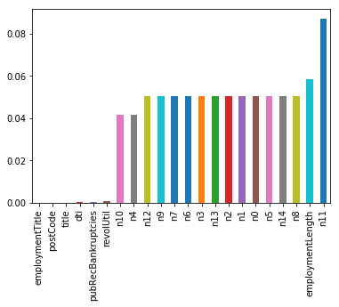
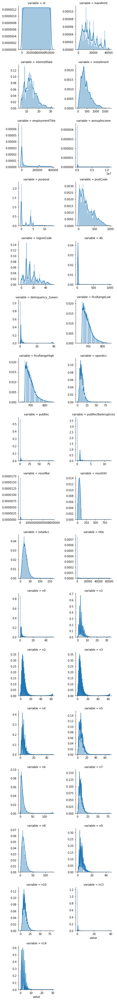
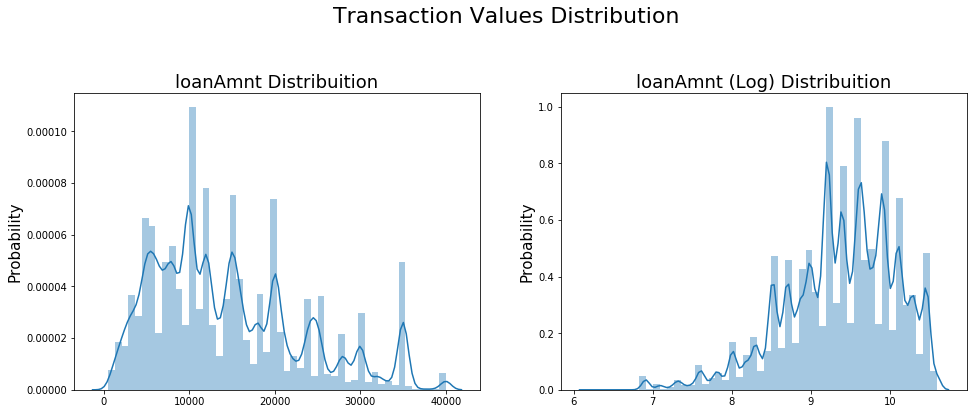
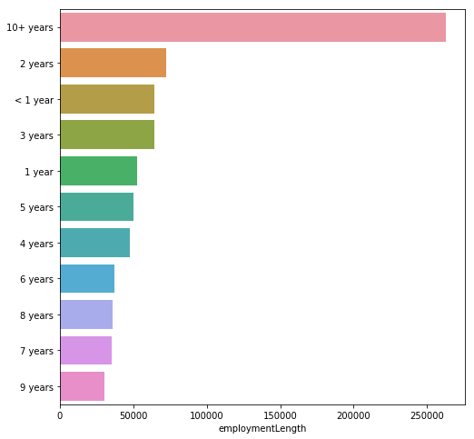
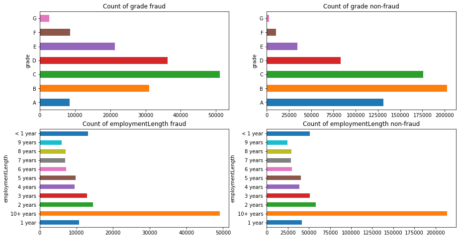
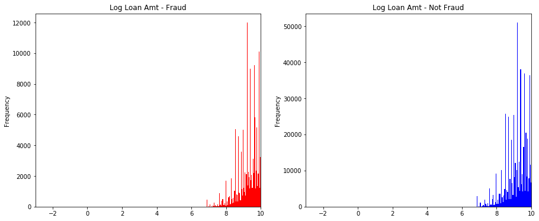
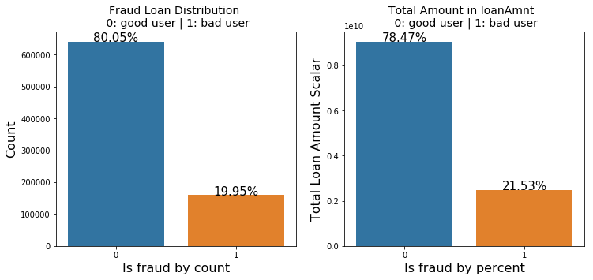
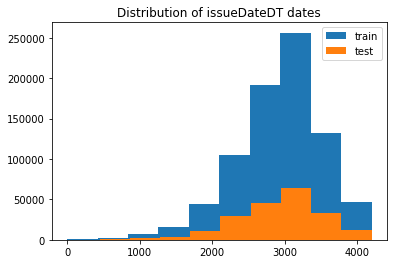

阿里天池赛题 https://tianchi.aliyun.com/competition/entrance/531830/introduction 

项目 https://github.com/datawhalechina/team-learning-data-mining/blob/master/FinancialRiskControl/Task1%20%E8%B5%9B%E9%A2%98%E7%90%86%E8%A7%A3.md

赛题目标：根据贷款申请人的数据信息预测其是否有违约的可能，以此判断是否通过此项贷款，这是一个典型的分类问题。
需要预测每个ID的isDefault是0还是1 

赛题以预测用户贷款是否违约为任务，数据集报名后可见并可下载，该数据来自某信贷平台的贷款记录，总数据量超过120w，包含47列变量信息，其中15列为匿名变量。为了保证比赛的公平性，将会从中抽取80万条作为训练集，20万条作为测试集A，20万条作为测试集B，同时会对employmentTitle、purpose、postCode和title等信息进行脱敏

竞赛最基本的需要完成：EDA（总体分布、缺失值处理、异常值处理）- 特征工程 - 建模（逻辑回归、决策树、XGboost、Lightgbm） - 用指标AUC评估模型 - 调参

熟悉数据集：


```python
import pandas as pd
```


```python
train = pd.read_csv('train.csv')
testA = pd.read_csv('testA.csv')
```


```python
train.head()
```


<div>
<style scoped>
    .dataframe tbody tr th:only-of-type {
        vertical-align: middle;
    }

    .dataframe tbody tr th {
        vertical-align: top;
    }

    .dataframe thead th {
        text-align: right;
    }
</style>
<table border="1" class="dataframe">
  <thead>
    <tr style="text-align: right;">
      <th></th>
      <th>id</th>
      <th>loanAmnt</th>
      <th>term</th>
      <th>interestRate</th>
      <th>installment</th>
      <th>grade</th>
      <th>subGrade</th>
      <th>employmentTitle</th>
      <th>employmentLength</th>
      <th>homeOwnership</th>
      <th>...</th>
      <th>n5</th>
      <th>n6</th>
      <th>n7</th>
      <th>n8</th>
      <th>n9</th>
      <th>n10</th>
      <th>n11</th>
      <th>n12</th>
      <th>n13</th>
      <th>n14</th>
    </tr>
  </thead>
  <tbody>
    <tr>
      <th>0</th>
      <td>0</td>
      <td>35000.0</td>
      <td>5</td>
      <td>19.52</td>
      <td>917.97</td>
      <td>E</td>
      <td>E2</td>
      <td>320.0</td>
      <td>2 years</td>
      <td>2</td>
      <td>...</td>
      <td>9.0</td>
      <td>8.0</td>
      <td>4.0</td>
      <td>12.0</td>
      <td>2.0</td>
      <td>7.0</td>
      <td>0.0</td>
      <td>0.0</td>
      <td>0.0</td>
      <td>2.0</td>
    </tr>
    <tr>
      <th>1</th>
      <td>1</td>
      <td>18000.0</td>
      <td>5</td>
      <td>18.49</td>
      <td>461.90</td>
      <td>D</td>
      <td>D2</td>
      <td>219843.0</td>
      <td>5 years</td>
      <td>0</td>
      <td>...</td>
      <td>NaN</td>
      <td>NaN</td>
      <td>NaN</td>
      <td>NaN</td>
      <td>NaN</td>
      <td>13.0</td>
      <td>NaN</td>
      <td>NaN</td>
      <td>NaN</td>
      <td>NaN</td>
    </tr>
    <tr>
      <th>2</th>
      <td>2</td>
      <td>12000.0</td>
      <td>5</td>
      <td>16.99</td>
      <td>298.17</td>
      <td>D</td>
      <td>D3</td>
      <td>31698.0</td>
      <td>8 years</td>
      <td>0</td>
      <td>...</td>
      <td>0.0</td>
      <td>21.0</td>
      <td>4.0</td>
      <td>5.0</td>
      <td>3.0</td>
      <td>11.0</td>
      <td>0.0</td>
      <td>0.0</td>
      <td>0.0</td>
      <td>4.0</td>
    </tr>
    <tr>
      <th>3</th>
      <td>3</td>
      <td>11000.0</td>
      <td>3</td>
      <td>7.26</td>
      <td>340.96</td>
      <td>A</td>
      <td>A4</td>
      <td>46854.0</td>
      <td>10+ years</td>
      <td>1</td>
      <td>...</td>
      <td>16.0</td>
      <td>4.0</td>
      <td>7.0</td>
      <td>21.0</td>
      <td>6.0</td>
      <td>9.0</td>
      <td>0.0</td>
      <td>0.0</td>
      <td>0.0</td>
      <td>1.0</td>
    </tr>
    <tr>
      <th>4</th>
      <td>4</td>
      <td>3000.0</td>
      <td>3</td>
      <td>12.99</td>
      <td>101.07</td>
      <td>C</td>
      <td>C2</td>
      <td>54.0</td>
      <td>NaN</td>
      <td>1</td>
      <td>...</td>
      <td>4.0</td>
      <td>9.0</td>
      <td>10.0</td>
      <td>15.0</td>
      <td>7.0</td>
      <td>12.0</td>
      <td>0.0</td>
      <td>0.0</td>
      <td>0.0</td>
      <td>4.0</td>
    </tr>
  </tbody>
</table>
<p>5 rows × 47 columns</p>
</div>


```python
testA.head()
```


<div>
<style scoped>
    .dataframe tbody tr th:only-of-type {
        vertical-align: middle;
    }

    .dataframe tbody tr th {
        vertical-align: top;
    }

    .dataframe thead th {
        text-align: right;
    }
</style>
<table border="1" class="dataframe">
  <thead>
    <tr style="text-align: right;">
      <th></th>
      <th>id</th>
      <th>loanAmnt</th>
      <th>term</th>
      <th>interestRate</th>
      <th>installment</th>
      <th>grade</th>
      <th>subGrade</th>
      <th>employmentTitle</th>
      <th>employmentLength</th>
      <th>homeOwnership</th>
      <th>...</th>
      <th>n5</th>
      <th>n6</th>
      <th>n7</th>
      <th>n8</th>
      <th>n9</th>
      <th>n10</th>
      <th>n11</th>
      <th>n12</th>
      <th>n13</th>
      <th>n14</th>
    </tr>
  </thead>
  <tbody>
    <tr>
      <th>0</th>
      <td>800000</td>
      <td>14000.0</td>
      <td>3</td>
      <td>10.99</td>
      <td>458.28</td>
      <td>B</td>
      <td>B3</td>
      <td>7027.0</td>
      <td>10+ years</td>
      <td>0</td>
      <td>...</td>
      <td>8.0</td>
      <td>4.0</td>
      <td>15.0</td>
      <td>19.0</td>
      <td>6.0</td>
      <td>17.0</td>
      <td>0.0</td>
      <td>0.0</td>
      <td>1.0</td>
      <td>3.0</td>
    </tr>
    <tr>
      <th>1</th>
      <td>800001</td>
      <td>20000.0</td>
      <td>5</td>
      <td>14.65</td>
      <td>472.14</td>
      <td>C</td>
      <td>C5</td>
      <td>60426.0</td>
      <td>10+ years</td>
      <td>0</td>
      <td>...</td>
      <td>1.0</td>
      <td>3.0</td>
      <td>3.0</td>
      <td>9.0</td>
      <td>3.0</td>
      <td>5.0</td>
      <td>0.0</td>
      <td>0.0</td>
      <td>2.0</td>
      <td>2.0</td>
    </tr>
    <tr>
      <th>2</th>
      <td>800002</td>
      <td>12000.0</td>
      <td>3</td>
      <td>19.99</td>
      <td>445.91</td>
      <td>D</td>
      <td>D4</td>
      <td>23547.0</td>
      <td>2 years</td>
      <td>1</td>
      <td>...</td>
      <td>1.0</td>
      <td>36.0</td>
      <td>5.0</td>
      <td>6.0</td>
      <td>4.0</td>
      <td>12.0</td>
      <td>0.0</td>
      <td>0.0</td>
      <td>0.0</td>
      <td>7.0</td>
    </tr>
    <tr>
      <th>3</th>
      <td>800003</td>
      <td>17500.0</td>
      <td>5</td>
      <td>14.31</td>
      <td>410.02</td>
      <td>C</td>
      <td>C4</td>
      <td>636.0</td>
      <td>4 years</td>
      <td>0</td>
      <td>...</td>
      <td>7.0</td>
      <td>2.0</td>
      <td>8.0</td>
      <td>14.0</td>
      <td>2.0</td>
      <td>10.0</td>
      <td>0.0</td>
      <td>0.0</td>
      <td>0.0</td>
      <td>3.0</td>
    </tr>
    <tr>
      <th>4</th>
      <td>800004</td>
      <td>35000.0</td>
      <td>3</td>
      <td>17.09</td>
      <td>1249.42</td>
      <td>D</td>
      <td>D1</td>
      <td>368446.0</td>
      <td>&lt; 1 year</td>
      <td>1</td>
      <td>...</td>
      <td>11.0</td>
      <td>3.0</td>
      <td>16.0</td>
      <td>18.0</td>
      <td>11.0</td>
      <td>19.0</td>
      <td>0.0</td>
      <td>0.0</td>
      <td>0.0</td>
      <td>1.0</td>
    </tr>
  </tbody>
</table>
<p>5 rows × 46 columns</p>
</div>


```python
train.shape
```


    (800000, 47)


```python
testA.shape
```


    (200000, 46)


表train有80万行，47列；表testA有20万行，46列


```python
sample=pd.read_csv('sample_submit.csv')
```


```python
sample.head()
```


<div>
<style scoped>
    .dataframe tbody tr th:only-of-type {
        vertical-align: middle;
    }

    .dataframe tbody tr th {
        vertical-align: top;
    }

    .dataframe thead th {
        text-align: right;
    }
</style>
<table border="1" class="dataframe">
  <thead>
    <tr style="text-align: right;">
      <th></th>
      <th>id</th>
      <th>isDefault</th>
    </tr>
  </thead>
  <tbody>
    <tr>
      <th>0</th>
      <td>800000</td>
      <td>0.5</td>
    </tr>
    <tr>
      <th>1</th>
      <td>800001</td>
      <td>0.5</td>
    </tr>
    <tr>
      <th>2</th>
      <td>800002</td>
      <td>0.5</td>
    </tr>
    <tr>
      <th>3</th>
      <td>800003</td>
      <td>0.5</td>
    </tr>
    <tr>
      <th>4</th>
      <td>800004</td>
      <td>0.5</td>
    </tr>
  </tbody>
</table>
</div>


```python
print(train.columns)
```

    Index(['id', 'loanAmnt', 'term', 'interestRate', 'installment', 'grade',
           'subGrade', 'employmentTitle', 'employmentLength', 'homeOwnership',
           'annualIncome', 'verificationStatus', 'issueDate', 'isDefault',
           'purpose', 'postCode', 'regionCode', 'dti', 'delinquency_2years',
           'ficoRangeLow', 'ficoRangeHigh', 'openAcc', 'pubRec',
           'pubRecBankruptcies', 'revolBal', 'revolUtil', 'totalAcc',
           'initialListStatus', 'applicationType', 'earliesCreditLine', 'title',
           'policyCode', 'n0', 'n1', 'n2', 'n3', 'n4', 'n5', 'n6', 'n7', 'n8',
           'n9', 'n10', 'n11', 'n12', 'n13', 'n14'],
          dtype='object')


```python
train['isDefault'].head(20)
```


    0     1
    1     0
    2     0
    3     0
    4     0
    5     0
    6     0
    7     0
    8     1
    9     0
    10    0
    11    0
    12    0
    13    0
    14    0
    15    0
    16    0
    17    1
    18    1
    19    0
    Name: isDefault, dtype: int64


```python
import pandas as pd
import numpy as np
import matplotlib.pyplot as plt
import seaborn as sns
import datetime
import warnings
warnings.filterwarnings('ignore')
```


```python
train.info()
```

    <class 'pandas.core.frame.DataFrame'>
    RangeIndex: 800000 entries, 0 to 799999
    Data columns (total 47 columns):
    id                    800000 non-null int64
    loanAmnt              800000 non-null float64
    term                  800000 non-null int64
    interestRate          800000 non-null float64
    installment           800000 non-null float64
    grade                 800000 non-null object
    subGrade              800000 non-null object
    employmentTitle       799999 non-null float64
    employmentLength      753201 non-null object
    homeOwnership         800000 non-null int64
    annualIncome          800000 non-null float64
    verificationStatus    800000 non-null int64
    issueDate             800000 non-null object
    isDefault             800000 non-null int64
    purpose               800000 non-null int64
    postCode              799999 non-null float64
    regionCode            800000 non-null int64
    dti                   799761 non-null float64
    delinquency_2years    800000 non-null float64
    ficoRangeLow          800000 non-null float64
    ficoRangeHigh         800000 non-null float64
    openAcc               800000 non-null float64
    pubRec                800000 non-null float64
    pubRecBankruptcies    799595 non-null float64
    revolBal              800000 non-null float64
    revolUtil             799469 non-null float64
    totalAcc              800000 non-null float64
    initialListStatus     800000 non-null int64
    applicationType       800000 non-null int64
    earliesCreditLine     800000 non-null object
    title                 799999 non-null float64
    policyCode            800000 non-null float64
    n0                    759730 non-null float64
    n1                    759730 non-null float64
    n2                    759730 non-null float64
    n3                    759730 non-null float64
    n4                    766761 non-null float64
    n5                    759730 non-null float64
    n6                    759730 non-null float64
    n7                    759730 non-null float64
    n8                    759729 non-null float64
    n9                    759730 non-null float64
    n10                   766761 non-null float64
    n11                   730248 non-null float64
    n12                   759730 non-null float64
    n13                   759730 non-null float64
    n14                   759730 non-null float64
    dtypes: float64(33), int64(9), object(5)
    memory usage: 286.9+ MB


```python
train.describe()
```


<div>
<style scoped>
    .dataframe tbody tr th:only-of-type {
        vertical-align: middle;
    }

    .dataframe tbody tr th {
        vertical-align: top;
    }

    .dataframe thead th {
        text-align: right;
    }
</style>
<table border="1" class="dataframe">
  <thead>
    <tr style="text-align: right;">
      <th></th>
      <th>id</th>
      <th>loanAmnt</th>
      <th>term</th>
      <th>interestRate</th>
      <th>installment</th>
      <th>employmentTitle</th>
      <th>homeOwnership</th>
      <th>annualIncome</th>
      <th>verificationStatus</th>
      <th>isDefault</th>
      <th>...</th>
      <th>n5</th>
      <th>n6</th>
      <th>n7</th>
      <th>n8</th>
      <th>n9</th>
      <th>n10</th>
      <th>n11</th>
      <th>n12</th>
      <th>n13</th>
      <th>n14</th>
    </tr>
  </thead>
  <tbody>
    <tr>
      <th>count</th>
      <td>800000.000000</td>
      <td>800000.000000</td>
      <td>800000.000000</td>
      <td>800000.000000</td>
      <td>800000.000000</td>
      <td>799999.000000</td>
      <td>800000.000000</td>
      <td>8.000000e+05</td>
      <td>800000.000000</td>
      <td>800000.000000</td>
      <td>...</td>
      <td>759730.000000</td>
      <td>759730.000000</td>
      <td>759730.000000</td>
      <td>759729.000000</td>
      <td>759730.000000</td>
      <td>766761.000000</td>
      <td>730248.000000</td>
      <td>759730.000000</td>
      <td>759730.000000</td>
      <td>759730.000000</td>
    </tr>
    <tr>
      <th>mean</th>
      <td>399999.500000</td>
      <td>14416.818875</td>
      <td>3.482745</td>
      <td>13.238391</td>
      <td>437.947723</td>
      <td>72005.351714</td>
      <td>0.614213</td>
      <td>7.613391e+04</td>
      <td>1.009683</td>
      <td>0.199513</td>
      <td>...</td>
      <td>8.107937</td>
      <td>8.575994</td>
      <td>8.282953</td>
      <td>14.622488</td>
      <td>5.592345</td>
      <td>11.643896</td>
      <td>0.000815</td>
      <td>0.003384</td>
      <td>0.089366</td>
      <td>2.178606</td>
    </tr>
    <tr>
      <th>std</th>
      <td>230940.252015</td>
      <td>8716.086178</td>
      <td>0.855832</td>
      <td>4.765757</td>
      <td>261.460393</td>
      <td>106585.640204</td>
      <td>0.675749</td>
      <td>6.894751e+04</td>
      <td>0.782716</td>
      <td>0.399634</td>
      <td>...</td>
      <td>4.799210</td>
      <td>7.400536</td>
      <td>4.561689</td>
      <td>8.124610</td>
      <td>3.216184</td>
      <td>5.484104</td>
      <td>0.030075</td>
      <td>0.062041</td>
      <td>0.509069</td>
      <td>1.844377</td>
    </tr>
    <tr>
      <th>min</th>
      <td>0.000000</td>
      <td>500.000000</td>
      <td>3.000000</td>
      <td>5.310000</td>
      <td>15.690000</td>
      <td>0.000000</td>
      <td>0.000000</td>
      <td>0.000000e+00</td>
      <td>0.000000</td>
      <td>0.000000</td>
      <td>...</td>
      <td>0.000000</td>
      <td>0.000000</td>
      <td>0.000000</td>
      <td>1.000000</td>
      <td>0.000000</td>
      <td>0.000000</td>
      <td>0.000000</td>
      <td>0.000000</td>
      <td>0.000000</td>
      <td>0.000000</td>
    </tr>
    <tr>
      <th>25%</th>
      <td>199999.750000</td>
      <td>8000.000000</td>
      <td>3.000000</td>
      <td>9.750000</td>
      <td>248.450000</td>
      <td>427.000000</td>
      <td>0.000000</td>
      <td>4.560000e+04</td>
      <td>0.000000</td>
      <td>0.000000</td>
      <td>...</td>
      <td>5.000000</td>
      <td>4.000000</td>
      <td>5.000000</td>
      <td>9.000000</td>
      <td>3.000000</td>
      <td>8.000000</td>
      <td>0.000000</td>
      <td>0.000000</td>
      <td>0.000000</td>
      <td>1.000000</td>
    </tr>
    <tr>
      <th>50%</th>
      <td>399999.500000</td>
      <td>12000.000000</td>
      <td>3.000000</td>
      <td>12.740000</td>
      <td>375.135000</td>
      <td>7755.000000</td>
      <td>1.000000</td>
      <td>6.500000e+04</td>
      <td>1.000000</td>
      <td>0.000000</td>
      <td>...</td>
      <td>7.000000</td>
      <td>7.000000</td>
      <td>7.000000</td>
      <td>13.000000</td>
      <td>5.000000</td>
      <td>11.000000</td>
      <td>0.000000</td>
      <td>0.000000</td>
      <td>0.000000</td>
      <td>2.000000</td>
    </tr>
    <tr>
      <th>75%</th>
      <td>599999.250000</td>
      <td>20000.000000</td>
      <td>3.000000</td>
      <td>15.990000</td>
      <td>580.710000</td>
      <td>117663.500000</td>
      <td>1.000000</td>
      <td>9.000000e+04</td>
      <td>2.000000</td>
      <td>0.000000</td>
      <td>...</td>
      <td>11.000000</td>
      <td>11.000000</td>
      <td>10.000000</td>
      <td>19.000000</td>
      <td>7.000000</td>
      <td>14.000000</td>
      <td>0.000000</td>
      <td>0.000000</td>
      <td>0.000000</td>
      <td>3.000000</td>
    </tr>
    <tr>
      <th>max</th>
      <td>799999.000000</td>
      <td>40000.000000</td>
      <td>5.000000</td>
      <td>30.990000</td>
      <td>1715.420000</td>
      <td>378351.000000</td>
      <td>5.000000</td>
      <td>1.099920e+07</td>
      <td>2.000000</td>
      <td>1.000000</td>
      <td>...</td>
      <td>70.000000</td>
      <td>132.000000</td>
      <td>79.000000</td>
      <td>128.000000</td>
      <td>45.000000</td>
      <td>82.000000</td>
      <td>4.000000</td>
      <td>4.000000</td>
      <td>39.000000</td>
      <td>30.000000</td>
    </tr>
  </tbody>
</table>
<p>8 rows × 42 columns</p>
</div>


```python
train.head(3).append(train.tail(3))
```


<div>
<style scoped>
    .dataframe tbody tr th:only-of-type {
        vertical-align: middle;
    }

    .dataframe tbody tr th {
        vertical-align: top;
    }

    .dataframe thead th {
        text-align: right;
    }
</style>
<table border="1" class="dataframe">
  <thead>
    <tr style="text-align: right;">
      <th></th>
      <th>id</th>
      <th>loanAmnt</th>
      <th>term</th>
      <th>interestRate</th>
      <th>installment</th>
      <th>grade</th>
      <th>subGrade</th>
      <th>employmentTitle</th>
      <th>employmentLength</th>
      <th>homeOwnership</th>
      <th>...</th>
      <th>n5</th>
      <th>n6</th>
      <th>n7</th>
      <th>n8</th>
      <th>n9</th>
      <th>n10</th>
      <th>n11</th>
      <th>n12</th>
      <th>n13</th>
      <th>n14</th>
    </tr>
  </thead>
  <tbody>
    <tr>
      <th>0</th>
      <td>0</td>
      <td>35000.0</td>
      <td>5</td>
      <td>19.52</td>
      <td>917.97</td>
      <td>E</td>
      <td>E2</td>
      <td>320.0</td>
      <td>2 years</td>
      <td>2</td>
      <td>...</td>
      <td>9.0</td>
      <td>8.0</td>
      <td>4.0</td>
      <td>12.0</td>
      <td>2.0</td>
      <td>7.0</td>
      <td>0.0</td>
      <td>0.0</td>
      <td>0.0</td>
      <td>2.0</td>
    </tr>
    <tr>
      <th>1</th>
      <td>1</td>
      <td>18000.0</td>
      <td>5</td>
      <td>18.49</td>
      <td>461.90</td>
      <td>D</td>
      <td>D2</td>
      <td>219843.0</td>
      <td>5 years</td>
      <td>0</td>
      <td>...</td>
      <td>NaN</td>
      <td>NaN</td>
      <td>NaN</td>
      <td>NaN</td>
      <td>NaN</td>
      <td>13.0</td>
      <td>NaN</td>
      <td>NaN</td>
      <td>NaN</td>
      <td>NaN</td>
    </tr>
    <tr>
      <th>2</th>
      <td>2</td>
      <td>12000.0</td>
      <td>5</td>
      <td>16.99</td>
      <td>298.17</td>
      <td>D</td>
      <td>D3</td>
      <td>31698.0</td>
      <td>8 years</td>
      <td>0</td>
      <td>...</td>
      <td>0.0</td>
      <td>21.0</td>
      <td>4.0</td>
      <td>5.0</td>
      <td>3.0</td>
      <td>11.0</td>
      <td>0.0</td>
      <td>0.0</td>
      <td>0.0</td>
      <td>4.0</td>
    </tr>
    <tr>
      <th>799997</th>
      <td>799997</td>
      <td>6000.0</td>
      <td>3</td>
      <td>13.33</td>
      <td>203.12</td>
      <td>C</td>
      <td>C3</td>
      <td>2582.0</td>
      <td>10+ years</td>
      <td>1</td>
      <td>...</td>
      <td>4.0</td>
      <td>26.0</td>
      <td>4.0</td>
      <td>10.0</td>
      <td>4.0</td>
      <td>5.0</td>
      <td>0.0</td>
      <td>0.0</td>
      <td>1.0</td>
      <td>4.0</td>
    </tr>
    <tr>
      <th>799998</th>
      <td>799998</td>
      <td>19200.0</td>
      <td>3</td>
      <td>6.92</td>
      <td>592.14</td>
      <td>A</td>
      <td>A4</td>
      <td>151.0</td>
      <td>10+ years</td>
      <td>0</td>
      <td>...</td>
      <td>10.0</td>
      <td>6.0</td>
      <td>12.0</td>
      <td>22.0</td>
      <td>8.0</td>
      <td>16.0</td>
      <td>0.0</td>
      <td>0.0</td>
      <td>0.0</td>
      <td>5.0</td>
    </tr>
    <tr>
      <th>799999</th>
      <td>799999</td>
      <td>9000.0</td>
      <td>3</td>
      <td>11.06</td>
      <td>294.91</td>
      <td>B</td>
      <td>B3</td>
      <td>13.0</td>
      <td>5 years</td>
      <td>0</td>
      <td>...</td>
      <td>3.0</td>
      <td>4.0</td>
      <td>4.0</td>
      <td>8.0</td>
      <td>3.0</td>
      <td>7.0</td>
      <td>0.0</td>
      <td>0.0</td>
      <td>0.0</td>
      <td>2.0</td>
    </tr>
  </tbody>
</table>
<p>6 rows × 47 columns</p>
</div>


```python
print(f'There are {train.isnull().any().sum()} columns in train dataset with missing values.')
```

    There are 22 columns in train dataset with missing values.


```python
have_null_fea_dict = (train.isnull().sum()/len(train)).to_dict()
fea_null_moreThanHalf = {}
for key,value in have_null_fea_dict.items():
    if value > 0.5:
        fea_null_moreThanHalf[key] = value
```


```python
fea_null_moreThanHalf
```

    {}


```python
missing = train.isnull().sum()/len(train)
missing = missing[missing > 0]
missing.sort_values(inplace=True)
missing.plot.bar()
```


    <matplotlib.axes._subplots.AxesSubplot at 0x7fb051e6e4a8>





```python
numerical_fea = list(train.select_dtypes(exclude=['object']).columns)
category_fea = list(filter(lambda x: x not in numerical_fea,list(train.columns)))
```


```python
numerical_fea
```


    ['id',
     'loanAmnt',
     'term',
     'interestRate',
     'installment',
     'employmentTitle',
     'homeOwnership',
     'annualIncome',
     'verificationStatus',
     'isDefault',
     'purpose',
     'postCode',
     'regionCode',
     'dti',
     'delinquency_2years',
     'ficoRangeLow',
     'ficoRangeHigh',
     'openAcc',
     'pubRec',
     'pubRecBankruptcies',
     'revolBal',
     'revolUtil',
     'totalAcc',
     'initialListStatus',
     'applicationType',
     'title',
     'policyCode',
     'n0',
     'n1',
     'n2',
     'n3',
     'n4',
     'n5',
     'n6',
     'n7',
     'n8',
     'n9',
     'n10',
     'n11',
     'n12',
     'n13',
     'n14']


```python
category_fea
```


    ['grade', 'subGrade', 'employmentLength', 'issueDate', 'earliesCreditLine']


```python
train.grade
```


    0         E
    1         D
    2         D
    3         A
    4         C
    5         A
    6         A
    7         C
    8         C
    9         B
    10        B
    11        E
    12        D
    13        B
    14        A
    15        B
    16        D
    17        B
    18        E
    19        E
    20        C
    21        C
    22        D
    23        C
    24        A
    25        A
    26        B
    27        C
    28        A
    29        C
             ..
    799970    B
    799971    A
    799972    G
    799973    D
    799974    B
    799975    E
    799976    C
    799977    C
    799978    B
    799979    C
    799980    C
    799981    C
    799982    B
    799983    B
    799984    C
    799985    D
    799986    C
    799987    B
    799988    C
    799989    D
    799990    C
    799991    B
    799992    C
    799993    A
    799994    E
    799995    C
    799996    A
    799997    C
    799998    A
    799999    B
    Name: grade, Length: 800000, dtype: object


```python
def get_numerical_serial_fea(data,feas):
    numerical_serial_fea = []
    numerical_noserial_fea = []
    for fea in feas:
        temp = data[fea].nunique()
        if temp <= 10:
            numerical_noserial_fea.append(fea)
            continue
        numerical_serial_fea.append(fea)
    return numerical_serial_fea,numerical_noserial_fea
numerical_serial_fea,numerical_noserial_fea = get_numerical_serial_fea(train,numerical_fea)
```


```python
numerical_serial_fea
```


    ['id',
     'loanAmnt',
     'interestRate',
     'installment',
     'employmentTitle',
     'annualIncome',
     'purpose',
     'postCode',
     'regionCode',
     'dti',
     'delinquency_2years',
     'ficoRangeLow',
     'ficoRangeHigh',
     'openAcc',
     'pubRec',
     'pubRecBankruptcies',
     'revolBal',
     'revolUtil',
     'totalAcc',
     'title',
     'n0',
     'n1',
     'n2',
     'n3',
     'n4',
     'n5',
     'n6',
     'n7',
     'n8',
     'n9',
     'n10',
     'n13',
     'n14']


```python
numerical_noserial_fea
```


    ['term',
     'homeOwnership',
     'verificationStatus',
     'isDefault',
     'initialListStatus',
     'applicationType',
     'policyCode',
     'n11',
     'n12']


```python
train['term'].value_counts()
```


    3    606902
    5    193098
    Name: term, dtype: int64


```python
train['homeOwnership'].value_counts()
```


    0    395732
    1    317660
    2     86309
    3       185
    5        81
    4        33
    Name: homeOwnership, dtype: int64


```python
train['verificationStatus'].value_counts()
```


    1    309810
    2    248968
    0    241222
    Name: verificationStatus, dtype: int64


```python
train['initialListStatus'].value_counts()
```


    0    466438
    1    333562
    Name: initialListStatus, dtype: int64


```python
train['applicationType'].value_counts()
```


    0    784586
    1     15414
    Name: applicationType, dtype: int64


```python
train['policyCode'].value_counts()
```


    1.0    800000
    Name: policyCode, dtype: int64


```python
train['n11'].value_counts()
```


    0.0    729682
    1.0       540
    2.0        24
    4.0         1
    3.0         1
    Name: n11, dtype: int64


```python
train['n12'].value_counts()
```


    0.0    757315
    1.0      2281
    2.0       115
    3.0        16
    4.0         3
    Name: n12, dtype: int64


以上都是离散型变量


```python
#每个数字特征得分布可视化
f = pd.melt(train, value_vars=numerical_serial_fea)
g = sns.FacetGrid(f, col="variable",  col_wrap=2, sharex=False, sharey=False)
g = g.map(sns.distplot, "value")
```





```python
#Ploting Transaction Amount Values Distribution
plt.figure(figsize=(16,12))
plt.suptitle('Transaction Values Distribution', fontsize=22)
plt.subplot(221)
sub_plot_1 = sns.distplot(train['loanAmnt'])
sub_plot_1.set_title("loanAmnt Distribuition", fontsize=18)
sub_plot_1.set_xlabel("")
sub_plot_1.set_ylabel("Probability", fontsize=15)

plt.subplot(222)
sub_plot_2 = sns.distplot(np.log(train['loanAmnt']))
sub_plot_2.set_title("loanAmnt (Log) Distribuition", fontsize=18)
sub_plot_2.set_xlabel("")
sub_plot_2.set_ylabel("Probability", fontsize=15)
```


    Text(0, 0.5, 'Probability')





```python
category_fea
```


    ['grade', 'subGrade', 'employmentLength', 'issueDate', 'earliesCreditLine']


```python
train['grade'].value_counts()
```


    B    233690
    C    227118
    A    139661
    D    119453
    E     55661
    F     19053
    G      5364
    Name: grade, dtype: int64


```python
train['subGrade'].value_counts()
```


    C1    50763
    B4    49516
    B5    48965
    B3    48600
    C2    47068
    C3    44751
    C4    44272
    B2    44227
    B1    42382
    C5    40264
    A5    38045
    A4    30928
    D1    30538
    D2    26528
    A1    25909
    D3    23410
    A3    22655
    A2    22124
    D4    21139
    D5    17838
    E1    14064
    E2    12746
    E3    10925
    E4     9273
    E5     8653
    F1     5925
    F2     4340
    F3     3577
    F4     2859
    F5     2352
    G1     1759
    G2     1231
    G3      978
    G4      751
    G5      645
    Name: subGrade, dtype: int64


```python
train['employmentLength'].value_counts()
```


    10+ years    262753
    2 years       72358
    < 1 year      64237
    3 years       64152
    1 year        52489
    5 years       50102
    4 years       47985
    6 years       37254
    8 years       36192
    7 years       35407
    9 years       30272
    Name: employmentLength, dtype: int64


```python
train['issueDate'].value_counts()
```


    2016-03-01    29066
    2015-10-01    25525
    2015-07-01    24496
    2015-12-01    23245
    2014-10-01    21461
    2016-02-01    20571
    2015-11-01    19453
    2015-01-01    19254
    2015-04-01    18929
    2015-08-01    18750
    2015-05-01    17119
    2016-01-01    16792
    2014-07-01    16355
    2015-06-01    15236
    2015-09-01    14950
    2016-04-01    14248
    2014-11-01    13793
    2015-03-01    13549
    2016-08-01    13301
    2015-02-01    12881
    2016-07-01    12835
    2016-06-01    12270
    2016-12-01    11562
    2016-10-01    11245
    2016-11-01    11172
    2014-05-01    10886
    2014-04-01    10830
    2016-05-01    10680
    2014-08-01    10648
    2016-09-01    10165
                  ...  
    2010-01-01      355
    2009-10-01      305
    2009-09-01      270
    2009-08-01      231
    2009-07-01      223
    2009-06-01      191
    2009-05-01      190
    2009-04-01      166
    2009-03-01      162
    2009-02-01      160
    2009-01-01      145
    2008-12-01      134
    2008-03-01      130
    2008-11-01      113
    2008-02-01      105
    2008-04-01       92
    2008-01-01       91
    2008-10-01       62
    2007-12-01       55
    2008-07-01       52
    2008-08-01       38
    2008-05-01       38
    2008-06-01       33
    2007-10-01       26
    2007-11-01       24
    2007-08-01       23
    2007-07-01       21
    2008-09-01       19
    2007-09-01        7
    2007-06-01        1
    Name: issueDate, Length: 139, dtype: int64


```python
train['earliesCreditLine'].value_counts()
```


    Aug-2001    5567
    Sep-2003    5403
    Aug-2002    5403
    Oct-2001    5258
    Aug-2000    5246
    Sep-2004    5219
    Sep-2002    5170
    Aug-2003    5116
    Oct-2000    5034
    Oct-2002    5034
    Oct-2003    4969
    Aug-2004    4904
    Nov-2000    4798
    Sep-2001    4787
    Sep-2000    4780
    Nov-1999    4773
    Oct-1999    4678
    Oct-2004    4647
    Sep-2005    4608
    Jul-2003    4586
    Nov-2001    4514
    Aug-2005    4494
    Jul-2001    4480
    Aug-1999    4446
    Sep-1999    4441
    Dec-2001    4379
    Jul-2002    4342
    Aug-2006    4283
    Mar-2001    4268
    May-2001    4223
                ... 
    Apr-1955       2
    Sep-1956       2
    Dec-1956       2
    Feb-1961       2
    May-1958       2
    May-1955       2
    Nov-1958       2
    Apr-1958       1
    Jan-1946       1
    Nov-1954       1
    Mar-1962       1
    Oct-1957       1
    Dec-1960       1
    Dec-1951       1
    Aug-1946       1
    Oct-2015       1
    May-1957       1
    May-1960       1
    Feb-1960       1
    Nov-1953       1
    Sep-1957       1
    Oct-1954       1
    Aug-1958       1
    Mar-1957       1
    Mar-1958       1
    Jun-1958       1
    Aug-1955       1
    Sep-1953       1
    Jul-1955       1
    Jan-1944       1
    Name: earliesCreditLine, Length: 720, dtype: int64


```python
train['isDefault'].value_counts()
```


    0    640390
    1    159610
    Name: isDefault, dtype: int64


```python
plt.figure(figsize=(8, 8))
sns.barplot(train["employmentLength"].value_counts(dropna=False)[:20],
            train["employmentLength"].value_counts(dropna=False).keys()[:20])
plt.show()
```





```python
train_loan_fr = train.loc[train['isDefault'] == 1]
train_loan_nofr = train.loc[train['isDefault'] == 0]
```


```python
fig, ((ax1, ax2), (ax3, ax4)) = plt.subplots(2, 2, figsize=(15, 8))
train_loan_fr.groupby('grade')['grade'].count().plot(kind='barh', ax=ax1, title='Count of grade fraud')
train_loan_nofr.groupby('grade')['grade'].count().plot(kind='barh', ax=ax2, title='Count of grade non-fraud')
train_loan_fr.groupby('employmentLength')['employmentLength'].count().plot(kind='barh', ax=ax3, title='Count of employmentLength fraud')
train_loan_nofr.groupby('employmentLength')['employmentLength'].count().plot(kind='barh', ax=ax4, title='Count of employmentLength non-fraud')
plt.show()
```





```python
fig, ((ax1, ax2)) = plt.subplots(1, 2, figsize=(15, 6))
train.loc[train['isDefault'] == 1] \
    ['loanAmnt'].apply(np.log) \
    .plot(kind='hist',
          bins=100,
          title='Log Loan Amt - Fraud',
          color='r',
          xlim=(-3, 10),
         ax= ax1)
train.loc[train['isDefault'] == 0] \
    ['loanAmnt'].apply(np.log) \
    .plot(kind='hist',
          bins=100,
          title='Log Loan Amt - Not Fraud',
          color='b',
          xlim=(-3, 10),
         ax=ax2) 
```


    <matplotlib.axes._subplots.AxesSubplot at 0x7fb002513ba8>





```python
total = len(train)
total_amt = train.groupby(['isDefault'])['loanAmnt'].sum().sum()
plt.figure(figsize=(12,5))
plt.subplot(121)##1代表行，2代表列，所以一共有2个图，1代表此时绘制第一个图。
plot_tr = sns.countplot(x='isDefault',data=train)#data_train‘isDefault’这个特征每种类别的数量**
plot_tr.set_title("Fraud Loan Distribution \n 0: good user | 1: bad user", fontsize=14)
plot_tr.set_xlabel("Is fraud by count", fontsize=16)
plot_tr.set_ylabel('Count', fontsize=16)
for p in plot_tr.patches:
    height = p.get_height()
    plot_tr.text(p.get_x()+p.get_width()/2.,
            height + 3,
            '{:1.2f}%'.format(height/total*100),
            ha="center", fontsize=15) 
    
percent_amt = (train.groupby(['isDefault'])['loanAmnt'].sum())
percent_amt = percent_amt.reset_index() 
plt.subplot(122) 
plot_tr_2 = sns.barplot(x='isDefault', y='loanAmnt',  dodge=True, data=percent_amt)
plot_tr_2.set_title("Total Amount in loanAmnt  \n 0: good user | 1: bad user", fontsize=14)
plot_tr_2.set_xlabel("Is fraud by percent", fontsize=16)
plot_tr_2.set_ylabel('Total Loan Amount Scalar', fontsize=16)
for p in plot_tr_2.patches:
    height = p.get_height()
    plot_tr_2.text(p.get_x()+p.get_width()/2.,
            height + 3,
            '{:1.2f}%'.format(height/total_amt * 100),
            ha="center", fontsize=15)     

```





```python
train['issueDate'] = pd.to_datetime(train['issueDate'],format='%Y-%m-%d')
startdate = datetime.datetime.strptime('2007-06-01', '%Y-%m-%d')
train['issueDateDT'] = train['issueDate'].apply(lambda x: x-startdate).dt.days 
```


```python
testA['issueDate'] = pd.to_datetime(train['issueDate'],format='%Y-%m-%d')
startdate = datetime.datetime.strptime('2007-06-01', '%Y-%m-%d') 
testA['issueDateDT'] = testA['issueDate'].apply(lambda x: x-startdate).dt.days 
```


```python
plt.hist(train['issueDateDT'], label='train');
plt.hist(testA['issueDateDT'], label='test');
plt.legend();
plt.title('Distribution of issueDateDT dates');
#train 和 test issueDateDT 日期有重叠 所以使用基于时间的分割进行验证是不明智的
```





```python
pivot = pd.pivot_table(train, index=['grade'], columns=['issueDateDT'], values=['loanAmnt'], aggfunc=np.sum)
```


```python
pivot
```


<div>
<style scoped>
    .dataframe tbody tr th:only-of-type {
        vertical-align: middle;
    }

    .dataframe tbody tr th {
        vertical-align: top;
    }

    .dataframe thead tr th {
        text-align: left;
    }

    .dataframe thead tr:last-of-type th {
        text-align: right;
    }
</style>
<table border="1" class="dataframe">
  <thead>
    <tr>
      <th></th>
      <th colspan="21" halign="left">loanAmnt</th>
    </tr>
    <tr>
      <th>issueDateDT</th>
      <th>0</th>
      <th>30</th>
      <th>61</th>
      <th>92</th>
      <th>122</th>
      <th>153</th>
      <th>183</th>
      <th>214</th>
      <th>245</th>
      <th>274</th>
      <th>...</th>
      <th>3926</th>
      <th>3957</th>
      <th>3987</th>
      <th>4018</th>
      <th>4048</th>
      <th>4079</th>
      <th>4110</th>
      <th>4140</th>
      <th>4171</th>
      <th>4201</th>
    </tr>
    <tr>
      <th>grade</th>
      <th></th>
      <th></th>
      <th></th>
      <th></th>
      <th></th>
      <th></th>
      <th></th>
      <th></th>
      <th></th>
      <th></th>
      <th></th>
      <th></th>
      <th></th>
      <th></th>
      <th></th>
      <th></th>
      <th></th>
      <th></th>
      <th></th>
      <th></th>
      <th></th>
    </tr>
  </thead>
  <tbody>
    <tr>
      <th>A</th>
      <td>NaN</td>
      <td>53650.0</td>
      <td>42000.0</td>
      <td>19500.0</td>
      <td>34425.0</td>
      <td>63950.0</td>
      <td>43500.0</td>
      <td>168825.0</td>
      <td>85600.0</td>
      <td>101825.0</td>
      <td>...</td>
      <td>13093850.0</td>
      <td>11757325.0</td>
      <td>11945975.0</td>
      <td>9144000.0</td>
      <td>7977650.0</td>
      <td>6888900.0</td>
      <td>5109800.0</td>
      <td>3919275.0</td>
      <td>2694025.0</td>
      <td>2245625.0</td>
    </tr>
    <tr>
      <th>B</th>
      <td>NaN</td>
      <td>13000.0</td>
      <td>24000.0</td>
      <td>32125.0</td>
      <td>7025.0</td>
      <td>95750.0</td>
      <td>164300.0</td>
      <td>303175.0</td>
      <td>434425.0</td>
      <td>538450.0</td>
      <td>...</td>
      <td>16863100.0</td>
      <td>17275175.0</td>
      <td>16217500.0</td>
      <td>11431350.0</td>
      <td>8967750.0</td>
      <td>7572725.0</td>
      <td>4884600.0</td>
      <td>4329400.0</td>
      <td>3922575.0</td>
      <td>3257100.0</td>
    </tr>
    <tr>
      <th>C</th>
      <td>NaN</td>
      <td>68750.0</td>
      <td>8175.0</td>
      <td>10000.0</td>
      <td>61800.0</td>
      <td>52550.0</td>
      <td>175375.0</td>
      <td>151100.0</td>
      <td>243725.0</td>
      <td>393150.0</td>
      <td>...</td>
      <td>17502375.0</td>
      <td>17471500.0</td>
      <td>16111225.0</td>
      <td>11973675.0</td>
      <td>10184450.0</td>
      <td>7765000.0</td>
      <td>5354450.0</td>
      <td>4552600.0</td>
      <td>2870050.0</td>
      <td>2246250.0</td>
    </tr>
    <tr>
      <th>D</th>
      <td>NaN</td>
      <td>NaN</td>
      <td>5500.0</td>
      <td>2850.0</td>
      <td>28625.0</td>
      <td>NaN</td>
      <td>167975.0</td>
      <td>171325.0</td>
      <td>192900.0</td>
      <td>269325.0</td>
      <td>...</td>
      <td>11403075.0</td>
      <td>10964150.0</td>
      <td>10747675.0</td>
      <td>7082050.0</td>
      <td>7189625.0</td>
      <td>5195700.0</td>
      <td>3455175.0</td>
      <td>3038500.0</td>
      <td>2452375.0</td>
      <td>1771750.0</td>
    </tr>
    <tr>
      <th>E</th>
      <td>7500.0</td>
      <td>NaN</td>
      <td>10000.0</td>
      <td>NaN</td>
      <td>17975.0</td>
      <td>1500.0</td>
      <td>94375.0</td>
      <td>116450.0</td>
      <td>42000.0</td>
      <td>139775.0</td>
      <td>...</td>
      <td>3983050.0</td>
      <td>3410125.0</td>
      <td>3107150.0</td>
      <td>2341825.0</td>
      <td>2225675.0</td>
      <td>1643675.0</td>
      <td>1091025.0</td>
      <td>1131625.0</td>
      <td>883950.0</td>
      <td>802425.0</td>
    </tr>
    <tr>
      <th>F</th>
      <td>NaN</td>
      <td>NaN</td>
      <td>31250.0</td>
      <td>2125.0</td>
      <td>NaN</td>
      <td>NaN</td>
      <td>NaN</td>
      <td>49000.0</td>
      <td>27000.0</td>
      <td>43000.0</td>
      <td>...</td>
      <td>1074175.0</td>
      <td>868925.0</td>
      <td>761675.0</td>
      <td>685325.0</td>
      <td>665750.0</td>
      <td>685200.0</td>
      <td>316700.0</td>
      <td>315075.0</td>
      <td>72300.0</td>
      <td>NaN</td>
    </tr>
    <tr>
      <th>G</th>
      <td>NaN</td>
      <td>NaN</td>
      <td>NaN</td>
      <td>NaN</td>
      <td>NaN</td>
      <td>NaN</td>
      <td>NaN</td>
      <td>24625.0</td>
      <td>NaN</td>
      <td>NaN</td>
      <td>...</td>
      <td>56100.0</td>
      <td>243275.0</td>
      <td>224825.0</td>
      <td>64050.0</td>
      <td>198575.0</td>
      <td>245825.0</td>
      <td>53125.0</td>
      <td>23750.0</td>
      <td>25100.0</td>
      <td>1000.0</td>
    </tr>
  </tbody>
</table>
<p>7 rows × 139 columns</p>
</div>


