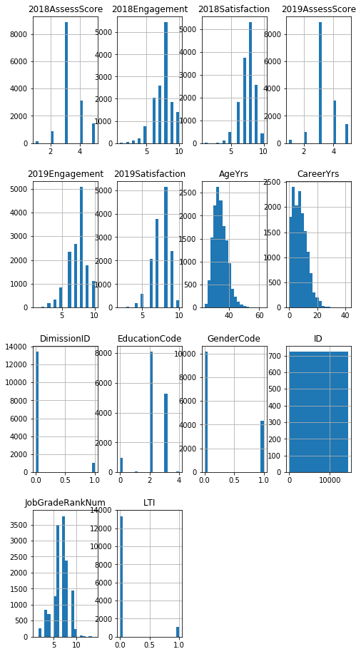
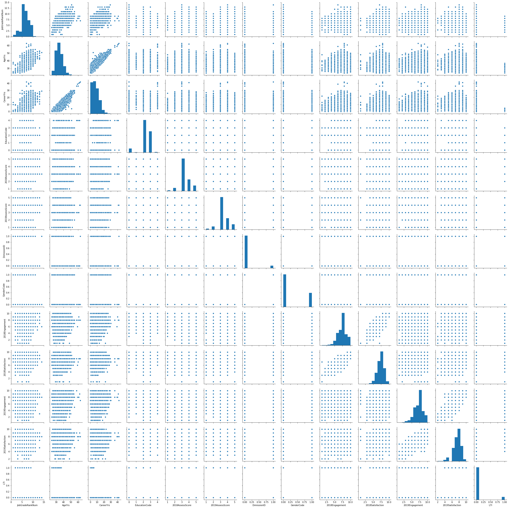

## 目录
<ul>
<li><a href="#definition">定义</a></li>
<li><a href="#analysis">分析</a></li>
<li><a href="#implementation">实现</a></li>
<li><a href="#result">结果</a></li>
<li><a href="#conclusion">结论</a></li>   
</ul>


---
<a id="definition"></a>
## Ⅰ.定义


### 1.项目概况
为了能衡量Q计划在保留上的效果，需要建立以在职特征为target建立二分类逻辑回归模型；
为了能衡量Q计划在激励上的效果，需要建立以（2019AssessScore-2018AssessScore）差值为target的线性回归模型；


```python
import numpy as np
import pandas as pd
import statsmodels.api as sm
from sklearn.model_selection import train_test_split
from sklearn.linear_model import LogisticRegression 
from sklearn.metrics import precision_score, recall_score, accuracy_score, confusion_matrix
from sklearn.metrics import classification_report
from sklearn.metrics import precision_recall_curve
from patsy import dmatrices
from statsmodels.stats.outliers_influence import variance_inflation_factor
import matplotlib.pyplot as plt
%matplotlib inline
```


```python
df=pd.read_csv('./sample_data.csv')
```


```python
#df有14461行，14列
df.shape
```


    (14461, 14)


```python
df.head(5)
```


<div>
<style scoped>
    .dataframe tbody tr th:only-of-type {
        vertical-align: middle;
    }

    .dataframe tbody tr th {
        vertical-align: top;
    }

    .dataframe thead th {
        text-align: right;
    }
</style>
<table border="1" class="dataframe">
  <thead>
    <tr style="text-align: right;">
      <th></th>
      <th>ID</th>
      <th>JobGradeRankNum</th>
      <th>AgeYrs</th>
      <th>CareerYrs</th>
      <th>EducationCode</th>
      <th>2018AssessScore</th>
      <th>2019AssessScore</th>
      <th>DimissionID</th>
      <th>GenderCode</th>
      <th>2018Engagement</th>
      <th>2018Satisfaction</th>
      <th>2019Engagement</th>
      <th>2019Satisfaction</th>
      <th>LTI</th>
    </tr>
  </thead>
  <tbody>
    <tr>
      <th>0</th>
      <td>1</td>
      <td>7</td>
      <td>39</td>
      <td>13</td>
      <td>2</td>
      <td>3.0</td>
      <td>3.0</td>
      <td>0</td>
      <td>0</td>
      <td>6.0</td>
      <td>6.0</td>
      <td>3.0</td>
      <td>6.0</td>
      <td>0</td>
    </tr>
    <tr>
      <th>1</th>
      <td>2</td>
      <td>9</td>
      <td>41</td>
      <td>13</td>
      <td>3</td>
      <td>4.0</td>
      <td>4.0</td>
      <td>0</td>
      <td>0</td>
      <td>8.0</td>
      <td>8.0</td>
      <td>6.0</td>
      <td>6.0</td>
      <td>0</td>
    </tr>
    <tr>
      <th>2</th>
      <td>3</td>
      <td>8</td>
      <td>40</td>
      <td>15</td>
      <td>3</td>
      <td>4.0</td>
      <td>3.0</td>
      <td>0</td>
      <td>0</td>
      <td>NaN</td>
      <td>NaN</td>
      <td>7.0</td>
      <td>7.0</td>
      <td>0</td>
    </tr>
    <tr>
      <th>3</th>
      <td>4</td>
      <td>6</td>
      <td>35</td>
      <td>7</td>
      <td>2</td>
      <td>3.0</td>
      <td>3.0</td>
      <td>0</td>
      <td>0</td>
      <td>7.0</td>
      <td>8.0</td>
      <td>6.0</td>
      <td>6.0</td>
      <td>0</td>
    </tr>
    <tr>
      <th>4</th>
      <td>5</td>
      <td>8</td>
      <td>45</td>
      <td>20</td>
      <td>2</td>
      <td>4.0</td>
      <td>5.0</td>
      <td>0</td>
      <td>0</td>
      <td>9.0</td>
      <td>9.0</td>
      <td>10.0</td>
      <td>9.0</td>
      <td>0</td>
    </tr>
  </tbody>
</table>
</div>


---
<a id="analysis"></a>
## Ⅱ.分析


### 1.数据的探索


### 2.探索性可视化

### 3.算法和技术


```python
#分析df各列的数据类型：
df.dtypes
```


    ID                    int64
    JobGradeRankNum       int64
    AgeYrs                int64
    CareerYrs             int64
    EducationCode         int64
    2018AssessScore     float64
    2019AssessScore     float64
    DimissionID           int64
    GenderCode            int64
    2018Engagement      float64
    2018Satisfaction    float64
    2019Engagement      float64
    2019Satisfaction    float64
    LTI                   int64
    dtype: object


```python
#检查df各列是否存在空值
df.isnull().sum()
```


    ID                     0
    JobGradeRankNum        0
    AgeYrs                 0
    CareerYrs              0
    EducationCode          0
    2018AssessScore      849
    2019AssessScore      842
    DimissionID            0
    GenderCode             0
    2018Engagement      4202
    2018Satisfaction    4202
    2019Engagement      1428
    2019Satisfaction    1428
    LTI                    0
    dtype: int64


```python
#数据预处理：考虑到后期需要建模，不丢失数据，所以用同一列的前值填补缺失值
df=df.fillna(method='ffill',axis=0)
```


```python
df.head()
```


<div>
<style scoped>
    .dataframe tbody tr th:only-of-type {
        vertical-align: middle;
    }

    .dataframe tbody tr th {
        vertical-align: top;
    }

    .dataframe thead th {
        text-align: right;
    }
</style>
<table border="1" class="dataframe">
  <thead>
    <tr style="text-align: right;">
      <th></th>
      <th>ID</th>
      <th>JobGradeRankNum</th>
      <th>AgeYrs</th>
      <th>CareerYrs</th>
      <th>EducationCode</th>
      <th>2018AssessScore</th>
      <th>2019AssessScore</th>
      <th>DimissionID</th>
      <th>GenderCode</th>
      <th>2018Engagement</th>
      <th>2018Satisfaction</th>
      <th>2019Engagement</th>
      <th>2019Satisfaction</th>
      <th>LTI</th>
    </tr>
  </thead>
  <tbody>
    <tr>
      <th>0</th>
      <td>1</td>
      <td>7</td>
      <td>39</td>
      <td>13</td>
      <td>2</td>
      <td>3.0</td>
      <td>3.0</td>
      <td>0</td>
      <td>0</td>
      <td>6.0</td>
      <td>6.0</td>
      <td>3.0</td>
      <td>6.0</td>
      <td>0</td>
    </tr>
    <tr>
      <th>1</th>
      <td>2</td>
      <td>9</td>
      <td>41</td>
      <td>13</td>
      <td>3</td>
      <td>4.0</td>
      <td>4.0</td>
      <td>0</td>
      <td>0</td>
      <td>8.0</td>
      <td>8.0</td>
      <td>6.0</td>
      <td>6.0</td>
      <td>0</td>
    </tr>
    <tr>
      <th>2</th>
      <td>3</td>
      <td>8</td>
      <td>40</td>
      <td>15</td>
      <td>3</td>
      <td>4.0</td>
      <td>3.0</td>
      <td>0</td>
      <td>0</td>
      <td>8.0</td>
      <td>8.0</td>
      <td>7.0</td>
      <td>7.0</td>
      <td>0</td>
    </tr>
    <tr>
      <th>3</th>
      <td>4</td>
      <td>6</td>
      <td>35</td>
      <td>7</td>
      <td>2</td>
      <td>3.0</td>
      <td>3.0</td>
      <td>0</td>
      <td>0</td>
      <td>7.0</td>
      <td>8.0</td>
      <td>6.0</td>
      <td>6.0</td>
      <td>0</td>
    </tr>
    <tr>
      <th>4</th>
      <td>5</td>
      <td>8</td>
      <td>45</td>
      <td>20</td>
      <td>2</td>
      <td>4.0</td>
      <td>5.0</td>
      <td>0</td>
      <td>0</td>
      <td>9.0</td>
      <td>9.0</td>
      <td>10.0</td>
      <td>9.0</td>
      <td>0</td>
    </tr>
  </tbody>
</table>
</div>


```python
#此时，df已无空值
df.isnull().values.any()
```


    False


```python
df.columns
```


    Index(['ID', 'JobGradeRankNum', 'AgeYrs', 'CareerYrs', 'EducationCode',
           '2018AssessScore', '2019AssessScore', 'DimissionID', 'GenderCode',
           '2018Engagement', '2018Satisfaction', '2019Engagement',
           '2019Satisfaction', 'LTI'],
          dtype='object')


```python
#观察每个变量的分布特征，下拉可看到每个变量的分布特征图，从ipynb/jupyter notebook打开才能看到
df.hist(bins=20, figsize=(8,16))
```


    array([[<matplotlib.axes._subplots.AxesSubplot object at 0x1c10ddc588>,
            <matplotlib.axes._subplots.AxesSubplot object at 0x1c0f5ccfd0>,
            <matplotlib.axes._subplots.AxesSubplot object at 0x1c0f5ff588>,
            <matplotlib.axes._subplots.AxesSubplot object at 0x1c10216b00>],
           [<matplotlib.axes._subplots.AxesSubplot object at 0x1c102450b8>,
            <matplotlib.axes._subplots.AxesSubplot object at 0x1c1026d630>,
            <matplotlib.axes._subplots.AxesSubplot object at 0x1c10294ba8>,
            <matplotlib.axes._subplots.AxesSubplot object at 0x1c102c6198>],
           [<matplotlib.axes._subplots.AxesSubplot object at 0x1c102c61d0>,
            <matplotlib.axes._subplots.AxesSubplot object at 0x1c10313c50>,
            <matplotlib.axes._subplots.AxesSubplot object at 0x1c10343208>,
            <matplotlib.axes._subplots.AxesSubplot object at 0x1c1036a780>],
           [<matplotlib.axes._subplots.AxesSubplot object at 0x1c10392cf8>,
            <matplotlib.axes._subplots.AxesSubplot object at 0x1c103c32b0>,
            <matplotlib.axes._subplots.AxesSubplot object at 0x1c103ea828>,
            <matplotlib.axes._subplots.AxesSubplot object at 0x1c10413da0>]],
          dtype=object)





```python
#观察每对数据的相关性,可知'JobGradeRankNum','AgeYrs','CareerYrs'三个变量之间有线性关系，其余没有
import seaborn as sb
sb.pairplot(df[['JobGradeRankNum','AgeYrs','CareerYrs', 'EducationCode','2018AssessScore', 
                '2019AssessScore', 'DimissionID', 'GenderCode','2018Engagement', 
                '2018Satisfaction', '2019Engagement', '2019Satisfaction', 'LTI']]);
```





```python
#同样反映了'JobGradeRankNum','AgeYrs','CareerYrs'三个变量之间关系密切，其余变量没有相互影响关系
df.corr()
```


<div>
<style scoped>
    .dataframe tbody tr th:only-of-type {
        vertical-align: middle;
    }

    .dataframe tbody tr th {
        vertical-align: top;
    }

    .dataframe thead th {
        text-align: right;
    }
</style>
<table border="1" class="dataframe">
  <thead>
    <tr style="text-align: right;">
      <th></th>
      <th>ID</th>
      <th>JobGradeRankNum</th>
      <th>AgeYrs</th>
      <th>CareerYrs</th>
      <th>EducationCode</th>
      <th>2018AssessScore</th>
      <th>2019AssessScore</th>
      <th>DimissionID</th>
      <th>GenderCode</th>
      <th>2018Engagement</th>
      <th>2018Satisfaction</th>
      <th>2019Engagement</th>
      <th>2019Satisfaction</th>
      <th>LTI</th>
    </tr>
  </thead>
  <tbody>
    <tr>
      <th>ID</th>
      <td>1.000000</td>
      <td>0.001944</td>
      <td>0.002700</td>
      <td>0.003149</td>
      <td>0.002243</td>
      <td>0.002849</td>
      <td>0.009598</td>
      <td>0.007712</td>
      <td>0.001934</td>
      <td>-0.001384</td>
      <td>-0.003134</td>
      <td>-0.006550</td>
      <td>-0.005068</td>
      <td>0.002001</td>
    </tr>
    <tr>
      <th>JobGradeRankNum</th>
      <td>0.001944</td>
      <td>1.000000</td>
      <td>0.727204</td>
      <td>0.708363</td>
      <td>-0.107557</td>
      <td>0.123775</td>
      <td>0.071316</td>
      <td>0.025212</td>
      <td>-0.066920</td>
      <td>0.028895</td>
      <td>0.014819</td>
      <td>0.054205</td>
      <td>0.026599</td>
      <td>-0.275364</td>
    </tr>
    <tr>
      <th>AgeYrs</th>
      <td>0.002700</td>
      <td>0.727204</td>
      <td>1.000000</td>
      <td>0.920992</td>
      <td>-0.122693</td>
      <td>0.004662</td>
      <td>-0.027213</td>
      <td>0.030942</td>
      <td>-0.027048</td>
      <td>0.032488</td>
      <td>0.002960</td>
      <td>0.054688</td>
      <td>0.019767</td>
      <td>-0.281373</td>
    </tr>
    <tr>
      <th>CareerYrs</th>
      <td>0.003149</td>
      <td>0.708363</td>
      <td>0.920992</td>
      <td>1.000000</td>
      <td>-0.253339</td>
      <td>0.002182</td>
      <td>-0.028549</td>
      <td>0.039017</td>
      <td>-0.002194</td>
      <td>0.031780</td>
      <td>-0.000203</td>
      <td>0.047110</td>
      <td>0.012300</td>
      <td>-0.300378</td>
    </tr>
    <tr>
      <th>EducationCode</th>
      <td>0.002243</td>
      <td>-0.107557</td>
      <td>-0.122693</td>
      <td>-0.253339</td>
      <td>1.000000</td>
      <td>0.028390</td>
      <td>0.040188</td>
      <td>-0.028513</td>
      <td>0.037903</td>
      <td>-0.034933</td>
      <td>-0.017000</td>
      <td>-0.029623</td>
      <td>-0.016581</td>
      <td>0.085754</td>
    </tr>
    <tr>
      <th>2018AssessScore</th>
      <td>0.002849</td>
      <td>0.123775</td>
      <td>0.004662</td>
      <td>0.002182</td>
      <td>0.028390</td>
      <td>1.000000</td>
      <td>0.179126</td>
      <td>-0.126144</td>
      <td>-0.017919</td>
      <td>0.026090</td>
      <td>0.033524</td>
      <td>0.055392</td>
      <td>0.069555</td>
      <td>0.054672</td>
    </tr>
    <tr>
      <th>2019AssessScore</th>
      <td>0.009598</td>
      <td>0.071316</td>
      <td>-0.027213</td>
      <td>-0.028549</td>
      <td>0.040188</td>
      <td>0.179126</td>
      <td>1.000000</td>
      <td>0.006874</td>
      <td>-0.008632</td>
      <td>0.028053</td>
      <td>0.032612</td>
      <td>0.066065</td>
      <td>0.074194</td>
      <td>0.057093</td>
    </tr>
    <tr>
      <th>DimissionID</th>
      <td>0.007712</td>
      <td>0.025212</td>
      <td>0.030942</td>
      <td>0.039017</td>
      <td>-0.028513</td>
      <td>-0.126144</td>
      <td>0.006874</td>
      <td>1.000000</td>
      <td>-0.009752</td>
      <td>-0.055353</td>
      <td>-0.050289</td>
      <td>-0.028546</td>
      <td>-0.026643</td>
      <td>-0.064022</td>
    </tr>
    <tr>
      <th>GenderCode</th>
      <td>0.001934</td>
      <td>-0.066920</td>
      <td>-0.027048</td>
      <td>-0.002194</td>
      <td>0.037903</td>
      <td>-0.017919</td>
      <td>-0.008632</td>
      <td>-0.009752</td>
      <td>1.000000</td>
      <td>-0.049118</td>
      <td>-0.056665</td>
      <td>-0.039799</td>
      <td>-0.055823</td>
      <td>-0.005935</td>
    </tr>
    <tr>
      <th>2018Engagement</th>
      <td>-0.001384</td>
      <td>0.028895</td>
      <td>0.032488</td>
      <td>0.031780</td>
      <td>-0.034933</td>
      <td>0.026090</td>
      <td>0.028053</td>
      <td>-0.055353</td>
      <td>-0.049118</td>
      <td>1.000000</td>
      <td>0.857988</td>
      <td>0.320097</td>
      <td>0.306935</td>
      <td>0.002613</td>
    </tr>
    <tr>
      <th>2018Satisfaction</th>
      <td>-0.003134</td>
      <td>0.014819</td>
      <td>0.002960</td>
      <td>-0.000203</td>
      <td>-0.017000</td>
      <td>0.033524</td>
      <td>0.032612</td>
      <td>-0.050289</td>
      <td>-0.056665</td>
      <td>0.857988</td>
      <td>1.000000</td>
      <td>0.300363</td>
      <td>0.332753</td>
      <td>0.019920</td>
    </tr>
    <tr>
      <th>2019Engagement</th>
      <td>-0.006550</td>
      <td>0.054205</td>
      <td>0.054688</td>
      <td>0.047110</td>
      <td>-0.029623</td>
      <td>0.055392</td>
      <td>0.066065</td>
      <td>-0.028546</td>
      <td>-0.039799</td>
      <td>0.320097</td>
      <td>0.300363</td>
      <td>1.000000</td>
      <td>0.850423</td>
      <td>-0.030220</td>
    </tr>
    <tr>
      <th>2019Satisfaction</th>
      <td>-0.005068</td>
      <td>0.026599</td>
      <td>0.019767</td>
      <td>0.012300</td>
      <td>-0.016581</td>
      <td>0.069555</td>
      <td>0.074194</td>
      <td>-0.026643</td>
      <td>-0.055823</td>
      <td>0.306935</td>
      <td>0.332753</td>
      <td>0.850423</td>
      <td>1.000000</td>
      <td>-0.006903</td>
    </tr>
    <tr>
      <th>LTI</th>
      <td>0.002001</td>
      <td>-0.275364</td>
      <td>-0.281373</td>
      <td>-0.300378</td>
      <td>0.085754</td>
      <td>0.054672</td>
      <td>0.057093</td>
      <td>-0.064022</td>
      <td>-0.005935</td>
      <td>0.002613</td>
      <td>0.019920</td>
      <td>-0.030220</td>
      <td>-0.006903</td>
      <td>1.000000</td>
    </tr>
  </tbody>
</table>
</div>


---
<a id="implementation"></a>
## Ⅲ. 实现
引入选定的模型，并使用数据集中的数据去训练优化它，使得最终的模型能够得到想要的结果

### 1.数据预处理


### 2.执行过程


### 3.完善
###第一个模型是以在职特征为target建立二分类逻辑回归模型，衡量Q计划在【保留】上的效果


```python
#首先特征预处理，并创建适合的虚拟变量
df[['Education_0','Education_1','Education_2','Education_3','Education_4']]=pd.get_dummies(df['EducationCode'])
df[['2018AS_1','2018AS_2','2018AS_3','2018AS_4','2018AS_5']]=pd.get_dummies(df['2018AssessScore'])
df[['2019AS_1','2019AS_2','2019AS_3','2019AS_4','2019AS_5']]=pd.get_dummies(df['2019AssessScore'])
df[['remain','dimission']]=pd.get_dummies(df['DimissionID'])
```


```python
df.columns
```


    Index(['ID', 'JobGradeRankNum', 'AgeYrs', 'CareerYrs', 'EducationCode',
           '2018AssessScore', '2019AssessScore', 'DimissionID', 'GenderCode',
           '2018Engagement', '2018Satisfaction', '2019Engagement',
           '2019Satisfaction', 'LTI', 'Education_0', 'Education_1', 'Education_2',
           'Education_3', 'Education_4', '2018AS_1', '2018AS_2', '2018AS_3',
           '2018AS_4', '2018AS_5', '2019AS_1', '2019AS_2', '2019AS_3', '2019AS_4',
           '2019AS_5', 'remain', 'dimission'],
          dtype='object')


```python
#建立预测保留指标的逻辑回归模型，以Education_0变量作为基准
df['intercept']=1
logit_mod1=sm.Logit(df['remain'],df[['intercept','JobGradeRankNum', 'AgeYrs', 'CareerYrs',
            'Education_1', 'Education_2', 'Education_3','Education_4','2018AS_1', '2018AS_2', 
           '2018AS_3', '2018AS_4','2019AS_1', '2019AS_2', '2019AS_3', '2019AS_4',
            'GenderCode','2018Engagement', '2018Satisfaction', '2019Engagement', 
            '2019Satisfaction', 'LTI']])
```


```python
results1=logit_mod1.fit()
results1.summary2()
```

    Optimization terminated successfully.
             Current function value: 0.672650
             Iterations 8


    /Users/xiahchiang/anaconda3/lib/python3.6/site-packages/statsmodels/base/model.py:488: HessianInversionWarning: Inverting hessian failed, no bse or cov_params available
      'available', HessianInversionWarning)
    /Users/xiahchiang/anaconda3/lib/python3.6/site-packages/statsmodels/base/model.py:488: HessianInversionWarning: Inverting hessian failed, no bse or cov_params available
      'available', HessianInversionWarning)
    /Users/xiahchiang/anaconda3/lib/python3.6/site-packages/statsmodels/discrete/discrete_model.py:3313: RuntimeWarning: divide by zero encountered in double_scalars
      return 1 - self.llf/self.llnull


<table class="simpletable">
<tr>
        <td>Model:</td>              <td>Logit</td>      <td>Pseudo R-squared:</td>     <td>inf</td>   
</tr>
<tr>
  <td>Dependent Variable:</td>      <td>remain</td>            <td>AIC:</td>        <td>19498.3919</td>
</tr>
<tr>
         <td>Date:</td>        <td>2020-03-18 02:10</td>       <td>BIC:</td>        <td>19665.1345</td>
</tr>
<tr>
   <td>No. Observations:</td>        <td>14461</td>       <td>Log-Likelihood:</td>    <td>-9727.2</td> 
</tr>
<tr>
       <td>Df Model:</td>             <td>21</td>            <td>LL-Null:</td>        <td>0.0000</td>  
</tr>
<tr>
     <td>Df Residuals:</td>          <td>14439</td>        <td>LLR p-value:</td>      <td>1.0000</td>  
</tr>
<tr>
      <td>Converged:</td>           <td>1.0000</td>           <td>Scale:</td>         <td>1.0000</td>  
</tr>
<tr>
    <td>No. Iterations:</td>        <td>8.0000</td>              <td></td>               <td></td>     
</tr>
</table>
<table class="simpletable">
<tr>
          <td></td>          <th>Coef.</th>  <th>Std.Err.</th>     <th>z</th>     <th>P>|z|</th> <th>[0.025</th>  <th>0.975]</th> 
</tr>
<tr>
  <th>intercept</th>        <td>0.4831</td>   <td>0.6815</td>   <td>0.7089</td>  <td>0.4784</td> <td>-0.8525</td> <td>1.8187</td> 
</tr>
<tr>
  <th>JobGradeRankNum</th>  <td>-0.0556</td>  <td>0.0296</td>   <td>-1.8787</td> <td>0.0603</td> <td>-0.1136</td> <td>0.0024</td> 
</tr>
<tr>
  <th>AgeYrs</th>           <td>0.0477</td>   <td>0.0228</td>   <td>2.0902</td>  <td>0.0366</td> <td>0.0030</td>  <td>0.0924</td> 
</tr>
<tr>
  <th>CareerYrs</th>        <td>-0.0475</td>  <td>0.0217</td>   <td>-2.1848</td> <td>0.0289</td> <td>-0.0901</td> <td>-0.0049</td>
</tr>
<tr>
  <th>Education_1</th>      <td>0.1203</td>   <td>0.5658</td>   <td>0.2126</td>  <td>0.8316</td> <td>-0.9886</td> <td>1.2292</td> 
</tr>
<tr>
  <th>Education_2</th>      <td>0.2667</td>   <td>0.1247</td>   <td>2.1385</td>  <td>0.0325</td> <td>0.0223</td>  <td>0.5112</td> 
</tr>
<tr>
  <th>Education_3</th>      <td>0.1791</td>   <td>0.1365</td>   <td>1.3125</td>  <td>0.1894</td> <td>-0.0884</td> <td>0.4466</td> 
</tr>
<tr>
  <th>Education_4</th>      <td>0.2782</td>   <td>0.5027</td>   <td>0.5533</td>  <td>0.5800</td> <td>-0.7071</td> <td>1.2634</td> 
</tr>
<tr>
  <th>2018AS_1</th>         <td>-3.3816</td>  <td>0.2153</td>  <td>-15.7041</td> <td>0.0000</td> <td>-3.8037</td> <td>-2.9596</td>
</tr>
<tr>
  <th>2018AS_2</th>         <td>-1.6012</td>  <td>0.1577</td>  <td>-10.1536</td> <td>0.0000</td> <td>-1.9103</td> <td>-1.2921</td>
</tr>
<tr>
  <th>2018AS_3</th>         <td>-0.3612</td>  <td>0.1329</td>   <td>-2.7183</td> <td>0.0066</td> <td>-0.6216</td> <td>-0.1008</td>
</tr>
<tr>
  <th>2018AS_4</th>         <td>-0.1813</td>  <td>0.1474</td>   <td>-1.2304</td> <td>0.2186</td> <td>-0.4702</td> <td>0.1075</td> 
</tr>
<tr>
  <th>2019AS_1</th>         <td>1.0838</td>   <td>0.2860</td>   <td>3.7896</td>  <td>0.0002</td> <td>0.5232</td>  <td>1.6443</td> 
</tr>
<tr>
  <th>2019AS_2</th>         <td>0.3497</td>   <td>0.1685</td>   <td>2.0752</td>  <td>0.0380</td> <td>0.0194</td>  <td>0.6800</td> 
</tr>
<tr>
  <th>2019AS_3</th>         <td>0.3750</td>   <td>0.1109</td>   <td>3.3803</td>  <td>0.0007</td> <td>0.1576</td>  <td>0.5924</td> 
</tr>
<tr>
  <th>2019AS_4</th>         <td>0.1545</td>   <td>0.1230</td>   <td>1.2561</td>  <td>0.2091</td> <td>-0.0866</td> <td>0.3955</td> 
</tr>
<tr>
  <th>GenderCode</th>       <td>0.1013</td>   <td>0.0753</td>   <td>1.3458</td>  <td>0.1784</td> <td>-0.0462</td> <td>0.2489</td> 
</tr>
<tr>
  <th>2018Engagement</th>   <td>0.1344</td>   <td>0.0440</td>   <td>3.0527</td>  <td>0.0023</td> <td>0.0481</td>  <td>0.2207</td> 
</tr>
<tr>
  <th>2018Satisfaction</th> <td>-0.0035</td>  <td>0.0554</td>   <td>-0.0627</td> <td>0.9500</td> <td>-0.1120</td> <td>0.1050</td> 
</tr>
<tr>
  <th>2019Engagement</th>   <td>0.0416</td>   <td>0.0418</td>   <td>0.9945</td>  <td>0.3200</td> <td>-0.0404</td> <td>0.1235</td> 
</tr>
<tr>
  <th>2019Satisfaction</th> <td>-0.0234</td>  <td>0.0533</td>   <td>-0.4392</td> <td>0.6605</td> <td>-0.1278</td> <td>0.0810</td> 
</tr>
<tr>
  <th>LTI</th>              <td>1.4311</td>   <td>0.2585</td>   <td>5.5356</td>  <td>0.0000</td> <td>0.9244</td>  <td>1.9378</td> 
</tr>
</table>


```python
#观察P值<0.05可知，LTI变量对于研究【保留】情况有统计学意义；在其他变量不变的情况下，Q计划受益者的员工，比起
#非Q计划的员工，多了4.18倍的可能性保留(1.4311是LTI的系数)
np.exp(1.4311)
```


    4.183298290074603


```python
----------------
### 第二个模型：以（2019AssessScore-2018AssessScore）差值为target的线性回归模型，以了解Q计划对【激励】的效果
```


```python
#激励是2019年上半年绩效相对于2018年下半年绩效提高的程度
df['increments']=df['2019AssessScore']-df['2018AssessScore']
```


```python
#以Education_0作为基准
df['intercept']=1
lm=sm.OLS(df['increments'],df[['intercept','JobGradeRankNum', 'AgeYrs', 'CareerYrs',
        'DimissionID', 'GenderCode',
       '2018Engagement', '2018Satisfaction', '2019Engagement',
       '2019Satisfaction', 'LTI', 'Education_1', 'Education_2',
       'Education_3', 'Education_4']])
```


```python
results2=lm.fit()
results2.summary2()
#观察可知，模型可读性很低，且'JobGradeRankNum','AgeYrs','CareerYrs'存在多重共线性
```


<table class="simpletable">
<tr>
        <td>Model:</td>               <td>OLS</td>         <td>Adj. R-squared:</td>      <td>0.012</td>  
</tr>
<tr>
  <td>Dependent Variable:</td>    <td>increments</td>           <td>AIC:</td>         <td>41020.9136</td>
</tr>
<tr>
         <td>Date:</td>        <td>2020-03-18 02:12</td>        <td>BIC:</td>         <td>41134.6017</td>
</tr>
<tr>
   <td>No. Observations:</td>        <td>14461</td>        <td>Log-Likelihood:</td>     <td>-20495.</td> 
</tr>
<tr>
       <td>Df Model:</td>             <td>14</td>           <td>F-statistic:</td>        <td>13.53</td>  
</tr>
<tr>
     <td>Df Residuals:</td>          <td>14446</td>      <td>Prob (F-statistic):</td>  <td>1.38e-32</td> 
</tr>
<tr>
      <td>R-squared:</td>            <td>0.013</td>            <td>Scale:</td>          <td>0.99775</td> 
</tr>
</table>
<table class="simpletable">
<tr>
          <td></td>          <th>Coef.</th>  <th>Std.Err.</th>    <th>t</th>     <th>P>|t|</th> <th>[0.025</th>  <th>0.975]</th> 
</tr>
<tr>
  <th>intercept</th>        <td>0.1366</td>   <td>0.1696</td>  <td>0.8057</td>  <td>0.4205</td> <td>-0.1958</td> <td>0.4690</td> 
</tr>
<tr>
  <th>JobGradeRankNum</th>  <td>-0.0271</td>  <td>0.0071</td>  <td>-3.8035</td> <td>0.0001</td> <td>-0.0410</td> <td>-0.0131</td>
</tr>
<tr>
  <th>AgeYrs</th>           <td>-0.0032</td>  <td>0.0057</td>  <td>-0.5577</td> <td>0.5771</td> <td>-0.0144</td> <td>0.0080</td> 
</tr>
<tr>
  <th>CareerYrs</th>        <td>0.0044</td>   <td>0.0055</td>  <td>0.7903</td>  <td>0.4294</td> <td>-0.0065</td> <td>0.0152</td> 
</tr>
<tr>
  <th>DimissionID</th>      <td>0.4107</td>   <td>0.0326</td>  <td>12.6153</td> <td>0.0000</td> <td>0.3469</td>  <td>0.4745</td> 
</tr>
<tr>
  <th>GenderCode</th>       <td>0.0098</td>   <td>0.0184</td>  <td>0.5336</td>  <td>0.5936</td> <td>-0.0262</td> <td>0.0459</td> 
</tr>
<tr>
  <th>2018Engagement</th>   <td>0.0078</td>   <td>0.0114</td>  <td>0.6864</td>  <td>0.4925</td> <td>-0.0145</td> <td>0.0301</td> 
</tr>
<tr>
  <th>2018Satisfaction</th> <td>-0.0056</td>  <td>0.0141</td>  <td>-0.3936</td> <td>0.6939</td> <td>-0.0332</td> <td>0.0221</td> 
</tr>
<tr>
  <th>2019Engagement</th>   <td>0.0157</td>   <td>0.0105</td>  <td>1.4895</td>  <td>0.1364</td> <td>-0.0049</td> <td>0.0363</td> 
</tr>
<tr>
  <th>2019Satisfaction</th> <td>-0.0107</td>  <td>0.0134</td>  <td>-0.7981</td> <td>0.4248</td> <td>-0.0370</td> <td>0.0156</td> 
</tr>
<tr>
  <th>LTI</th>              <td>-0.0085</td>  <td>0.0327</td>  <td>-0.2608</td> <td>0.7943</td> <td>-0.0727</td> <td>0.0556</td> 
</tr>
<tr>
  <th>Education_1</th>      <td>-0.0371</td>  <td>0.1621</td>  <td>-0.2292</td> <td>0.8187</td> <td>-0.3549</td> <td>0.2806</td> 
</tr>
<tr>
  <th>Education_2</th>      <td>-0.0036</td>  <td>0.0344</td>  <td>-0.1061</td> <td>0.9155</td> <td>-0.0710</td> <td>0.0637</td> 
</tr>
<tr>
  <th>Education_3</th>      <td>0.0315</td>   <td>0.0363</td>  <td>0.8675</td>  <td>0.3857</td> <td>-0.0397</td> <td>0.1027</td> 
</tr>
<tr>
  <th>Education_4</th>      <td>-0.0079</td>  <td>0.1289</td>  <td>-0.0614</td> <td>0.9510</td> <td>-0.2605</td> <td>0.2447</td> 
</tr>
</table>
<table class="simpletable">
<tr>
     <td>Omnibus:</td>    <td>20.697</td>  <td>Durbin-Watson:</td>    <td>1.880</td>
</tr>
<tr>
  <td>Prob(Omnibus):</td>  <td>0.000</td> <td>Jarque-Bera (JB):</td> <td>24.479</td>
</tr>
<tr>
       <td>Skew:</td>      <td>0.015</td>     <td>Prob(JB):</td>      <td>0.000</td>
</tr>
<tr>
     <td>Kurtosis:</td>    <td>3.199</td>  <td>Condition No.:</td>     <td>833</td> 
</tr>
</table>


```python
#计算多重共线性
def vif_calculator(df, response):
    '''
    INPUT:
    df - a dataframe holding the x and y-variables
    response - the column name of the response as a string
    OUTPUT:
    vif - a dataframe of the vifs
    '''
    df2 = df.drop(response, axis = 1, inplace=False)
    features = "+".join(df2.columns)
    y, X = dmatrices(response + ' ~' + features, df, return_type='dataframe')
    vif = pd.DataFrame()
    vif["VIF Factor"] = [variance_inflation_factor(X.values, i) for i in range(X.shape[1])]
    vif["features"] = X.columns
    vif = vif.round(1)
    return vif
```


```python
vif_calculator(df,'increments')
```


```python
#如果2个变量的VIF大于10，可以删除其中一个,因为变量彼此相关，删除一个会使另一个高VIF的变量的VIF变小
#因此把'AgeYrs', 'CareerYrs'删除，保留'JobGradeRankNum'
```


```python
df['intercept']=1
lm2=sm.OLS(df['increments'],df[['intercept','JobGradeRankNum',
        'DimissionID', 'GenderCode',
       '2018Engagement', '2018Satisfaction', '2019Engagement',
       '2019Satisfaction', 'LTI', 'Education_1', 'Education_2',
       'Education_3', 'Education_4']])
results3=lm2.fit()
results3.summary2()
```


<table class="simpletable">
<tr>
        <td>Model:</td>               <td>OLS</td>         <td>Adj. R-squared:</td>      <td>0.012</td>  
</tr>
<tr>
  <td>Dependent Variable:</td>    <td>increments</td>           <td>AIC:</td>         <td>41017.6254</td>
</tr>
<tr>
         <td>Date:</td>        <td>2020-03-18 02:17</td>        <td>BIC:</td>         <td>41116.1551</td>
</tr>
<tr>
   <td>No. Observations:</td>        <td>14461</td>        <td>Log-Likelihood:</td>     <td>-20496.</td> 
</tr>
<tr>
       <td>Df Model:</td>             <td>12</td>           <td>F-statistic:</td>        <td>15.72</td>  
</tr>
<tr>
     <td>Df Residuals:</td>          <td>14448</td>      <td>Prob (F-statistic):</td>  <td>1.22e-33</td> 
</tr>
<tr>
      <td>R-squared:</td>            <td>0.013</td>            <td>Scale:</td>          <td>0.99766</td> 
</tr>
</table>
<table class="simpletable">
<tr>
          <td></td>          <th>Coef.</th>  <th>Std.Err.</th>    <th>t</th>     <th>P>|t|</th> <th>[0.025</th>  <th>0.975]</th> 
</tr>
<tr>
  <th>intercept</th>        <td>0.0501</td>   <td>0.0823</td>  <td>0.6082</td>  <td>0.5431</td> <td>-0.1113</td> <td>0.2114</td> 
</tr>
<tr>
  <th>JobGradeRankNum</th>  <td>-0.0248</td>  <td>0.0050</td>  <td>-4.9586</td> <td>0.0000</td> <td>-0.0347</td> <td>-0.0150</td>
</tr>
<tr>
  <th>DimissionID</th>      <td>0.4113</td>   <td>0.0325</td>  <td>12.6372</td> <td>0.0000</td> <td>0.3475</td>  <td>0.4751</td> 
</tr>
<tr>
  <th>GenderCode</th>       <td>0.0115</td>   <td>0.0183</td>  <td>0.6298</td>  <td>0.5288</td> <td>-0.0243</td> <td>0.0473</td> 
</tr>
<tr>
  <th>2018Engagement</th>   <td>0.0080</td>   <td>0.0113</td>  <td>0.7076</td>  <td>0.4792</td> <td>-0.0142</td> <td>0.0303</td> 
</tr>
<tr>
  <th>2018Satisfaction</th> <td>-0.0058</td>  <td>0.0141</td>  <td>-0.4144</td> <td>0.6786</td> <td>-0.0335</td> <td>0.0218</td> 
</tr>
<tr>
  <th>2019Engagement</th>   <td>0.0157</td>   <td>0.0105</td>  <td>1.4978</td>  <td>0.1342</td> <td>-0.0049</td> <td>0.0364</td> 
</tr>
<tr>
  <th>2019Satisfaction</th> <td>-0.0108</td>  <td>0.0134</td>  <td>-0.8090</td> <td>0.4185</td> <td>-0.0371</td> <td>0.0154</td> 
</tr>
<tr>
  <th>LTI</th>              <td>-0.0112</td>  <td>0.0324</td>  <td>-0.3441</td> <td>0.7308</td> <td>-0.0748</td> <td>0.0524</td> 
</tr>
<tr>
  <th>Education_1</th>      <td>-0.0225</td>  <td>0.1611</td>  <td>-0.1394</td> <td>0.8891</td> <td>-0.3383</td> <td>0.2934</td> 
</tr>
<tr>
  <th>Education_2</th>      <td>-0.0019</td>  <td>0.0339</td>  <td>-0.0546</td> <td>0.9564</td> <td>-0.0683</td> <td>0.0646</td> 
</tr>
<tr>
  <th>Education_3</th>      <td>0.0234</td>   <td>0.0350</td>  <td>0.6692</td>  <td>0.5034</td> <td>-0.0452</td> <td>0.0921</td> 
</tr>
<tr>
  <th>Education_4</th>      <td>0.0045</td>   <td>0.1280</td>  <td>0.0354</td>  <td>0.9717</td> <td>-0.2464</td> <td>0.2554</td> 
</tr>
</table>
<table class="simpletable">
<tr>
     <td>Omnibus:</td>    <td>20.614</td>  <td>Durbin-Watson:</td>    <td>1.880</td>
</tr>
<tr>
  <td>Prob(Omnibus):</td>  <td>0.000</td> <td>Jarque-Bera (JB):</td> <td>24.384</td>
</tr>
<tr>
       <td>Skew:</td>      <td>0.014</td>     <td>Prob(JB):</td>      <td>0.000</td>
</tr>
<tr>
     <td>Kurtosis:</td>    <td>3.199</td>  <td>Condition No.:</td>     <td>323</td> 
</tr>
</table>


```python
#观察LTI的系数和P值可知，Q计划甚至对激励无明显作用
```

---
<a id="result"></a>
## IV. 结果


### 模型的评价与验证


```python
#使用另一种方法建立激励预测模型
from sklearn.linear_model import LinearRegression
```


```python
x=df[['JobGradeRankNum', 'AgeYrs', 'CareerYrs',
       'DimissionID', 'GenderCode',
       '2018Engagement', '2018Satisfaction', '2019Engagement',
       '2019Satisfaction', 'LTI', 'Education_0', 'Education_1', 'Education_2',
       'Education_3', 'Education_4']]
```


```python
y=df['increments']
```


```python
x_train, x_test, y_train, y_test = train_test_split(x,y,test_size=0.20,random_state=0)
```


```python
#特征缩放
from sklearn.preprocessing import StandardScaler
scaler = StandardScaler()
x_train = scaler.fit_transform(x_train)
x_test = scaler.transform(x_test)
```


```python
from sklearn.linear_model import LinearRegression

lr=LinearRegression()
lr.fit(x_train, y_train)
y_pred=lr.predict(x_test)
```


```python
lr.score(x_test,y_test)
```


    0.014737783308901742


```python
from sklearn.metrics import mean_squared_error

# mse = mean_squared_error(y_test, y_pred)
mse = mean_squared_error(y_test, y_pred)
print("mse score for test data: {}".format(mse))
```

    mse score for test data: 1.0066398118278892


---
<a id="conclusion"></a>
## V. 项目结论


### 其他变量不变的情况下，Q计划受益者的员工，比起非Q计划的员工，多了4.18倍的可能性保留，Q计划使保留人数提高318%
### Q计划对激励无明显作用，其他变量对激励也无明显作用

